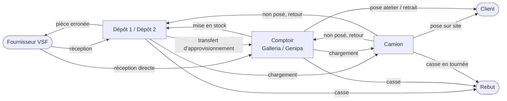
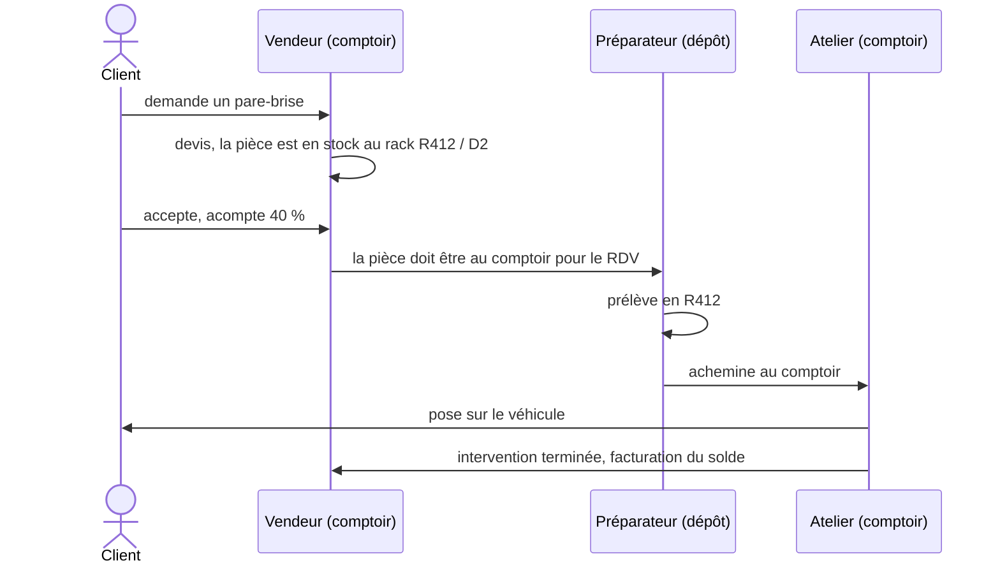
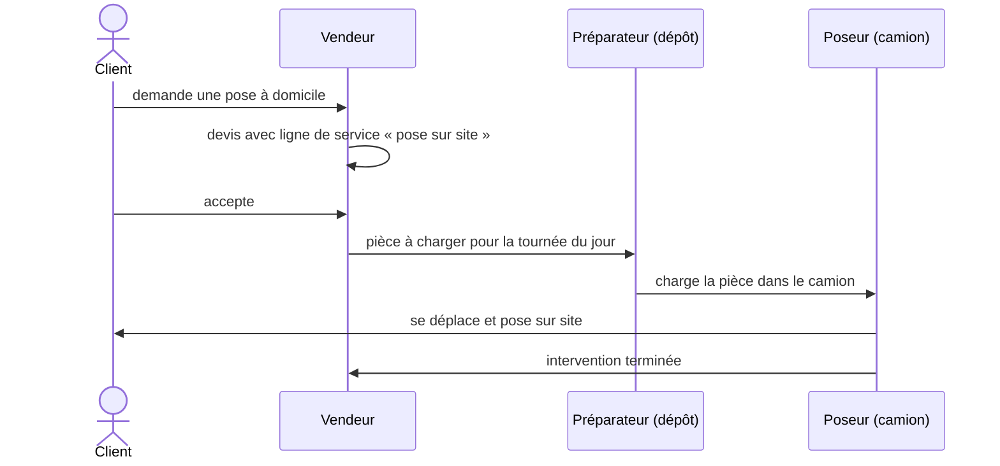
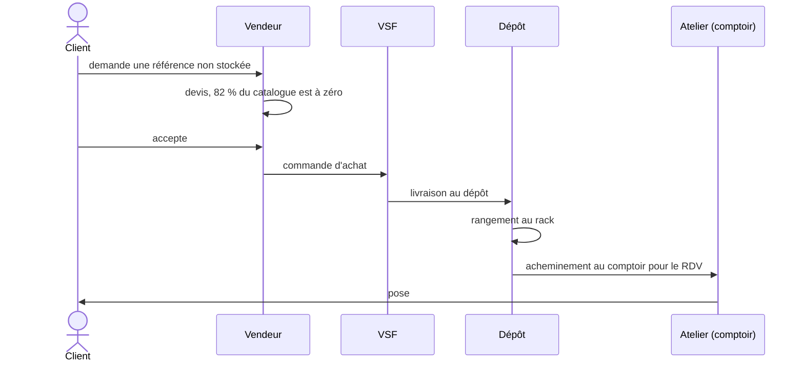
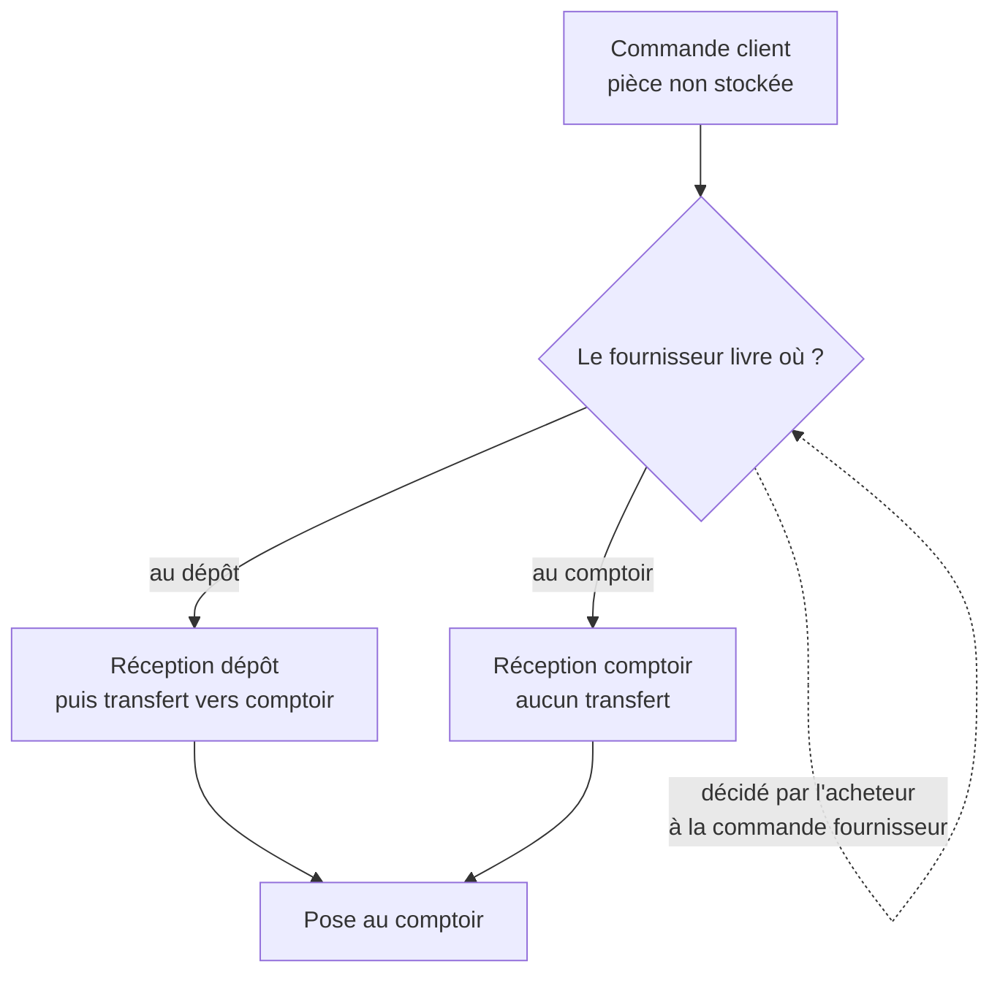
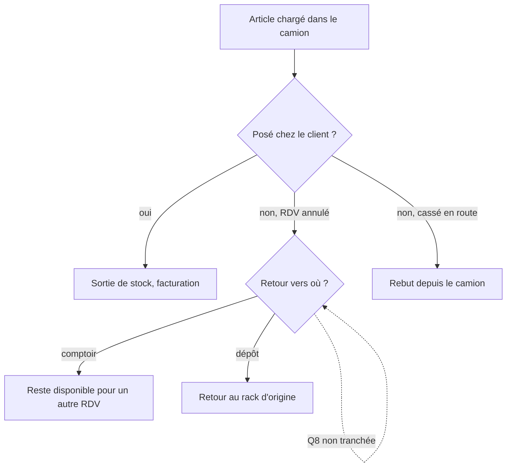
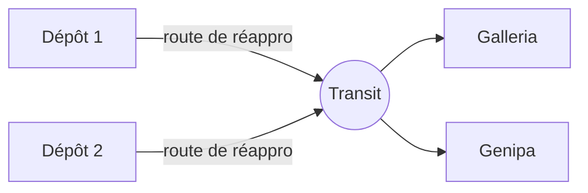

# Architectures de stock — définition comparée

Date : 2026-08-05 · Objet : trancher **Q1** — 5 entrepôts Odoo distincts, ou 1 entrepôt dont les
5 sites sont des zones de stockage.

**Mise à jour du 2026-08-06** : la livraison fournisseur directe au comptoir est **confirmée**.
C'était la condition annoncée en [F.3](#f3-recommandation) comme faisant basculer la conclusion.
Elle ne la fait pas basculer — l'arbitrage complet est en [I](#i--arbitrage-du-2026-08-06). Les
sections antérieures sont **conservées telles quelles**, y compris là où elles ne décrivent plus
la réalité : elles portent la trace de la décision.

Ce document part des **flux métier réels**, en déduit les deux implémentations Odoo, et rend la
comparaison décidable. Aucune configuration n'a été appliquée sur l'instance.

Décisions déjà arrêtées : [decisions.md](decisions.md) · Questions restantes :
[questions-ouvertes.md](questions-ouvertes.md) · Plan d'import : [plan-import-articles.md](plan-import-articles.md)

---

## Sommaire

- [A. Modèle organisationnel](#a--modèle-organisationnel)
- [B. Mécanismes Odoo 17 mobilisables](#b--mécanismes-odoo-17-mobilisables)
- [C. Architecture 1 — un entrepôt, cinq zones](#c--architecture-1--un-entrepôt-cinq-zones)
- [D. Architecture 2 — cinq entrepôts distincts](#d--architecture-2--cinq-entrepôts-distincts)
- [D bis. Architecture 3 — hybride, comptoirs imbriqués](#d-bis--architecture-3--hybride-comptoirs-imbriqués)
- [E. Fiches de configuration des trois profils de site](#e--fiches-de-configuration-des-trois-profils-de-site)
- [F. Comparaison et recommandation](#f--comparaison-et-recommandation)
- [G. Extension à N camions](#g--extension-à-n-camions)
- [H. Prérequis et décisions](#h--prérequis-et-décisions)
- [I. Arbitrage du 2026-08-06 — le fournisseur peut livrer au comptoir](#i--arbitrage-du-2026-08-06)

---

## État actuel de l'instance

Relevé en lecture seule sur `rpbm-preprod` le 2026-08-05 :

| Élément | Valeur |
|---|---|
| Entrepôts | **1** : `RPBM`, `reception_steps = one_step`, `delivery_steps = ship_only` |
| `lot_stock_id` | `RPBM/Stock D1` |
| Emplacements internes | 438, dont `RPBM/Stock D1`, `RPBM/Stock D2`, `RPBM/GALLERIA`, `RPBM/GENIPA` — tous **frères** |
| Types d'opération | `Réceptions` [IN], `Transferts internes` [INT], **`Livraisons Galleria` [OUT]**, **`Livraisons Génipa` [OUT]** |
| Routes | `RPBM: Recevoir en 1 étape`, `RPBM: Livrer en 1 étape`, `Make To Order`, `Buy`, `Manufacture` |
| Règles de rangement | 0 |
| Règles de réassort | 2 |
| `stock_picking_batch` | **non installé** |
| `delivery`, `stock_delivery` | installés — `shipping_selectable` et `carrier.route_ids` disponibles |
| Transporteurs | 1, `Free delivery charges` |

Deux constats en découlent immédiatement.

**Le défaut de réservation.** `GALLERIA`, `GENIPA` et `Stock D2` sont des **frères** de `Stock D1`,
pas des enfants. Comme `lot_stock_id` pointe sur `Stock D1`, une commande client ne peut réserver
que ce qui s'y trouve : **67 unités sur 799**, soit 8 %. Le reste apparaît indisponible alors qu'il
existe. À corriger dans les deux architectures — voir [H](#h--prérequis-et-décisions).

**La segmentation par site existe déjà, sans entrepôts séparés.** RPBM exploite deux types
d'opération sortants distincts, `Livraisons Galleria` et `Livraisons Génipa`, sur un entrepôt
unique. C'est la réponse directe à la sous-question 2 de Q1 : **des documents séparés par site ne
demandent pas des entrepôts séparés**. Nuance à connaître : les deux types partagent aujourd'hui le
même `sequence_code` `OUT`, donc la numérotation est commune ; leur donner `OUT/GALL` et `OUT/GENI`
est un changement d'un champ, pas d'architecture.

---

## A — Modèle organisationnel

### A.1 Trois profils de site

Les cinq sites ne sont pas cinq objets de même nature. Ils se rangent en trois **profils**, définis
par leur rôle métier :

| Profil | Rôle | Reçoit un client ? | Stocke durablement ? | Sites |
|---|---|---|---|---|
| **Comptoir** | Accueil client, pose atelier, vente au comptoir | oui | non, tampon court | Galleria, Genipa |
| **Dépôt** | Stockage du catalogue, aucune activité client | non | oui, c'est sa fonction | Dépôt 1, Dépôt 2 |
| **Camion** | Emporte la pièce chez le client, pose sur site | chez le client | non, le temps d'une tournée | Camion |

Cette distinction commande tout le reste : un dépôt a besoin d'un rangement fin (489 racks), un
comptoir d'un réapprovisionnement lisible, un camion d'une traçabilité du chargement et du retour.

### A.2 Vue d'ensemble des chemins possibles



Onze flux couvrent l'ensemble. Chacun est détaillé ci-dessous.

### A.3 Les onze flux

| # | Flux | Point saillant |
|---|---|---|
| F1 | Pièce en stock au dépôt → pose au comptoir | cas nominal |
| F2 | Pièce en stock au dépôt → pose sur site | passage par le camion |
| F3 | Pièce absente → commande VSF → dépôt → comptoir | le plus long, trois sauts |
| F4 | Pièce absente → **le fournisseur livre au comptoir** | court-circuite le dépôt — **confirmé le 2026-08-06** |
| F5 | Réception au comptoir → chargement camion → pose sur site | combine F4 et F2 |
| F6 | **Comptoir → dépôt** : invendu, surstock, rangement | flux inverse |
| F7 | Article chargé mais **non posé** → retour | destination à trancher (Q8) |
| F8 | Casse constatée au dépôt, au comptoir ou en tournée | rebut depuis trois origines |
| F9 | Vente servie depuis le stock du comptoir | aucun transfert |
| F10 | Rééquilibrage dépôt ↔ dépôt, comptoir ↔ comptoir | rare mais réel |
| F11 | Retour fournisseur VSF | sortie vers le fournisseur |

#### F1 — Pièce en stock au dépôt, pose au comptoir



Ce qui doit rester tracé : le prélèvement au rack (**quel** emplacement a été vidé), l'acheminement
vers le comptoir, la sortie de stock à la pose.

#### F2 — Pièce en stock au dépôt, pose sur site



Deux mouvements, pas un : *dépôt → camion* le matin, *camion → client* à la pose. L'étape
intermédiaire n'est pas de la bureaucratie — un pare-brise chargé le matin et cassé en route est
une perte à tracer **depuis le camion**, ce qu'un mouvement unique dépôt → client ne permet pas.

#### F3 — Pièce absente, commande VSF, dépôt, puis comptoir



C'est le flux dominant : 82 % du catalogue est à zéro et se commande à la demande.

#### F4 — le fournisseur livre directement au comptoir



**C'est la question qui décide de l'architecture.** Si VSF peut livrer à l'adresse de Galleria ou
de Genipa, un comptoir a besoin d'une adresse de réception propre — ce qu'un entrepôt Odoo porte
nativement et qu'une zone ne porte pas.

> **Révision du 2026-08-06.** Le paragraphe ci-dessus est conservé : c'est l'hypothèse sur laquelle
> reposait la recommandation du 2026-08-05. Deux corrections lui sont apportées en
> [I](#i--arbitrage-du-2026-08-06) :
>
> 1. **F4 est réel** — un fournisseur peut devoir livrer au comptoir — mais **occasionnel**, et la
>    décision se prend **à l'achat, pas à la vente** : c'est l'acheteur, en négociant avec le
>    fournisseur, qui sait où la pièce sera livrée. Le diagramme a été corrigé en ce sens.
> 2. **L'adresse de réception propre ne vaut que si le document imprimé part chez le fournisseur.**
>    Chez RPBM il ne part pas (commandes par portail ou téléphone). Le seul bénéfice réel des cinq
>    entrepôts est donc sans objet, et F4 se traite sur l'entrepôt unique.

#### F5 — Réception au comptoir, chargement camion, pose sur site

Enchaînement de F4 et F2 : la pièce arrive au comptoir, y est chargée dans le camion, part chez le
client. Elle ne voit jamais le dépôt.

#### F6 — Le comptoir renvoie une pièce en dépôt

Flux inverse, régulièrement oublié dans les modélisations : une pièce commandée pour un client qui
se désiste, un reliquat, un rangement de fin de semaine. Le comptoir n'a pas vocation à stocker :
la pièce redescend au dépôt et doit **recevoir un rack**.

#### F7 — Article chargé mais non posé



#### F8 — Casse

Trois origines — au rack, au comptoir, en tournée — une seule destination : l'emplacement de rebut
`CASSE`, déjà décidé en `usage=inventory` et `scrap_location` ([D14](decisions.md)). Ce qui compte
est de savoir **d'où** la casse est partie, pour l'imputer au bon site.

#### F9 — Vente servie depuis le stock du comptoir

Le client repart avec la pièce, ou elle est posée dans la foulée. Aucun transfert : un seul
mouvement, du comptoir vers le client. C'est le flux le plus fréquent en volume de documents et
celui qui doit rester le plus léger.

#### F10 — Rééquilibrage entre sites de même profil

Dépôt 1 → Dépôt 2, ou Galleria → Genipa. Déclenché par un humain, sans commande client.

#### F11 — Retour fournisseur VSF

Référence erronée ou pièce cassée à réception : sortie vers le fournisseur, avec le lien vers la
réception d'origine.

### A.4 Ce que le métier impose

De ces onze flux se dégagent quatre exigences, qui serviront de critères en [partie F](#f--comparaison-et-recommandation) :

1. **Savoir où est la pièce**, au rack près, à tout instant — c'est le problème réel de RPBM, avec
   3 273 références réparties sur 489 racks.
2. **Une liste de ce qu'il faut aller chercher**, lisible par le préparateur, sans qu'il ait à
   ouvrir chaque commande.
3. **Tracer le passage par le camion**, sans quoi la casse en tournée n'est imputable à personne.
4. **Ne pas alourdir F9**, la vente au comptoir servie sur place, qui n'a besoin d'aucun transfert.

---

## B — Mécanismes Odoo 17 mobilisables

Section de référence. Tout ce qui suit est vérifié dans `D:\git\odoo_17`, pas reconstitué de
mémoire.

### B.1 Configuration d'entrepôt

`stock.warehouse` (`stock/models/stock_warehouse.py:57-72`) porte deux sélections qui génèrent
automatiquement routes, règles et emplacements :

| Champ | Valeurs |
|---|---|
| `reception_steps` | `one_step` · `two_steps` (Input → Stock) · `three_steps` (Input → Qualité → Stock) |
| `delivery_steps` | `ship_only` · `pick_ship` (Stock → Output → Client) · `pick_pack_ship` |

Emplacements techniques associés : `wh_input_stock_loc_id`, `wh_qc_stock_loc_id`,
`wh_pack_stock_loc_id`, `wh_output_stock_loc_id`.

`get_rules_dict()` donne le routage exact produit par chaque combinaison :

| Configuration | Règles générées (source → destination, type, action) |
|---|---|
| `one_step` | Fournisseur → Stock, *Réception*, pull |
| `two_steps` | Fournisseur → Input, *Réception*, pull · Input → Stock, *Interne*, pull_push |
| `three_steps` | Fournisseur → Input · Input → Qualité · Qualité → Stock, pull_push |
| `ship_only` | Stock → Client, *Livraison*, pull |
| `pick_ship` | Stock → Output, *Pick*, pull · Output → Client, *Livraison*, pull |
| `pick_pack_ship` | Stock → Pack · Pack → Output · Output → Client |
| `crossdock` | Input → Output, *Interne*, pull · Output → Client, *Livraison*, pull |

> **Contrainte à connaître sur le cross-dock** : la route `crossdock` n'est **active que si**
> `reception_steps != 'one_step'` **et** `delivery_steps != 'ship_only'`
> (`stock_warehouse.py:559-564`). Ses règles sont en `make_to_order`. Un entrepôt en réception
> 1 étape ne peut donc pas faire de cross-dock natif — point décisif pour F4.

### B.2 Réapprovisionnement entre entrepôts

`create_resupply_routes()` : cocher un entrepôt dans `resupply_wh_ids` crée **une route par couple**
(entrepôt approvisionné, entrepôt fournisseur), transitant par l'`Internal Transit Location` de la
société. Deux détails qui surprennent en pratique :

- si l'entrepôt **source** est en `ship_only`, Odoo crée en plus une **règle MTO dédiée** — sans
  quoi la chaîne ne se déclencherait pas ;
- la règle d'entrée porte `propagate_warehouse_id`, pour que le besoin remonte vers le bon entrepôt.

Le transit appartient à la société, donc il est valorisé : **un transfert inter-entrepôts d'une même
société ne génère aucune écriture comptable**.

### B.3 Comment Odoo choisit la règle — la précédence

`_search_rule` et `_search_rule_for_warehouses` (`stock/models/stock_rule.py`) appliquent cet
ordre :

```
route_ids (ligne de commande)  >  emballage  >  produit + catégorie  >  routes de l'entrepôt
```

puis tri par `route_sequence`, `sequence`. C'est ce qui rend une route posée sur la ligne de
commande **prioritaire et déterministe** : elle l'emporte sur celle de l'article et sur celle de sa
catégorie.

### B.4 Méthode d'approvisionnement

`stock.rule.procure_method` :

| Valeur | Comportement |
|---|---|
| `make_to_stock` | prendre dans le stock disponible de l'emplacement source |
| `make_to_order` | ignorer le stock, déclencher systématiquement la règle amont |
| **`mts_else_mto`** | **prendre au dépôt si disponible, sinon déclencher la commande VSF** |

`mts_else_mto` est le mécanisme central du couple F1/F3 : c'est lui qui fait que 18 % des ventes
partent du stock et 82 % déclenchent un achat, **sans intervention humaine et sans deux routes
concurrentes**.

### B.5 Les cinq points de sélection de route

| Point d'accroche | Champ | Domaine requis |
|---|---|---|
| **Ligne de commande** | `sale.order.line.route_id` | `sale_selectable` |
| **Mode d'expédition** | `delivery.carrier.route_ids` | `shipping_selectable` |
| Produit / catégorie | `product.route_ids`, `categ_id.total_route_ids` | `product_selectable`, `product_categ_selectable` |
| Entrepôt | `stock.warehouse.route_ids` | `warehouse_selectable` |
| Emballage | `product_packaging_id.route_ids` | `packaging_selectable` |

La route de ligne est transmise au réapprovisionnement par `_prepare_procurement_values()`
(`sale_stock/models/sale_order_line.py:273`, `'route_ids': self.route_id`).

### B.5 bis — Le mode d'expédition sélectionne bien une route

Le mécanisme n'est pas dans le module `delivery` mais dans **`stock_delivery`** :

- `stock.route.shipping_selectable` — « Applicable on Shipping Methods »
  (`stock_delivery/models/stock_move.py:10`) ;
- `delivery.carrier.route_ids`, many2many sur `stock.route`, domaine
  `[('shipping_selectable', '=', True)]` (`stock_delivery/models/delivery_carrier.py:27-29`) ;
- l'injection dans l'approvisionnement (`stock_delivery/models/sale_order.py:51-55`) :

```python
def _prepare_procurement_values(self, group_id):
    values = super()._prepare_procurement_values(group_id)
    if not values.get("route_ids") and self.order_id.carrier_id.route_ids:
        values['route_ids'] = self.order_id.carrier_id.route_ids
    return values
```

**La route du transporteur s'applique en repli** : elle n'est prise que si la ligne n'a pas de
`route_id`. La précédence complète devient donc :

```
route de la ligne  >  route du mode d'expédition  >  emballage  >  produit + catégorie  >  entrepôt
```

Le test standard `stock_delivery/tests/test_carrier_propagation.py:132`
(`test_route_based_on_carrier_delivery`) valide exactement ce comportement dans les deux sens.

`stock_delivery` dépend de `sale_stock` et `delivery`, et il est **`auto_install`** — il est donc
déjà **installé sur `rpbm-preprod`**, vérifié le 2026-08-05, tout comme les champs
`shipping_selectable` et `carrier.route_ids`.

**Pourquoi c'est intéressant pour RPBM.** Le point de vigilance de la route à la ligne est que
`route_id` est un champ **de ligne** : un dossier comporte plusieurs lignes (pare-brise, joint,
main-d'œuvre) et les renseigner une par une est une source d'erreur — route oubliée, technicien
parti sans la pièce. Le mode d'expédition, lui, se choisit **une seule fois pour toute la
commande**, par l'assistant standard « Ajouter un mode de livraison ». Deux transporteurs suffisent :

| Mode d'expédition | Route rattachée | Effet |
|---|---|---|
| « Retrait / pose au comptoir » | Stock → Client | 1 document |
| « Pose sur site » | Stock → Camion → Client | 2 documents |

Avantage secondaire : un `delivery.carrier` porte un **prix**, qui se matérialise en ligne de
commande. Les frais de déplacement, aujourd'hui saisis comme service, deviennent l'attribut naturel
du mode « Pose sur site ».

**Deux limites à connaître** :

1. le transporteur doit être posé **avant la confirmation** de la commande — l'approvisionnement
   est calculé à ce moment-là, et changer le transporteur après ne rejoue pas les règles ;
2. c'est un choix **par commande**, pas par ligne. Une commande mixte (une pièce posée sur site,
   une autre retirée au comptoir) demande de revenir à `route_id` sur la ligne concernée, qui
   reprend la main puisqu'elle est prioritaire. Les deux mécanismes se complètent : le mode
   d'expédition donne le cas général, la route de ligne traite l'exception.

### B.6 Rattachement d'une vente à un site

`sale.order.warehouse_id` est requis et calculé, avec pour défaut
`res.users.property_warehouse_id` (`sale_stock/models/res_users.py:10`, *company_dependent*).
C'est la réponse native à la sous-question 6 de Q1 : **affecter un entrepôt par défaut à chaque
vendeur** suffit, la commande reste modifiable au cas par cas.

Ce champ n'existe **qu'au niveau entrepôt** : dans l'architecture à entrepôt unique, il ne segmente
rien, et la segmentation passe alors par le type d'opération, l'équipe de vente (`team_id`) et
l'analytique (`analytic_account_id`).

### B.7 Traçabilité et ergonomie pour les équipes

| Besoin | Mécanisme | État en préprod |
|---|---|---|
| Regrouper les préparations du jour en une sortie | `stock.picking.batch`, `is_wave` | **module non installé** |
| Liste « ce qu'il faut faire venir ici » | `stock.warehouse.orderpoint` (`location_id`, `trigger='manual'`) | 2 règles |
| Réassort d'un emplacement précis | `stock.location.replenish_location` — *« get all quantities to replenish at this particular location »* | non utilisé |
| Ranger automatiquement une réception au bon rack | `stock.putaway.rule` (`location_in_id`, `location_out_id`, `product_id`, `category_id`, `storage_category_id`, `sequence`) | 0 règle |
| Séparer les listes de travail par site | `stock.picking.type` + `sequence_code` | 2 types sortants |
| Quand réserver | `picking_type.reservation_method` : `at_confirm` · `manual` · `by_date` | `at_confirm` partout |
| Reliquats | `picking_type.create_backorder` : `ask` · `always` · `never` | `ask` partout |

---

## C — Architecture 1 — un entrepôt, cinq zones

### C.1 Structure

Un seul `stock.warehouse` (`RPBM`), dont l'emplacement de stock couvre **tout** l'arbre :

```
RPBM (vue)
└── Stock                        ← lot_stock_id, corrigé
    ├── Dépôt 1
    │   └── R101 … R336          (109 racks)
    ├── Dépôt 2
    │   ├── R401 … R937          (380 racks)
    │   └── J… / T…
    ├── Galleria                 ← zone comptoir
    ├── Genipa                   ← zone comptoir
    ├── Camion                   ← zone de sortie
    └── A controler              (49 emplacements non arbitrés)
```

Configuration : `reception_steps = one_step`, `delivery_steps = ship_only` **par défaut**, les
deux étapes n'étant utilisées que par la route « pose sur site » décrite plus bas.

### C.2 Les deux routes sélectionnables à la ligne de commande

C'est le cœur du dispositif. Deux routes concurrentes, portant **à la fois** `sale_selectable` et
`shipping_selectable`, et non la configuration de l'entrepôt :

| Route | Règles | Documents |
|---|---|---|
| **Retrait / pose au comptoir** | Stock → Client, *Livraison*, pull, `mts_else_mto` | 1 |
| **Pose sur site (camion)** | Stock → Camion, *Chargement*, pull, `mts_else_mto` · Camion → Client, *Pose sur site*, pull, `make_to_order` | 2 |

`mts_else_mto` sur la première règle assure F1/F3 sans arbitrage humain : si la pièce est au rack
elle est prélevée, sinon la commande VSF se déclenche.

> **Révision du 2026-08-06 — la route comptoir compte deux règles, pas une.** Le défaut de
> [Q9](questions-ouvertes.md#q9) étant désormais le **pool par comptoir**
> ([I.7](#le-défaut-retenu--pool-par-comptoir-2026-08-06)), la route « Retrait / pose au comptoir »
> prend la même forme à deux étages que la route camion, et se décline **par comptoir** :
>
> | Route | Règles | Documents |
> |---|---|---|
> | **Retrait / pose Galleria** | `Galleria` → Client, *Livraison*, pull, `mts_else_mto` · `Dépôts` → `Galleria`, *Transfert*, pull, `mts_else_mto` | 1 ou 2 |
> | **Retrait / pose Genipa** | idem, avec `Genipa` | 1 ou 2 |
>
> La chaîne se lit ainsi : la première règle sert la pièce si elle est **au comptoir** (1 document) ;
> sinon elle déclenche la seconde, qui la prend **aux dépôts** (2 documents) ; sinon l'achat part.
> Le stock de l'**autre comptoir** n'est jamais atteint, à aucun étage — c'est précisément l'effet
> recherché. Le tableau d'origine ci-dessus est conservé : il décrit la variante *pool unique*, qui
> reste la solution si le client tranche dans l'autre sens.

**Deux façons de les sélectionner, qui se complètent** ([B.5 bis](#b5-bis--le-mode-dexpédition-sélectionne-bien-une-route)) :

- **le mode d'expédition**, choisi une fois pour toute la commande — c'est le cas général, et il
  supprime le risque d'oubli ligne par ligne ;
- **`route_id` sur la ligne**, qui reprend la main puisqu'elle est prioritaire — pour la commande
  mixte où une pièce part sur site et une autre est retirée au comptoir.

Dans les deux cas la route l'emporte sur celle de l'article et de sa catégorie
([B.3](#b3-comment-odoo-choisit-la-règle--la-précédence)) : le comportement est déterministe, et
n'exige aucun développement.

### C.3 Les onze flux

| # | Chaîne de documents | Source → destination | Type d'opération |
|---|---|---|---|
| F1 | 1 livraison | `Dépôt 2/R412` → Client | `Livraisons Galleria` |
| F2 | 2 : chargement + pose | `Dépôt 2/R412` → `Camion` → Client | `Chargement camion`, `Pose sur site` |
| F3 | 1 réception + 1 livraison | Fournisseur → `Dépôt 2/R412` ; puis → Client | `Réceptions`, `Livraisons …` |
| F4 | 1 réception + 1 livraison | Fournisseur → `Galleria` ; puis → Client | idem, la règle de rangement change la destination |
| F5 | 1 réception + 2 (chargement, pose) | Fournisseur → `Galleria` → `Camion` → Client | |
| F6 | 1 transfert interne | `Galleria` → `Dépôt 1/R117` | `Transferts internes` |
| F7 | 1 transfert interne (retour) | `Camion` → `Galleria` ou `Dépôt …` | `Transferts internes` |
| F8 | 1 rebut | `Dépôt …` / `Galleria` / `Camion` → `CASSE` | `stock.scrap` |
| F9 | 1 livraison | `Galleria` → Client | `Livraisons Galleria` |
| F10 | 1 transfert interne | zone → zone | `Transferts internes` |
| F11 | 1 retour de réception | `Dépôt …` → Fournisseur | retour sur la réception |

**Une seule réservation sur tout l'arbre** : la commande client trouve la pièce où qu'elle soit, et
produit **un seul bon de livraison** pour les flux F1, F3, F4 et F9.

> **Révision du 2026-08-06.** Le tableau ci-dessus décrit le **pool unique**. Il est conservé tel
> quel, mais ce n'est plus le défaut : avec le **pool par comptoir**
> ([I.7](#le-défaut-retenu--pool-par-comptoir-2026-08-06)), trois lignes changent.
>
> | # | Pool unique *(ci-dessus)* | **Pool par comptoir** *(défaut)* |
> |---|---|---|
> | F1 | 1 livraison | **2** : transfert `Dépôts` → `Galleria`, puis livraison |
> | F3 | 1 réception + 1 livraison | **3** : réception au dépôt, transfert, livraison |
> | F4 | 1 réception + 1 livraison | **2** — inchangé, et c'est justement son intérêt : la réception au comptoir évite le transfert |
>
> F9 (vente servie depuis le stock du comptoir) reste à **1 document** dans les deux cas — c'est le
> flux le plus fréquent en volume, et il n'est pas alourdi.
>
> La phrase « un seul bon de livraison pour F1, F3, F4 et F9 » ne vaut donc plus que pour F4 et F9.
> Le coût est assumé et chiffré en [I.7](#le-défaut-retenu--pool-par-comptoir-2026-08-06).

### C.4 Comment F4 est traité sans cross-dock

Le cross-dock natif exige `reception_steps != one_step`
([B.1](#b1-configuration-dentrepôt)) : il n'est pas mobilisable en réception 1 étape. Ce n'est pas
un manque — dans cette architecture, F4 se résout par une **règle de rangement** :

| `location_in_id` | Condition | `location_out_id` |
|---|---|---|
| `RPBM/Stock` | catégorie `Consommable` | `Galleria` |
| `RPBM/Stock` | par défaut | `Dépôt 2` |

La réception atterrit directement au bon endroit, sans document supplémentaire. Ce que cela **ne
donne pas** : une adresse de livraison propre à Galleria pour le bon de commande fournisseur.

> **Correctif du 2026-08-06.** La règle de rangement ci-dessus est **insuffisante pour F4**, et le
> tableau est conservé uniquement pour mémoire. Elle route par **catégorie d'article** : tous les
> consommables iraient à Galleria, toujours, quel que soit le fournisseur et quel que soit le
> comptoir concerné. Or « ce fournisseur-là livre cette commande-là au comptoir » est une décision
> **par commande d'achat**, pas une propriété de l'article.
>
> Le traitement retenu est le **A** de [I.4](#i4-les-trois-traitements-possibles-de-f4) : un type
> d'opération de réception par comptoir, dont la destination est la zone du comptoir, que l'acheteur
> sélectionne dans le champ **« Livrer à »** de la demande de prix. La destination effective de la
> réception est bien `picking_type_id.default_location_dest_id`
> (`purchase_stock/models/purchase_order.py:204-208`).
>
> Les règles de rangement gardent leur rôle **à l'intérieur** d'un dépôt — router une réception vers
> la bonne plage de racks — qui est leur usage naturel.

### C.5 La liste de travail des équipes

C'est le point sur lequel cette architecture doit être jugée, puisqu'elle ne produit pas de
transfert inter-entrepôts automatique.

- **Le bon de livraison porte l'emplacement source ligne par ligne.** Le préparateur lit
  `Dépôt 2 / R412`, va chercher, valide. La « liste des transferts à effectuer » est la liste des
  livraisons du jour, filtrée par type d'opération — donc par comptoir.
- **`stock.picking.batch`** (à installer) regroupe les préparations du jour en un seul lot : une
  tournée de dépôt, un document à valider. C'est là qu'est le gain de temps réel.
- **Si un mouvement en deux temps est souhaité** (le dépôt prépare, le comptoir reçoit), il
  s'obtient par une troisième route `Dépôt → Comptoir → Client` en `pick_ship`, sélectionnable à la
  ligne comme les autres. Le choix reste ouvert sans changer l'architecture.
- **Réassort d'un comptoir** : `replenish_location` sur `Galleria` et `Genipa`, plus des
  orderpoints `trigger='manual'` sur les consommables à rotation rapide, alimentent la vue Réassort.

### C.6 Ce que cette architecture ne donne pas

- pas d'adresse de réception propre par site — les commandes fournisseur partent d'une adresse
  unique ; *(2026-08-06 : sans effet chez RPBM, où le bon de commande imprimé n'est pas envoyé au
  fournisseur — voir [I.3](#i3-pourquoi-le-critère-de-bascule-ne-bascule-pas). La **destination**
  de la réception, elle, est bien pilotable par site : traitement A de
  [I.4](#i4-les-trois-traitements-possibles-de-f4).)*
- `sale.order.warehouse_id` ne segmente rien : la segmentation passe par le type d'opération,
  `team_id` et l'analytique ;
- pas de stock valorisé « par entrepôt » en standard : le reporting par site se fait par filtre sur
  l'emplacement.

---

## D — Architecture 2 — cinq entrepôts distincts

### D.1 Structure

Cinq `stock.warehouse` : `Galleria` (GALL), `Genipa` (GENI), `Dépôt 1` (DEP1), `Dépôt 2` (DEP2),
`Camion` (CAM). Chacun avec son arbre d'emplacements, ses types d'opération, ses séquences.

Les 434 emplacements existants sous `RPBM/Stock D1` et `RPBM/Stock D2` doivent être **déplacés**
sous les nouveaux entrepôts. Ce n'est pas une création : c'est une restructuration de l'existant,
avec un risque de perdre le rattachement des articles qui s'y trouvent.

### D.2 Routes de réapprovisionnement

`resupply_wh_ids` sur chaque comptoir, coché avec les deux dépôts, génère quatre routes :



Chaque vente d'une pièce stockée ailleurs produit alors une chaîne : *livraison du dépôt →
transit → réception au comptoir → livraison au client*, soit **2 à 3 documents** au lieu d'un.

Les dépôts étant en `ship_only`, Odoo crée en plus une règle MTO dédiée par couple
([B.2](#b2-réapprovisionnement-entre-entrepôts)).

### D.3 Les onze flux

| # | Chaîne de documents | Commentaire |
|---|---|---|
| F1 | 3 : livraison DEP2 → transit → réception GALL → livraison client | trois validations |
| F2 | 3 : livraison DEP2 → réception CAM → livraison client | le camion est un entrepôt |
| F3 | 4 : réception DEP2 → livraison DEP2 → réception GALL → livraison client | le plus long |
| F4 | 2 : réception GALL → livraison client | **le cas où cette architecture gagne** |
| F5 | 3 : réception GALL → livraison GALL → réception CAM → livraison client | |
| F6 | 2 : livraison GALL → réception DEP1 | via transit |
| F7 | 2 : livraison CAM → réception GALL/DEP | retour inter-entrepôts |
| F8 | 1 rebut, imputé à l'entrepôt d'origine | imputation native |
| F9 | 1 livraison | identique à l'architecture 1 |
| F10 | 2 : livraison + réception | via transit |
| F11 | 1 retour de réception | identique |

### D.4 Ce que cette architecture apporte

- **Réception fournisseur par site**, avec une adresse propre — le vrai différenciateur, et l'objet
  de la sous-question 1 de Q1 ;
- **numérotation native par site**, chaque entrepôt ayant ses séquences ;
- `sale.order.warehouse_id` segmente les ventes, avec un défaut par vendeur
  (`property_warehouse_id`) ;
- stock et valorisation **par entrepôt** en standard dans les rapports ;
- le camion porte ses propres réceptions et rebuts sans configuration supplémentaire.

### D.5 Ce qu'elle coûte

- **2 à 3 documents par vente** au lieu d'un, sur des pièces qui partent à l'unité ;
- 5 jeux de types d'opération et de séquences à maintenir ;
- un transfert inter-entrepôts **imposé par le modèle à chaque vente**, même quand la même personne
  fait tout ;
- la restructuration des 434 emplacements existants ;
- une réversibilité faible : démonter cinq entrepôts porteurs de mouvements est difficile, alors que
  promouvoir une zone en entrepôt reste possible plus tard.

### D.6 Le réapprovisionnement par anticipation, mesuré

Cette architecture est faite pour un stock qu'on réapprovisionne. Les données disent le contraire :

| | |
|---|---:|
| Références au catalogue | 3 273 |
| Références avec du stock | 578 (18 %) |
| Références à **une seule** unité | 452, soit **78 %** de celles en stock |
| Moyenne quand il y a du stock | 1,33 unité |

Les règles de réassort (`stock.warehouse.orderpoint`) acceptent un `location_id` et fonctionnent
donc aussi bien par zone que par entrepôt : **elles ne sont pas un argument pour les entrepôts**.
Et avec une seule unité dans 78 % des cas, les stratégies de sortie (FIFO, « au plus proche ») n'ont
rien à arbitrer.

---

## D bis — Architecture 3 — hybride, comptoirs imbriqués

*Ajoutée le 2026-08-06. **Sans objet aujourd'hui, ce qui n'est pas la même chose que mauvaise.**
Son unique différenciateur face au traitement A retenu en [I.5](#i5-décision-proposée) est
l'adresse imprimée sur le bon de commande — que RPBM n'envoie pas. Le bénéfice étant nul, n'importe
quel coût est un mauvais échange. Elle est documentée comme **chemin de sortie vérifié**, à
réexaminer le jour où ce bon de commande partirait réellement. Les réserves de
[D bis.4](#d-bis4--ce-quelle-coûte-et-les-réserves-à-lever) ne s'examinent qu'à ce moment-là.*

Les architectures 1 et 2 sont présentées comme exclusives. Elles ne le sont pas : Odoo 17 accepte
qu'un entrepôt vive **à l'intérieur** de l'arbre d'emplacements d'un autre. C'est explicite dans
`stock.location._compute_warehouse_id` (`stock/models/stock_location.py:140-152`), qui cherche
**tous** les entrepôts dont la `view_location_id` est parente de l'emplacement, les trie par
profondeur décroissante (`parent_path`, `reverse=True`) et retient **le plus proche** :

```python
warehouses = self.env['stock.warehouse'].search([('view_location_id', 'parent_of', self.ids)])
warehouses = warehouses.sorted(lambda w: w.view_location_id.parent_path, reverse=True)
```

Ce tri n'a de sens que si l'imbrication est un cas prévu.

### D bis.1 — Structure

Seuls les **comptoirs** deviennent des entrepôts, parce qu'eux seuls reçoivent des fournisseurs.
Les dépôts et le camion restent des zones de `RPBM`.

```
RPBM (vue)                       ← entrepôt RPBM
└── Stock                        ← lot_stock_id de RPBM
    ├── Dépôt 1 / Dépôt 2        (489 racks, zones)
    ├── Camion                   (zone)
    ├── Galleria (vue)           ← view_location_id de l'entrepôt GALL
    │   └── Comptoir             ← lot_stock_id de GALL
    └── Genipa (vue)             ← view_location_id de l'entrepôt GENI
        └── Comptoir             ← lot_stock_id de GENI
```

### D bis.2 — Ce que cela donne

| Apport | Mécanisme |
|---|---|
| Adresse imprimée par comptoir sur les BC et demandes de prix | `stock.warehouse.partner_id`, lu par `picking_type_id.warehouse_id.partner_id` (`purchase_stock/report/purchase_report_templates.xml:9-11`) |
| Séquences natives `GALL/IN`, `GALL/OUT`, `GALL/INT` | jeu de types d'opération créé automatiquement à la création de l'entrepôt |
| `sale.order.warehouse_id` par comptoir, avec défaut par vendeur | `res.users.property_warehouse_id` ([B.6](#b6-rattachement-dune-vente-à-un-site)) |
| Stock et mouvements par comptoir en reporting | natif, l'entrepôt étant réel — **mais lire la réserve 1 de [D bis.4](#d-bis4--ce-quelle-coûte-et-les-réserves-à-lever)** : cette ventilation se paie par la perte du total implicite |

### D bis.3 — Le point qui la rend viable

Le coût rédhibitoire de l'architecture 2 est la **chaîne de 2 à 3 documents par vente**, imposée
par les routes de réapprovisionnement inter-entrepôts ([D.2](#d2-routes-de-réapprovisionnement)).
L'imbrication le supprime, à une condition :

- les emplacements des comptoirs restent **enfants de `RPBM/Stock`**, donc une commande portée par
  l'entrepôt `RPBM` réserve la pièce où qu'elle soit, exactement comme en architecture 1 ;
- pour qu'une commande portée par l'entrepôt `GALL` réserve elle aussi sur tout l'arbre, il faut
  **repointer le `location_src_id` de sa règle de livraison sur `RPBM/Stock`** au lieu de
  `GALL/Comptoir` ;
- aucune route `resupply_wh_ids` n'est créée : le transit inter-entrepôts n'existe pas ici.

F1 et F9 gardent alors **un seul document**, numéroté `GALL/OUT/…`.

**Ce repointage dépend de [Q9](questions-ouvertes.md#q9)**, et c'est un lien qu'il faut voir : il
n'est nécessaire que si la réponse est *pool unique*. Si RPBM répond *pool par comptoir*,
**on ne repointe rien** — l'imbrication native donne exactement ce comportement, chaque comptoir
réservant son propre stock. L'intérêt de cette architecture n'est donc pas le même selon Q9 :
neutre dans un cas, elle devient la voie la plus naturelle dans l'autre.

### D bis.4 — Ce qu'elle coûte, et les réserves à lever

Cinq réserves, de la plus structurante à la plus circonstancielle. Les quatre premières sont des
**lectures de code**, pas des observations : rien de tout cela n'a été essayé sur `rpbm-preprod`.

**1. Le reporting par entrepôt se scinde, silencieusement.** C'est la plus gênante, et c'est le
revers exact de l'apport « stock par comptoir » de [D bis.2](#d-bis2--ce-que-cela-donne).
`stock.quant.warehouse_id` est un `related='location_id.warehouse_id'`
(`stock/models/stock_quant.py:63`), et `_compute_warehouse_id` retient l'entrepôt **le plus
profond**. Les quants des comptoirs deviennent donc ceux de `GALL` et `GENI`, **plus** ceux de
`RPBM` : « la valeur du stock de l'entrepôt RPBM » cesse d'être le total.

Aujourd'hui RPBM n'a qu'un entrepôt, donc tout rapport groupé par entrepôt est implicitement
exhaustif. Cette propriété se perd **sans avertissement ni erreur** — un chiffre qui était juste
devient partiel, et rien ne le signale. On gagne la ventilation par site, on perd le total
implicite. Tout rapport ou tableau de bord existant est à revoir.

**2. L'imbrication n'est pas un chemin de création, c'est une correction après coup.**
`stock.warehouse.create()` place `view_location_id` **en dur** sous
`stock.stock_location_locations` (`stock/models/stock_warehouse.py:112-113`). Il faut donc créer
l'entrepôt normalement, puis **déplacer** sa vue sous `RPBM/Stock`. Odoo prévoit l'imbrication
**en lecture** — le tri par profondeur de `_compute_warehouse_id` ne s'explique pas autrement — il
ne l'offre pas **en écriture**. C'est un cas toléré, pas un cas outillé, et la nuance compte pour
qui reprendra la configuration plus tard.

**3. Le ménage n'est pas stable dans le temps.** Créer un entrepôt génère emplacements, séquences,
types d'opération, routes et règles (`stock/models/stock_warehouse.py:126-140`). Ceux dont on ne
veut pas doivent être archivés — mais `write()` rappelle `_create_missing_locations()` à **chaque**
écriture, et régénère types d'opération et routes dès que `code` ou une dépendance de route change
(`stock/models/stock_warehouse.py:171`, `:195-200`). **Un simple renommage de l'entrepôt peut
ressusciter ce qu'on avait neutralisé.** C'est la réserve la plus sérieuse techniquement : la
configuration n'est pas auto-portante, elle demande d'être re-vérifiée après toute modification de
l'entrepôt.

**4. Une règle reparamétrée à la main, que rien n'explique dans l'interface.** Le `location_src_id`
de la règle de livraison repointé sur `RPBM/Stock` fonctionne, mais ne se devine pas à la relecture
et doit être commenté. À nuancer toutefois : ce repointage **n'est nécessaire que si
[Q9](questions-ouvertes.md#q9) est répondue *pool unique*** — voir
[D bis.3](#d-bis3--le-point-qui-la-rend-viable).

**5. Effets de bord sur l'interface de tous les utilisateurs.** `create()` appelle
`_check_multiwarehouse_group()` (`stock/models/stock_warehouse.py:150`), qui active le groupe
multi-entrepôts : l'interface change pour tout le monde, pas seulement pour qui manipule les
comptoirs. Et `sale.order.warehouse_id` propose désormais trois entrepôts au vendeur, dont deux ne
doivent jamais être choisis pour une pose sur site.

### D bis.5 — Ce qui n'est pas une réserve

Par souci d'équilibre, deux reproches qu'on pourrait lui faire et qui ne tiennent pas :

- **ce n'est pas l'architecture 2 déguisée** : aucun transit, aucune chaîne à 2 ou 3 documents, la
  réservation reste globale. Les coûts listés en [D.5](#d5-ce-quelle-coûte) ne s'appliquent pas ;
- **l'imbrication n'est pas un détournement** : elle est explicitement gérée en lecture par le
  cœur d'Odoo 17.

**Conclusion.** Ce n'est pas une architecture faible, c'est une architecture **sans emploi
aujourd'hui**. Si le bon de commande imprimé devient un besoin réel, elle reste la bonne réponse —
à condition de lever d'abord la réserve 1 (quels rapports dépendent du total par entrepôt ?) et de
valider les réserves 2, 3 et 5 par un essai en préproduction.

---

## E — Fiches de configuration des trois profils de site

### E.1 Architecture 1 — les trois profils sont des zones

| Rubrique | Comptoir (Galleria, Genipa) | Dépôt (D1, D2) | Camion |
|---|---|---|---|
| Objet Odoo | `stock.location`, `usage=internal` | `stock.location`, `usage=internal` | `stock.location`, `usage=internal` |
| Parent | `RPBM/Stock` | `RPBM/Stock` | `RPBM/Stock` |
| Sous-emplacements | aucun | 489 racks (`R…`, `J…`, `T…`) | aucun, ou un par camion |
| Type d'opération sortant | `Livraisons Galleria` [OUT/GALL], `Livraisons Génipa` [OUT/GENI] | — | `Pose sur site` [OUT/CAM] |
| **Type d'opération entrant** *(2026-08-06)* | **`Réception Galleria` [IN/GALL], `Réception Génipa` [IN/GENI]**, destination = la zone du comptoir | `Réceptions` [IN], destination par défaut | — |
| Type d'opération interne | `Transferts internes` [INT] | idem | `Chargement camion` [INT/CAM] |
| `reservation_method` | `at_confirm` | `at_confirm` | **`manual`** — on ne réserve qu'au chargement effectif |
| `create_backorder` | `ask` | `ask` | **`always`** — un article non posé doit rester dû |
| Règles de rangement | destination des réceptions de consommables | destination par défaut des réceptions | aucune |
| Réassort | ~~`replenish_location = True`~~ **impossible** + orderpoints manuels — voir correctif ci-dessous | orderpoints sur consommables uniquement | aucun |
| Routes rattachées | « Retrait / pose Galleria » et « Retrait / pose Génipa », **à deux règles chacune** depuis le défaut *pool par comptoir* ([C.2](#c2-les-deux-routes-sélectionnables-à-la-ligne-de-commande)) | — | « Pose sur site (camion) » |
| Périmètre de réservation *(2026-08-06)* | **son propre stock, puis les dépôts** — jamais l'autre comptoir ([I.7](#le-défaut-retenu--pool-par-comptoir-2026-08-06)) | source de la règle amont des comptoirs | hors `Stock`, jamais réservé par une vente comptoir |

> **Correctif du 2026-08-06 — `replenish_location` sur les comptoirs est impossible.** La ligne
> « Réassort » ci-dessus était fausse. Odoo interdit **deux emplacements de réassort dans une même
> chaîne parent/enfant** : `_check_replenish_location` lève une `ValidationError`
> (`stock/models/stock_location.py:171-178`). Or l'emplacement de stock d'un entrepôt est créé
> avec `replenish_location = True` (`stock/models/stock_warehouse.py:640`) — c'est le cas de
> `RPBM/Stock`, dont `Galleria` et `Genipa` sont enfants.
>
> Le réassort des comptoirs passe donc **uniquement par des `stock.warehouse.orderpoint`** portant
> `location_id = RPBM/Stock/Galleria`, qui acceptent n'importe quel emplacement et ne sont pas
> soumis à cette contrainte. La vue « Réassort » globale reste celle de `RPBM/Stock`.
>
> Ce correctif vaut aussi pour [E.3](#e3-architecture-3--les-comptoirs-sont-des-entrepôts-imbriqués),
> où il est plus gênant : l'imbrication place `GALL/Comptoir` (créé à `True`) sous `RPBM/Stock`
> (à `True`), donc dans un état que la contrainte rejette dès la prochaine écriture sur
> l'emplacement du comptoir. À tester en préproduction — le moment exact du déclenchement dépend
> du champ écrit, et n'a pas été vérifié.

### E.2 Architecture 2 — les trois profils sont des entrepôts

| Rubrique | Comptoir | Dépôt | Camion |
|---|---|---|---|
| Objet Odoo | `stock.warehouse` | `stock.warehouse` | `stock.warehouse` |
| Code | `GALL`, `GENI` | `DEP1`, `DEP2` | `CAM` |
| `reception_steps` | `one_step`, ou `two_steps` si cross-dock souhaité | `one_step` | `one_step` |
| `delivery_steps` | `ship_only` | `ship_only` | `ship_only` |
| `resupply_wh_ids` | Dépôt 1, Dépôt 2 | — | Dépôt 1, Dépôt 2, Galleria, Genipa |
| Séquences | `GALL/IN`, `GALL/OUT`, `GALL/INT` | `DEP1/…` | `CAM/…` |
| `reservation_method` | `at_confirm` | `at_confirm` | **`manual`** |
| `create_backorder` | `ask` | `ask` | **`always`** |
| Emplacements | `GALL/Stock` | `DEP1/Stock/R101…` | `CAM/Stock` |
| Règles de rangement | par catégorie | par plage de racks | aucune |
| Adresse | propre au site | propre au site | celle du siège |

### E.3 Architecture 3 — les comptoirs sont des entrepôts imbriqués

*Ajoutée le 2026-08-06. Détail, apports et réserves en
[D bis](#d-bis--architecture-3--hybride-comptoirs-imbriqués).*

| Rubrique | Comptoir (Galleria, Genipa) | Dépôt (D1, D2) | Camion |
|---|---|---|---|
| Objet Odoo | **`stock.warehouse` imbriqué** | `stock.location`, `usage=internal` | `stock.location`, `usage=internal` |
| Code | `GALL`, `GENI` | — | — |
| Parent | `view_location_id` **déplacé sous `RPBM/Stock` après création** — voir réserve 2 | `RPBM/Stock/Dépôts` | `RPBM/Camion`, hors `Stock` ([I.7](#i7-le-périmètre-de-réservation--une-décision-de-plus-à-poser-au-client)) |
| Emplacement de stock | `lot_stock_id` = `RPBM/Stock/Galleria/Comptoir` | celui de `RPBM` | celui de `RPBM` |
| Sous-emplacements | aucun | 489 racks (`R…`, `J…`, `T…`) | aucun, ou un par camion |
| `reception_steps` / `delivery_steps` | `one_step` / `ship_only` | — | — |
| **`resupply_wh_ids`** | **vide** — c'est la ligne décisive : aucune route de transit n'est créée, donc aucune chaîne à 3 documents (`stock/models/stock_warehouse.py:715-727`) | — | — |
| Type d'opération entrant | `GALL/IN` **natif**, adresse portée par `partner_id` de l'entrepôt | `Réceptions` [IN] de `RPBM` | — |
| Type d'opération sortant | `GALL/OUT` **natif** | — | `Pose sur site` [OUT/CAM] de `RPBM` |
| Type d'opération interne | `GALL/INT` **natif** | `Transferts internes` [INT] de `RPBM` | `Chargement camion` [INT/CAM] |
| Séquences | `GALL/IN/`, `GALL/OUT/`, `GALL/INT/` **natives** — le préfixe est reconstruit à partir du code de l'entrepôt (`stock/models/stock_picking.py:183-190`) | celles de `RPBM` | celles de `RPBM` |
| Types générés à neutraliser | aucun : en `ship_only`, `PICK` et `PACK` naissent **inactifs** (`stock/models/stock_warehouse.py:971-977`). Restent 3 types actifs et 2 routes propres | — | — |
| Routes rattachées | les 2 routes propres de l'entrepôt : *Recevoir en 1 étape*, *Livrer en 1 étape* | — | « Pose sur site (camion) » de `RPBM` |
| `location_src_id` de la règle de livraison | `RPBM/Stock/Galleria/Comptoir` — **le natif, rien à repointer**, puisque le défaut de [Q9](questions-ouvertes.md#q9) est le *pool par comptoir*. Repointage sur `RPBM/Stock` seulement si le client tranche pour le *pool unique* | — | `RPBM/Camion` |
| Règle amont vers le comptoir | `RPBM/Stock/Dépôts` → `GALL/Comptoir`, pull, `mts_else_mto` — à créer à la main, l'entrepôt n'en génère pas | — | — |
| `reservation_method` | `at_confirm` | `at_confirm` | **`manual`** |
| `create_backorder` | `ask` | `ask` | **`always`** |
| Règles de rangement | par catégorie | par plage de racks | aucune |
| Réassort | ~~`replenish_location = True`~~ **impossible** + orderpoints manuels — voir correctif ci-dessous | orderpoints sur consommables uniquement | aucun |
| Adresse | **propre au site** (`partner_id`) — le seul vrai différenciateur | celle du siège | celle du siège |
| `warehouse_id` des quants | **`GALL` / `GENI`**, pas `RPBM` — voir réserve 1, le total par entrepôt se scinde | `RPBM` | `RPBM` |
| À faire après création | déplacer la vue sous `RPBM/Stock`, vérifier les 2 routes propres, **et re-vérifier après toute modification de l'entrepôt** (réserve 3) | — | — |

**Comment lire cette fiche.** Seul le profil **Comptoir** change de nature ; les colonnes Dépôt et
Camion sont mot pour mot celles de [E.1](#e1-architecture-1--les-trois-profils-sont-des-zones).
C'est tout l'intérêt de l'architecture 3 — et toute sa fragilité : le gain se concentre sur deux
sites, les réserves aussi.

Les trois réserves citées ci-dessus sont détaillées en
[D bis.4](#d-bis4--ce-quelle-coûte-et-les-réserves-à-lever).

### E.4 Ce qui ne change pas entre les trois

- l'emplacement de rebut `CASSE`, en `usage=inventory` + `scrap_location` ([D14](decisions.md)) ;
- la valorisation : coût `standard`, inventaire `manual_periodic` ([D8](decisions.md)) ;
- les 489 racks et leur rattachement `R101`-`R336` → Dépôt 1, `R401`-`R937`/`J…`/`T…` → Dépôt 2
  ([D12](decisions.md)) ;
- la segmentation commerciale par `team_id` et compte analytique ;
- le traitement comptable, **identique** — voir ci-dessous.

*(Liste établie pour les deux premières architectures le 2026-08-05, et vérifiée valable pour la
troisième le 2026-08-06 : l'imbrication ne touche ni le rebut, ni la valorisation, ni le
rattachement des racks, ni la segmentation commerciale.)*

---

## F — Comparaison et recommandation

### F.1 Le comptable est neutre, il ne doit pas entrer dans l'arbitrage

Vérifié dans le code d'Odoo 17, et **confirmé sur l'instance le 2026-08-05** : l'écriture de
3 188 coûts n'a créé aucune `stock.valuation.layer` ni aucune `account.move`.

1. Les comptes de valorisation sont portés par la **catégorie d'articles**, jamais par l'entrepôt ni
   par l'emplacement. `stock.warehouse` n'a aucun champ comptable ; les deux champs de
   `stock.location` précisent *« This has no effect for internal locations »*.
2. Un mouvement entre deux emplacements internes ne génère **jamais** d'écriture.
3. Les transferts entre entrepôts d'une même société non plus : le transit porte la société, donc
   il est valorisé.
4. Avec la valorisation manuelle retenue, aucune écriture n'est générée de toute façon.

**Le choix est logistique et organisationnel.**

### F.2 Comparaison sur les exigences métier de [A.4](#a4-ce-que-le-métier-impose)

*Deux colonnes ajoutées le 2026-08-06 : l'**architecture 1 + traitement A** de
[I.4](#i4-les-trois-traitements-possibles-de-f4), qui est la configuration réellement proposée, et
l'**architecture 3** de [D bis](#d-bis--architecture-3--hybride-comptoirs-imbriqués), qui est le
repli identifié. Les deux colonnes d'origine sont conservées.*

| Critère | 1 entrepôt, 5 zones | **1 entrepôt + traitement A** | 5 entrepôts | **Architecture 3** |
|---|---|---|---|---|
| Savoir où est la pièce, au rack près | identique — c'est l'emplacement qui porte l'information | identique | identique | identique |
| Documents pour F1 (le cas nominal) | **1** | **2** avec le défaut *pool par comptoir* · 1 si pool unique | 3 | **2** avec le défaut · 1 si pool unique |
| Documents pour F3 (le flux dominant) | 2 | **3** avec le défaut · 2 si pool unique | 4 | **3** avec le défaut · 2 si pool unique |
| Documents pour F4 (le fournisseur livre au comptoir) | 2, destination pilotée par catégorie seulement | **2, destination pilotée par commande** | **2, avec adresse imprimée** | **2, avec adresse imprimée** |
| Documents pour F9 (vente au comptoir) | 1 | 1 | 1 | 1 |
| Traçabilité du passage camion | route à 2 étapes, portée par le mode d'expédition | idem | native | idem arch. 1 — le camion reste une zone |
| Liste de travail par site | par type d'opération (**existe déjà**) | idem, réceptions comprises | par entrepôt | native pour les comptoirs, par type d'opération pour dépôts et camion |
| Numérotation par site | par `sequence_code` du type d'opération | idem, réceptions comprises | native | **native** pour les comptoirs |
| Réception fournisseur par site | non | **destination oui, adresse imprimée non** | **oui** | **oui, destination et adresse** |
| Stock par site en reporting | filtre sur emplacement | filtre sur emplacement | natif | natif pour les comptoirs, **mais le total par entrepôt se scinde** (réserve 1) |
| Jeux de types d'opération à maintenir | 1 + 2 sortants | 1 + 2 sortants + 2 entrants | 5 | ceux de `RPBM` + 3 par comptoir |
| Réversibilité | promouvoir une zone en entrepôt : possible | idem, chemin décrit en [D bis](#d-bis--architecture-3--hybride-comptoirs-imbriqués) | démonter un entrepôt : difficile | intermédiaire — 2 entrepôts à démonter, mais **aucun mouvement de transit** à reprendre |
| Impact sur l'import | P2 disparaît, P3 se rattache à l'existant | idem | P2 + restructuration des 434 emplacements | P2 réduite à 2 entrepôts, P3 inchangée |

*Lignes F1 et F3 mises à jour le 2026-08-06 : le défaut de [Q9](questions-ouvertes.md#q9) est
désormais le **pool par comptoir**, qui coûte un document de plus sur ces deux flux dans toutes les
colonnes sauf la première. La ligne F3 a été ajoutée à cette occasion — elle manquait, alors que
c'est le flux dominant.*

Trois lectures à ne pas manquer dans ce tableau :

- **l'écart avec l'architecture 2 s'est resserré** sur le critère qui servait le plus à
  l'écarter : 2 documents contre 3 sur F1, au lieu de 1 contre 3. La recommandation ne change pas —
  les autres coûts de l'architecture 2 restent entiers — mais l'argument « un seul document par
  vente » ne peut plus être avancé tel quel ;
- **l'architecture 3 égale l'architecture 2 sur son seul point fort** — la réception fournisseur
  par site, adresse comprise — **sans en payer le prix** : l'import n'est pas bouleversé et la
  réversibilité reste praticable. Avec le défaut *pool par comptoir*, elle gagne en plus le
  comportement recherché **sans repointer aucune règle** ;
- **elle n'est pas gratuite pour autant** : la ligne « stock par site en reporting » est à double
  tranchant, et c'est la réserve la plus sérieuse
  ([D bis.4](#d-bis4--ce-quelle-coûte-et-les-réserves-à-lever), réserve 1).

### F.3 Recommandation

**Un entrepôt unique avec les cinq sites en zones — sauf si VSF doit livrer directement à l'adresse
de Galleria ou de Genipa.**

C'est la seule sous-question qui fasse réellement basculer la conclusion, parce qu'elle porte sur
quelque chose qu'une zone ne peut pas fournir : une adresse de réception propre. Les autres
arguments souvent avancés en faveur des cinq entrepôts s'obtiennent sans eux :

| Argument | Réponse |
|---|---|
| « Il faut des documents séparés par site » | déjà en place — deux types d'opération sortants |
| « Il faut une numérotation par site » | un `sequence_code` par type d'opération |
| « Il faut le CA par site » | compte analytique + équipe de vente |
| « Il faut tracer le camion » | route en deux étapes, portée par un mode d'expédition « Pose sur site » |
| « Il faut du réassort par site » | `orderpoint.location_id` fonctionne par zone |
| « C'est mieux comptablement » | strictement identique, vérifié |

> **La condition est réalisée, la conclusion ne change pas — 2026-08-06.** Un fournisseur peut bien
> devoir livrer au comptoir. La recommandation ci-dessus est **maintenue**, parce que la valeur
> qu'elle attribuait aux cinq entrepôts — une adresse de réception propre imprimée sur le bon de
> commande — est nulle chez RPBM : les commandes fournisseur passent par portail ou téléphone, le
> document imprimé n'est jamais envoyé. Ce qu'il faut, c'est router la **destination** de la
> réception, ce qui se fait sur l'entrepôt unique. Démonstration en
> [I](#i--arbitrage-du-2026-08-06).
>
> **Et l'alternative n'était pas binaire.** Le titre de ce document — « 5 entrepôts *ou* 5 zones » —
> posait un choix qui n'existe pas : Odoo 17 accepte qu'un entrepôt vive à l'intérieur de l'arbre
> d'un autre. L'[architecture 3](#d-bis--architecture-3--hybride-comptoirs-imbriqués) promeut les
> **seuls comptoirs**, parce qu'eux seuls reçoivent des fournisseurs, et laisse dépôts et camion en
> zones. Elle obtient l'adresse imprimée **sans** la chaîne à 3 documents.
>
> Elle n'est pas retenue aujourd'hui — non parce qu'elle est faible, mais parce que son unique
> apport, l'adresse imprimée, ne sert à rien tant que le document n'est pas envoyé. Elle est le
> **repli identifié**, dernier barreau de l'escalier de
> [I.4](#i4-les-trois-traitements-possibles-de-f4) :
>
> | Aujourd'hui | Si F4 devient un flux régulier | Si le BC imprimé part réellement |
> |---|---|---|
> | **Traitement A** — 2 types d'opération de réception | **Traitement B** — une route *Acheter → comptoir* par comptoir | **Architecture 3** — comptoirs imbriqués |
>
> Chaque barreau s'ajoute au précédent sans le défaire. C'est ce qui rend la décision d'aujourd'hui
> peu coûteuse à réviser.

### F.4 Quelle réponse fait basculer quoi

| Sous-question de Q1 | Si oui | Si non |
|---|---|---|
| 1. VSF livre-t-il en direct par site ? | **bascule vers 5 entrepôts** | reste sur 1 entrepôt |
| 1 bis. *(2026-08-06)* Le bon de commande imprimé part-il chez le fournisseur ? | c'est **elle** qui fait basculer, pas la ligne 1 — bascule vers l'[architecture 3](#d-bis--architecture-3--hybride-comptoirs-imbriqués) | **cas de RPBM** : reste sur 1 entrepôt, traitement A |
| [Q9](questions-ouvertes.md#q9). *(2026-08-06)* Pool par comptoir plutôt que pool unique ? **← défaut retenu** | rend l'[architecture 3](#d-bis--architecture-3--hybride-comptoirs-imbriqués) **naturelle** : l'imbrication donne ce comportement sans repointer aucune règle. Coûte +1 document sur F1 et F3 | architecture 3 neutre sur ce point — un `location_src_id` à repointer à la main |
| 2. Numérotations distinctes par site ? | `sequence_code` suffit | sans objet |
| 3. Lecture du stock par site ? | filtre sur emplacement | sans objet |
| 4. Tracer le chargement du camion ? | route en 2 étapes | route en 1 étape |
| 5. Répartition comptoir / sur site ? | fixe la route par défaut des lignes | — |
| 6. Vente rattachée par vendeur ? | `property_warehouse_id` (si 5 entrepôts) ou analytique | — |
| 7. Consommables à rotation rapide au comptoir ? | orderpoints par zone | aucun réassort |

La sous-question 7 est la seule qui puisse remettre en cause le raisonnement « aucun
réapprovisionnement par anticipation » : il ne vaut que pour le catalogue vitrage.

---

## G — Extension à N camions

Le nombre de camions n'étant pas connu, la modélisation ci-dessus en suppose **un**. Voici le delta
si RPBM en exploite plusieurs, ou attribue un stock embarqué par technicien.

| | 1 entrepôt, 5 zones | 5 entrepôts |
|---|---|---|
| Structure | un emplacement par camion sous `RPBM/Stock/Camion` | un entrepôt par camion, ou un emplacement par camion sous `CAM/Stock` |
| Affectation à la commande | une route `sale_selectable` par camion, ou une route unique + choix de l'emplacement à la préparation | `warehouse_id` de la commande, ou route par camion |
| Chargement | un lot (`stock.picking.batch`) par camion et par jour | une réception par camion |
| Casse en tournée | imputée à l'emplacement du camion | imputée à l'entrepôt du camion |

L'extension est **moins coûteuse dans l'architecture à zones** : ajouter un camion y est la création
d'un emplacement et, éventuellement, d'une route ; dans l'autre, c'est un entrepôt complet avec ses
types d'opération et ses séquences.

Recommandation de séquencement : modéliser un camion maintenant, avec l'emplacement `Camion` déjà
prévu comme parent. Passer à N revient alors à créer des enfants, sans rien défaire.

---

## H — Prérequis et décisions

### H.1 À corriger avant toute mise en service, quelle que soit l'architecture

**Le `lot_stock_id` de l'entrepôt `RPBM`.** Il pointe sur `RPBM/Stock D1`, dont `GALLERIA`,
`GENIPA` et `Stock D2` sont des **frères**. Une commande client ne peut réserver que 67 unités sur
799 — 8 %. Le reste du stock apparaît indisponible alors qu'il existe. La correction consiste à
interposer un niveau `Stock` et à y rattacher les quatre zones, ou à repositionner `lot_stock_id`
sur un parent commun.

> **Précision du 2026-08-06.** Cette reconstruction est l'occasion — et la seule occasion peu
> coûteuse — de fixer la **forme** de l'arbre, qui est le seul levier natif sur le périmètre de
> réservation. Deux ajustements à faire au même moment, détaillés en
> [I.7](#i7-le-périmètre-de-réservation--une-décision-de-plus-à-poser-au-client) :
>
> 1. **interposer un niveau `Dépôts`** au-dessus de Dépôt 1 et Dépôt 2. Ce n'est plus une précaution
>    mais un **prérequis** : le défaut retenu pour [Q9](questions-ouvertes.md#q9) étant le *pool par
>    comptoir*, la règle amont `Dépôts` → comptoir a besoin de ce niveau comme source. L'arbre
>    reste compatible avec le *pool unique* si le client tranche dans l'autre sens ;
> 2. **placer `Camion` hors de `Stock`**, pour qu'aucune vente au comptoir ne réserve une pièce
>    chargée dans un véhicule en tournée.

**Les catégories en valorisation automatique.** `Accessoires`, `Consommables Atelier` et
`Pièces de Rechange` sont en `average`/`real_time`. Aucun article importé n'y est rattaché, mais
`Accessoires` est désignée par [D1](decisions.md) comme catégorie à réutiliser : tout article qu'on
y placerait verrait son `standard_price` réécrit à chaque réception, ce que [D8](decisions.md)
cherche précisément à éviter.

### H.2 À installer si l'architecture 1 est retenue

`stock_picking_batch` — aujourd'hui non installé. C'est lui qui transforme « le préparateur ouvre
chaque livraison » en « le préparateur sort une fois avec un lot ». Sans lui, l'ergonomie promise
en [C.5](#c5-la-liste-de-travail-des-équipes) n'est pas atteinte.

### H.3 Décisions attendues de RPBM

1. **Les sous-questions 2 à 7 de Q1** — voir [F.4](#f4-quelle-réponse-fait-basculer-quoi). *(La
   sous-question 1 est **répondue** depuis le 2026-08-06 : oui, un fournisseur peut livrer au
   comptoir, et cela ne fait pas basculer l'architecture. Voir [I](#i--arbitrage-du-2026-08-06).)*
2. **Q8** — usage précis du camion : qui prépare le chargement et à quelle fréquence, et que devient
   un article chargé mais non posé (F7).
3. **Q7** — sort des 49 emplacements laissés sous `A controler`, dont `Centre` (1 320 lignes
   source), dont la nature reste inconnue.
4. **Nombre de camions**, pour figer ou non l'extension décrite en [G](#g--extension-à-n-camions).

### H.4 Ce que la décision débloque

L'architecture retenue conditionne les phases **P2 (entrepôts)** et **P3 (emplacements)** de
l'import, seules phases encore non lancées. Si l'entrepôt unique est retenu, **P2 disparaît** et P3
rattache les 489 racks à l'arborescence existante.

---

## I — Arbitrage du 2026-08-06

*Le fournisseur peut livrer au comptoir.*

### I.1 L'information nouvelle

**Un fournisseur peut devoir livrer des pièces directement au comptoir**, Galleria ou Genipa. C'est
littéralement un « oui » à la sous-question 1 de Q1, que [F.3](#f3-recommandation) et
[F.4](#f4-quelle-réponse-fait-basculer-quoi) annonçaient comme faisant basculer la conclusion vers
les cinq entrepôts.

Trois précisions changent la portée de ce « oui » :

| Question posée | Réponse |
|---|---|
| Le bon de commande / la demande de prix imprimé part-il chez le fournisseur ? | **Non** — les commandes passent par portail ou téléphone |
| À quelle fréquence un fournisseur livre-t-il au comptoir ? | **Exception occasionnelle**, décidée au moment de l'achat |
| VSF seul, ou tous les fournisseurs ? | **Inconnu** → le mécanisme doit être générique |

Les sections A à H sont **conservées inchangées**, y compris l'hypothèse qu'elles portent. Cette
section-ci en est la révision, pas la réécriture : elle doit permettre de relire l'arbitrage.

### I.2 Ce que le code établit

Vérifié dans `D:\git\odoo_17` le 2026-08-06, comme le reste du document.

| # | Constat | Source |
|---|---|---|
| 1 | L'adresse imprimée sur un BC ou une demande de prix vient de **`picking_type_id.warehouse_id.partner_id`**. Sans entrepôt sur le type d'opération, **aucun bloc adresse n'est imprimé** — le `t-if` échoue. | `purchase_stock/report/purchase_report_templates.xml:9-11` et `:33-35` |
| 2 | **`dest_address_id` n'est pas une porte de sortie** : il n'est visible que si la destination du type d'opération est `usage = customer` (dropship), et route alors vers `property_stock_customer`, donc hors stock interne. | `purchase_stock/views/purchase_views.xml:77` · `purchase_stock/models/purchase_order.py:206-207` |
| 3 | Le type d'opération d'un BC **généré automatiquement** vient de la **règle *Acheter***, pas de l'entrepôt de la vente. | `purchase_stock/models/stock_rule.py:294` |
| 4 | La destination réelle de la réception est **`picking_type_id.default_location_dest_id`**. Changer « Livrer à » sur la demande de prix, avant confirmation, suffit. | `purchase_stock/models/purchase_order.py:204-208` (`_get_destination_location`) |
| 5 | `default_location_dest_id` et `warehouse_id` du type d'opération sont **modifiables** (`compute`, `store=True`, `readonly=False`) et **rien ne les lie** — le seul `@api.constrains` porte sur `mrp_operation`. | `stock/models/stock_picking.py:34-52`, `:336` |
| 6 | La numérotation par site est native sur le type d'opération : `sequence_code` réécrit le préfixe en `<code entrepôt>/<sequence_code>/`. | `stock/models/stock_picking.py:183-190` |
| 7 | Odoo 17 gère nativement les **entrepôts imbriqués** : tri des entrepôts parents par profondeur décroissante, le plus proche l'emporte. | `stock/models/stock_location.py:140-152` |

Le constat 1 **confirme** la thèse du 2026-08-05 — une adresse propre exige bien un entrepôt — tout
en la restreignant : elle ne concerne que les sites qui **reçoivent**, soit 2 comptoirs, jamais les
dépôts ni le camion. Les cinq entrepôts n'étaient donc déjà pas la bonne réponse à cette question.

### I.3 Pourquoi le critère de bascule ne bascule pas

L'argument des cinq entrepôts tenait en un point unique : l'adresse de réception propre. Or une
adresse n'a de valeur que si **quelqu'un la lit**. Chez RPBM, le document imprimé n'est jamais
envoyé au fournisseur — la commande se passe par portail ou par téléphone, et l'adresse de
livraison s'y dit de vive voix.

Le bénéfice tombe donc à zéro, pendant que le coût listé en [D.5](#d5-ce-quelle-coûte) reste
entier : 2 à 3 documents par vente, 5 jeux de types d'opération, la restructuration des 434
emplacements, une réversibilité faible.

Ce que F4 exige réellement n'est pas une adresse, c'est une **destination** : que la marchandise
atterrisse dans la zone du comptoir et non au dépôt. Le constat 4 montre que cela se règle sur
l'entrepôt unique, par un champ de la demande de prix.

### I.4 Les trois traitements possibles de F4

Du moins cher au plus cher.

| # | Traitement | Ce que ça coûte | Ce que ça donne | À retenir si |
|---|---|---|---|---|
| **A** | Deux types d'opération de réception, `Réception Galleria` [IN/GALL] et `Réception Génipa` [IN/GENI], dont `default_location_dest_id` est la zone du comptoir. L'acheteur bascule **« Livrer à »** sur la demande de prix. | 2 enregistrements. Aucune route, aucun entrepôt, aucun développement. | Destination correcte, numérotation et liste de travail par comptoir, **aucun document supplémentaire**. | **F4 est une exception et le BC n'est pas envoyé — le cas de RPBM** |
| **B** | A, plus une route *Acheter → comptoir* par comptoir (`sale_selectable` / `shipping_selectable`) portant sa propre règle *Acheter* avec son `picking_type_id` (constat 3). | 2 routes et 2 règles à maintenir ; un choix de plus à la vente. | F4 déclenché depuis la commande client, sans intervention de l'acheteur. | **F4 devient un flux régulier** : plusieurs livraisons au comptoir par semaine, ou l'oubli de « Livrer à » devient récurrent |
| **C** | Entrepôts `GALL` et `GENI` **imbriqués** dans l'arbre de `RPBM` — [architecture 3](#d-bis--architecture-3--hybride-comptoirs-imbriqués). | 2 entrepôts, leurs routes parasites à neutraliser, une règle de livraison reparamétrée à la main par comptoir. | Adresse imprimée correcte, séquences natives, `sale.order.warehouse_id` par comptoir. | **Le BC imprimé part réellement chez le fournisseur** — par courriel, par fax, ou parce qu'un nouveau fournisseur l'exige |

Les trois se cumulent en escalier : B s'ajoute à A sans le défaire, C s'ajoute à l'un ou l'autre.
Aucun n'oblige à revenir en arrière.

### I.5 Décision proposée

**Traitement A.** Deux types d'opération de réception, et le champ « Livrer à » de la demande de
prix comme point de décision — là où la décision se prend réellement, c'est-à-dire chez l'acheteur
au moment de commander.

C'est la réponse proportionnée à un flux occasionnel : deux enregistrements de configuration pour
un cas qui arrive de temps en temps, contre deux routes et deux règles pour B, ou une
restructuration pour C.

Les deux déclencheurs qui font passer à l'étage suivant, formulés comme des faits observables et
non comme des intentions :

- **vers B** — si les réceptions au comptoir dépassent quelques unités par mois, ou si des
  réceptions arrivent régulièrement au dépôt par oubli de « Livrer à » ;
- **vers C** — si un fournisseur demande à recevoir le bon de commande imprimé, ou si RPBM se met
  à l'envoyer par courriel depuis Odoo.

Cette proposition n'est **pas** une décision arrêtée : elle n'entre dans
[decisions.md](decisions.md) qu'après validation par RPBM.

### I.6 Ce que le traitement A ne donne pas

- **Aucune adresse imprimée sur le bon de commande.** Nuance à ne pas perdre : le bloc adresse
  **disparaît**, il n'affiche pas une adresse fausse (constat 1). Un document sans adresse vaut
  mieux qu'un document annonçant le siège quand la livraison est attendue à Galleria.
- **« Livrer à » doit être changé avant confirmation** de la commande d'achat. Après confirmation
  la réception est déjà créée, avec sa destination.
- **Aucun garde-fou natif contre l'oubli.** La dégradation est bénigne et connue : la marchandise
  arrive au dépôt, et le flux **F6** (comptoir ↔ dépôt) la remet en place par un transfert interne.
  On perd un déplacement, pas une pièce ni une traçabilité.
- **Rien pour les fournisseurs autres que ceux déjà identifiés.** Le mécanisme est générique — il
  porte sur le type d'opération, pas sur le partenaire — donc il couvre n'importe quel fournisseur
  sans configuration supplémentaire. Le périmètre exact reste à confirmer avec RPBM.

### I.7 Le périmètre de réservation — une décision de plus, à poser au client

> **Défaut retenu le 2026-08-06** : **pool par comptoir** — une vente comptoir ne réserve pas le
> stock de l'autre comptoir. Le raisonnement complet suit ; la conclusion est
> [en fin de section](#le-défaut-retenu--pool-par-comptoir-2026-08-06). La décision reste à faire
> confirmer par le client ([Q9](questions-ouvertes.md#q9)).

L'architecture 1 réserve sur **tout l'arbre** sous la source de la règle de livraison. Avec
`location_src_id = RPBM/Stock`, une vente Galleria peut donc réserver une pièce physiquement à
**Genipa**, ou dans le **camion**. Le bon de livraison porte bien l'emplacement source ligne par
ligne, mais le déplacement physique entre les deux sites n'est **jamais matérialisé par un
document**. C'est le revers direct du « un seul document par vente » vanté en
[C.3](#c3-les-onze-flux) — il faut le nommer, pas le découvrir en production.

**Il n'existe aucun levier natif pour exclure un emplacement de la réservation.** `stock.quant._gather`
filtre en `child_of` sur la source (`stock/models/stock_quant.py:813-819`) et `stock.location`
n'a aucun champ de ce type — ni `active` (qui masque tout), ni `replenish_location` (qui sert au
réassort). Les deux seuls leviers sont **la forme de l'arbre** et le `location_src_id` de la règle.

Conséquence pratique, et elle est favorable : **l'arbre peut être bâti dès maintenant de façon à
laisser le choix ouvert**, puisque le correctif du `lot_stock_id` ([H.1](#h1-à-corriger-avant-toute-mise-en-service-quelle-que-soit-larchitecture))
impose de toute façon de le reconstruire.

```
RPBM (vue)
├── Stock                    ← lot_stock_id
│   ├── Dépôts               ← niveau ajouté, regroupe D1 et D2
│   │   ├── Dépôt 1          (R101 … R336)
│   │   └── Dépôt 2          (R401 … R937, J…, T…)
│   ├── Galleria
│   └── Genipa
├── Camion                   ← sorti de Stock (voir ci-dessous)
└── A controler
```

Cet arbre **supporte les deux réponses**, qui ne diffèrent alors que par le `location_src_id` de
deux règles — un champ, réversible :

| | Pool unique | **Pool par comptoir** *(défaut retenu)* |
|---|---|---|
| `location_src_id` de la règle comptoir | `RPBM/Stock` | `RPBM/Stock/Galleria` (resp. Genipa), plus une règle amont `RPBM/Stock/Dépôts` → comptoir |
| Documents pour F1 | **1** | **2** : transfert interne + livraison |
| Documents pour F3 (flux dominant) | 2 : réception + livraison | **3** : réception + transfert + livraison |
| Vente Galleria sur une pièce à Genipa | réservée, **déplacement non documenté** | **non vue** → `mts_else_mto` déclenche un achat VSF d'une pièce déjà possédée |
| Vente Galleria sur une pièce au dépôt | réservée directement | réservée **via la règle amont** — les dépôts restent accessibles aux deux comptoirs |
| Transfert dépôt → comptoir | implicite, porté par la ligne du bon de livraison | tracé par un document |

Aucune des deux n'est gratuite. Avec 578 références en stock à 1,33 unité de moyenne, « racheter
une pièce qu'on possède à l'autre comptoir » n'est pas un cas d'école ; à l'inverse, un document de
plus sur F1 **et** sur F3 pèse sur le flux le plus fréquent.

#### Le défaut retenu : pool par comptoir *(2026-08-06)*

**Une vente comptoir ne réserve pas le stock de l'autre comptoir.** C'est le défaut du projet
jusqu'à décision contraire du client.

Précision importante sur ce que cela veut dire, parce que la formule prête à confusion : le
comptoir **garde accès aux dépôts**. La chaîne à deux règles le permet — `Galleria → Client` en
`mts_else_mto` puise d'abord dans Galleria, et à défaut déclenche `Dépôts → Galleria`, qui puise
dans les dépôts avant de déclencher l'achat. Ce qui est exclu, c'est **uniquement le stock de
l'autre comptoir**. C'est exactement l'intention exprimée, et c'est le seul découpage que l'arbre
permette d'exprimer sans emplacement partagé.

**Ce que ce défaut coûte, et il faut le dire sans l'arrondir** : un document de plus sur F1 (le cas
nominal) et sur F3 (82 % du catalogue). L'écart avec l'architecture 2 se resserre — 2 documents
contre 3 sur F1, au lieu de 1 contre 3. Les autres coûts de l'architecture 2 restent entiers, la
recommandation ne bouge pas, mais l'argument « un seul document par vente » ne peut plus être
avancé tel quel.

**Ce que ce défaut apporte en échange** :

- le déplacement dépôt → comptoir devient un **document**, alors que la narration de
  [F1](#f1--pièce-en-stock-au-dépôt-pose-au-comptoir) le décrit déjà comme une étape physique
  distincte (« achemine au comptoir »). La modélisation colle au métier au lieu de le compresser ;
- il rend le **traitement A** ([I.4](#i4-les-trois-traitements-possibles-de-f4)) plus utile
  qu'avant : faire livrer le fournisseur directement au comptoir économise désormais **deux**
  documents au lieu d'un ;
- il rend l'[architecture 3](#d-bis--architecture-3--hybride-comptoirs-imbriqués) **native** :
  avec un pool par comptoir, l'imbrication donne ce comportement sans repointer aucune règle
  ([D bis.3](#d-bis3--le-point-qui-la-rend-viable)).

**Un point à vérifier en préproduction avant mise en service** : l'interaction entre le traitement
A et la chaîne MTO. Si une commande client a déjà généré la chaîne `Dépôts → Galleria` puis l'achat,
et que l'acheteur bascule ensuite « Livrer à » sur `Réception Galleria`, la marchandise arrive au
comptoir alors qu'un transfert depuis les dépôts reste planifié. Le comportement d'Odoo dans ce cas
n'a pas été vérifié — il doit l'être avant de généraliser le traitement A.

**Le camion, lui, ne mérite pas une question.** Le sortir de `Stock` — frère et non enfant — suffit
à ce qu'aucune vente comptoir ne réserve une pièce chargée dans un véhicule en tournée, et ne coûte
rien : la route camion nomme explicitement sa source et sa destination
(`RPBM/Stock` → `Camion`), elle fonctionne à l'identique. C'est une recommandation, pas un
arbitrage.

Cette décision est posée au client en **[Q9](questions-ouvertes.md#q9)**.
