# Architecture 1 — un entrepôt `RPBM`, les cinq sites en zones de stockage

Date : 2026-08-06 · Cible de configuration, **rien n'est appliqué sur l'instance**.

Ce document suit le plan imposé en [§7 des invariants](00-invariants.md#7-format-imposé-aux-trois-documents-darchitecture)
et ne redéfinit rien de ce qui y est fixé — les 31 types d'opération et leurs `sequence_code`
([§2](00-invariants.md#2-le-référentiel-des-opérations)), les trois transporteurs
([§4](00-invariants.md#4-sélection-de-la-route-par-transporteur)), le pool par comptoir
([§5](00-invariants.md#5-périmètre-de-réservation--pool-par-comptoir)), les onze flux
([§6](00-invariants.md#6-les-onze-flux)).

Toute affirmation sur le comportement d'Odoo est sourcée `fichier:ligne` depuis `D:\git\odoo_17`.
Les points non vérifiés sont regroupés en [§6](#6--ce-qui-na-pas-pu-être-tranché-ou-vérifié).

> **Trois amendements aux invariants sont demandés par ce document**, tous issus de la même
> contrainte du moteur : *une règle porte exactement un type d'opération*. Ils sont établis en
> [§4.1](#41-une-règle--un-type-dopération--le-rack-prélevé-ne-peut-pas-typer-le-document) et
> résumés en [§4.7](#47-récapitulatif-des-amendements-demandés).

---

## 1. Structure

### 1.1 L'arbre des emplacements

```
RPBM                                    view          ← stock.warehouse.view_location_id
├── Stock                               internal      ← stock.warehouse.lot_stock_id
│   ├── Dépôts                          internal      ← source de la règle amont des comptoirs
│   │   ├── Dépôt 1                     internal        R101 … R336            (109 racks)
│   │   └── Dépôt 2                     internal        R401 … R937, J…, T…    (380 racks)
│   ├── Galleria                        internal
│   └── Genipa                          internal
├── Camion                              internal      ← hors Stock, volontairement
└── A controler                         internal      ← hors Stock, 49 emplacements non arbitrés

Virtual Locations
└── CASSE                               inventory     scrap_location = True
```

Un seul `stock.warehouse`. `reception_steps = one_step`, `delivery_steps = ship_only`.
`resupply_wh_ids` vide (aucun autre entrepôt), donc **aucune route de transit n'est créée**
(`stock/models/stock_warehouse.py:715-727` est la méthode `create_resupply_routes`, jamais appelée
faute de second entrepôt).

### 1.2 Ce que la forme de l'arbre produit, et pourquoi elle est le seul levier

`stock.quant._gather` filtre les quants disponibles en `child_of` sur l'emplacement source
(`stock/models/stock_quant.py:803`, appelé par `_gather` en `:813-819`). Il n'existe **aucun champ
d'exclusion** sur `stock.location`. La forme de l'arbre et le `location_src_id` des règles sont donc
les deux seuls leviers ([invariants §5](00-invariants.md#5-périmètre-de-réservation--pool-par-comptoir)).

Conséquences directes de l'arbre ci-dessus :

| Décision de forme | Effet vérifié |
|---|---|
| `Camion` **frère** de `Stock`, pas enfant | une règle sourcée sur `RPBM/Stock` ne peut pas atteindre le camion : `Camion.parent_path` ne commence pas par celui de `Stock` (`stock/models/stock_location.py:456-458`) |
| `A controler` **frère** de `Stock` | les 49 emplacements non arbitrés ([Q7](../questions-ouvertes.md)) ne sont jamais réservés par une vente |
| niveau `Dépôts` interposé | donne un `location_src_id` unique aux deux règles amont des comptoirs, sans lequel le pool par comptoir n'est pas exprimable |
| `Galleria` et `Genipa` **frères** | une règle sourcée sur `Galleria` ne voit jamais `Genipa` — c'est tout le pool par comptoir |

`Dépôts` est en `usage = internal` et non `view`. Un `view` empêcherait par construction tout quant
d'y traîner (`stock/models/stock_quant.py:639-642` lève une `ValidationError`), mais
`stock.move.line.location_id` porte le domaine `[('usage','!=','view')]`
(`stock/models/stock_move_line.py:63`) : un mouvement sourcé sur `Dépôts` qui devrait, faute de
quant, écrire une ligne à sa propre source violerait ce domaine. `internal` est le choix sûr ;
`view` est une variante à essayer en préproduction, pas à poser d'emblée.

### 1.3 Reprise de l'existant

L'instance porte aujourd'hui `RPBM/Stock D1`, `RPBM/Stock D2`, `RPBM/GALLERIA`, `RPBM/GENIPA`
**tous frères**, avec `lot_stock_id = RPBM/Stock D1`
([architectures-stock.md § H.1](../architectures-stock.md#h1-à-corriger-avant-toute-mise-en-service-quelle-que-soit-larchitecture)).
La reconstruction est un renommage plus un rattachement :

| Existant | Devient | Opération |
|---|---|---|
| — | `RPBM/Stock` | création, puis `lot_stock_id` repointé dessus |
| — | `RPBM/Stock/Dépôts` | création |
| `RPBM/Stock D1` | `RPBM/Stock/Dépôts/Dépôt 1` | `name`, `location_id` |
| `RPBM/Stock D2` | `RPBM/Stock/Dépôts/Dépôt 2` | `name`, `location_id` |
| `RPBM/GALLERIA` | `RPBM/Stock/Galleria` | `name`, `location_id` |
| `RPBM/GENIPA` | `RPBM/Stock/Genipa` | `name`, `location_id` |
| — | `RPBM/Camion`, `RPBM/A controler` | création |
| 489 racks | enfants de `Dépôt 1` / `Dépôt 2` | phase P3 de l'import |

`complete_name` et `parent_path` sont des champs calculés stockés récursifs
(`stock/models/stock_location.py:33`, `:66`) : le rattachement les recalcule, aucune reprise
manuelle n'est nécessaire.

---

## 2. Enregistrements

### 2.1 `stock.warehouse` — un seul

| Champ | Valeur | Note |
|---|---|---|
| `name` | `RPBM` | |
| `code` | `RPBM` | `size=5` (`stock/models/stock_warehouse.py:51`) — les préfixes seront `RPBM/<sequence_code>/` |
| `partner_id` | siège RPBM | seule adresse ; voir [§5](#5--ce-que-cette-architecture-ne-donne-pas) |
| `view_location_id` | `RPBM` | `usage = view` imposé par le domaine (`stock_warehouse.py:44-46`) |
| `lot_stock_id` | `RPBM/Stock` | `usage = internal` imposé par le domaine (`stock_warehouse.py:47-50`) |
| `reception_steps` | `one_step` | |
| `delivery_steps` | `ship_only` | |
| `resupply_wh_ids` | vide | |
| `buy_to_resupply` | `True` | ancre la règle *Acheter* (`purchase_stock/models/stock.py:19-45`) |
| `in_type_id` | `Réception Dépôt 2` | voir [§4.2](#42-la-règle-acheter-doit-diverger-de-son-propre-type-dopération) |
| `out_type_id` | `RPBM: Livraisons` *(natif, conservé inactif)* | voir [§4.3](#43-les-types-et-routes-natifs-de-lentrepôt) |
| `int_type_id` | `Transfert Dépôts → Galleria` | recyclage sûr, voir [§4.3](#43-les-types-et-routes-natifs-de-lentrepôt) |
| `pick_type_id`, `pack_type_id` | natifs, inactifs | `active = delivery_steps != 'ship_only'` (`stock_warehouse.py:971-978`) |

### 2.2 `stock.location`

Tous en `company_id = RPBM`. `usage` et `location_id` sont les seuls champs discriminants ; les
autres restent au défaut sauf mention.

| Nom | `usage` | `location_id` (parent) | Autres champs |
|---|---|---|---|
| `RPBM` | `view` | *(racine)* | |
| `Stock` | `internal` | `RPBM` | |
| `Dépôts` | `internal` | `RPBM/Stock` | |
| `Dépôt 1` | `internal` | `RPBM/Stock/Dépôts` | |
| `R101` … `R336` (109) | `internal` | `RPBM/Stock/Dépôts/Dépôt 1` | `barcode` = le code du rack |
| `Dépôt 2` | `internal` | `RPBM/Stock/Dépôts` | |
| `R401` … `R937`, `J…`, `T…` (380) | `internal` | `RPBM/Stock/Dépôts/Dépôt 2` | `barcode` = le code du rack |
| `Galleria` | `internal` | `RPBM/Stock` | `replenish_location = True` |
| `Genipa` | `internal` | `RPBM/Stock` | `replenish_location = True` |
| `Camion` | `internal` | `RPBM` | `return_location = True` |
| `A controler` | `internal` | `RPBM` | 49 emplacements enfants, [Q7](../questions-ouvertes.md) |
| `CASSE` | `inventory` | `Virtual Locations` | `scrap_location = True` ([D14](../decisions.md)) |

`replenish_location` alimente la vue Réassort pour un emplacement précis
(`stock/models/stock_location.py:73-74`). `return_location` sur `Camion` le rend éligible au champ
`default_location_return_id` des types d'opération (`stock/models/stock_picking.py:42-44`).

### 2.3 `stock.picking.type` — les 31 types des invariants

Tous portent `warehouse_id = RPBM` et `company_id = RPBM`. Le préfixe de séquence est reconstruit
par Odoo en `<code entrepôt>/<sequence_code>/` à la création comme à la modification
(`stock/models/stock_picking.py:153-160` et `:183-190`) : ne jamais l'écrire à la main.

`reservation_method` est **masqué pour les types entrants** (`hide_reservation_method`,
`stock/models/stock_picking.py:215-218`) — la colonne est donc sans objet pour §2.3.2.

#### 2.3.1 Transferts inter-sites — `code = internal` (20)

| `sequence_code` | Nom | `default_location_src_id` | `default_location_dest_id` | `reservation_method` | `create_backorder` |
|---|---|---|---|---|---|
| `D1-GALL` | Transfert Dépôt 1 → Galleria | `RPBM/Stock/Dépôts/Dépôt 1` | `RPBM/Stock/Galleria` | `at_confirm` | `ask` |
| `D1-GENI` | Transfert Dépôt 1 → Genipa | `RPBM/Stock/Dépôts/Dépôt 1` | `RPBM/Stock/Genipa` | `at_confirm` | `ask` |
| `D1-CAM` | Transfert Dépôt 1 → Camion | `RPBM/Stock/Dépôts/Dépôt 1` | `RPBM/Camion` | `manual` | `always` |
| `D1-D2` | Transfert Dépôt 1 → Dépôt 2 | `RPBM/Stock/Dépôts/Dépôt 1` | `RPBM/Stock/Dépôts/Dépôt 2` | `at_confirm` | `ask` |
| `D2-GALL` | Transfert Dépôt 2 → Galleria | `RPBM/Stock/Dépôts/Dépôt 2` | `RPBM/Stock/Galleria` | `at_confirm` | `ask` |
| `D2-GENI` | Transfert Dépôt 2 → Genipa | `RPBM/Stock/Dépôts/Dépôt 2` | `RPBM/Stock/Genipa` | `at_confirm` | `ask` |
| `D2-CAM` | Transfert Dépôt 2 → Camion | `RPBM/Stock/Dépôts/Dépôt 2` | `RPBM/Camion` | `manual` | `always` |
| `D2-D1` | Transfert Dépôt 2 → Dépôt 1 | `RPBM/Stock/Dépôts/Dépôt 2` | `RPBM/Stock/Dépôts/Dépôt 1` | `at_confirm` | `ask` |
| `GALL-D1` | Transfert Galleria → Dépôt 1 | `RPBM/Stock/Galleria` | `RPBM/Stock/Dépôts/Dépôt 1` | `at_confirm` | `ask` |
| `GALL-D2` | Transfert Galleria → Dépôt 2 | `RPBM/Stock/Galleria` | `RPBM/Stock/Dépôts/Dépôt 2` | `at_confirm` | `ask` |
| `GALL-CAM` | Transfert Galleria → Camion | `RPBM/Stock/Galleria` | `RPBM/Camion` | `manual` | `always` |
| `GALL-GENI` | Transfert Galleria → Genipa | `RPBM/Stock/Galleria` | `RPBM/Stock/Genipa` | `at_confirm` | `ask` |
| `GENI-D1` | Transfert Genipa → Dépôt 1 | `RPBM/Stock/Genipa` | `RPBM/Stock/Dépôts/Dépôt 1` | `at_confirm` | `ask` |
| `GENI-D2` | Transfert Genipa → Dépôt 2 | `RPBM/Stock/Genipa` | `RPBM/Stock/Dépôts/Dépôt 2` | `at_confirm` | `ask` |
| `GENI-CAM` | Transfert Genipa → Camion | `RPBM/Stock/Genipa` | `RPBM/Camion` | `manual` | `always` |
| `GENI-GALL` | Transfert Genipa → Galleria | `RPBM/Stock/Genipa` | `RPBM/Stock/Galleria` | `at_confirm` | `ask` |
| `CAM-D1` | Retour Camion → Dépôt 1 | `RPBM/Camion` | `RPBM/Stock/Dépôts/Dépôt 1` | `at_confirm` | `ask` |
| `CAM-D2` | Retour Camion → Dépôt 2 | `RPBM/Camion` | `RPBM/Stock/Dépôts/Dépôt 2` | `at_confirm` | `ask` |
| `CAM-GALL` | Retour Camion → Galleria | `RPBM/Camion` | `RPBM/Stock/Galleria` | `at_confirm` | `ask` |
| `CAM-GENI` | Retour Camion → Genipa | `RPBM/Camion` | `RPBM/Stock/Genipa` | `at_confirm` | `ask` |

`reservation_method = manual` sur les quatre types `*-CAM` : la réservation n'a lieu qu'au
chargement effectif ([invariants §3.2](00-invariants.md#32-paramètres-par-profil-de-site)). Les
types `CAM-*` sont des **retours vers un site fixe** : leur source est le camion, ils réservent
normalement.

#### 2.3.2 Réceptions fournisseur — `code = incoming` (4)

`default_location_src_id = Partners/Vendors` pour les quatre.

| `sequence_code` | Nom | `default_location_dest_id` | `return_picking_type_id` | `create_backorder` |
|---|---|---|---|---|
| `D1/IN` | Réception Dépôt 1 | `RPBM/Stock/Dépôts/Dépôt 1` | `D1/RET` | `ask` |
| `D2/IN` | Réception Dépôt 2 | `RPBM/Stock/Dépôts/Dépôt 2` | `D2/RET` | `ask` |
| `GALL/IN` | Réception Galleria | `RPBM/Stock/Galleria` | `GALL/RET` | `ask` |
| `GENI/IN` | Réception Genipa | `RPBM/Stock/Genipa` | `GENI/RET` | `ask` |

`D2/IN` est **le type par défaut de tout achat** : c'est lui qui est posé sur la règle *Acheter*
(voir [§4.2](#42-la-règle-acheter-doit-diverger-de-son-propre-type-dopération)). L'acheteur bascule
« Livrer à » sur un autre type avant confirmation pour F4/F5 — la destination réelle est bien
`picking_type_id.default_location_dest_id` (`purchase_stock/models/purchase_order.py:204-208`).

#### 2.3.3 Livraisons client — `code = outgoing` (3)

`default_location_dest_id = Partners/Customers` pour les trois.

| `sequence_code` | Nom | `default_location_src_id` | `reservation_method` | `create_backorder` | `default_location_return_id` |
|---|---|---|---|---|---|
| `GALL/OUT` | Livraison Galleria | `RPBM/Stock/Galleria` | `at_confirm` | `ask` | — |
| `GENI/OUT` | Livraison Genipa | `RPBM/Stock/Genipa` | `at_confirm` | `ask` | — |
| `CAM/OUT` | Pose sur site | `RPBM/Camion` | `manual` | `always` | `RPBM/Camion` |

`create_backorder = always` sur `CAM/OUT` : un article chargé et non posé reste dû, c'est le
support de F7 ([invariants §3.2](00-invariants.md#32-paramètres-par-profil-de-site)).

#### 2.3.4 Retours fournisseur — `code = outgoing` (4)

`default_location_dest_id = Partners/Vendors` pour les quatre.

| `sequence_code` | Nom | `default_location_src_id` | Rattaché comme `return_picking_type_id` de |
|---|---|---|---|
| `D1/RET` | Retour fournisseur Dépôt 1 | `RPBM/Stock/Dépôts/Dépôt 1` | `D1/IN` |
| `D2/RET` | Retour fournisseur Dépôt 2 | `RPBM/Stock/Dépôts/Dépôt 2` | `D2/IN` |
| `GALL/RET` | Retour fournisseur Galleria | `RPBM/Stock/Galleria` | `GALL/IN` |
| `GENI/RET` | Retour fournisseur Genipa | `RPBM/Stock/Genipa` | `GENI/IN` |

L'assistant de retour lit `return_picking_type_id` et retombe sur le type d'origine s'il est vide
(`stock/wizard/stock_picking_return.py:116`).

#### 2.3.5 Les trois types supplémentaires imposés par le moteur de règles

Établis en [§4.1](#41-une-règle--un-type-dopération--le-rack-prélevé-ne-peut-pas-typer-le-document).
Ce sont les seuls types qu'une **règle** peut nommer sur les chaînes automatiques.

| `sequence_code` | Nom | `code` | `default_location_src_id` | `default_location_dest_id` | `reservation_method` | `create_backorder` |
|---|---|---|---|---|---|---|
| `DEP-GALL` | Transfert Dépôts → Galleria | `internal` | `RPBM/Stock/Dépôts` | `RPBM/Stock/Galleria` | `at_confirm` | `ask` |
| `DEP-GENI` | Transfert Dépôts → Genipa | `internal` | `RPBM/Stock/Dépôts` | `RPBM/Stock/Genipa` | `at_confirm` | `ask` |
| `STK-CAM` | Chargement camion | `internal` | `RPBM/Stock` | `RPBM/Camion` | `manual` | `always` |

### 2.4 `stock.route`

Les six flags de sélection sont : `product_selectable` (défaut **True**),
`product_categ_selectable`, `warehouse_selectable`, `packaging_selectable`
(`stock/models/stock_location.py:471-474`), `sale_selectable`
(`sale_stock/models/stock.py:12`) et `shipping_selectable`
(`stock_delivery/models/stock_move.py:10`).

| Route | `sequence` | `product_selectable` | `product_categ_selectable` | `warehouse_selectable` | `packaging_selectable` | `sale_selectable` | `shipping_selectable` |
|---|---|---|---|---|---|---|---|
| **Retrait / pose Galleria** | 20 | ❌ | ❌ | ❌ | ❌ | ✅ | ✅ |
| **Retrait / pose Genipa** | 21 | ❌ | ❌ | ❌ | ❌ | ✅ | ✅ |
| **Pose sur site — Camion** | 22 | ❌ | ❌ | ❌ | ❌ | ✅ | ✅ |
| `Buy` *(globale, existante)* | 5 | ✅ | **✅ à cocher** | ❌ | ❌ | ❌ | ❌ |
| `RPBM: Recevoir en 1 étape` *(native)* | 9 | ❌ | ✅ | ✅ | ❌ | ❌ | ❌ |
| `RPBM: Livrer en 1 étape` *(native)* | 10 | ❌ | ✅ | ✅ | ❌ | ❌ | ❌ |
| `Replenish on Order (MTO)` *(globale)* | — | ✅ | ❌ | ❌ | ❌ | ❌ | ❌ |

`product_categ_selectable` doit être **coché sur la route `Buy`** : il est à `False` par défaut
(le champ vaut `False` par défaut, `stock/models/stock_location.py:472`, et l'enregistrement
`purchase_stock.route_warehouse0_buy` ne le renseigne pas —
`purchase_stock/data/purchase_stock_data.xml:10-14`). Sans cela, `Buy` ne peut être portée que
article par article. Voir [§4.4](#44-la-route-buy-doit-être-portée-par-larticle-ou-sa-catégorie--rien-ne-lajoute-tout-seul).

Les trois routes RPBM ne sont ni `product_selectable` ni `warehouse_selectable` : elles ne doivent
jamais être choisies par défaut, uniquement par le transporteur ou par `sale.order.line.route_id`.

### 2.5 `stock.rule`

Toutes en `action = pull`, `company_id = RPBM`, `group_propagation_option = propagate`,
`warehouse_id = RPBM`, `auto = manual`. `propagate_cancel = True` sur les règles amont, pour qu'une
annulation de vente annule le transfert.

| # | `name` | `route_id` | `sequence` | `location_src_id` | `location_dest_id` | `picking_type_id` | `procure_method` |
|---|---|---|---|---|---|---|---|
| 1 | Galleria → Clients | Retrait / pose Galleria | 10 | `RPBM/Stock/Galleria` | `Partners/Customers` | `GALL/OUT` | `mts_else_mto` |
| 2 | Dépôts → Galleria | Retrait / pose Galleria | 20 | `RPBM/Stock/Dépôts` | `RPBM/Stock/Galleria` | `DEP-GALL` | `mts_else_mto` |
| 3 | Genipa → Clients | Retrait / pose Genipa | 10 | `RPBM/Stock/Genipa` | `Partners/Customers` | `GENI/OUT` | `mts_else_mto` |
| 4 | Dépôts → Genipa | Retrait / pose Genipa | 20 | `RPBM/Stock/Dépôts` | `RPBM/Stock/Genipa` | `DEP-GENI` | `mts_else_mto` |
| 5 | Camion → Clients | Pose sur site — Camion | 10 | `RPBM/Camion` | `Partners/Customers` | `CAM/OUT` | `make_to_order` |
| 6 | Stock → Camion | Pose sur site — Camion | 20 | `RPBM/Stock` | `RPBM/Camion` | `STK-CAM` | `mts_else_mto` |
| 7 | *Acheter* `buy_pull_id` | `Buy` | 20 | — | **`RPBM/Stock`** | `D2/IN` | *(n/a, `action = buy`)* |

Trois points de lecture, chacun établi en [§4](#4--ce-que-cette-architecture-impose-de-particulier) :

- **règle 5 en `make_to_order` et non `mts_else_mto`** : le chargement doit produire un document
  même si une pièce identique traîne déjà dans le camion, sinon l'article posé n'a plus de trace de
  chargement. `mts_else_mto` est la variante « le camion est un stock comme un autre », à arbitrer
  avec RPBM ;
- **règle 6 sourcée sur `RPBM/Stock`** et non sur `Dépôts` : le camion peut légitimement être chargé
  depuis un comptoir (F5). Le pool par comptoir concerne les **ventes comptoir**, pas le chargement ;
- **règle 7 : `location_dest_id = RPBM/Stock` alors que son `picking_type_id` livre au `Dépôt 2`.**
  Ce n'est pas une erreur, c'est structurel — voir
  [§4.2](#42-la-règle-acheter-doit-diverger-de-son-propre-type-dopération).

### 2.6 `delivery.carrier` — les trois transporteurs

`product_id` est **requis** (`delivery/models/delivery_carrier.py:49`) : chaque transporteur
consomme un article de service. `fixed_price` écrit le `list_price` de cet article
(`delivery/models/delivery_carrier.py:281-290`).

| `name` | `delivery_type` | `product_id` | `fixed_price` | `route_ids` | `integration_level` |
|---|---|---|---|---|---|
| Retrait / pose Galleria | `fixed` | *Retrait comptoir* (service) | `0.00` | `Retrait / pose Galleria` | `rate` |
| Retrait / pose Genipa | `fixed` | *Retrait comptoir* (service) | `0.00` | `Retrait / pose Genipa` | `rate` |
| Pose sur site (Camion) | `fixed` ou `base_on_rule` | *Frais de déplacement* (service) | tarif déplacement | `Pose sur site — Camion` | `rate` |

`route_ids` est filtré par `[('shipping_selectable','=',True)]`
(`stock_delivery/models/delivery_carrier.py:27-29`) et injecté **en repli** de la route de ligne
(`stock_delivery/models/sale_order.py:51-55`), la route de ligne venant de
`sale_stock/models/sale_order_line.py:273`.

### 2.7 `stock.putaway.rule`

`location_out_id` est contraint `child_of location_in_id`
(`stock/models/product_strategy.py:55-58`), et `_get_putaway_strategy` ne lit que
`self.putaway_rule_ids`, c'est-à-dire les règles dont le `location_in_id` **est exactement**
l'emplacement de destination du mouvement (`stock/models/stock_location.py:284`). Il n'y a pas de
remontée dans l'arbre : il faut une règle par emplacement d'atterrissage réel.

| `location_in_id` | `category_id` / `product_id` | `location_out_id` | `sequence` | Rôle |
|---|---|---|---|---|
| `RPBM/Stock/Dépôts/Dépôt 2` | *(vide, défaut)* | plage de racks `R4…` | 50 | ranger une réception `D2/IN` |
| `RPBM/Stock/Dépôts/Dépôt 1` | *(vide, défaut)* | plage de racks `R1…` | 50 | ranger une réception `D1/IN` |
| `RPBM/Stock` | *(vide, défaut)* | `RPBM/Stock/Dépôts/Dépôt 2` | 90 | **filet** : rattrape une marchandise atterrie à `Stock` |

La troisième règle n'a pas de rôle nominal — elle existe pour que la dégradation décrite en
[§4.2](#42-la-règle-acheter-doit-diverger-de-son-propre-type-dopération) reste sans conséquence.

### 2.8 Ce qui ne change pas

`CASSE`, la valorisation `standard` / `manual_periodic`, le rattachement des 489 racks, la
segmentation commerciale par `team_id` et analytique :
[invariants §3](00-invariants.md#3-conventions-transverses) et
[architectures-stock.md § E.4](../architectures-stock.md#e4-ce-qui-ne-change-pas-entre-les-trois).

`stock_picking_batch` est à installer
([architectures-stock.md § H.2](../architectures-stock.md#h2-à-installer-si-larchitecture-1-est-retenue)).

---

## 3. Les onze flux

Décompte établi avec le **pool par comptoir**
([invariants §5](00-invariants.md#5-périmètre-de-réservation--pool-par-comptoir)). Sauf mention,
la vente porte le transporteur *Retrait / pose Galleria*.

### F1 — Pièce en stock au dépôt → pose au comptoir · **2 documents**

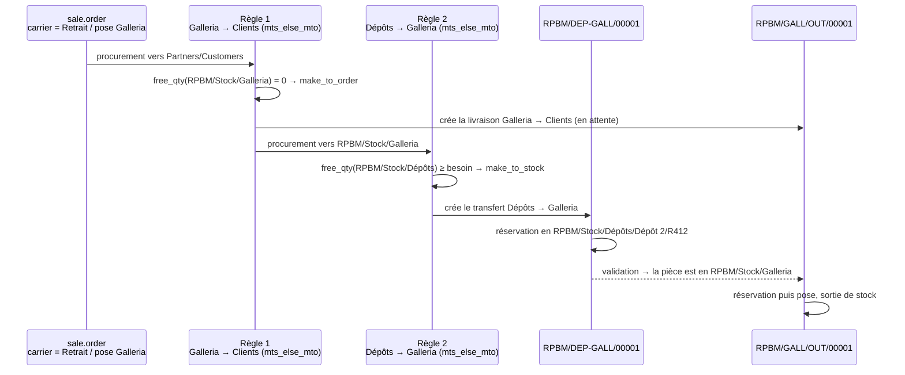

Le rack `R412` n'apparaît **pas** dans le type d'opération, il apparaît sur la ligne de mouvement
(`stock.move.line.location_id`), écrite par `_gather` (`stock/models/stock_quant.py:813-819`). Le
document reste typé `DEP-GALL` même si la pièce vient du Dépôt 1 — c'est la limite établie en
[§4.1](#41-une-règle--un-type-dopération--le-rack-prélevé-ne-peut-pas-typer-le-document).

### F2 — Pièce en stock au dépôt → pose sur site · **2 documents**

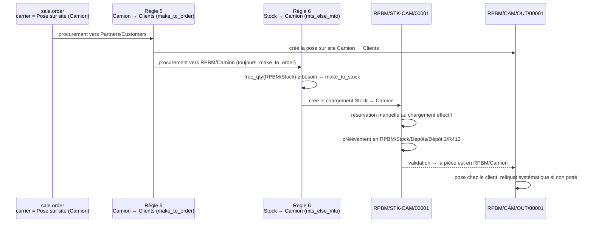

### F3 — Pièce absente → achat → dépôt → comptoir · **3 documents**

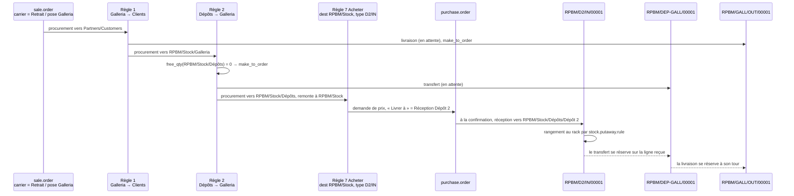

La remontée `Dépôts` → `Stock` est le parcours ascendant de `_get_rule`
(`stock/models/stock_rule.py:560-563` construit la hiérarchie, `:601-614` la reparcourt jusqu'à
trouver une règle). C'est **la raison** pour laquelle la règle 7 doit porter `RPBM/Stock` en
destination : posée sur `Dépôt 2`, elle serait un *enfant* du point de départ et ne serait jamais
atteinte.

### F4 — Pièce absente, le fournisseur livre au comptoir · **2 documents utiles, 3 émis**

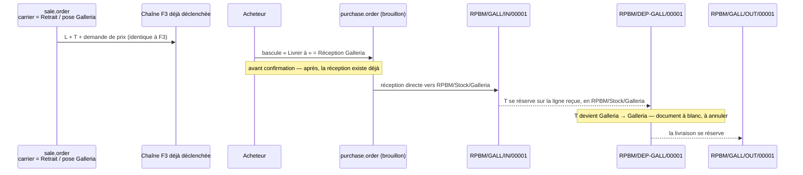

**Point dur.** Le transfert `DEP-GALL` a déjà été créé au moment de la confirmation de la vente ;
le basculement de « Livrer à » intervient après. Le mouvement chaîné se réserve sur
l'emplacement de destination **réel** des lignes du mouvement amont, pas sur son propre
`location_id` : `_get_available_move_lines_in` regroupe par `ml.location_dest_id`
(`stock/models/stock_move.py:1621-1634`) et `_action_assign` réserve ensuite `strict=True` sur cet
emplacement (`stock/models/stock_move.py:1771-1785`). Le transfert devient donc
`Galleria → Galleria` : il fonctionne, il ne déplace rien, et il pollue la file de travail. La
procédure est d'**annuler** ce transfert. C'est la sharpening du point laissé ouvert en
[architectures-stock.md § I.7](../architectures-stock.md#i7-le-périmètre-de-réservation--une-décision-de-plus-à-poser-au-client) ;
il reste à confirmer en préproduction ([§6](#6--ce-qui-na-pas-pu-être-tranché-ou-vérifié)).

### F5 — Réception au comptoir → chargement camion → pose sur site · **3 documents**

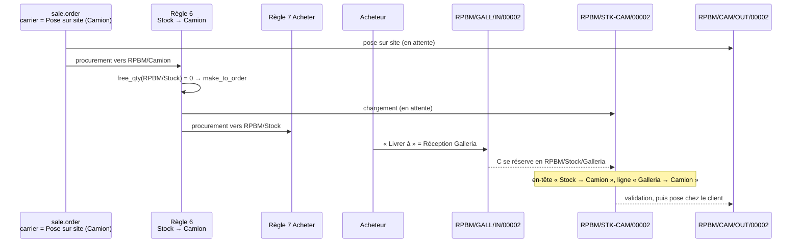

Ici l'écart en-tête / ligne est **bénin** : `RPBM/Stock/Galleria` est bien un descendant de
`RPBM/Stock`, la source de la règle 6. Contrairement à F4, aucun document à blanc n'est produit.

### F6 — Le comptoir renvoie une pièce en dépôt · **1 document**

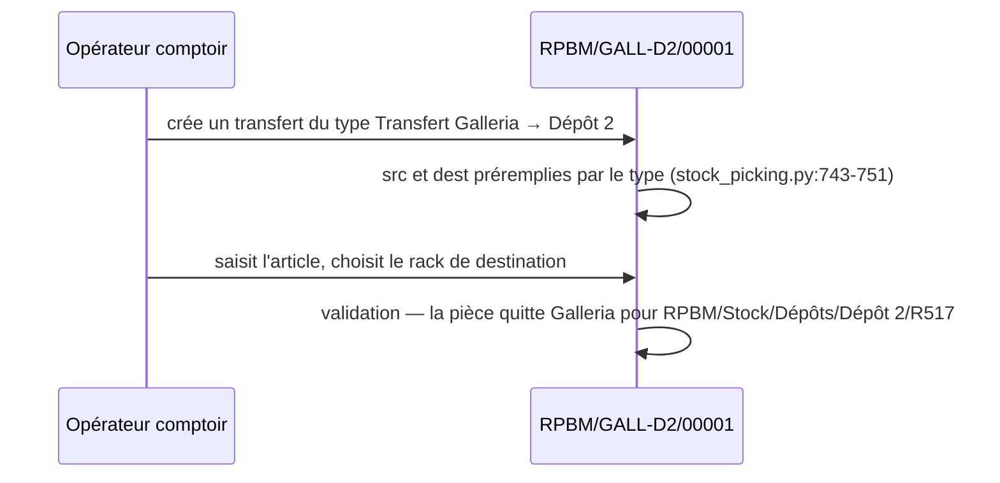

Aucune règle, aucune route : c'est un transfert manuel typé. Les 20 types de
[§2.3.1](#231-transferts-inter-sites--code--internal-20) existent d'abord pour cela.

### F7 — Article chargé mais non posé → retour · **1 document (+ le reliquat)**

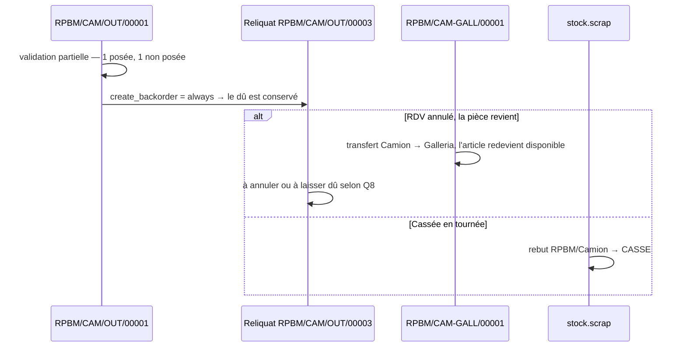

`create_backorder = always` est ce qui rend F7 lisible : le dû n'est jamais silencieusement
effacé (`stock/models/stock_picking.py:139-145`). La destination du retour reste
[Q8](../questions-ouvertes.md).

### F8 — Casse · **1 `stock.scrap`, 0 type d'opération**

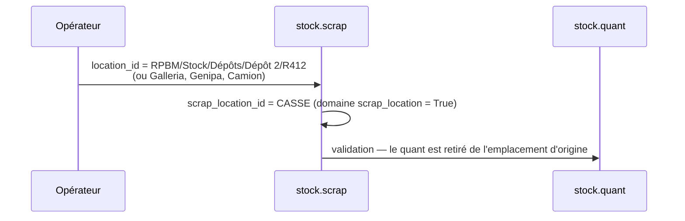

`stock.scrap.location_id` porte le domaine `[('usage','=','internal')]`
(`stock/models/stock_scrap.py:39-42`) et `scrap_location_id` le domaine
`[('scrap_location','=',True)]` (`:43-46`). L'origine de la casse est donc tracée par
`location_id`, avec la granularité du rack.

### F9 — Vente servie depuis le stock du comptoir · **1 document**

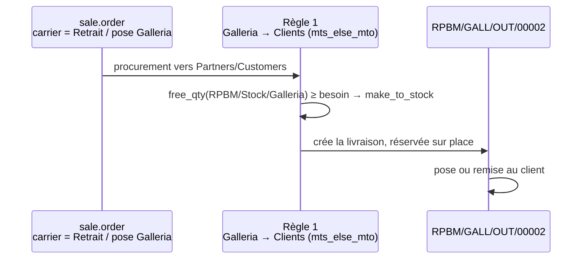

C'est le flux le plus fréquent en volume et il reste à un document — la règle 2 n'est pas
déclenchée. Le mécanisme est `_run_pull` (`stock/models/stock_rule.py:258-276`) : le
`procure_method` effectif est décidé règle par règle en comparant le besoin au `free_qty` de
`location_src_id`.

### F10 — Rééquilibrage entre sites de même profil · **1 document**

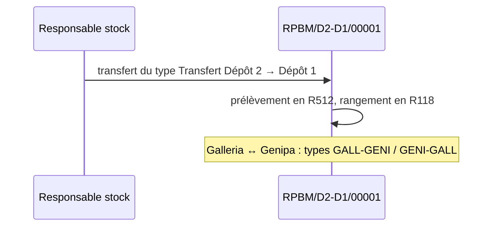

### F11 — Retour fournisseur · **1 document**

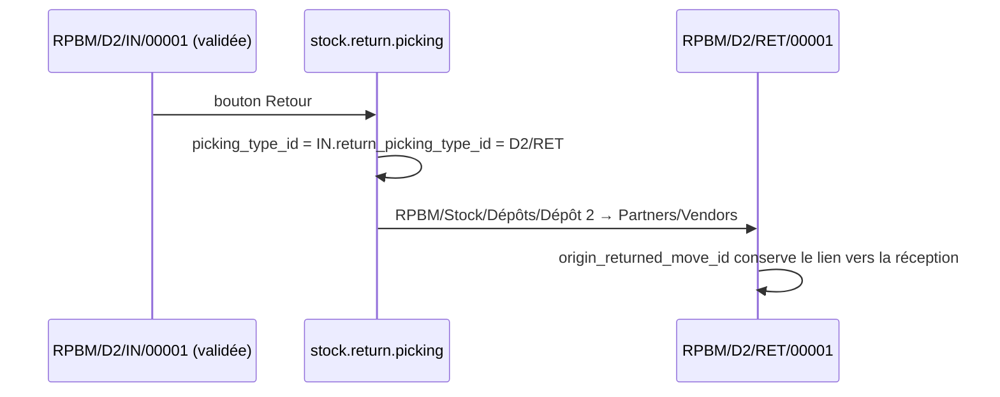

`_prepare_picking_default_values` lit `return_picking_type_id` avec repli sur le type d'origine
(`stock/wizard/stock_picking_return.py:116`), et `origin_returned_move_id` est posé sur chaque
mouvement (`stock/wizard/stock_picking_return.py:106`).

### Décompte récapitulatif

| Flux | Documents | Types mobilisés |
|---|---|---|
| F1 | **2** | `DEP-GALL` + `GALL/OUT` |
| F2 | **2** | `STK-CAM` + `CAM/OUT` |
| F3 | **3** | `D2/IN` + `DEP-GALL` + `GALL/OUT` |
| F4 | **2 utiles, 3 émis** | `GALL/IN` + `GALL/OUT`, plus un `DEP-GALL` à blanc à annuler |
| F5 | **3** | `GALL/IN` + `STK-CAM` + `CAM/OUT` |
| F6 | **1** | `GALL-D1` / `GALL-D2` / `GENI-D1` / `GENI-D2` |
| F7 | **1** (+ reliquat) | `CAM-D1` / `CAM-D2` / `CAM-GALL` / `CAM-GENI` |
| F8 | **1 `stock.scrap`** | aucun |
| F9 | **1** | `GALL/OUT` / `GENI/OUT` |
| F10 | **1** | `D1-D2` / `D2-D1` / `GALL-GENI` / `GENI-GALL` |
| F11 | **1** | `D1/RET` / `D2/RET` / `GALL/RET` / `GENI/RET` |

---

## 4. Ce que cette architecture impose de particulier

### 4.1 Une règle = un type d'opération : le rack prélevé ne peut pas typer le document

C'est **le** point de conception de cette architecture, et il ne se contourne pas.

Ce que le code établit :

| # | Constat | Source |
|---|---|---|
| 1 | `stock.rule.picking_type_id` est un `Many2one` **`required`** — une règle porte un et un seul type. | `stock/models/stock_rule.py:75-78` |
| 2 | Le mouvement créé prend `location_id = rule.location_src_id` et `picking_type_id = rule.picking_type_id`, **figés à la création**. | `stock/models/stock_rule.py:344` et `:350` |
| 3 | Le rack réellement prélevé est décidé **plus tard**, à la réservation, par `_gather` en `child_of`. Il n'écrit que `stock.move.line.location_id`. | `stock/models/stock_quant.py:803`, `:813-819` |
| 4 | `_action_assign` n'écrit **jamais** `picking_type_id` — vérifié par lecture intégrale de la méthode. | `stock/models/stock_move.py:1670-1800` |

Il n'existe donc aucun chemin entre « la pièce était en `R412`, donc au Dépôt 2 » et « le document
doit être typé `D2-GALL` ».

**Deux règles concurrentes ne résolvent rien non plus**, et c'est le point qu'il faut nommer parce
qu'il est contre-intuitif :

- *Deux règles dans la même route*, `Dépôt 1 → Galleria` et `Dépôt 2 → Galleria` :
  `_search_rule_for_warehouses` groupe par `(location_dest_id, warehouse_id, route_id)` et ne
  **conserve qu'une seule règle par groupe**, `sorted((route_sequence, sequence))[0]`
  (`stock/models/stock_rule.py:516-524`). La seconde règle n'est jamais atteignable.
- *Deux règles dans deux routes* : `extract_rule` parcourt les routes triées par `sequence` et
  `break` au premier succès (`stock/models/stock_rule.py:574-585`). Même résultat.
- Dans les deux cas le gagnant est **toujours le même dépôt**, indépendamment du stock disponible :
  `mts_else_mto` n'est évalué qu'**après** la sélection de la règle (`_run_pull`,
  `stock/models/stock_rule.py:258-276`). Il n'existe pas de cascade « si le Dépôt 1 est vide, essaie
  le Dépôt 2 » entre deux règles sœurs.

**Trois traitements possibles**, du moins cher au plus cher.

| # | Traitement | Documents pour F1 | Ce que ça coûte | Ce que ça donne |
|---|---|---|---|---|
| **A** | Un type unique `DEP-GALL` sourcé sur `RPBM/Stock/Dépôts`, plus `DEP-GENI` et `STK-CAM` sur le même principe. | **2** | 3 types au-delà des 31 ; le document ne dit pas le bâtiment | Le dépôt d'origine reste lisible **ligne par ligne** (`stock.move.line.location_id` porte le rack) et filtrable dans la liste des transferts |
| **B** | Chaîne `Dépôt 1 → Dépôt 2 → Galleria` : `D2-GALL` en `mts_else_mto` sur `Dépôt 2`, dont l'amont est `D1-D2` en `mts_else_mto` sur `Dépôt 1`. | **2** si la pièce est au D2, **3** si elle est au D1 | Fait transiter physiquement par le Dépôt 2 une pièce du Dépôt 1 qui va au comptoir — un déplacement inutile, sur 109 racks sur 489 | Conserve intégralement le typage `D1-…` / `D2-…` des invariants |
| **C** | Une règle par dépôt, deux routes, sélection par le transporteur. | 2 | Multiplie les transporteurs par le nombre de dépôts (6 au lieu de 3), et demande au vendeur de savoir **dans quel bâtiment** est la pièce au moment du devis | Typage exact, mais la décision est déplacée sur la personne la moins informée |

**Recommandation : A.** Le principe directeur des invariants — *toute opération doit être
identifiable sans ouvrir le document* — est tenu à 90 % : le document dit « des dépôts vers
Galleria », l'ouvrir dit « rack R412 ». Le traitement B achète le dernier dixième au prix d'un
déplacement physique fictif sur 22 % du stock. Le traitement C achète le même dixième au prix d'une
information que le vendeur n'a pas.

Ce point vaut **à l'identique pour le camion**, et plus durement : les quatre types `D1-CAM`,
`D2-CAM`, `GALL-CAM`, `GENI-CAM` ne peuvent être servis par la route *Pose sur site — Camion*, qui
n'a qu'une règle de chargement. `STK-CAM` les remplace **sur le chemin automatique uniquement** ; les
quatre restent utilisables pour un chargement manuel préparé à l'avance.

### 4.2 La règle *Acheter* doit diverger de son propre type d'opération

La règle `buy_pull_id` est générée avec `picking_type_id = warehouse.in_type_id` et
`location_dest_id = in_type_id.default_location_dest_id`
(`purchase_stock/models/stock.py:23-45`). Les deux sont normalement identiques. **Ici ils ne peuvent
pas l'être** :

- `_get_rule` remonte la hiérarchie de l'emplacement de **destination** du besoin et cherche des
  règles dont le `location_dest_id` est dans cette chaîne ascendante
  (`stock/models/stock_rule.py:560-563` construit la chaîne, `:616-626` le domaine, `:601-614` la
  reparcourt). Un besoin né en `RPBM/Stock/Dépôts` visite `Dépôts`, `Stock`, `RPBM` — **jamais**
  `Dépôt 2`, qui est un enfant ;
- si la règle *Acheter* portait `location_dest_id = Dépôt 2`, elle serait invisible depuis la règle
  amont des comptoirs (sourcée sur `Dépôts`) **et** depuis la règle de chargement camion (sourcée
  sur `RPBM/Stock`). F3 et F5 échoueraient à la confirmation de la vente, sur une
  `ProcurementException` « aucune règle trouvée » ;
- la destination **physique** du bon de commande, elle, ne vient pas de la règle mais du type
  d'opération : `_get_destination_location` retourne `picking_type_id.default_location_dest_id`
  (`purchase_stock/models/purchase_order.py:204-208`).

**Configuration cible** : `buy_pull_id.location_dest_id = RPBM/Stock` (valeur native, à ne pas
toucher) et `buy_pull_id.picking_type_id = Réception Dépôt 2`, avec
`Réception Dépôt 2.default_location_dest_id = RPBM/Stock/Dépôts/Dépôt 2`.
Rien ne lie ces deux champs — `default_location_dest_id` et `warehouse_id` sont `compute` /
`store=True` / `readonly=False` et le seul `@api.constrains` porte sur `mrp_operation`
(`stock/models/stock_picking.py:38-41`, `:336-340`).

**La mine, à connaître avant d'y marcher.** Écrire `reception_steps` ou `buy_to_resupply` sur
l'entrepôt `RPBM` déclenche `_create_or_update_global_routes_rules`
(`stock/models/stock_warehouse.py:211-215`) qui réapplique
`buy_pull_id.location_dest_id = in_type_id.default_location_dest_id`, soit `Dépôt 2`
(`purchase_stock/models/stock.py:37-42`). La même écriture réapplique aussi
`in_type_id.default_location_dest_id = lot_stock_id` via `_get_picking_type_update_values`
(`stock/models/stock_warehouse.py:962-966`). Résultat après une simple visite du formulaire
d'entrepôt suivie d'une sauvegarde : **F3 et F5 tombent en erreur à la confirmation de vente**,
et les réceptions atterrissent à `RPBM/Stock` au lieu du Dépôt 2. La panne est bruyante, pas
silencieuse — mais elle doit figurer dans la procédure d'exploitation, et la règle de rangement
`RPBM/Stock → Dépôt 2` de [§2.7](#27-stockputawayrule) en amortit la moitié.

### 4.3 Les types et routes natifs de l'entrepôt

L'entrepôt en génère cinq types et deux routes qu'il faut décider de recycler ou de neutraliser.

| Enregistrement natif | Décision | Motif, vérifié |
|---|---|---|
| `in_type_id` [`IN`] | **recyclé** en `Réception Dépôt 2` [`D2/IN`] | c'est l'ancre de la règle *Acheter* ; le recyclage évite un cinquième type de réception que l'acheteur devrait basculer sur 100 % des achats |
| `int_type_id` [`INT`] | **recyclé** en `Transfert Dépôts → Galleria` [`DEP-GALL`] | recyclage **sûr** : `_get_picking_type_update_values` ne réécrit que `barcode` pour `int_type_id` (`stock/models/stock_warehouse.py:982-984`) |
| `out_type_id` [`OUT`] | **conservé, archivé après reprise** | recyclage **dangereux** : `_get_picking_type_update_values` réécrit `default_location_src_id = lot_stock_id` (`stock_warehouse.py:967-970`), soit `RPBM/Stock` — ce qui restaurerait silencieusement le pool unique sur les livraisons du comptoir |
| `pick_type_id`, `pack_type_id` | laissés inactifs | `active = delivery_steps != 'ship_only'` (`stock_warehouse.py:971-978`) |
| `RPBM: Recevoir en 1 étape` | conservée, **sans règle** | en `one_step` la route de réception est vide : `_get_receive_rules_dict()['one_step'] = []` (`stock/models/stock_warehouse.py:812-813`), et c'est cette variante que `purchase_stock` impose (`purchase_stock/models/stock.py:52-61`) |
| `RPBM: Livrer en 1 étape` | **à archiver** | c'est le filet de sécurité, et c'est un piège : voir ci-dessous |

**Le sort de `RPBM: Livrer en 1 étape` est un arbitrage, pas une évidence.** Cette route est
`warehouse_selectable`, donc dernier étage de la cascade de `_search_rule`
(`stock/models/stock_rule.py:546-549`). Une commande **sans transporteur et sans route de ligne**
y retombe et produit une livraison sourcée sur `RPBM/Stock` avec le type natif `OUT` :
réservation sur tout l'arbre, pool unique restauré, aucun transfert documenté, et un document qui
ne relève d'aucun comptoir.

- **L'archiver** rend l'oubli de transporteur *bruyant* : `ProcurementException` à la confirmation.
  C'est le comportement recommandé — un blocage vaut mieux qu'une vente servie depuis le mauvais site.
- **La conserver** rend l'oubli silencieux.

Attention : l'archivage est réversible **par Odoo lui-même**. `route_update_values` pose
`'active': self.active` sur la route de livraison, et `_create_or_update_route` désactive puis
réactive ses règles (`stock/models/stock_warehouse.py:476` et `:535-553`), dès qu'une écriture
touche `delivery_steps`. Même mine que [§4.2](#42-la-règle-acheter-doit-diverger-de-son-propre-type-dopération),
même parade : ne pas éditer l'entrepôt après la mise en service, et vérifier ces trois points après
toute intervention.

### 4.4 La route `Buy` doit être portée par l'article ou sa catégorie — rien ne l'ajoute tout seul

Contrairement à ce que l'intuition suggère, la règle *Acheter* n'est **pas** atteinte par le repli
« routes de l'entrepôt » de `_search_rule`.

- `warehouse.route_ids` n'est peuplée que des routes créées avec `warehouse_selectable = True`
  (`stock/models/stock_warehouse.py:494-498`), soit réception, livraison et cross-dock ;
- la route `Buy` est créée sans aucun flag explicite (`purchase_stock/data/purchase_stock_data.xml:10-14`)
  et hérite donc de `product_selectable = True`, `product_categ_selectable = False`,
  `warehouse_selectable = False` (`stock/models/stock_location.py:471-474`) ;
- `stock.route` n'est jamais ajoutée automatiquement à un article : `product_template.route_ids` n'a
  ni valeur par défaut ni `compute`. Les tests standard l'écrivent explicitement
  (`purchase_stock/tests/test_create_picking.py:399-408` :
  `'route_ids': [(6, 0, [route_buy.id, route_mto.id])]`).

**Conséquence pour RPBM, où 82 % du catalogue est à zéro** : si `Buy` n'est pas portée par les
catégories d'articles, F3 échoue à la confirmation de la vente sur *aucune règle trouvée*. La
configuration à faire tient en deux gestes : cocher `product_categ_selectable` sur la route `Buy`,
puis l'ajouter au `total_route_ids` des catégories d'articles achetés.

*Ceci corrige la formulation de [invariants §4.2](00-invariants.md#42-mécanique-vérifiée), dernier
point, qui attribue le déclenchement de l'achat au « repli sur les routes de l'entrepôt ». Le repli
existe bien et la cascade fonctionne — mais l'étage qui trouve la règle `Acheter` est
`product_id.route_ids | product_id.categ_id.total_route_ids` (`stock/models/stock_rule.py:542-545`),
pas `warehouse_id.route_ids`.*

### 4.5 Ce que le mode d'expédition impose au poste de vente

Repris de [invariants §4.3](00-invariants.md#43-deux-limites-à-documenter-dans-chaque-architecture),
avec ce que cette architecture y ajoute.

- **Le transporteur est obligatoire de fait.** Ce n'est plus un confort mais la seule façon de
  sélectionner le comptoir servant, puisque `sale.order.warehouse_id` ne segmente rien (il n'y a
  qu'un entrepôt). L'oubli n'a aucun garde-fou natif ; le seul levier est l'archivage décrit en
  [§4.3](#43-les-types-et-routes-natifs-de-lentrepôt).
- **Le transporteur doit être posé avant confirmation** : la route est lue dans
  `_prepare_procurement_values` (`stock_delivery/models/sale_order.py:51-55`), appelé une seule fois
  à la confirmation.
- **C'est un choix par commande.** Une commande mixte demande `sale.order.line.route_id`, prioritaire
  (`stock/models/stock_rule.py:536-537`, premier étage de la cascade).
- **L'assistant crée une ligne de livraison** (`delivery/models/sale_order.py:129-131`,
  `product_id` requis sur `delivery.carrier`). À prix nul pour les deux retraits comptoir, c'est une
  ligne de bruit sur le devis. Pour « Pose sur site », c'est au contraire le bon endroit pour les
  frais de déplacement, aujourd'hui saisis comme service.

### 4.6 Points à vérifier en préproduction

1. **F4 et le transfert à blanc** — confirmer que le `DEP-GALL` devient `Galleria → Galleria` et
   qu'il s'annule sans casser la chaîne vers la livraison. Prédit par
   `stock/models/stock_move.py:1621-1634` et `:1771-1785`, non exécuté.
2. **Réservation depuis un parent qui n'a pas de quant propre** — la règle 2 est sourcée sur
   `RPBM/Stock/Dépôts`, qui ne contient jamais de quant en propre. `_gather` en `child_of` doit
   trouver les racks ; à confirmer sur un cas réel, notamment le libellé de l'emplacement source
   affiché sur la ligne du transfert.
3. **Répercussion d'une modification d'entrepôt** — écrire puis annuler une valeur sur le formulaire
   de l'entrepôt `RPBM` et vérifier l'état de `buy_pull_id.location_dest_id`,
   de `in_type_id.default_location_dest_id` et de l'`active` de `RPBM: Livrer en 1 étape`.
4. **Repointage de `lot_stock_id`** — l'écriture de `lot_stock_id` déclenche
   `_create_missing_locations` (`stock/models/stock_warehouse.py:171`) ; l'effet sur les
   emplacements techniques `wh_input_stock_loc_id` et consorts n'a pas été tracé.
5. **Ordre de la reprise** — recycler `int_type_id` en `DEP-GALL` change son `sequence_code`, ce qui
   réécrit le préfixe de la séquence **existante** (`stock/models/stock_picking.py:183-190`) : les
   documents déjà émis en `RPBM/INT/` gardent leur nom, la numérotation repart en `RPBM/DEP-GALL/`
   au compteur courant. À valider avec RPBM.
6. **Quel type d'opération est aujourd'hui `out_type_id`** — `Livraisons Galleria` ou
   `Livraisons Génipa` ? Non relevé sur l'instance (aucune lecture n'a été faite pour ce document).
   Celui qui l'est doit être laissé de côté et un type neuf créé à sa place.

### 4.7 Récapitulatif des amendements demandés

| # | Invariant concerné | Amendement | Motif |
|---|---|---|---|
| 1 | §2.1, types `D1-GALL` / `D2-GALL` / `D1-GENI` / `D2-GENI` | ajouter `DEP-GALL` et `DEP-GENI`, seuls types portables par la règle amont. Les quatre types d'origine restent pour les transferts manuels. | [§4.1](#41-une-règle--un-type-dopération--le-rack-prélevé-ne-peut-pas-typer-le-document) |
| 2 | §2.1, types `D1-CAM` / `D2-CAM` / `GALL-CAM` / `GENI-CAM` | ajouter `STK-CAM`, seul type portable par la règle de chargement. Les quatre restent pour un chargement préparé à la main. | [§4.1](#41-une-règle--un-type-dopération--le-rack-prélevé-ne-peut-pas-typer-le-document) |
| 3 | §4.2, dernier point | la règle *Acheter* est trouvée par les routes de l'**article ou de sa catégorie**, pas par celles de l'entrepôt ; `product_categ_selectable` est à cocher sur `Buy`. | [§4.4](#44-la-route-buy-doit-être-portée-par-larticle-ou-sa-catégorie--rien-ne-lajoute-tout-seul) |

Le référentiel passe donc de **31 à 34 types d'opération**, dont 31 utilisables manuellement et 3
réservés aux chaînes automatiques.

---

## 5. Ce qu'elle ne donne pas

- **Aucune adresse de réception par site.** Le bloc adresse d'un bon de commande vient de
  `picking_type_id.warehouse_id.partner_id`
  (`purchase_stock/report/purchase_report_templates.xml:9-11`, `:33-35`) : les 34 types partagent
  le même entrepôt, donc la même adresse. Sans effet chez RPBM, où le document n'est pas envoyé au
  fournisseur ([architectures-stock.md § I.3](../architectures-stock.md#i3-pourquoi-le-critère-de-bascule-ne-bascule-pas)) —
  et ce serait le déclencheur d'un passage à l'architecture 3.
- **`sale.order.warehouse_id` ne segmente rien.** Il n'y a qu'un entrepôt ; le défaut par vendeur
  (`res.users.property_warehouse_id`, `sale_stock/models/res_users.py:10`) est sans effet. La
  segmentation commerciale passe par `team_id` et l'analytique, et la segmentation logistique
  uniquement par le type d'opération.
- **Aucun stock valorisé « par site » en standard.** `stock.quant.warehouse_id` vaut `RPBM` pour
  tous les quants ; le reporting par site se fait par filtre sur l'emplacement.
- **Le document ne dit pas le bâtiment sur les chaînes automatiques.** `DEP-GALL` couvre les deux
  dépôts, `STK-CAM` les quatre sites — [§4.1](#41-une-règle--un-type-dopération--le-rack-prélevé-ne-peut-pas-typer-le-document).
  L'information existe, à la ligne.
- **Aucune protection contre l'oubli du transporteur, sinon un blocage.** Il n'y a pas de position
  intermédiaire entre « la vente échoue » et « la vente part sur le mauvais périmètre de
  réservation ».
- **La configuration n'est pas idempotente vis-à-vis du formulaire d'entrepôt.** Trois réglages
  (`buy_pull_id.location_dest_id`, `in_type_id.default_location_dest_id`, `active` de la route de
  livraison native) sont réécrits par Odoo lors d'une écriture sur `RPBM`. C'est le prix de
  détourner les objets natifs plutôt que d'en créer.
- **Une vente Galleria ne voit pas le stock de Genipa** — c'est l'effet recherché
  ([invariants §5](00-invariants.md#5-périmètre-de-réservation--pool-par-comptoir)), et son revers :
  `mts_else_mto` déclenchera un achat VSF d'une pièce déjà possédée à l'autre comptoir. Avec 578
  références en stock à 1,33 unité de moyenne, ce n'est pas un cas d'école.

---

## 6. Ce qui n'a pas pu être tranché ou vérifié

Section honnête. Rien de ce qui suit n'est affirmé dans le corps du document.

| # | Point | État |
|---|---|---|
| 1 | **L'état réel de l'instance** n'a pas été relevé pour ce document. Aucune connexion, aucune lecture, aucune écriture. Les identifiants natifs (`out_type_id`, `int_type_id`, `in_type_id`) sont supposés d'après [architectures-stock.md § « État actuel »](../architectures-stock.md#état-actuel-de-linstance) daté du 2026-08-05. | **non vérifié** |
| 2 | **Le comportement effectif de F4** (transfert `DEP-GALL` devenu `Galleria → Galleria`) est déduit de la lecture de `_get_available_move_lines_in` et `_action_assign`, pas d'une exécution. | déduit, **non exécuté** |
| 3 | **`Dépôts` en `usage = view`** : je n'ai pas trouvé de contrainte Python interdisant `stock.move.location_id` sur un `view` (seul `stock.move.line` porte le domaine, `stock/models/stock_move_line.py:63`, et un domaine n'est pas une contrainte). La variante `view` est donc peut-être viable et plus sûre contre les quants égarés. **Non tranché**, `internal` retenu par prudence. | **non tranché** |
| 4 | **Effet du repointage de `lot_stock_id`** sur `wh_input_stock_loc_id` et les autres emplacements techniques : `_create_missing_locations` est appelé mais son corps n'a pas été lu. | **non vérifié** |
| 5 | **Continuité des séquences** lors du changement de `sequence_code` d'un type existant : le préfixe est réécrit, le compteur `number_next` ne l'est pas. Ce qui se passe si un préfixe entre en collision avec un autre n'a pas été tracé au-delà de l'avertissement d'ergonomie de `_onchange_sequence_code` (`stock/models/stock_picking.py:319-334`). | **partiellement vérifié** |
| 6 | **`procure_method` de la règle 5** (`Camion → Clients`) : `make_to_order` est retenu pour garantir un document de chargement. `mts_else_mto` serait plus léger si RPBM charge le camion à l'avance. Le choix dépend de [Q8](../questions-ouvertes.md) et **n'est pas tranché**. | arbitrage **ouvert** |
| 7 | **Source de la règle 6** (`Stock → Camion`) : `RPBM/Stock` est retenu pour que F5 fonctionne sans intervention. `RPBM/Stock/Dépôts` serait plus strict mais rendrait F5 entièrement manuel. **Non tranché.** | arbitrage **ouvert** |
| 8 | **Volumétrie de la file `DEP-GALL`** : je n'ai pas de mesure du nombre de transferts dépôt → comptoir par jour, donc pas d'avis chiffré sur la charge que le pool par comptoir ajoute réellement aux équipes. | **hors périmètre** |
| 9 | **Interaction `stock_picking_batch` / 34 types d'opération** : le regroupement en lots par type n'a pas été vérifié dans le code du module (non installé sur l'instance). | **non vérifié** |
