# Architecture 2 — cinq entrepôts Odoo distincts

Date : 2026-08-06 · Odoo 17 · Document de configuration cible. **Aucune configuration n'a été
appliquée sur l'instance.**

Ce document ne redéfinit rien de [00-invariants.md](00-invariants.md) : les cinq sites, les 31 types
d'opération et leurs `sequence_code`, les trois transporteurs, le pool par comptoir, les onze flux et
les conventions transverses y sont fixés et s'appliquent ici tels quels. Il décrit **uniquement
l'implémentation** de ces invariants avec cinq `stock.warehouse`.

Toute affirmation sur le comportement d'Odoo est référencée `fichier:ligne` depuis
`D:\git\odoo_17\odoo17\addons` (Community) ou `D:\git\odoo_17\enterprise`. Ce qui n'a pas été vérifié
est signalé comme tel et regroupé en [§ 6](#6-ce-que-je-nai-pas-tranché-ou-pas-vérifié).

Sommaire de lecture rapide : le conflit entre l'invariant « un transfert = un document » et le
réapprovisionnement inter-entrepôts natif est tranché en [§ 0](#0-le-point-dur--transit-natif-contre-un-document) ;
tout le reste en découle.

---

## 0. Le point dur : transit natif contre « un document »

### 0.1 L'invariant

[§ 2 des invariants](00-invariants.md#2-le-référentiel-des-opérations) : *« Un transfert inter-sites
est UN document, émis du côté de l'origine et allant directement à la destination. Aucun emplacement
de transit, aucune réception de contrepartie. »*

### 0.2 Ce que fait réellement le mécanisme natif — vérifié

`stock.warehouse.resupply_wh_ids` (`stock/models/stock_warehouse.py:82-84`) déclenche
`create_resupply_routes()` à la création (`:140`) et à l'écriture (`:261-277`).

`create_resupply_routes()` (`stock/models/stock_warehouse.py:715-747`) :

| Ligne | Ce que fait le code |
|---|---|
| `:719` | `input_location, output_location = self._get_input_output_locations(...)` — pour l'entrepôt **approvisionné** ; en `one_step`, `input_location = lot_stock_id` (`:750-752`) |
| `:720` | `internal_transit_location, external_transit_location = self._get_transit_locations()` |
| `:723` | `transit_location = internal_transit_location if supplier_wh.company_id == self.company_id else external_transit_location` |
| `:724-725` | `if not transit_location: continue` — **sans emplacement de transit, la route n'est pas créée du tout** |
| `:726` | `transit_location.active = True` — le transit est réactivé de force |
| `:727` | `output_location = supplier_wh.lot_stock_id if supplier_wh.delivery_steps == 'ship_only' else supplier_wh.wh_output_stock_loc_id` |
| `:729-734` | si l'entrepôt source est en `ship_only`, création d'une **règle MTO supplémentaire** `output_location → transit_location` |
| `:736` | création de la route `<Approvisionné>: Supply Product from <Fournisseur>` (`:820-829`) |
| `:738-740` | **règle 1** : `Routing(output_location, transit_location, supplier_wh.out_type_id, 'pull')` |
| `:741-743` | **règle 2** : `Routing(transit_location, input_location, self.in_type_id, 'pull')`, avec `propagate_warehouse_id = supplier_wh.id` |

`_get_transit_locations()` (`:754-755`) renvoie
`(self.company_id.internal_transit_location_id, self.env.ref('stock.stock_location_inter_wh'))`. Il
n'existe **aucun paramètre, aucun booléen, aucune clé de contexte** permettant de sauter cette étape :
la variable `transit_location` est la destination de la règle 1 et la source de la règle 2, en dur.

**Conséquence** : deux `stock.rule` avec deux `picking_type_id` différents
(`supplier_wh.out_type_id` puis `self.in_type_id`) produisent deux `stock.move` non fusionnables (les
emplacements diffèrent), donc **deux `stock.picking`** : une livraison chez l'entrepôt source, une
réception chez l'entrepôt destination. Le mécanisme natif **ne peut pas** produire un document unique.

### 0.3 Les fausses pistes, éliminées

| Piste | Pourquoi elle ne marche pas |
|---|---|
| `stock.rule.auto = 'transparent'` (« Automatic No Step Added », `stock/models/stock_rule.py:95-100`) qui remplace l'emplacement du mouvement au lieu d'en créer un second | Ce comportement n'est implémenté que dans `_run_push` (`stock/models/stock_rule.py:193-202`), appelé exclusivement par `stock_move._push_apply()`, dont le domaine est `[('location_src_id','=',...), ('action','in',('push','pull_push'))]` (`stock/models/stock_move.py:963-971`). Les règles de réapprovisionnement sont créées en `'pull'` (`stock_warehouse.py:738-743`) : `auto` n'est jamais lu pour elles. |
| Pointer `internal_transit_location_id` de la société sur `GALL/Stock` pour que la règle 2 devienne un no-op | La règle 1 deviendrait `DEP2/Stock → GALL/Stock` (le bon transfert) mais la règle 2 `GALL/Stock → GALL/Stock` créerait quand même un second `stock.move` et un second picking, et le transit serait partagé par **tous** les couples d'entrepôts. Non retenu, non testé. |
| Archiver la règle 2 après création | `_find_existing_rule_or_create()` (`stock_warehouse.py:611-624`) réactive toute règle inactive dont `(picking_type_id, location_src_id, location_dest_id, route_id, action)` correspond, à chaque passage de `_create_or_update_route()`. Et `_check_reception_resupply()` / `_check_delivery_resupply()` (`:884-920`) réécrivent ces règles quand `reception_steps` / `delivery_steps` changent. Fragile par construction. |

### 0.4 L'alternative : construire les règles à la main

Une règle `pull` unique, `location_src_id = DEP2/Stock`, `location_dest_id = GALL/Stock`,
`picking_type_id = D2-GALL` — un seul mouvement, un seul picking. **Odoo l'accepte.** Vérifications :

| Point à vérifier | Résultat | Source |
|---|---|---|
| Existe-t-il une contrainte liant les emplacements d'une règle à l'entrepôt de son type d'opération ? | **Non.** `stock.rule` n'a qu'un seul `@api.constrains`, sur `company_id`, qui compare la société de la règle à celle de sa route. | `stock/models/stock_rule.py:110-115` |
| `check_company` bloque-t-il le croisement ? | Non. `location_src_id`, `location_dest_id`, `picking_type_id`, `warehouse_id` portent `check_company=True` et le modèle `_check_company_auto = True`, mais `_check_company()` ne compare **que** les `company_id`. Cinq entrepôts d'une même société sont mutuellement compatibles. | `stock_rule.py:35, 62-63, 75-77, 91` ; `odoo/models.py:4061-4113` |
| `_onchange_picking_type` n'écrase-t-il pas les emplacements ? | Il les écrase **en interface** (`self.location_src_id = self.picking_type_id.default_location_src_id`), pas via l'ORM ni via un import de données. Et si on renseigne les `default_location_*` du type d'opération avec les mêmes valeurs, l'onchange devient un no-op. | `stock_rule.py:118-125` |
| Un type d'opération `internal` accepte-t-il des emplacements par défaut hors de son propre entrepôt ? | Oui. `default_location_src_id` / `default_location_dest_id` sont des calculés `store=True, readonly=False`, et les méthodes de calcul **n'assignent rien** quand `code == 'internal'` (elles ne traitent que `incoming` et `outgoing`). | `stock_picking.py:34-41, 267-274, 276-283` |
| Un calculé stocké non assigné ne lève-t-il pas d'erreur ? | Non : Odoo ne lève `Compute method failed to assign` que si le champ est `readonly and not store`. Sinon il retombe sur la valeur nulle. | `odoo/fields.py:1222-1229` |
| `_compute_warehouse_id` du type d'opération pose-t-il problème ? | **Oui, un piège.** C'est un calculé `store=True, readonly=False` dépendant de `company_id` : si `warehouse_id` est laissé vide à la création, il prend **le premier entrepôt trouvé de la société** (`search([...], limit=1)`). Avec cinq entrepôts, les 24 types créés à la main atterriraient tous sur le même. Il faut donc **écrire `warehouse_id` explicitement sur chaque type**. | `stock_picking.py:50-52, 302-311` |
| La règle sera-t-elle trouvée par `_search_rule` ? | Oui **à condition que `rule.warehouse_id` soit l'entrepôt du besoin**, c'est-à-dire la **destination** : le domaine est `['|', ('warehouse_id','=',warehouse_id.id), ('warehouse_id','=',False)]`. | `stock_rule.py:504, 536-538` |
| Le besoin amont remontera-t-il vers l'entrepôt source ? | Oui, par `propagate_warehouse_id` : `_get_stock_move_values` pose `'warehouse_id': self.propagate_warehouse_id.id or self.warehouse_id.id` sur le mouvement créé. C'est exactement le mécanisme du natif (`stock_warehouse.py:741-743`). | `stock_rule.py:353` |

**Le point de configuration le plus contre-intuitif de cette architecture, et il faut l'écrire noir sur
blanc :**

> `stock.picking.type.warehouse_id` = entrepôt **d'origine** (file de travail, préfixe de séquence).
> `stock.rule.warehouse_id` = entrepôt **de destination** (périmètre de recherche de la règle).
> Ils diffèrent sur les 20 transferts inter-sites. Rien dans Odoo ne l'interdit, rien ne le documente.

### 0.5 Tranché

**`resupply_wh_ids` reste vide sur les cinq entrepôts. Les règles inter-sites sont construites à la
main.** L'invariant « un transfert = un document » est **atteignable** en architecture 2 — mais pas
avec le mécanisme natif, dont on sort entièrement.

Ce qu'on perd en abandonnant `resupply_wh_ids` :

1. **La maintenance automatique.** `_check_delivery_resupply()` et `_check_reception_resupply()`
   (`stock_warehouse.py:884-920`) repointent les règles de réappro quand `delivery_steps` ou
   `reception_steps` d'un entrepôt change. Nos règles ne sont vues par aucun de ces hooks : toute
   modification d'un `stock.warehouse` impose une **re-vérification manuelle** des 20 règles.
2. **La visibilité de configuration.** `stock.route.supplied_wh_id` / `supplier_wh_id`
   (`stock/models/stock_location.py:475-476`) restent vides, donc `resupply_route_ids` reste vide et
   le bouton « Routes de l'entrepôt » ne les liste pas (`_get_all_routes()`,
   `stock_warehouse.py:1094-1097`). Le formulaire Entrepôt n'affiche aucun réapprovisionnement : la
   configuration réelle n'est lisible que dans Inventaire > Configuration > Routes.
3. **Le calage MTS/MTO automatique.** `_get_supply_pull_rules_values()` (`:865-872`) posait
   `make_to_stock` sur le premier tronçon et `make_to_order` sur les suivants. À notre charge.
4. **La règle MTO dédiée** créée pour les sources en `ship_only` (`:729-734`). À notre charge — en
   pratique inutile ici, voir [§ 2.5](#25-stockrule).
5. **Le stock en transit** cesse d'exister comme concept : plus de ligne « Stock in Transit » dans le
   rapport de prévision. Ici c'est un gain, pas une perte : le transfert est instantané dans le modèle.

Ce qu'on gagne : F6, F7 et F10 tombent de 2 documents à 1, F1 de 3 à 2, F3 de 4 à 3 — les chiffres
annoncés en [architectures-stock.md § D.3](../architectures-stock.md#d3-les-onze-flux) supposaient le
transit natif et ne s'appliquent plus.

### 0.6 Ce que l'invariant coûte quand même, et qu'on ne peut pas éviter

Un point ne se résout pas : **`_search_rule` renvoie une seule règle** (`limit=1`, tri
`route_sequence, sequence`, `stock_rule.py:536-549`) et **ne consulte pas le stock disponible pour
choisir**. Deux règles `DEP1/Stock → GALL/Stock` et `DEP2/Stock → GALL/Stock` dans la même route sont
donc impossibles : la seconde serait morte.

En architecture 1, on contourne en pointant `location_src_id` sur un emplacement **vue parent** des
deux dépôts — `stock.quant._gather` filtre en `child_of` (`stock/models/stock_quant.py:813-819`) et
sert donc indifféremment depuis D1 ou D2. En architecture 2, `DEP1/Stock` et `DEP2/Stock` sont sous
deux `view_location_id` d'entrepôts **frères** : le seul parent commun est `Physical Locations`, qui
contient aussi `GALL/Stock`, `GENI/Stock` et `CAM/Stock` — ce qui violerait le pool par comptoir
([invariants § 5](00-invariants.md#5-périmètre-de-réservation--pool-par-comptoir)).

On pourrait créer une vue `Physical Locations/Dépôts` et y déplacer les vues `DEP1` et `DEP2` — mais
la règle unique qui en résulterait porterait **un seul type d'opération** `DEP-GALL`, ce qui viole
l'invariant § 2 (un type par couple de sites orienté).

**Arbitrage retenu** : on respecte l'invariant. La règle automatique d'approvisionnement des comptoirs
et du camion pointe sur **Dépôt 2** (380 racks contre 109, [D12](../decisions.md)). Les huit types
`D1-*` et les transferts entre comptoirs existent et sont pleinement utilisables, mais **en création
manuelle** : aucune règle ne les déclenche. C'est une limite structurelle de l'architecture 2, pas un
défaut de configuration.

---

## 1. Structure

### 1.1 Les cinq entrepôts

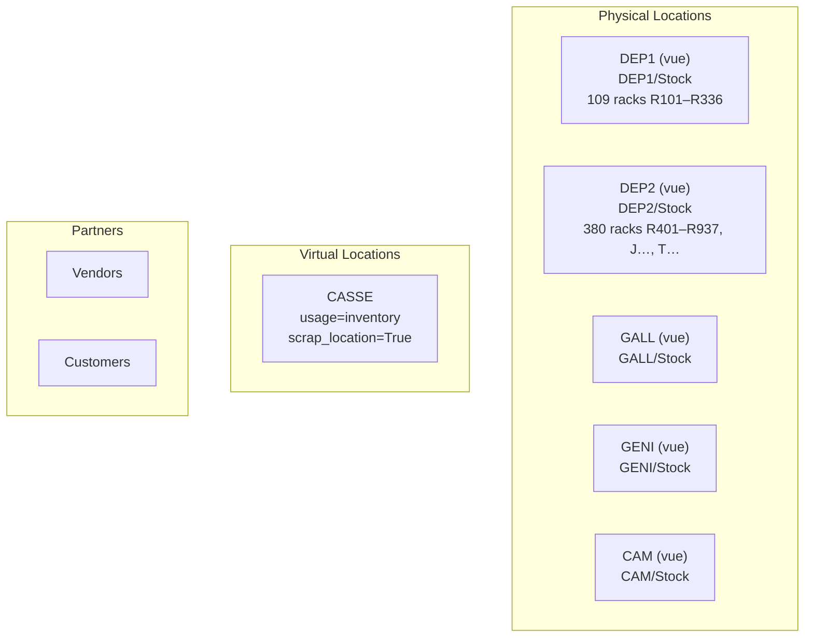

Les cinq vues d'entrepôt sont créées **automatiquement** sous `Physical Locations`
(`stock.stock_location_locations`), nommées d'après le `code` de l'entrepôt, en `usage = 'view'`
(`stock/models/stock_warehouse.py:109-113`). Elles sont **sœurs** : aucun entrepôt n'est imbriqué dans
un autre (c'est l'objet de l'[architecture 3](03-architecture-3-hybride.md)).

C'est cette forme d'arbre qui **donne gratuitement le pool par comptoir** exigé par
[l'invariant § 5](00-invariants.md#5-périmètre-de-réservation--pool-par-comptoir) : la règle de
livraison de Galleria a `location_src_id = GALL/Stock`, `_gather` filtre en `child_of`
(`stock/models/stock_quant.py:813-819`), donc ni `GENI/Stock` ni `CAM/Stock` ni les dépôts ne sont
jamais atteints par une réservation Galleria. **C'est le seul avantage structurel net de cette
architecture sur les deux autres.**

### 1.2 Arbre complet des emplacements

```
Physical Locations                                    (view, natif)
├── DEP1                                              (view, généré)
│   ├── DEP1/Stock                                    (internal, lot_stock_id, replenish_location=True)
│   │   ├── R101 … R336                               (internal, 109 racks — à déplacer)
│   ├── DEP1/Input            (inactif)
│   ├── DEP1/Quality Control  (inactif)
│   ├── DEP1/Output           (inactif)
│   └── DEP1/Packing Zone     (inactif)
├── DEP2                                              (view, généré)
│   ├── DEP2/Stock                                    (internal, lot_stock_id)
│   │   ├── R401 … R937, J…, T…                       (internal, 380 racks — à déplacer)
│   └── … 4 emplacements techniques inactifs
├── GALL / GALL/Stock                                 (aucun sous-emplacement)
├── GENI / GENI/Stock                                 (aucun sous-emplacement)
└── CAM  / CAM/Stock                                  (aucun sous-emplacement)

Virtual Locations
└── CASSE                                             (inventory, scrap_location=True)

Partners
├── Vendors                                           (supplier)
└── Customers                                         (customer)
```

Les 489 racks existants sont sous `RPBM/Stock D1` et `RPBM/Stock D2` : ils doivent être **déplacés**
(écriture de `location_id`), pas recréés. Le déplacement recalcule `warehouse_id` sur chaque
emplacement (`stock/models/stock_location.py:139-152`, dépend de `location_id`) et donc le rattachement
des `stock.quant` par entrepôt dans les rapports.

### 1.3 Ce que la création d'un entrepôt génère — et qu'il faut neutraliser

Pour **chaque** `stock.warehouse` créé, Odoo produit sans le demander :

| Objet | Quantité | Détail | Source |
|---|---|---|---|
| `stock.location` vue | 1 | `Physical Locations/<CODE>`, `usage=view` | `stock_warehouse.py:109-113` |
| `stock.location` | 5 | `Stock` (actif, `replenish_location=True`), `Input`, `Quality Control`, `Output`, `Packing Zone` — les 4 derniers **inactifs** en `one_step` / `ship_only` | `:627-670` |
| `ir.sequence` | 5 | une par type d'opération, préfixe `<code>/<sequence_code>/`, padding 5 | `:1046-1077` |
| `stock.picking.type` | 5 | `IN`, `OUT`, `INT` actifs ; `PICK` et `PACK` **créés inactifs** en `ship_only` (les `update_values` portant `active` survivent au `update()` par les `create_values` qui n'en portent pas) | `:323-366`, notamment `:346-354` et `:971-977` |
| câblage retours | 2 écritures | `out_type_id.return_picking_type_id = in_type_id` **et l'inverse** | `:362-365` |
| `stock.route` | 3 | `<Nom>: Recevoir en 1 étape` et `<Nom>: Livrer en 1 étape` (toutes deux `warehouse_selectable=True`, `product_categ_selectable=True`), plus `<Nom>: Cross-Dock` **créée inactive** car `delivery_steps == 'ship_only'` | `:500-570`, condition `:559-564` |
| `stock.rule` de route | 2 | `Partners/Vendors → <WH>/Stock` (type `IN`, pull) et `<WH>/Stock → Partners/Customers` (type `OUT`, pull) | `:774-800` |
| `stock.rule` MTO | 1 | `<WH>/Stock → Partners/Customers`, `procure_method = mts_else_mto`, sur la route globale *Replenish on Order (MTO)*, avec `warehouse_id = <WH>` | `:419-447`, `:380` |
| `stock.rule` Acheter | 1 | `location_dest_id = in_type_id.default_location_dest_id`, `picking_type_id = in_type_id`, sur la route globale *Acheter*, `warehouse_id = <WH>` | `purchase_stock/models/stock.py:23-44` ; `stock_warehouse.py:380` |
| groupes | — | `stock.group_stock_multi_warehouses` et `group_stock_multi_locations` activés dès qu'il y a plus d'un entrepôt actif | `:294-308` |

**Total pour cinq entrepôts** : 5 vues + 25 emplacements, 25 types d'opération + 25 séquences,
15 routes (dont 5 cross-dock inactives), 10 règles de route, 5 règles MTO, 5 règles Acheter.

**À neutraliser** (au-delà des `PICK`/`PACK` déjà inactifs) :

| Objet | Action | Motif |
|---|---|---|
| `CAM` : type `IN`, route *Recevoir en 1 étape*, règle Acheter | archiver + `buy_to_resupply = False` sur `CAM` | Le camion ne reçoit pas de fournisseur ([invariants § 2.2](00-invariants.md#22-réceptions-fournisseur--4-types)). `buy_to_resupply = False` passe la règle Acheter à `active = False` par les `update_values` (`purchase_stock/models/stock.py:37`). |
| `DEP1` et `DEP2` : type `OUT`, route *Livrer en 1 étape*, règle MTO | archiver | Les dépôts ne servent pas de client ([invariants § 2.3](00-invariants.md#23-livraisons-client--3-types)). |
| `GALL`, `GENI`, `CAM` : type `INT` | archiver | Aucun mouvement intra-site sur ces trois sites (pas de sous-emplacements). |
| `DEP1/INT`, `DEP2/INT` | **conserver actifs** | Mouvements rack à rack à l'intérieur d'un dépôt. Hors des 31 types du référentiel — voir [§ 2.3](#23-stockpickingtype). |
| 5 routes *Cross-Dock* | laisser inactives | Déjà inactives (`reception_steps == 'one_step'`). |
| `Virtual Locations/Scrap` natif (`stock.stock_location_scrapped`) | archiver | `_compute_scrap_location_id` retient le `id:min` parmi les emplacements de rebut de la société (`stock/models/stock_scrap.py:76-85`). Le natif ayant un id plus petit que `CASSE`, il resterait le défaut. |

**Danger de maintenance** : archiver une règle native n'est pas définitif.
`_find_existing_rule_or_create()` (`stock_warehouse.py:611-624`) **réactive** toute règle inactive dont
le quintuplet `(picking_type_id, location_src_id, location_dest_id, route_id, action)` correspond, et
il est appelé par `_create_or_update_route()` à chaque écriture d'un champ listé dans `depends`
(`reception_steps`, `delivery_steps`, `buy_to_resupply`, `active`). Toute modification d'un entrepôt
impose de re-contrôler les archivages. À inscrire dans la procédure d'exploitation.

---

## 2. Enregistrements

### 2.1 `stock.warehouse`

| `name` | `code` | `partner_id` | `reception_steps` | `delivery_steps` | `resupply_wh_ids` | `lot_stock_id` | `buy_to_resupply` |
|---|---|---|---|---|---|---|---|
| Dépôt 1 | `DEP1` | *Contact « RPBM — Dépôt 1 »* | `one_step` | `ship_only` | **vide** | `DEP1/Stock` | `True` |
| Dépôt 2 | `DEP2` | *Contact « RPBM — Dépôt 2 »* | `one_step` | `ship_only` | **vide** | `DEP2/Stock` | `True` |
| Galleria | `GALL` | *Contact « RPBM — Galleria »* | `one_step` | `ship_only` | **vide** | `GALL/Stock` | `True` |
| Genipa | `GENI` | *Contact « RPBM — Genipa »* | `one_step` | `ship_only` | **vide** | `GENI/Stock` | `True` |
| Camion | `CAM` | *(société RPBM, défaut)* | `one_step` | `ship_only` | **vide** | `CAM/Stock` | **`False`** |

`code` est limité à 5 caractères (`size=5`, `stock_warehouse.py:51`) — `DEP1`, `DEP2`, `GALL`, `GENI`,
`CAM` passent. `name` et `code` sont uniques par société (contraintes SQL `:89-92`).

**Piège sur `partner_id`.** Renseigner ce champ déclenche `_update_partner_data()`
(`stock_warehouse.py:143-144` à la création, `:184-189` à l'écriture), qui **écrase**
`property_stock_customer` **et** `property_stock_supplier` du partenaire avec l'emplacement de transit
interne de la société (`:312-321`). Conséquences :

- les quatre adresses de site doivent être des **contacts dédiés** (contacts enfants de la société
  RPBM), jamais un partenaire utilisé par ailleurs comme client ou fournisseur ;
- si l'on réutilisait un partenaire client existant, ses livraisons partiraient vers le transit au lieu
  de `Partners/Customers` ;
- le transit interne de la société est donc **réactivé et référencé** même si `resupply_wh_ids` reste
  vide. Il ne porte aucun mouvement dans cette configuration, mais il existe.

L'adresse par site est le différenciateur réel de l'architecture 2 : c'est elle qui est imprimée sur le
bon de commande fournisseur. Voir [architectures-stock.md § I](../architectures-stock.md#i1-linformation-nouvelle)
pour l'arbitrage sur sa valeur métier réelle.

### 2.2 `stock.location`

| `complete_name` | `usage` | `location_id` | Particularités |
|---|---|---|---|
| `DEP1` | `view` | `Physical Locations` | généré, nommé d'après le `code` |
| `DEP1/Stock` | `internal` | `DEP1` | `lot_stock_id` de DEP1, `replenish_location = True` (défaut, `:632`) |
| `DEP1/Stock/R101` … `R336` | `internal` | `DEP1/Stock` | 109 racks, **déplacés** depuis `RPBM/Stock D1` |
| `DEP1/Input`, `/Quality Control`, `/Output`, `/Packing Zone` | `internal` | `DEP1` | `active = False`, générés |
| `DEP2` | `view` | `Physical Locations` | |
| `DEP2/Stock` | `internal` | `DEP2` | `lot_stock_id` de DEP2 |
| `DEP2/Stock/R401` … `R937`, `J…`, `T…` | `internal` | `DEP2/Stock` | 380 racks, **déplacés** depuis `RPBM/Stock D2` |
| `DEP2/Input`, `/Quality Control`, `/Output`, `/Packing Zone` | `internal` | `DEP2` | `active = False` |
| `GALL` / `GALL/Stock` | `view` / `internal` | `Physical Locations` / `GALL` | aucun sous-emplacement |
| `GENI` / `GENI/Stock` | `view` / `internal` | `Physical Locations` / `GENI` | aucun sous-emplacement |
| `CAM` / `CAM/Stock` | `view` / `internal` | `Physical Locations` / `CAM` | aucun sous-emplacement ; un par camion en [extension à N](../architectures-stock.md#g--extension-à-n-camions) |
| `CASSE` | `inventory` | `Virtual Locations` | `scrap_location = True` ([D14](../decisions.md)) |
| `Virtual Locations/Scrap` | `inventory` | `Virtual Locations` | **à archiver** (voir § 1.3) |
| `Inter-warehouse transit` (société) | `transit` | — | réactivé par `partner_id` sur les entrepôts, **non utilisé** |

Les 12 emplacements techniques inactifs (Input / QC / Output / Packing × 5, moins ceux déjà comptés)
ne sont pas supprimables sans casser `wh_input_stock_loc_id` & consorts : `_create_missing_locations()`
(`stock_warehouse.py:690-714`) les recrée à la moindre écriture. On les laisse inactifs.

### 2.3 `stock.picking.type`

Rappel : les 31 types, leurs libellés et leurs `sequence_code` sont fixés par
[l'invariant § 2](00-invariants.md#2-le-référentiel-des-opérations). Ce tableau ne fait que les
**rattacher à un entrepôt et à des emplacements**.

**Choix de rattachement des 20 transferts : l'entrepôt d'ORIGINE.** Justification :

1. L'invariant § 2 énonce que le document est *« émis du côté de l'origine »*. Le rattachement suit
   l'émission.
2. Le préfixe de séquence est reconstruit en `picking_type.warehouse_id.code + '/' + sequence_code + '/'`
   (`stock/models/stock_picking.py:153-161` à la création, `:183-191` à l'écriture). Rattacher à
   l'origine donne `DEP2/D2-GALL/00001` : le code du site expéditeur et le sens du transfert se lisent
   dans la même référence, sans contradiction.
3. La vue d'ensemble Inventaire regroupe les types par entrepôt (`_rec_names_search`,
   `display_name` = `warehouse.name + ': ' + name`, `stock_picking.py:24, 237-242`). Le magasinier de
   Dépôt 2 voit dans **son** entrepôt la file des prélèvements qu'il doit faire — c'est là qu'est le
   travail physique déclenchant.
4. La règle s'applique symétriquement aux quatre retours camion : `CAM-GALL` appartient à `CAM`. Le
   déchargement se fait à Galleria, mais le document naît au départ du camion. Une exception aurait
   rendu le référentiel illisible.

**Ce que ce choix coûte** : le comptoir de destination **n'a pas de file d'opérations « ce qui
m'arrive »**. Galleria ne voit pas `DEP2/D2-GALL/00001` dans sa vue d'ensemble. Il le voit dans le
rapport de prévision, qui est scopé par emplacement (`child_of warehouse.view_location_id`,
`stock/report/stock_forecasted.py:113-125`) et donc correct, ou par un filtre `location_dest_id` sur la
liste des transferts. C'est le prix direct de « un transfert = un document » : un document a un seul
type d'opération, donc un seul entrepôt.

#### 20 transferts inter-sites — `code = internal`

Colonnes constantes : `reservation_method = at_confirm` et `create_backorder = ask`, **sauf** quand
l'origine est le camion (`reservation_method = manual`, `create_backorder = always`,
[invariant § 3.2](00-invariants.md#32-paramètres-par-profil-de-site)). `return_picking_type_id` vide
sur les 20 (un transfert inter-site erroné se corrige par le type inverse, qui existe).

| `sequence_code` | `name` | `warehouse_id` | `default_location_src_id` | `default_location_dest_id` | Préfixe obtenu | `reservation_method` | `create_backorder` |
|---|---|---|---|---|---|---|---|
| `D1-GALL` | Transfert Dépôt 1 → Galleria | `DEP1` | `DEP1/Stock` | `GALL/Stock` | `DEP1/D1-GALL/` | `at_confirm` | `ask` |
| `D1-GENI` | Transfert Dépôt 1 → Genipa | `DEP1` | `DEP1/Stock` | `GENI/Stock` | `DEP1/D1-GENI/` | `at_confirm` | `ask` |
| `D1-CAM` | Transfert Dépôt 1 → Camion | `DEP1` | `DEP1/Stock` | `CAM/Stock` | `DEP1/D1-CAM/` | `at_confirm` | `ask` |
| `D1-D2` | Transfert Dépôt 1 → Dépôt 2 | `DEP1` | `DEP1/Stock` | `DEP2/Stock` | `DEP1/D1-D2/` | `at_confirm` | `ask` |
| `D2-GALL` | Transfert Dépôt 2 → Galleria | `DEP2` | `DEP2/Stock` | `GALL/Stock` | `DEP2/D2-GALL/` | `at_confirm` | `ask` |
| `D2-GENI` | Transfert Dépôt 2 → Genipa | `DEP2` | `DEP2/Stock` | `GENI/Stock` | `DEP2/D2-GENI/` | `at_confirm` | `ask` |
| `D2-CAM` | Transfert Dépôt 2 → Camion | `DEP2` | `DEP2/Stock` | `CAM/Stock` | `DEP2/D2-CAM/` | `at_confirm` | `ask` |
| `D2-D1` | Transfert Dépôt 2 → Dépôt 1 | `DEP2` | `DEP2/Stock` | `DEP1/Stock` | `DEP2/D2-D1/` | `at_confirm` | `ask` |
| `GALL-D1` | Transfert Galleria → Dépôt 1 | `GALL` | `GALL/Stock` | `DEP1/Stock` | `GALL/GALL-D1/` | `at_confirm` | `ask` |
| `GALL-D2` | Transfert Galleria → Dépôt 2 | `GALL` | `GALL/Stock` | `DEP2/Stock` | `GALL/GALL-D2/` | `at_confirm` | `ask` |
| `GALL-CAM` | Transfert Galleria → Camion | `GALL` | `GALL/Stock` | `CAM/Stock` | `GALL/GALL-CAM/` | `at_confirm` | `ask` |
| `GALL-GENI` | Transfert Galleria → Genipa | `GALL` | `GALL/Stock` | `GENI/Stock` | `GALL/GALL-GENI/` | `at_confirm` | `ask` |
| `GENI-D1` | Transfert Genipa → Dépôt 1 | `GENI` | `GENI/Stock` | `DEP1/Stock` | `GENI/GENI-D1/` | `at_confirm` | `ask` |
| `GENI-D2` | Transfert Genipa → Dépôt 2 | `GENI` | `GENI/Stock` | `DEP2/Stock` | `GENI/GENI-D2/` | `at_confirm` | `ask` |
| `GENI-CAM` | Transfert Genipa → Camion | `GENI` | `GENI/Stock` | `CAM/Stock` | `GENI/GENI-CAM/` | `at_confirm` | `ask` |
| `GENI-GALL` | Transfert Genipa → Galleria | `GENI` | `GENI/Stock` | `GALL/Stock` | `GENI/GENI-GALL/` | `at_confirm` | `ask` |
| `CAM-D1` | Retour Camion → Dépôt 1 | `CAM` | `CAM/Stock` | `DEP1/Stock` | `CAM/CAM-D1/` | **`manual`** | **`always`** |
| `CAM-D2` | Retour Camion → Dépôt 2 | `CAM` | `CAM/Stock` | `DEP2/Stock` | `CAM/CAM-D2/` | **`manual`** | **`always`** |
| `CAM-GALL` | Retour Camion → Galleria | `CAM` | `CAM/Stock` | `GALL/Stock` | `CAM/CAM-GALL/` | **`manual`** | **`always`** |
| `CAM-GENI` | Retour Camion → Genipa | `CAM` | `CAM/Stock` | `GENI/Stock` | `CAM/CAM-GENI/` | **`manual`** | **`always`** |

Répartition : **4 types par entrepôt**, exactement. Aucun entrepôt n'est surchargé.

#### 4 réceptions fournisseur — `code = incoming`

Types **natifs** (`in_type_id`) des quatre entrepôts, renommés et re-`sequence_code`és.

| `sequence_code` | `name` | `warehouse_id` | `default_location_src_id` | `default_location_dest_id` | `return_picking_type_id` | `reservation_method` | `create_backorder` |
|---|---|---|---|---|---|---|---|
| `D1/IN` | Réception Dépôt 1 | `DEP1` | *(vide → `Partners/Vendors` du partenaire)* | `DEP1/Stock` | **`D1/RET`** | `at_confirm` | `ask` |
| `D2/IN` | Réception Dépôt 2 | `DEP2` | *(vide)* | `DEP2/Stock` | **`D2/RET`** | `at_confirm` | `ask` |
| `GALL/IN` | Réception Galleria | `GALL` | *(vide)* | `GALL/Stock` | **`GALL/RET`** | `at_confirm` | `ask` |
| `GENI/IN` | Réception Genipa | `GENI` | *(vide)* | `GENI/Stock` | **`GENI/RET`** | `at_confirm` | `ask` |

`return_picking_type_id` doit être **réécrit** : la création d'entrepôt le câble sur le type sortant
du même entrepôt (`stock_warehouse.py:362-365`), ce que
[l'invariant § 2.4](00-invariants.md#24-retours-fournisseur--4-types) remplace par les types `*/RET`.

Le type `CAM/IN` natif est archivé, et `buy_to_resupply = False` sur `CAM`.

#### 3 livraisons client — `code = outgoing`

Types **natifs** (`out_type_id`) de `GALL`, `GENI` et `CAM`, renommés. Ceux de `DEP1` et `DEP2` sont
archivés.

| `sequence_code` | `name` | `warehouse_id` | `default_location_src_id` | `default_location_dest_id` | `return_picking_type_id` | `reservation_method` | `create_backorder` |
|---|---|---|---|---|---|---|---|
| `GALL/OUT` | Livraison Galleria | `GALL` | `GALL/Stock` | `Partners/Customers` | `GALL/IN` *(natif, retour client)* | `at_confirm` | `ask` |
| `GENI/OUT` | Livraison Genipa | `GENI` | `GENI/Stock` | `Partners/Customers` | `GENI/IN` | `at_confirm` | `ask` |
| `CAM/OUT` | Pose sur site | `CAM` | `CAM/Stock` | `Partners/Customers` | *(vide — voir note)* | **`manual`** | **`always`** |

Note `CAM/OUT` : le type de retour natif serait `CAM/IN`, qu'on archive. Un retour client sur une pose
doit rentrer au comptoir ou au dépôt, pas dans le camion. Laisser `return_picking_type_id` vide fait
retomber l'assistant de retour sur **le type d'origine** `CAM/OUT`
(`stock/wizard/stock_picking_return.py:116` : `... .return_picking_type_id.id or self.picking_id.picking_type_id.id`),
ce qui produit un mouvement `Customers → CAM/Stock` typé « Pose sur site ». Imparfait ; alternative en
[§ 6](#6-ce-que-je-nai-pas-tranché-ou-pas-vérifié).

#### 4 retours fournisseur — `code = outgoing`

Types **créés de toutes pièces** (les types `OUT` des dépôts ne sont pas réutilisés : leur `code` est
bon mais leur destination et leur rôle divergent, et les recycler rendrait la configuration
illisible).

| `sequence_code` | `name` | `warehouse_id` | `default_location_src_id` | `default_location_dest_id` | `return_picking_type_id` | `reservation_method` | `create_backorder` |
|---|---|---|---|---|---|---|---|
| `D1/RET` | Retour fournisseur Dépôt 1 | `DEP1` | `DEP1/Stock` | `Partners/Vendors` | *(vide)* | `at_confirm` | `ask` |
| `D2/RET` | Retour fournisseur Dépôt 2 | `DEP2` | `DEP2/Stock` | `Partners/Vendors` | *(vide)* | `at_confirm` | `ask` |
| `GALL/RET` | Retour fournisseur Galleria | `GALL` | `GALL/Stock` | `Partners/Vendors` | *(vide)* | `at_confirm` | `ask` |
| `GENI/RET` | Retour fournisseur Genipa | `GENI` | `GENI/Stock` | `Partners/Vendors` | *(vide)* | `at_confirm` | `ask` |

#### Hors référentiel — conservés

| `sequence_code` | `name` | `warehouse_id` | Emplacements | Motif |
|---|---|---|---|---|
| `INT` | Transferts internes Dépôt 1 | `DEP1` | `DEP1/Stock` → `DEP1/Stock` | mouvements rack à rack entre les 109 racks |
| `INT` | Transferts internes Dépôt 2 | `DEP2` | `DEP2/Stock` → `DEP2/Stock` | idem sur 380 racks |

Ces deux types **s'ajoutent aux 31 de l'invariant** : le référentiel ne couvre que les mouvements
inter-sites, or les racks imposent des mouvements intra-site. Le `sequence_code` `INT` étant identique
sur les deux, les préfixes restent distincts (`DEP1/INT/` et `DEP2/INT/`) puisqu'ils intègrent le code
d'entrepôt. Odoo affichera néanmoins un avertissement d'onchange sur le doublon de `sequence_code`
(`stock_picking.py:319-334`) — c'est un simple avertissement, pas une contrainte.

#### Récapitulatif des types

| Catégorie | Actifs |
|---|---:|
| Transferts inter-sites (invariant § 2.1) | 20 |
| Réceptions fournisseur (§ 2.2) | 4 |
| Livraisons client (§ 2.3) | 3 |
| Retours fournisseur (§ 2.4) | 4 |
| **Sous-total référentiel** | **31** |
| Transferts internes rack à rack | 2 |
| **Total actif** | **33** |
| Archivés manuellement | 6 (`CAM/IN`, `DEP1/OUT`, `DEP2/OUT`, `GALL/INT`, `GENI/INT`, `CAM/INT`) |
| Inactifs à la naissance | 10 (`PICK` ×5, `PACK` ×5) |

Sur les 25 types natifs, **9 sont réutilisés** (4 `IN`, 3 `OUT`, 2 `INT`), 16 sont neutralisés, et
**24 types sont créés à la main** (20 transferts + 4 retours fournisseur). Chacun de ces 24 doit porter
`warehouse_id` explicitement, sinon `_compute_warehouse_id` (`stock_picking.py:302-311`) les affecte
tous au premier entrepôt de la société.

### 2.4 `stock.route`

| `name` | `sequence` | `shipping_selectable` | `sale_selectable` | `product_selectable` | `product_categ_selectable` | `warehouse_selectable` | `company_id` |
|---|---:|---|---|---|---|---|---|
| **Retrait / pose Galleria** | 5 | **`True`** | `True` | `False` | `False` | `False` | RPBM |
| **Retrait / pose Genipa** | 5 | **`True`** | `True` | `False` | `False` | `False` | RPBM |
| **Pose sur site — Camion** | 5 | **`True`** | `True` | `False` | `False` | `False` | RPBM |
| Dépôt 1 : Recevoir en 1 étape *(natif, conservé)* | 9 | `False` | `False` | `False` | `True` | `True` | RPBM |
| Dépôt 2 : Recevoir en 1 étape *(natif, conservé)* | 9 | `False` | `False` | `False` | `True` | `True` | RPBM |
| Galleria : Recevoir en 1 étape *(natif, conservé)* | 9 | `False` | `False` | `False` | `True` | `True` | RPBM |
| Genipa : Recevoir en 1 étape *(natif, conservé)* | 9 | `False` | `False` | `False` | `True` | `True` | RPBM |
| Camion : Recevoir en 1 étape *(natif)* | 9 | — | — | — | — | — | **archivée** |
| Galleria : Livrer en 1 étape *(natif)* | 10 | `False` | `False` | `False` | `True` | `True` | RPBM — **conservée**, voir note |
| Genipa : Livrer en 1 étape *(natif)* | 10 | `False` | `False` | `False` | `True` | `True` | RPBM — **conservée** |
| Camion : Livrer en 1 étape *(natif)* | 10 | `False` | `False` | `False` | `True` | `True` | RPBM — **conservée** |
| Dépôt 1 / Dépôt 2 : Livrer en 1 étape *(natifs)* | 10 | — | — | — | — | — | **archivées** |
| Cross-Dock × 5 *(natives)* | 20 | — | — | — | — | — | **inactives à la naissance** |
| Acheter *(globale, natif `purchase_stock`)* | — | `False` | `False` | `True` | `True` | `False` | — |
| Replenish on Order (MTO) *(globale, native)* | — | `False` | `False` | `True` | `False` | `False` | — |

`shipping_selectable` est ajouté sur `stock.route` par le module **`stock_delivery`**
(`stock_delivery/models/stock_move.py:10`), pas par `delivery`. Le domaine du champ
`delivery.carrier.route_ids` est `[('shipping_selectable','=',True)]`
(`stock_delivery/models/delivery_carrier.py:27-29`).

**Note sur les routes natives de livraison conservées.** Les routes *Galleria/Genipa/Camion : Livrer en
1 étape* sont `warehouse_selectable` et rattachées à `warehouse.route_ids`. Elles servent de **filet**
quand aucun transporteur n'est renseigné sur la commande : `_search_rule` retombe sur les routes de
l'entrepôt de la commande (`stock_rule.py:544-548`) et la vente est servie depuis le stock du comptoir,
sans approvisionnement amont. C'est le comportement souhaité pour F9. Elles ne concurrencent pas les
routes de transporteur : la route du transporteur est injectée dans `values['route_ids']`
(`stock_delivery/models/sale_order.py:51-55`) et le premier étage de la cascade `_search_rule` la
consulte en priorité.

### 2.5 `stock.rule`

Toutes les règles ci-dessous sont `action = 'pull'`, `auto = 'manual'`, `company_id = RPBM`,
`group_propagation_option = 'propagate'`, `propagate_cancel = False`.

Rappel de la mécanique de sélection ([invariant § 4.2](00-invariants.md#42-mécanique-vérifiée)) :
`_search_rule` filtre d'abord sur `['|', ('warehouse_id','=',<entrepôt du besoin>), ('warehouse_id','=',False)]`
(`stock_rule.py:536-538`), puis parcourt en cascade `route de ligne → emballage → produit/catégorie →
routes de l'entrepôt`, avec `if not res` à chaque étage (`:539-549`), et renvoie **une seule** règle
(`limit=1`, tri `route_sequence, sequence`).

#### Route « Retrait / pose Galleria »

| # | `name` | `location_src_id` | `location_dest_id` | `picking_type_id` | `procure_method` | `warehouse_id` | `propagate_warehouse_id` | `sequence` |
|---|---|---|---|---|---|---|---|---:|
| G1 | Galleria : Stock → Client | `GALL/Stock` | `Partners/Customers` | `GALL/OUT` | `mts_else_mto` | **vide** | `GALL` | 10 |
| G2 | Dépôt 2 → Galleria | `DEP2/Stock` | `GALL/Stock` | `D2-GALL` | `mts_else_mto` | `GALL` | `DEP2` | 20 |

#### Route « Retrait / pose Genipa »

| # | `name` | `location_src_id` | `location_dest_id` | `picking_type_id` | `procure_method` | `warehouse_id` | `propagate_warehouse_id` | `sequence` |
|---|---|---|---|---|---|---|---|---:|
| N1 | Genipa : Stock → Client | `GENI/Stock` | `Partners/Customers` | `GENI/OUT` | `mts_else_mto` | **vide** | `GENI` | 10 |
| N2 | Dépôt 2 → Genipa | `DEP2/Stock` | `GENI/Stock` | `D2-GENI` | `mts_else_mto` | `GENI` | `DEP2` | 20 |

#### Route « Pose sur site — Camion »

| # | `name` | `location_src_id` | `location_dest_id` | `picking_type_id` | `procure_method` | `warehouse_id` | `propagate_warehouse_id` | `sequence` |
|---|---|---|---|---|---|---|---|---:|
| C1 | Camion : Stock → Client | `CAM/Stock` | `Partners/Customers` | `CAM/OUT` | `mts_else_mto` | **vide** | `CAM` | 10 |
| C2 | Dépôt 2 → Camion | `DEP2/Stock` | `CAM/Stock` | `D2-CAM` | `mts_else_mto` | `CAM` | `DEP2` | 20 |

**Pourquoi `warehouse_id` est vide sur G1, N1 et C1.** Ces routes sont sélectionnées par le
**transporteur**, pas par l'entrepôt de la commande. Or `sale.order.warehouse_id` vaut l'entrepôt du
vendeur (`sale_stock/models/sale_order.py:26-28, 164-173`) et est transmis tel quel au calcul
d'approvisionnement (`sale_stock/models/sale_order_line.py:274`). Une commande saisie par un vendeur
de Genipa avec le transporteur « Retrait Galleria » porterait `warehouse_id = GENI` et **ne trouverait
pas** G1 si celle-ci était filtrée sur `GALL`. `warehouse_id` n'est pas obligatoire sur `stock.rule`
(`stock_rule.py:91`) ; la valeur vide passe le filtre `('warehouse_id','=',False)` du domaine
(`:504, 536-538`). `propagate_warehouse_id` reprend ensuite la main pour que le besoin amont soit
attribué au bon site.

**Pourquoi `warehouse_id` est renseigné sur G2, N2 et C2.** Le besoin amont créé par G1 porte
`warehouse_id = GALL` (`propagate_warehouse_id or warehouse_id`, `stock_rule.py:353`), donc G2 doit
être visible pour `GALL`. Et `propagate_warehouse_id = DEP2` fait que, si Dépôt 2 est vide, le besoin
suivant est attribué à `DEP2` — ce qui amène la cascade sur les routes de DEP2 et donc sur sa règle
Acheter. C'est le fonctionnement de F3.

**Ce que ces règles ne couvrent pas, volontairement.** Aucune règle n'existe pour :
`DEP1 → *` (voir [§ 0.6](#06-ce-que-linvariant-coûte-quand-même-et-quon-ne-peut-pas-éviter)),
`GALL → CAM` et `GENI → CAM` (F5), les quatre retours camion (F7), les retours comptoir → dépôt (F6),
les rééquilibrages (F10). Ces flux passent par **création manuelle** du transfert avec le type
d'opération correspondant. Le référentiel des 20 types les couvre tous ; seule l'automatisation
manque.

#### Règles natives conservées

| `name` | Route | `location_src_id` | `location_dest_id` | `picking_type_id` | `procure_method` | `warehouse_id` |
|---|---|---|---|---|---|---|
| `DEP1: Vendors → Stock` | Dépôt 1 : Recevoir en 1 étape | `Partners/Vendors` | `DEP1/Stock` | `D1/IN` | `make_to_stock` | `DEP1` |
| `DEP2: Vendors → Stock` | Dépôt 2 : Recevoir en 1 étape | `Partners/Vendors` | `DEP2/Stock` | `D2/IN` | `make_to_stock` | `DEP2` |
| `GALL: Vendors → Stock` | Galleria : Recevoir en 1 étape | `Partners/Vendors` | `GALL/Stock` | `GALL/IN` | `make_to_stock` | `GALL` |
| `GENI: Vendors → Stock` | Genipa : Recevoir en 1 étape | `Partners/Vendors` | `GENI/Stock` | `GENI/IN` | `make_to_stock` | `GENI` |
| `GALL: Stock → Customers` | Galleria : Livrer en 1 étape | `GALL/Stock` | `Partners/Customers` | `GALL/OUT` | `make_to_stock` | `GALL` |
| `GENI: Stock → Customers` | Genipa : Livrer en 1 étape | `GENI/Stock` | `Partners/Customers` | `GENI/OUT` | `make_to_stock` | `GENI` |
| `CAM: Stock → Customers` | Camion : Livrer en 1 étape | `CAM/Stock` | `Partners/Customers` | `CAM/OUT` | `make_to_stock` | `CAM` |
| `DEP1: Buy` | Acheter *(globale)* | — | `DEP1/Stock` | `D1/IN` | `make_to_stock` | `DEP1` |
| `DEP2: Buy` | Acheter *(globale)* | — | `DEP2/Stock` | `D2/IN` | `make_to_stock` | `DEP2` |
| `GALL: Buy` | Acheter *(globale)* | — | `GALL/Stock` | `GALL/IN` | `make_to_stock` | `GALL` |
| `GENI: Buy` | Acheter *(globale)* | — | `GENI/Stock` | `GENI/IN` | `make_to_stock` | `GENI` |

Les règles Acheter sont `action = 'buy'` et portent `warehouse_id = <WH>` par
`_create_or_update_global_routes_rules()` (`stock_warehouse.py:380`). Leur `location_dest_id` est
recopiée de `in_type_id.default_location_dest_id` (`purchase_stock/models/stock.py:25, 40`) : si l'on
modifie la destination par défaut d'un type de réception, **la règle Acheter n'est pas resynchronisée**
tant qu'on ne réécrit pas `reception_steps` ou `buy_to_resupply` sur l'entrepôt. À contrôler.

#### Règles natives archivées

| `name` | Route | Motif |
|---|---|---|
| `DEP1: Stock → Customers` | Dépôt 1 : Livrer en 1 étape | dépôt ne sert pas de client |
| `DEP2: Stock → Customers` | Dépôt 2 : Livrer en 1 étape | idem |
| `DEP1: Stock → Customers (MTO)` | Replenish on Order (MTO) | idem |
| `DEP2: Stock → Customers (MTO)` | Replenish on Order (MTO) | idem |
| `CAM: Vendors → Stock` | Camion : Recevoir en 1 étape | camion ne reçoit pas de fournisseur |
| `CAM: Buy` | Acheter | neutralisée par `buy_to_resupply = False` |
| `GALL/GENI/CAM: Stock → Customers (MTO)` | Replenish on Order (MTO) | redondantes avec G1/N1/C1, et sans `propagate_warehouse_id`. Les archiver évite qu'un article portant la route MTO court-circuite les routes de transporteur. |

### 2.6 `delivery.carrier`

| `name` | `route_ids` | `delivery_type` | `product_id` | `fixed_price` | `company_id` |
|---|---|---|---|---|---|
| Retrait / pose Galleria | *Retrait / pose Galleria* | `fixed` | *Service « Retrait comptoir »*, prix 0 | 0 | RPBM |
| Retrait / pose Genipa | *Retrait / pose Genipa* | `fixed` | *Service « Retrait comptoir »*, prix 0 | 0 | RPBM |
| Pose sur site (Camion) | *Pose sur site — Camion* | `fixed` | *Service « Pose sur site »*, prix 0 | 0 | RPBM |

`product_id` est `required` sur `delivery.carrier`, et l'assistant « Ajouter un mode de livraison »
ajoute une **ligne de commande** portant ce produit (`delivery/models/sale_order.py:58-63`). À prix nul
c'est une ligne de bruit sur le devis, à assumer ou à masquer côté rapport
([invariant § 4](00-invariants.md#4-sélection-de-la-route-par-transporteur)).

Les deux limites du choix par transporteur (transporteur à poser **avant** confirmation ; choix par
commande et non par ligne) sont énoncées en
[invariant § 4.3](00-invariants.md#43-deux-limites-à-documenter-dans-chaque-architecture) et
s'appliquent identiquement ici.

---

## 3. Les onze flux

Convention de lecture : chaque participant est un **emplacement réel**, chaque flèche est un
**`stock.move`** et chaque annotation `[TYPE]` le `stock.picking.type` qui le porte. Le décompte de
documents compte les `stock.picking` et les `stock.scrap` ; le bon de commande d'achat est compté à
part.

### F1 — Pièce en stock au dépôt, pose au comptoir

Vente Galleria, transporteur « Retrait / pose Galleria », article présent à Dépôt 2.

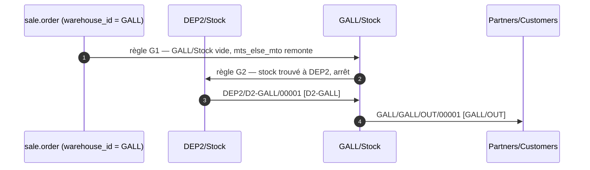

**2 documents.** Conforme à
[l'invariant § 5](00-invariants.md#5-périmètre-de-réservation--pool-par-comptoir) (« F1 coûte 2
documents »). Sans l'abandon du transit ce serait 3.

### F2 — Pièce en stock au dépôt, pose sur site

Vente Galleria ou Genipa, transporteur « Pose sur site (Camion) », article présent à Dépôt 2.

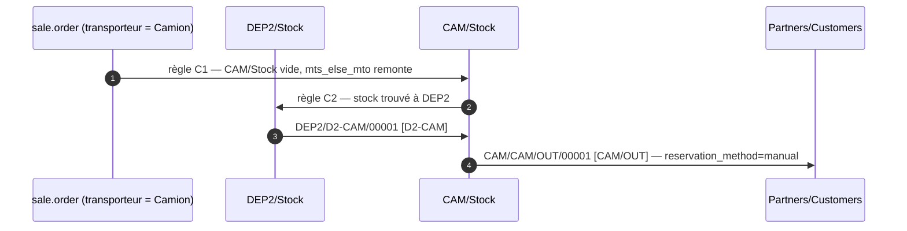

**2 documents.** `CAM/OUT` est en `reservation_method = manual` : rien n'est réservé tant que le
chauffeur ne déclenche pas « Vérifier la disponibilité »
([invariant § 3.2](00-invariants.md#32-paramètres-par-profil-de-site)).

### F3 — Pièce absente, achat, dépôt, puis comptoir

Le cas majoritaire (82 % des ventes, [architectures-stock.md § D.6](../architectures-stock.md#d6-le-réapprovisionnement-par-anticipation-mesuré)).

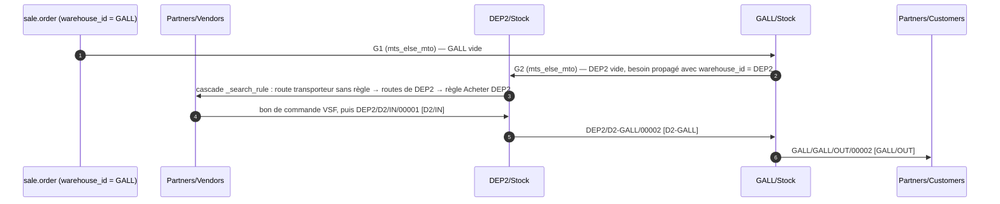

**3 documents de stock** (+ 1 bon de commande d'achat). Conforme à l'invariant § 5.

Le relâchement de la route collante est ce qui fait fonctionner ce flux : `_get_stock_move_values`
recopie `route_ids` sur le mouvement amont (`stock_rule.py:352`) et
`_prepare_procurement_values` le réémet (`stock/models/stock_move.py:1487`), mais la route « Retrait /
pose Galleria » n'a **aucune règle** dont `location_dest_id = DEP2/Stock` ; `_search_rule` passe donc à
l'étage suivant (`if not res`, `:539-549`) jusqu'aux routes de l'entrepôt **DEP2** — l'entrepôt du
besoin grâce à `propagate_warehouse_id`.

### F4 — Le fournisseur livre directement au comptoir

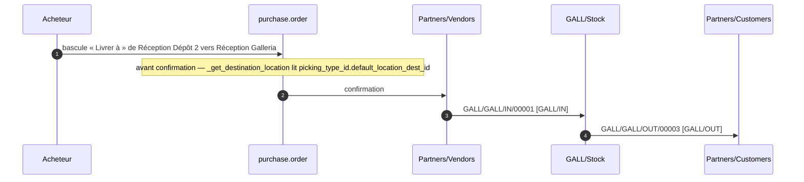

**2 documents** (+ 1 bon de commande) **— mais avec une réserve lourde.**

`purchase.order._get_destination_location()` renvoie `self.picking_type_id.default_location_dest_id.id`
(sauf `dest_address_id` renseigné, `purchase_stock/models/purchase_order.py:204-208`). Basculer
« Livrer à » sur `Réception Galleria` fait donc bien atterrir la marchandise à `GALL/Stock`.

**Le problème** : si la vente a été confirmée avec le transporteur « Retrait Galleria », la chaîne
G1 → G2 → Acheter a déjà créé un mouvement `D2-GALL` chaîné qui attend le stock **à `DEP2/Stock`**. La
marchandise arrivant à `GALL/Stock`, ce mouvement n'a plus rien à prélever et reste bloqué, et la
livraison client qui en dépend aussi. Il faut **annuler manuellement le transfert `D2-GALL`** et
raccrocher la livraison. C'est exactement le point traité en
[architectures-stock.md § I.4](../architectures-stock.md#i4-les-trois-traitements-possibles-de-f4).

**Chemin propre, vérifiable dans le code, non testé** : créer une route dédiée
« Achat direct comptoir Galleria » (`sale_selectable = True`) portant **une seule** règle
`GALL/Stock → Partners/Customers`, type `GALL/OUT`, `procure_method = make_to_order`,
`warehouse_id` vide, `propagate_warehouse_id = GALL`. Posée sur `sale.order.line.route_id` (étage
prioritaire de `_search_rule`, `stock_rule.py:539-541`), elle sert le client depuis Galleria ; le
besoin amont, attribué à `GALL`, ne trouve pas de règle dans cette route et retombe sur les routes de
l'entrepôt `GALL` → sa règle Acheter → bon de commande livré à `GALL/IN`. Le dépôt n'est jamais
sollicité, aucun document orphelin. Voir [§ 6](#6-ce-que-je-nai-pas-tranché-ou-pas-vérifié).

### F5 — Réception au comptoir, chargement camion, pose sur site

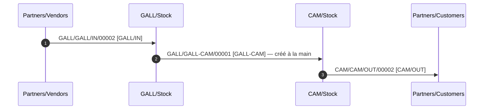

**3 documents** (+ 1 bon de commande).

Le transfert `GALL-CAM` est **manuel**. Une règle automatique `GALL/Stock → CAM/Stock` dans la route
« Pose sur site — Camion » entrerait en collision avec C2 (`DEP2/Stock → CAM/Stock`) : même
`location_dest_id`, même route, et `_search_rule` n'en retient qu'une (`limit=1`,
`stock_rule.py:536-549`), **sans regarder le stock disponible**. Le comptoir serait alors toujours
préféré au dépôt, ou jamais — jamais « selon disponibilité ».

### F6 — Le comptoir renvoie une pièce en dépôt

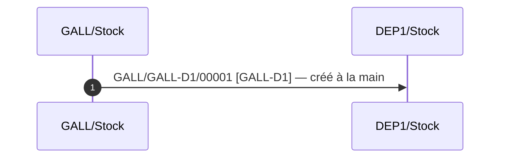

**1 document.** C'est le gain le plus net de l'abandon du transit : le natif en aurait produit 2
(livraison GALL + réception DEP1). Le type `GALL-D2` existe symétriquement.

### F7 — Article chargé mais non posé, retour

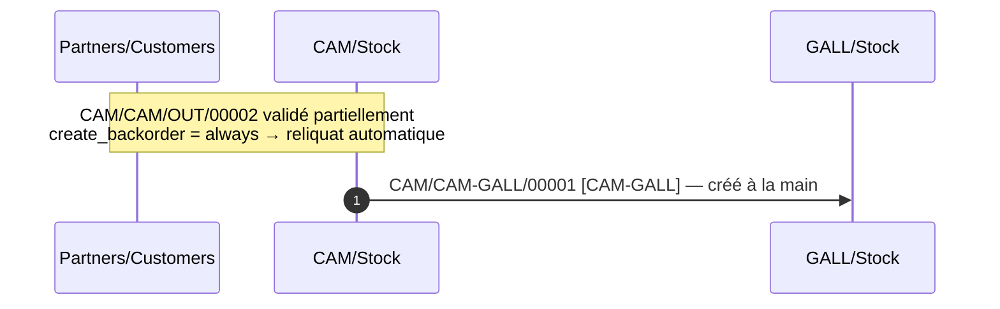

**1 document de retour** (+ le reliquat de `CAM/OUT`, créé automatiquement et resté dû, conformément à
[l'invariant § 3.2](00-invariants.md#32-paramètres-par-profil-de-site)). Les quatre destinations
possibles ont chacune leur type : `CAM-D1`, `CAM-D2`, `CAM-GALL`, `CAM-GENI`.

### F8 — Casse

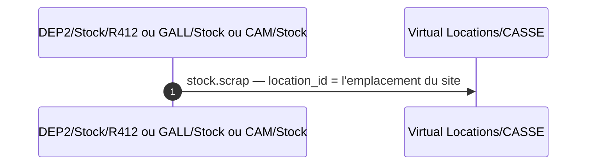

**1 document** (`stock.scrap`, aucun `stock.picking.type` consommé).

Deux points de vigilance :

- `_compute_scrap_location_id` retient le `id:min` des emplacements `scrap_location = True` de la
  société (`stock/models/stock_scrap.py:76-85`). Le `Virtual Locations/Scrap` natif ayant un id
  inférieur à `CASSE`, il faut l'**archiver**, sinon il reste le défaut ;
- `_compute_location_id` sans picking renvoie `lot_stock_ids[0]` d'un `_read_group` sur les entrepôts
  de la société (`:62-74`) — soit **un entrepôt arbitraire parmi les cinq**. L'opérateur doit donc
  choisir l'emplacement source à chaque casse. Le champ est `readonly=False` (`:39-41`), c'est
  faisable, mais c'est une saisie de plus par rapport à une architecture mono-entrepôt.

### F9 — Vente servie depuis le stock du comptoir

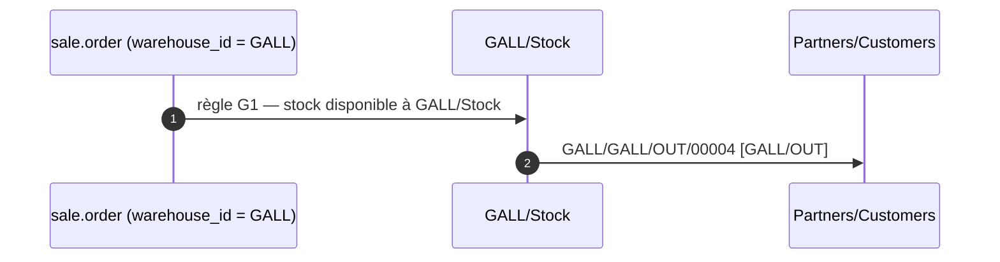

**1 document.** Le pool par comptoir est natif ici : `_gather` filtre en `child_of GALL/Stock`
(`stock/models/stock_quant.py:813-819`), donc `GENI/Stock` et `CAM/Stock`, qui sont sous d'autres vues
d'entrepôt, sont hors d'atteinte sans aucune configuration.

### F10 — Rééquilibrage entre sites de même profil

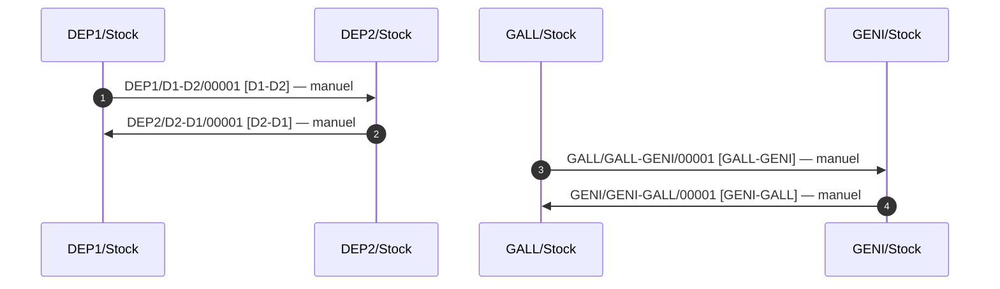

**1 document par rééquilibrage.** Le natif en aurait produit 2.

### F11 — Retour fournisseur

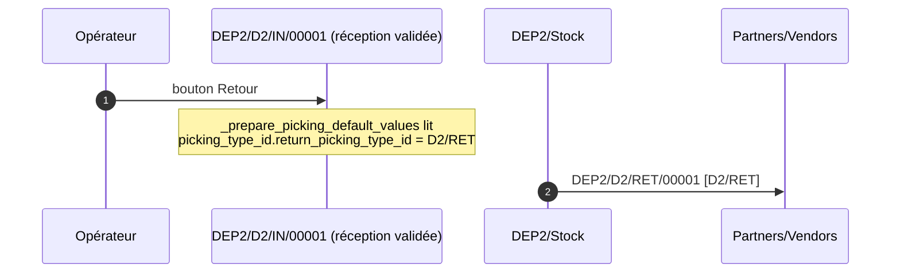

**1 document.** L'assistant lit `picking_type_id.return_picking_type_id` et retombe sur le type
d'origine si le champ est vide (`stock/wizard/stock_picking_return.py:116`) — d'où l'obligation de
réécrire ce champ sur les quatre types de réception ([§ 2.3](#23-stockpickingtype)).

### Récapitulatif du coût documentaire

| Flux | Documents de stock | Achats | Automatique ? |
|---|---:|---:|---|
| F1 | 2 | — | oui (règles G2/N2) |
| F2 | 2 | — | oui (règles C1/C2) |
| F3 | 3 | 1 | oui (cascade complète) |
| F4 | 2 | 1 | non — bascule manuelle du « Livrer à », + annulation d'un transfert orphelin |
| F5 | 3 | 1 | non — `GALL-CAM` manuel |
| F6 | 1 | — | non |
| F7 | 1 (+ reliquat auto) | — | non |
| F8 | 1 (`stock.scrap`) | — | — |
| F9 | 1 | — | oui |
| F10 | 1 | — | non |
| F11 | 1 | — | assistant de retour |

Contre le tableau de [architectures-stock.md § D.3](../architectures-stock.md#d3-les-onze-flux), établi
avec le transit natif : F1 passe de 3 à 2, F3 de 4 à 3, F5 de 3 à 3, F6 de 2 à 1, F7 de 2 à 1, F10 de 2
à 1. **L'abandon du transit économise un document sur six flux sur onze.**

---

## 4. Ce que cette architecture impose de particulier

### 4.1 Écarts au standard Odoo

| # | Écart | Portée |
|---|---|---|
| 1 | `resupply_wh_ids` vide sur les cinq entrepôts alors que quatre s'approvisionnent mutuellement | La configuration réelle est invisible depuis le formulaire Entrepôt. Documenter dans l'aide en ligne interne. |
| 2 | 20 `stock.picking.type` dont `warehouse_id` (origine) diffère du `warehouse_id` des règles qui les portent (destination) | Aucune contrainte Odoo ne le vérifie, aucun rapport ne le signale. C'est l'écart le plus susceptible d'être « corrigé » par erreur par un intégrateur ultérieur. |
| 3 | 6 types d'opération natifs et 6 règles natives archivés à la main | `_find_existing_rule_or_create()` (`stock_warehouse.py:611-624`) les réactive à chaque `_create_or_update_route()`. |
| 4 | 4 `return_picking_type_id` réécrits contre le câblage automatique (`stock_warehouse.py:362-365`) | Réécrit à chaque recréation d'un type. |
| 5 | Séquences à préfixe redondant : `DEP2/D2-GALL/00001`, `DEP2/D2/IN/00001` | Le `sequence_code` de l'invariant porte déjà le site, et Odoo y préfixe le code de l'entrepôt (`stock_picking.py:153-161`). L'invariant § 3.1 interdit d'écrire le préfixe à la main. Voir [§ 6](#6-ce-que-je-nai-pas-tranché-ou-pas-vérifié). |
| 6 | Emplacement de rebut natif archivé au profit de `CASSE` | Imposé par le `id:min` de `_compute_scrap_location_id`. |

### 4.2 Configurations manuelles à produire

| Objet | Volume | Remarque |
|---|---:|---|
| `stock.warehouse` | 5 | dont 4 avec un `partner_id` dédié |
| Déplacement de racks (`location_id`) | 489 | 109 vers `DEP1/Stock`, 380 vers `DEP2/Stock` — **avec du stock dessus** |
| `stock.picking.type` créés | 24 | `warehouse_id` obligatoire sur chacun |
| `stock.picking.type` modifiés | 9 | renommage, `sequence_code`, `return_picking_type_id`, `reservation_method`, `create_backorder` |
| `stock.picking.type` archivés | 6 | |
| `stock.route` créées | 3 | + 2 optionnelles pour F4 |
| `stock.rule` créées | 6 | + 2 optionnelles pour F4 |
| `stock.rule` archivées | ~9 | |
| `delivery.carrier` | 3 | + 2 produits service à prix nul |
| `stock.location` | 1 (`CASSE`) + 1 archivage | |

### 4.3 Points à vérifier en préproduction

1. **Le préfixe réellement obtenu** sur chacun des 24 types créés — vérifier que
   `ir.sequence.prefix` vaut bien `<code entrepôt>/<sequence_code>/` et qu'aucune collision de
   `ir.sequence.name` n'a déclenché le suffixe `(copy)(id)` (`stock_warehouse.py:355-358`).
2. **Que les 24 types portent le bon `warehouse_id`** — un oubli les colle tous sur `DEP1`
   silencieusement (`stock_picking.py:302-311`).
3. **Le rejeu complet de F3** : confirmer une vente Galleria sur un article à stock nul et vérifier que
   le bon de commande naît avec « Livrer à » = `Réception Dépôt 2`, pas un autre. Le défaut de
   `purchase.order.picking_type_id` est `_get_picking_type()` qui prend **le premier type `incoming` de
   la société** (`purchase_stock/models/purchase_order.py:14-15, 210-215`) — avec quatre types entrants,
   ce défaut est arbitraire, mais dans une chaîne MTO c'est la règle Acheter qui impose le type
   (`purchase_stock/models/stock.py:31`), pas le défaut.
4. **F4 de bout en bout**, y compris le sort du transfert `D2-GALL` orphelin.
5. **Que `property_stock_customer` / `property_stock_supplier`** des quatre contacts de site pointent
   bien sur le transit et qu'aucun client ou fournisseur réel n'a été touché
   (`stock_warehouse.py:312-321`).
6. **Le comportement après une écriture sur un `stock.warehouse`** : modifier `reception_steps` puis le
   remettre, et recompter les types et règles actifs. C'est le test de non-régression de tous les
   archivages.
7. **Le rapport de prévision par entrepôt** sur un article présent aux deux dépôts — il est scopé
   `child_of view_location_id` (`stock/report/stock_forecasted.py:113-125`), donc les cinq totaux
   doivent se sommer au total société sans double compte.
8. **La casse** : vérifier que `CASSE` est bien proposé par défaut après archivage du natif.

---

## 5. Ce qu'elle ne donne pas

1. **Pas d'approvisionnement automatique depuis les deux dépôts.** La règle amont d'un comptoir pointe
   sur `DEP2/Stock` et rien d'autre. Le stock de Dépôt 1 (109 racks) n'est jamais servi
   automatiquement. C'est structurel : `_search_rule` renvoie une seule règle sans consulter le stock
   (`stock_rule.py:536-549`), et il n'existe pas de parent commun aux deux dépôts qui n'englobe pas
   aussi les comptoirs et le camion. Une architecture à emplacements
   ([architecture 1](01-architecture-1-zones.md)) n'a pas cette limite : un emplacement vue
   `RPBM/Stock/Dépôts` la lève d'une ligne.
2. **Pas de file « ce qui m'arrive » côté destination.** Un document a un seul type d'opération, donc
   un seul entrepôt. Le comptoir voit ce qui lui arrive dans le rapport de prévision ou par un filtre,
   pas dans sa vue d'ensemble.
3. **Pas de F4 propre sans configuration supplémentaire.** La bascule du « Livrer à » laisse un
   transfert orphelin à annuler dès que la vente a été confirmée en MTO. La route dédiée décrite en
   [§ 3 F4](#f4--le-fournisseur-livre-directement-au-comptoir) résout le problème mais ajoute deux
   routes et deux règles, et déplace le choix sur la ligne de commande — donc sur le vendeur, au moment
   du devis, avant que l'acheteur sache s'il fera livrer au comptoir.
4. **Pas de F5 ni de F6 ni de F7 ni de F10 automatisés.** Sept des vingt types de transfert n'ont
   aucune règle : ils s'utilisent en création manuelle. Le référentiel est complet, l'automatisation ne
   l'est pas.
5. **Pas de réversibilité.** Cinq entrepôts porteurs de mouvements ne se démontent pas : `unlink()` sur
   un `stock.warehouse` échoue dès qu'un type d'opération a servi, et l'archivage
   (`stock_warehouse.py:217-241`) désactive vue, routes et règles mais laisse tous les mouvements
   rattachés à un entrepôt archivé. À l'inverse, promouvoir une zone en entrepôt reste possible plus
   tard ([architecture 3](03-architecture-3-hybride.md) montre que l'imbrication est un cas prévu).
6. **Pas de maintenance automatique de la configuration.** Les 6 règles et 24 types faits à la main ne
   sont vus par aucun hook de `stock.warehouse`. Toute évolution d'un entrepôt est une opération
   manuelle assortie d'un contrôle de non-régression.
7. **Pas de gain sur la valorisation ni sur la comptabilité.** `standard` / `manual_periodic`
   ([D8](../decisions.md)) : aucune écriture n'est générée, quelle que soit l'architecture
   ([invariant § 3.4](00-invariants.md#34-valorisation)). Les cinq entrepôts n'y changent rien.
8. **Pas d'argument tiré du réassort.** `stock.warehouse.orderpoint` accepte un `location_id` et
   fonctionne aussi bien par zone que par entrepôt
   ([architectures-stock.md § D.6](../architectures-stock.md#d6-le-réapprovisionnement-par-anticipation-mesuré)).
   Avec `resupply_wh_ids` vide, un point de commande sur `GALL/Stock` ne peut de toute façon être
   satisfait que par un achat, pas par un transfert automatique depuis un dépôt.

**Ce qu'elle donne, en contrepartie** : une adresse propre par site sur le bon de commande fournisseur,
le pool par comptoir sans aucune configuration, une numérotation portant le code de l'entrepôt, et
`sale.order.warehouse_id` comme axe de segmentation commerciale natif avec défaut par vendeur
(`res.users.property_warehouse_id`).

---

## 6. Ce que je n'ai pas tranché, ou pas vérifié

1. **Le doublement du préfixe de séquence.** `DEP2/D2-GALL/00001` et surtout `DEP2/D2/IN/00001` sont
   redondants : le `sequence_code` de l'invariant a été conçu pour une architecture mono-entrepôt.
   Trois issues, aucune retenue ici parce qu'elles touchent toutes au contrat :
   (a) amender l'invariant pour que les `sequence_code` soient `GALL`, `IN`, `RET`… en architecture 2 —
   mais les documents ne seraient plus comparables ligne à ligne ;
   (b) écrire `ir.sequence.prefix` à la main, ce que l'invariant § 3.1 interdit explicitement ;
   (c) laisser `picking_type.warehouse_id` vide, auquel cas le préfixe vaut **exactement** le
   `sequence_code`, sans slash ajouté (`stock_picking.py:162-165`) — mais on perd le rattachement à
   l'entrepôt, donc la file de travail et le rapport de réception. **À arbitrer avec le rédacteur des
   invariants.**
2. **La route dédiée pour F4** (`Achat direct comptoir Galleria`, § 3 F4) est déduite de la lecture de
   `_search_rule` (`stock_rule.py:527-549`) et de la persistance de `route_ids` sur les mouvements
   amont (`:352`, `stock_move.py:1487`). **Elle n'a pas été exécutée.** Le point à tester : que le
   besoin remontant de `GALL/Stock`, portant encore la route de ligne, tombe bien sur la règle Acheter
   de `GALL` et non sur autre chose.
3. **Le sort exact du transfert `D2-GALL` orphelin en F4.** Je décris qu'il reste bloqué et doit être
   annulé ; je n'ai pas tracé le comportement précis de `_action_assign` sur un mouvement `mts_else_mto`
   dont le mouvement amont a atterri ailleurs. Le résultat pratique (chaîne cassée) ne fait pas de
   doute, la forme exacte de l'échec n'a pas été vérifiée.
4. **`return_picking_type_id` de `CAM/OUT`.** Laissé vide, ce qui fait retomber l'assistant sur
   `CAM/OUT` lui-même et produit un mouvement `Customers → CAM/Stock` typé « Pose sur site ». Créer un
   32ᵉ type « Retour client Camion » serait plus propre mais sort du référentiel des invariants. **Non
   tranché.**
5. **Les retours client sur `GALL/OUT` et `GENI/OUT`.** Laissés sur le câblage natif
   (`return_picking_type_id = GALL/IN`), ce qui mélange retours clients et réceptions fournisseur dans
   la même file. L'invariant ne couvre pas les retours clients. **Non tranché.**
6. **L'effet de `resupply_wh_ids` vide sur l'assistant « Réapprovisionner »**
   (`stock.warehouse.orderpoint` et le bouton *Replenish* du produit). Je n'ai pas lu
   `stock/models/stock_orderpoint.py` : je suppose, sans l'avoir vérifié, qu'un point de commande sur
   `GALL/Stock` ne proposera que la route Acheter et aucun transfert inter-entrepôts.
7. **La migration des 489 racks avec du stock dessus.** Déplacer `location_id` d'un emplacement portant
   des `stock.quant` sous une autre vue d'entrepôt : je n'ai pas vérifié si les quants suivent
   proprement (recalcul de `warehouse_id`, historique de `stock.move.line`). C'est le risque
   opérationnel principal de cette architecture, mentionné en
   [architectures-stock.md § D.1](../architectures-stock.md#d1-structure), et il mérite un test sur une
   copie de la base avant toute décision.
8. **La variante « transit repointé sur l'emplacement de destination »**
   ([§ 0.3](#03-les-fausses-pistes-éliminées)) n'a pas été testée. Je l'écarte par lecture du code —
   la règle 2 crée un mouvement même dégénéré — mais sans exécution.
9. **Le comportement du rapport de réception** (`auto_show_reception_report`,
   `stock_picking.py:1170-1180`) sur un transfert dont le type appartient à l'entrepôt d'origine mais
   dont la destination est un autre entrepôt : le `wh_location_ids` calculé est celui de l'entrepôt
   **du type**, donc de l'origine. Le rapport proposera d'allouer depuis les mauvais emplacements. Je
   recommande `auto_show_reception_report = False` sur les 20 types de transfert, mais je n'ai pas
   vérifié l'effet réel.
