# Architecture 3 — hybride, comptoirs en entrepôts imbriqués

Date : 2026-08-06 · Odoo 17 · Instance cible : `rpbm-preprod` · **Document de configuration, aucune
écriture n'a été appliquée sur l'instance.**

Ce document suit le plan imposé en
[§7 des invariants](00-invariants.md#7-format-imposé-aux-trois-documents-darchitecture). Tout ce que
fixent les invariants — les 31 types d'opération et leurs `sequence_code`, les 3 transporteurs, le
pool par comptoir, les 11 flux, les conventions de séquence, de rebut et de valorisation — s'applique
tel quel et n'est pas redéfini ici.

Références : [00-invariants.md](00-invariants.md) ·
[architectures-stock.md § D bis](../architectures-stock.md#d-bis--architecture-3--hybride-comptoirs-imbriqués)
· [§ E.3](../architectures-stock.md#e3-architecture-3--les-comptoirs-sont-des-entrepôts-imbriqués) ·
[§ I.7](../architectures-stock.md#i7-le-périmètre-de-réservation--une-décision-de-plus-à-poser-au-client)
· [§ H.1](../architectures-stock.md#h1-à-corriger-avant-toute-mise-en-service-quelle-que-soit-larchitecture)

**Position de cette architecture.** Elle n'est pas recommandée aujourd'hui : son unique
différenciateur face à l'architecture 1 est l'adresse de livraison imprimée par comptoir sur le bon
de commande fournisseur (`purchase_stock/report/purchase_report_templates.xml:9-11`), et RPBM
n'envoie pas ce document. Le bénéfice étant nul, le coût — quel qu'il soit — est un mauvais échange.
Ce document existe pour que la bascule soit chiffrée et exécutable **le jour où ce bon de commande
partirait réellement**, pas pour plaider en sa faveur. Il ne la dénigre pas non plus : sur le plan
mécanique elle tient, et le pool par comptoir la rend plus naturelle qu'elle ne l'était.

**Toutes les affirmations sur le comportement d'Odoo sont sourcées `fichier:ligne` dans
`D:\git\odoo_17\odoo17\addons` (Community).** Les rares points non vérifiés sont regroupés en
[§ 6](#6--points-non-tranchés-et-non-vérifiés) et signalés comme tels.

---

## 1 — Structure

### 1.1 Le principe

Trois `stock.warehouse` : `RPBM`, `GALL` (Galleria), `GENI` (Genipa). Les deux comptoirs sont des
entrepôts **réels**, mais leur arbre d'emplacements vit **à l'intérieur** de celui de `RPBM`. Les
dépôts et le camion restent des zones de `RPBM`.

```
Physical Locations
└── RPBM                              (vue)      ← view_location_id de RPBM
    ├── Stock                         (interne)  ← lot_stock_id de RPBM · replenish_location = True
    │   ├── Dépôts                    (interne)  ← source de la règle amont des deux comptoirs
    │   │   ├── Dépôt 1               (interne)  ← 109 racks R101 … R336
    │   │   └── Dépôt 2               (interne)  ← 380 racks R401 … R937, J…, T…
    │   ├── Galleria                  (vue)      ← view_location_id de GALL — DÉPLACÉ après création
    │   │   ├── Comptoir              (interne)  ← lot_stock_id de GALL
    │   │   └── Input / Quality Control / Output / Packing Zone   (natifs, archivés)
    │   └── Genipa                    (vue)      ← view_location_id de GENI — DÉPLACÉ après création
    │       ├── Comptoir              (interne)  ← lot_stock_id de GENI
    │       └── Input / Quality Control / Output / Packing Zone   (natifs, archivés)
    ├── Camion                        (interne)  ← hors Stock, frère de Stock
    └── A controler                   (interne)  ← 49 emplacements en attente (Q7)

Virtual Locations
└── CASSE                             (inventory, scrap_location = True)
```

Deux propriétés de cet arbre, et elles sont l'architecture :

1. **`Comptoir` est sous `RPBM/Stock`.** Une commande portée par `RPBM` réserve donc la pièce où
   qu'elle soit dans `Stock`, exactement comme en architecture 1 : `stock.quant._gather` filtre en
   `child_of` sur la source de la règle (`stock/models/stock_quant.py:812-819`). Aucune route de
   transit inter-entrepôts n'est nécessaire, et c'est ce qui distingue cette architecture de
   l'architecture 2.
2. **`Camion` est hors de `Stock`.** Aucune vente comptoir ni aucune vente `RPBM/Stock` ne réserve
   une pièce chargée dans un véhicule en tournée
   ([H.1](../architectures-stock.md#h1-à-corriger-avant-toute-mise-en-service-quelle-que-soit-larchitecture)).

### 1.2 L'imbrication est un cas prévu — en lecture

`stock.location.warehouse_id` est un champ **stocké**, calculé par
`_compute_warehouse_id` (`stock/models/stock_location.py:93`, `:139-152`) :

```python
warehouses = self.env['stock.warehouse'].search([('view_location_id', 'parent_of', self.ids)])
warehouses = warehouses.sorted(lambda w: w.view_location_id.parent_path, reverse=True)
```

La recherche accepte **plusieurs** entrepôts parents d'un même emplacement, les trie par
`parent_path` décroissant — donc par profondeur décroissante — et retient le **plus proche**
(`stock/models/stock_location.py:149-152`). Ce tri n'a de sens que si l'imbrication est un cas prévu.

Conséquences directes, toutes vérifiées :

| Emplacement | `warehouse_id` calculé |
|---|---|
| `RPBM/Stock/Dépôts/Dépôt 2/R412` | `RPBM` |
| `RPBM/Camion` | `RPBM` |
| `RPBM/Stock/Galleria` (la vue) | **`GALL`** — `parent_of` inclut l'emplacement lui-même |
| `RPBM/Stock/Galleria/Comptoir` | **`GALL`** |

**Ce qu'Odoo n'offre pas, c'est l'imbrication en écriture.** `stock.warehouse.create()` place la vue
**en dur** sous `stock.stock_location_locations` — « Physical Locations »
(`stock/models/stock_warehouse.py:112-113`, `stock/data/stock_data.xml:23-27`). L'imbrication est
donc un **déplacement après coup**, décrit pas à pas en [§ 4.1](#41--procédure-de-création-dans-lordre).

### 1.3 Le périmètre de réservation est natif

Le défaut du projet est le **pool par comptoir** ([invariants § 5](00-invariants.md#5-périmètre-de-réservation--pool-par-comptoir)).
Avec cette structure, il ne demande **aucun repointage de règle** :

- `GALL.lot_stock_id = RPBM/Stock/Galleria/Comptoir`, valeur **native** — `_get_locations_values`
  crée un emplacement `Stock` sous la vue de l'entrepôt
  (`stock/models/stock_warehouse.py:636-642`), qu'on renomme `Comptoir` ;
- la règle de livraison de la route transporteur part de ce `lot_stock_id`. `_gather` en `child_of`
  ne descend donc que dans Galleria : **le stock de Genipa n'est jamais atteint**, celui du camion
  non plus puisqu'il est hors de `Stock` ;
- le comptoir garde accès aux dépôts par une **seconde règle**, `RPBM/Stock/Dépôts → Comptoir`. Cette
  règle **doit être créée à la main** : `resupply_wh_ids` est vide, donc `create_resupply_routes()`
  n'est jamais appelée avec un fournisseur (`stock/models/stock_warehouse.py:140`, `:715-745`), et
  `get_rules_dict()` ne produit pour `ship_only` que `lot_stock → Customers`
  (`stock/models/stock_warehouse.py:792`). **Vérifié : aucune règle amont n'est générée.**

C'est l'apport réel de l'architecture 3 depuis l'arbitrage du 2026-08-06 : ce que l'architecture 1
obtient en pointant explicitement `location_src_id` sur `RPBM/Stock/Galleria`, l'architecture 3
l'obtient par le `lot_stock_id` natif de l'entrepôt.

---

## 2 — Enregistrements

### 2.0 Convention de `sequence_code` retenue

Les invariants fixent les `sequence_code` des 31 types. Le préfixe de séquence est reconstruit par
Odoo en `<code entrepôt>/<sequence_code>/` (`stock/models/stock_picking.py:183-190`,
`stock/models/stock_warehouse.py:1052-1077`). Appliquer littéralement `GALL/OUT` à un type porté par
l'entrepôt de code `GALL` produirait `GALL/GALL/OUT/00001`.

**Règle retenue** : pour les sept types dont le `sequence_code` de l'invariant commence par le code
du site (`GALL/IN`, `GALL/OUT`, `GALL/RET`, `GENI/IN`, `GENI/OUT`, `GENI/RET`), le préfixe de site
est **retiré du `sequence_code`** et rendu par le code de l'entrepôt. La référence visible du
document est alors **exactement** la chaîne voulue par l'invariant :

| Invariant | Entrepôt porteur | `sequence_code` réel | Référence produite |
|---|---|---|---|
| `GALL/IN` | `GALL` | `IN` | `GALL/IN/00001` ✔ |
| `GALL/OUT` | `GALL` | `OUT` | `GALL/OUT/00001` ✔ |
| `GALL/RET` | `GALL` | `RET` | `GALL/RET/00001` ✔ |
| `D2/IN` | `RPBM` | `D2/IN` | `RPBM/D2/IN/00001` ✔ |
| `D2-GALL` | `RPBM` | `D2-GALL` | `RPBM/D2-GALL/00001` ✔ |

Aucun `sequence_code` d'invariant n'est modifié pour les 24 types portés par `RPBM`.

### 2.1 `stock.warehouse` — 3 enregistrements

| Champ | `RPBM` | `GALL` | `GENI` |
|---|---|---|---|
| `name` | RPBM | Galleria | Genipa |
| `code` | `RPBM` | `GALL` | `GENI` |
| `partner_id` | contact siège | **contact Galleria** | **contact Genipa** |
| `view_location_id` | `RPBM` (sous *Physical Locations*) | `RPBM/Stock/Galleria` **(déplacé)** | `RPBM/Stock/Genipa` **(déplacé)** |
| `lot_stock_id` | `RPBM/Stock` | `RPBM/Stock/Galleria/Comptoir` | `RPBM/Stock/Genipa/Comptoir` |
| `reception_steps` | `one_step` | `one_step` | `one_step` |
| `delivery_steps` | `ship_only` | `ship_only` | `ship_only` |
| `resupply_wh_ids` | **vide** | **vide** | **vide** |
| `buy_to_resupply` | `True` | `True` | `True` |
| `in_type_id` | *Réception Dépôt 2* | *Réception Galleria* | *Réception Genipa* |
| `out_type_id` | *Pose sur site* | *Livraison Galleria* | *Livraison Genipa* |
| `int_type_id` | *Chargement camion* | *Approvisionnement Galleria* | *Approvisionnement Genipa* |
| `pick_type_id` / `pack_type_id` | inactifs | inactifs | inactifs |
| `sequence` | 1 | 2 | 3 |

`resupply_wh_ids` vide est **la ligne décisive** : c'est elle qui supprime le transit inter-entrepôts
et la chaîne à 3 documents de l'architecture 2. `create_resupply_routes()` n'est appelée qu'avec
`warehouse.resupply_wh_ids` (`stock/models/stock_warehouse.py:140`) ; vide, elle ne crée ni route
`X: Supply Product from Y`, ni règle vers l'emplacement de transit
(`stock/models/stock_warehouse.py:722-745`).

`buy_to_resupply = True` sur les comptoirs a un effet précis et voulu : `purchase_stock` crée une
règle **Acheter** par entrepôt, dont la destination est `in_type_id.default_location_dest_id` et le
type d'opération `in_type_id` (`purchase_stock/models/stock.py:24-43`). Un point de commande posé sur
`RPBM/Stock/Galleria/Comptoir` déclenche donc une demande de prix livrée **au comptoir**, avec
l'adresse du comptoir imprimée. C'est le seul endroit où le différenciateur de cette architecture
produit un effet automatique.

### 2.2 `stock.location`

| Emplacement (`complete_name`) | `usage` | Parent | `replenish_location` | `scrap_location` | Rôle |
|---|---|---|---|---|---|
| `RPBM` | `view` | *Physical Locations* | — | — | `view_location_id` de `RPBM` |
| `RPBM/Stock` | `internal` | `RPBM` | **`True`** | `False` | `lot_stock_id` de `RPBM` · source de la règle *Chargement camion* |
| `RPBM/Stock/Dépôts` | `internal` | `RPBM/Stock` | `False` | `False` | **source des deux règles amont comptoir** |
| `RPBM/Stock/Dépôts/Dépôt 1` | `internal` | `…/Dépôts` | `False` | `False` | destination de `D1/IN` |
| `RPBM/Stock/Dépôts/Dépôt 1/R101…R336` | `internal` | `…/Dépôt 1` | `False` | `False` | 109 racks ([D12](../decisions.md)) |
| `RPBM/Stock/Dépôts/Dépôt 2` | `internal` | `…/Dépôts` | `False` | `False` | destination de `D2/IN` |
| `RPBM/Stock/Dépôts/Dépôt 2/R401…R937, J…, T…` | `internal` | `…/Dépôt 2` | `False` | `False` | 380 racks |
| `RPBM/Stock/Galleria` | `view` | `RPBM/Stock` | — | — | `view_location_id` de `GALL` |
| `RPBM/Stock/Galleria/Comptoir` | `internal` | `…/Galleria` | **`False`** *(voir § 4.4)* | `False` | `lot_stock_id` de `GALL` |
| `RPBM/Stock/Galleria/Input` | `internal` | `…/Galleria` | `False` | `False` | natif, **archivé** (`one_step`) |
| `RPBM/Stock/Galleria/Quality Control` | `internal` | `…/Galleria` | `False` | `False` | natif, **archivé** |
| `RPBM/Stock/Galleria/Output` | `internal` | `…/Galleria` | `False` | `False` | natif, **archivé** (`ship_only`) |
| `RPBM/Stock/Galleria/Packing Zone` | `internal` | `…/Galleria` | `False` | `False` | natif, **archivé** |
| `RPBM/Stock/Genipa` + 5 enfants | idem Galleria | | | | |
| `RPBM/Camion` | `internal` | `RPBM` | `False` | `False` | **frère de `Stock`**, hors périmètre de réservation |
| `RPBM/A controler` | `internal` | `RPBM` | `False` | `False` | 49 emplacements ([Q7](../questions-ouvertes.md)) |
| `Virtual Locations/CASSE` | `inventory` | *Virtual Locations* | — | **`True`** | rebut ([D14](../decisions.md)) |

**Les quatre emplacements natifs archivés n'ont pas à être créés ni supprimés** : `_get_locations_values`
les crée déjà `active = False` en `one_step` / `ship_only`
(`stock/models/stock_warehouse.py:643-666`). Il ne faut **jamais les supprimer** — voir
[§ 4.2](#42--ce-que-write-régénère-et-quand).

`Dépôts` est délibérément **`internal` et non `view`** : c'est la `location_src_id` de deux règles
pull. Une source `view` fonctionnerait pour la réservation (`_gather` en `child_of`,
`stock/models/stock_quant.py:812-819`) mais produirait des mouvements dont l'emplacement d'origine
est une vue ; le comportement n'a pas été vérifié et le risque est inutile — `RPBM/Stock` est déjà
`internal` dans le standard.

### 2.3 `stock.picking.type` — 34 types actifs

31 types des invariants + 3 **types porteurs de règle** (`CHARG`, `GALL/INT`, `GENI/INT`), dont
l'existence est expliquée et justifiée en [§ 4.6](#46--un-type-dopération-par-règle--pourquoi-il-en-faut-3-de-plus).

Colonnes omises car identiques partout : `company_id` = RPBM, `active` = `True`,
`use_create_lots`/`use_existing_lots` selon la politique de traçabilité (hors périmètre).
`reservation_method` est masqué sur les types entrants (`stock/models/stock_picking.py:216-218`).

#### 2.3.1 Portés par `RPBM` — 26 types

Abréviations : `S` = `RPBM/Stock`, `D1` = `RPBM/Stock/Dépôts/Dépôt 1`,
`D2` = `RPBM/Stock/Dépôts/Dépôt 2`, `DEP` = `RPBM/Stock/Dépôts`, `GA` = `RPBM/Stock/Galleria/Comptoir`,
`GE` = `RPBM/Stock/Genipa/Comptoir`, `CAM` = `RPBM/Camion`, `V` = `Partners/Vendors`,
`C` = `Partners/Customers`.

| Nom | `code` | `sequence_code` | `default_location_src_id` | `default_location_dest_id` | `reservation_method` | `create_backorder` | `return_picking_type_id` |
|---|---|---|---|---|---|---|---|
| Transfert Dépôt 1 → Galleria | `internal` | `D1-GALL` | `D1` | `GA` | `at_confirm` | `ask` | — |
| Transfert Dépôt 1 → Genipa | `internal` | `D1-GENI` | `D1` | `GE` | `at_confirm` | `ask` | — |
| Transfert Dépôt 1 → Camion | `internal` | `D1-CAM` | `D1` | `CAM` | **`manual`** | **`always`** | — |
| Transfert Dépôt 1 → Dépôt 2 | `internal` | `D1-D2` | `D1` | `D2` | `at_confirm` | `ask` | — |
| Transfert Dépôt 2 → Galleria | `internal` | `D2-GALL` | `D2` | `GA` | `at_confirm` | `ask` | — |
| Transfert Dépôt 2 → Genipa | `internal` | `D2-GENI` | `D2` | `GE` | `at_confirm` | `ask` | — |
| Transfert Dépôt 2 → Camion | `internal` | `D2-CAM` | `D2` | `CAM` | **`manual`** | **`always`** | — |
| Transfert Dépôt 2 → Dépôt 1 | `internal` | `D2-D1` | `D2` | `D1` | `at_confirm` | `ask` | — |
| Transfert Galleria → Dépôt 1 | `internal` | `GALL-D1` | `GA` | `D1` | `at_confirm` | `ask` | — |
| Transfert Galleria → Dépôt 2 | `internal` | `GALL-D2` | `GA` | `D2` | `at_confirm` | `ask` | — |
| Transfert Galleria → Camion | `internal` | `GALL-CAM` | `GA` | `CAM` | **`manual`** | **`always`** | — |
| Transfert Galleria → Genipa | `internal` | `GALL-GENI` | `GA` | `GE` | `at_confirm` | `ask` | — |
| Transfert Genipa → Dépôt 1 | `internal` | `GENI-D1` | `GE` | `D1` | `at_confirm` | `ask` | — |
| Transfert Genipa → Dépôt 2 | `internal` | `GENI-D2` | `GE` | `D2` | `at_confirm` | `ask` | — |
| Transfert Genipa → Camion | `internal` | `GENI-CAM` | `GE` | `CAM` | **`manual`** | **`always`** | — |
| Transfert Genipa → Galleria | `internal` | `GENI-GALL` | `GE` | `GA` | `at_confirm` | `ask` | — |
| Retour Camion → Dépôt 1 | `internal` | `CAM-D1` | `CAM` | `D1` | **`manual`** | **`always`** | — |
| Retour Camion → Dépôt 2 | `internal` | `CAM-D2` | `CAM` | `D2` | **`manual`** | **`always`** | — |
| Retour Camion → Galleria | `internal` | `CAM-GALL` | `CAM` | `GA` | **`manual`** | **`always`** | — |
| Retour Camion → Genipa | `internal` | `CAM-GENI` | `CAM` | `GE` | **`manual`** | **`always`** | — |
| **Chargement camion** *(natif `int_type_id`)* | `internal` | `CHARG` | `S` | `CAM` | **`manual`** | **`always`** | — |
| Réception Dépôt 1 | `incoming` | `D1/IN` | `V` | `D1` | *(masqué)* | `ask` | **Retour fournisseur Dépôt 1** |
| **Réception Dépôt 2** *(natif `in_type_id`)* | `incoming` | `D2/IN` | `V` | `D2` | *(masqué)* | `ask` | **Retour fournisseur Dépôt 2** |
| **Pose sur site** *(natif `out_type_id`)* | `outgoing` | `CAM/OUT` | `CAM` | `C` | **`manual`** | **`always`** | *(voir § 6)* |
| Retour fournisseur Dépôt 1 | `outgoing` | `D1/RET` | `D1` | `V` | `at_confirm` | `ask` | — |
| Retour fournisseur Dépôt 2 | `outgoing` | `D2/RET` | `D2` | `V` | `at_confirm` | `ask` | — |

Trois de ces 26 sont les types **natifs** de `RPBM`, repris et reparamétrés plutôt que recréés :
`in_type_id` devient *Réception Dépôt 2*, `out_type_id` devient *Pose sur site*, `int_type_id`
devient *Chargement camion*. Ce choix n'est pas cosmétique : la règle **Acheter** de `RPBM` est
construite sur `in_type_id` et la règle **MTO** sur `out_type_id`
(`purchase_stock/models/stock.py:30`, `stock/models/stock_warehouse.py:422-426`) ; laisser ces
pointeurs sur des types morts crée des règles inutilisables.

#### 2.3.2 Portés par `GALL` — 4 types

| Nom | Origine | `code` | `sequence_code` | `default_location_src_id` | `default_location_dest_id` | `reservation_method` | `create_backorder` | `return_picking_type_id` |
|---|---|---|---|---|---|---|---|---|
| Réception Galleria | **natif** `in_type_id` | `incoming` | `IN` | `Partners/Vendors` | `RPBM/Stock/Galleria/Comptoir` | *(masqué)* | `ask` | **Retour fournisseur Galleria** |
| Livraison Galleria | **natif** `out_type_id` | `outgoing` | `OUT` | `RPBM/Stock/Galleria/Comptoir` | `Partners/Customers` | `at_confirm` | `ask` | Réception Galleria |
| Approvisionnement Galleria | **natif** `int_type_id` | `internal` | `INT` | **`RPBM/Stock/Dépôts`** | `RPBM/Stock/Galleria/Comptoir` | `at_confirm` | `ask` | — |
| Retour fournisseur Galleria | **créé** | `outgoing` | `RET` | `RPBM/Stock/Galleria/Comptoir` | `Partners/Vendors` | `at_confirm` | `ask` | — |
| *Pick* / *Pack* | natifs | `internal` | `PICK` / `PACK` | — | — | — | — | **inactifs** |

#### 2.3.3 Portés par `GENI` — 4 types

Strictement symétriques, avec `RPBM/Stock/Genipa/Comptoir` et `sequence_code` `IN`, `OUT`, `INT`,
`RET` → références `GENI/IN/…`, `GENI/OUT/…`, `GENI/INT/…`, `GENI/RET/…`.

#### 2.3.4 Deux points de vigilance sur ce tableau

**`warehouse_id` doit être renseigné explicitement à la création manuelle d'un type.**
`stock.picking.type.warehouse_id` est `store=True, readonly=False` avec un calcul qui, si le champ
est vide, prend **le premier entrepôt trouvé** (`search(..., limit=1)` sur `_order = 'sequence,id'`,
`stock/models/stock_picking.py:50-52`, `:303-311`, `stock/models/stock_warehouse.py:27`). Un type
créé sans `warehouse_id` serait silencieusement rattaché à `RPBM` — ce qui est ici le bon résultat
pour les 23 types manuels de `RPBM`, et le mauvais pour *Retour fournisseur Galleria*.

**`return_picking_type_id` natif est à corriger.** `create()` appose automatiquement
`in_type_id.return_picking_type_id = out_type_id` et réciproquement
(`stock/models/stock_warehouse.py:362-365`). Pour `GALL`, *Réception Galleria* pointerait donc sur
*Livraison Galleria* : un retour fournisseur partirait vers `Partners/Customers`. Il faut le
repointer sur *Retour fournisseur Galleria*. Bonne nouvelle vérifiée : cette écriture native n'a
lieu **qu'à la création du type**, la branche de mise à jour ne touche pas ce champ
(`stock/models/stock_warehouse.py:349-352` vs `:362-365`) — la correction est stable.

Le wizard de retour utilise `return_picking_type_id` et retombe sur le type d'origine s'il est vide
(`stock/wizard/stock_picking_return.py:116`).

### 2.4 `stock.route`

#### 2.4.1 Les 3 routes de sélection — créées à la main

| Champ | Retrait Galleria | Retrait Genipa | Pose sur site — Camion |
|---|---|---|---|
| `name` | Retrait / pose Galleria | Retrait / pose Genipa | Pose sur site — Camion |
| `sequence` | `1` | `2` | `3` |
| `shipping_selectable` | **`True`** | **`True`** | **`True`** |
| `sale_selectable` | `True` | `True` | `True` |
| `product_selectable` | `False` | `False` | `False` |
| `product_categ_selectable` | `False` | `False` | `False` |
| `warehouse_selectable` | `False` | `False` | `False` |
| `company_id` | RPBM | RPBM | RPBM |
| Nombre de règles | 2 | 2 | 2 |

`shipping_selectable` est la condition d'apparition dans `delivery.carrier.route_ids`
(`stock_delivery/models/delivery_carrier.py:27-29`) ; `sale_selectable` celle d'apparition dans
`sale.order.line.route_id` (`sale_stock/models/sale_order_line.py:16`,
`sale_stock/models/stock.py:12`), nécessaire pour la commande mixte
([invariants § 4.3](00-invariants.md#43-deux-limites-à-documenter-dans-chaque-architecture)).

`warehouse_selectable = False` est délibéré : ces routes ne doivent pas s'appliquer par défaut à tout
ce qui traverse un entrepôt, seulement quand le transporteur ou la ligne les désigne.

Les `sequence` 1 à 3 les placent devant les routes générées — `Buy` est à 5
(`purchase_stock/data/purchase_stock_data.xml:10-14`), les routes de réception à 9, de livraison à 10,
cross-dock à 20 (`stock/models/stock_warehouse.py:528`, `:547`, `:566`). C'est l'ordre utilisé par
`extract_rule`, qui trie les routes candidates par `sequence` (`stock/models/stock_rule.py:576`).

#### 2.4.2 Les routes générées par les 3 entrepôts — 9 enregistrements

| Route | Entrepôt | `active` | Règles | Sort |
|---|---|---|---|---|
| `RPBM: Recevoir en 1 étape` | RPBM | `True` | **0** | conservée, inerte |
| `RPBM: Livrer en 1 étape` | RPBM | `True` | 1 (`RPBM/Stock → Customers`, *Pose sur site*, MTS) | conservée comme filet |
| `RPBM: Cross-Dock` | RPBM | **`False`** | 2 | laissée telle quelle |
| `Galleria: Recevoir en 1 étape` | GALL | `True` | **0** | conservée, inerte |
| `Galleria: Livrer en 1 étape` | GALL | `True` | 1 (`GALL/Comptoir → Customers`, *Livraison Galleria*, MTS) | conservée comme filet |
| `Galleria: Cross-Dock` | GALL | **`False`** | 2 | laissée telle quelle |
| `Genipa: …` | GENI | idem | idem | idem |

**Les routes de réception n'ont aucune règle en `one_step`, et c'est le standard** — pas un oubli.
`purchase_stock` surcharge `get_rules_dict()` avec `_get_receive_rules_dict()`, dont l'entrée
`one_step` vaut `[]` (`purchase_stock/models/stock.py:51-56`,
`stock/models/stock_warehouse.py:812-818`), et surcharge `_get_routes_values()` sans condition
(`purchase_stock/models/stock.py:58-61`). C'est la règle **Acheter** qui crée la réception, pas la
route de réception.

Les routes cross-dock sont créées **inactives** (`stock/models/stock_warehouse.py:559`, `:564`) mais
leurs 2 règles sont créées **actives** (`rules_values: {'active': True}`,
`stock/models/stock_warehouse.py:568-571`). Ces règles pointent sur les emplacements `Input` et
`Output` archivés. Elles sont **inatteignables** : `_search_rule_for_warehouses` ne considère que les
routes du transporteur, de l'emballage, du produit, de sa catégorie ou de l'entrepôt
(`stock/models/stock_rule.py:505-514`), et une route cross-dock n'est ni `warehouse_selectable` ni
posée sur un produit. Elles sont donc du bruit, pas un risque.

#### 2.4.3 Les 2 routes globales

| Route | Règles après configuration |
|---|---|
| `Buy` (`purchase_stock.route_warehouse0_buy`, `sequence = 5`) | **3** : une par entrepôt (`buy_pull_id`) |
| `Replenish on Order (MTO)` (`stock.route_warehouse0_mto`) | **3** : une par entrepôt (`mto_pull_id`) |

La route `Buy` est posée par défaut sur `product.template.route_ids`
(`purchase_stock/models/product.py:27-35`) : elle est donc toujours dans les routes candidates du
produit, quel que soit le transporteur. C'est ce qui fait fonctionner F3 —
[invariants § 4.2](00-invariants.md#42-mécanique-vérifiée).

### 2.5 `stock.rule`

#### 2.5.1 Les 6 règles créées à la main

`propagate_carrier = True` sur les règles de livraison ; `auto = manual` partout ;
`group_propagation_option = propagate` sauf mention.

| # | `name` | Route | `action` | `location_src_id` | `location_dest_id` | `picking_type_id` | `procure_method` | `warehouse_id` | `propagate_warehouse_id` | `sequence` |
|---|---|---|---|---|---|---|---|---|---|---|
| R1 | Galleria → Client | Retrait Galleria | `pull` | `RPBM/Stock/Galleria/Comptoir` | `Partners/Customers` | *Livraison Galleria* (`GALL/OUT`) | **`mts_else_mto`** | **vide** | — | 10 |
| R2 | Dépôts → Galleria | Retrait Galleria | `pull` | `RPBM/Stock/Dépôts` | `RPBM/Stock/Galleria/Comptoir` | *Approvisionnement Galleria* (`GALL/INT`) | **`mts_else_mto`** | **vide** | **`RPBM`** | 20 |
| R3 | Genipa → Client | Retrait Genipa | `pull` | `RPBM/Stock/Genipa/Comptoir` | `Partners/Customers` | *Livraison Genipa* (`GENI/OUT`) | **`mts_else_mto`** | **vide** | — | 10 |
| R4 | Dépôts → Genipa | Retrait Genipa | `pull` | `RPBM/Stock/Dépôts` | `RPBM/Stock/Genipa/Comptoir` | *Approvisionnement Genipa* (`GENI/INT`) | **`mts_else_mto`** | **vide** | **`RPBM`** | 20 |
| R5 | Camion → Client | Pose sur site — Camion | `pull` | `RPBM/Camion` | `Partners/Customers` | *Pose sur site* (`CAM/OUT`) | **`make_to_order`** | **vide** | — | 10 |
| R6 | Stock → Camion | Pose sur site — Camion | `pull` | `RPBM/Stock` | `RPBM/Camion` | *Chargement camion* (`CHARG`) | **`mts_else_mto`** | **vide** | **`RPBM`** | 20 |

**Deux champs de ce tableau demandent une justification, et ils sont le cœur technique de cette
architecture.**

**`warehouse_id` vide.** `_search_rule_for_warehouses` ajoute au domaine
`['|', ('warehouse_id','in',warehouse_ids.ids), ('warehouse_id','=',False)]`
(`stock/models/stock_rule.py:503-504`). Une règle portant `warehouse_id = RPBM` est donc **invisible**
à un approvisionnement dont l'entrepôt est `GALL`. Comme `sale_stock` transmet
`warehouse_id = order.warehouse_id` dans les valeurs d'approvisionnement
(`sale_stock/models/sale_order_line.py:274`), et que le vendeur voit désormais trois entrepôts au
lieu d'un, **une règle rattachée à un entrepôt devient dépendante d'un champ que le vendeur peut se
tromper de renseigner**. Laisser `warehouse_id` vide sur les 6 règles rend le comportement
déterministe : c'est la **route** — donc le transporteur — qui décide, seule, quel que soit
`sale.order.warehouse_id`. `extract_rule` retombe explicitement sur l'entrée `False` du dictionnaire
quand aucune règle de l'entrepôt demandé n'existe (`stock/models/stock_rule.py:582-583`).

**`propagate_warehouse_id = RPBM` sur R2, R4 et R6.** Sans lui, la chaîne **casse sur F3**. Le
raisonnement, vérifié étape par étape :

1. R2 en `mts_else_mto` ne trouve rien dans `Dépôts` → émet un approvisionnement sur
   `RPBM/Stock/Dépôts` ;
2. l'entrepôt de cet approvisionnement vaut `move.warehouse_id or picking_type_id.warehouse_id`
   (`stock/models/stock_move.py:1488`), et `move.warehouse_id` vaut
   `propagate_warehouse_id or rule.warehouse_id` (`stock/models/stock_rule.py:353`). Sans
   `propagate_warehouse_id`, on retombe sur `GALL` — l'entrepôt du type *Approvisionnement Galleria* ;
3. `_get_rule` remonte la hiérarchie de destination `Dépôts → Stock → RPBM`
   (`stock/models/stock_rule.py:559-561`, `:601-611`) et cherche une règle `Buy`. Celle de `RPBM` a
   `location_dest_id = RPBM/Stock` et `warehouse_id = RPBM` : **filtrée** par le domaine ci-dessus.
   Celle de `GALL` a `location_dest_id = RPBM/Stock/Galleria/Comptoir`, qui n'est pas sur le chemin
   remonté ;
4. aucune règle → `ProcurementException` *« No rule has been found to replenish … »*
   (`stock/models/stock_rule.py:477-479`), remontée en `UserError` à la confirmation de la commande
   (`stock/models/stock_rule.py:461-466`).

`propagate_warehouse_id` est le champ **prévu pour cela** — « The warehouse to propagate on the
created move/procurement, which can be different of the warehouse this rule is for »
(`stock/models/stock_rule.py:92-94`) ; c'est celui qu'utilisent les routes de réapprovisionnement
natives (`stock/models/stock_warehouse.py:741-743`). Avec `propagate_warehouse_id = RPBM`, l'étape 3
trouve la règle `Buy` de `RPBM` et l'achat part.

#### 2.5.2 Les règles générées — 9 enregistrements

| Règle | Entrepôt | `location_src_id` | `location_dest_id` | `picking_type_id` | `procure_method` | Réglage |
|---|---|---|---|---|---|---|
| `RPBM: Stock → Customers` | RPBM | `RPBM/Stock` | `Partners/Customers` | *Pose sur site* | `make_to_stock` | natif, conservé |
| `RPBM: Stock → Customers MTO` | RPBM | `RPBM/Stock` | `Partners/Customers` | *Pose sur site* | `mts_else_mto` | natif (`mto_pull_id`) |
| `RPBM: Buy` | RPBM | `Partners/Vendors` | **`RPBM/Stock`** | *Réception Dépôt 2* | `make_to_stock` | **`location_dest_id` à laisser sur `RPBM/Stock`** |
| `Galleria: Comptoir → Customers` | GALL | `…/Galleria/Comptoir` | `Partners/Customers` | *Livraison Galleria* | `make_to_stock` | natif, conservé |
| `Galleria: Comptoir → Customers MTO` | GALL | `…/Galleria/Comptoir` | `Partners/Customers` | *Livraison Galleria* | `mts_else_mto` | natif |
| `Galleria: Buy` | GALL | `Partners/Vendors` | `…/Galleria/Comptoir` | *Réception Galleria* | `make_to_stock` | natif — sert F4 par point de commande |
| `Genipa: …` ×3 | GENI | idem | idem | idem | idem | idem |
| Cross-dock ×2 par entrepôt | — | `Input` | `Output` / `Customers` | — | `make_to_order` | actives sur route inactive, inertes |

**Le seul réglage manuel sur les règles générées** concerne `RPBM: Buy`. Odoo la crée avec
`location_dest_id = in_type_id.default_location_dest_id`
(`purchase_stock/models/stock.py:25`, `:40`), soit `Dépôt 2` dans notre configuration. Or
`_get_rule` remonte la hiérarchie **vers les parents** : un approvisionnement émis sur
`RPBM/Stock/Dépôts` visite `Dépôts`, `Stock`, `RPBM` — jamais `Dépôt 2`, qui est en dessous. La règle
`Buy` doit donc avoir `location_dest_id = RPBM/Stock` pour être atteignable.

Ce découplage est sans effet sur la destination physique de la réception : pour une commande
d'achat, l'emplacement de destination est repris du **type d'opération**, pas de la règle —
`PurchaseOrder._get_destination_location()` renvoie
`self.picking_type_id.default_location_dest_id` (`purchase_stock/models/purchase_order.py:203-208`).
La marchandise arrive donc bien en `Dépôt 2`, qui est sous `Dépôts` : la réservation du transfert
`GALL/INT` chaîné derrière la trouve.

### 2.6 `delivery.carrier` — 3 enregistrements

| Champ | Retrait / pose Galleria | Retrait / pose Genipa | Pose sur site (Camion) |
|---|---|---|---|
| `name` | Retrait / pose Galleria | Retrait / pose Genipa | Pose sur site (Camion) |
| `delivery_type` | `fixed` | `fixed` | `fixed` |
| `product_id` | *Retrait comptoir* (service, prix 0) | idem | *Pose sur site* (service) |
| `route_ids` | `Retrait Galleria` | `Retrait Genipa` | `Pose sur site — Camion` |
| `fixed_price` | 0 | 0 | selon tarif |
| `invoice_policy` | `estimated` | `estimated` | `estimated` |
| `sequence` | 1 | 2 | 3 |
| `company_id` | RPBM *(related de `product_id`)* | | |

`product_id` est **`required`** (`delivery/models/delivery_carrier.py:50`) : les trois articles de
service doivent exister. L'assistant standard « Ajouter un mode de livraison » ajoute une ligne de
commande porteuse de cet article ; à prix nul c'est une ligne de bruit, à documenter comme telle
([invariants § 4](00-invariants.md#4-sélection-de-la-route-par-transporteur)).

Le transporteur injecte sa route **en repli** de celle de la ligne
(`stock_delivery/models/sale_order.py:51-55`) : `sale.order.line.route_id` reste prioritaire pour la
commande mixte.

---

## 3 — Les onze flux

Décompte de documents conforme aux invariants : **F1 = 2, F3 = 3, F9 = 1**
([§ 5](00-invariants.md#5-périmètre-de-réservation--pool-par-comptoir)). La casse ne consomme aucun
type d'opération.

Dans les diagrammes, `[R1]`…`[R6]` renvoient aux règles de [§ 2.5.1](#251-les-6-règles-créées-à-la-main).

### F1 — Pièce en stock au dépôt, pose au comptoir · **2 documents**

Commande client, transporteur *Retrait / pose Galleria*. La pièce n'est pas au comptoir, elle est en
`Dépôt 2`.

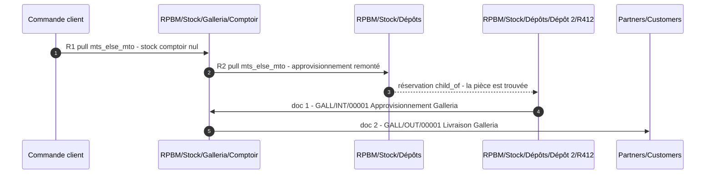

Le stock de Genipa n'est atteint à aucun étage : R1 part de `Galleria/Comptoir`, R2 de `Dépôts`.
Le camion non plus, il est hors de `Stock`.

### F2 — Pièce en stock au dépôt, pose sur site · **2 documents**

Transporteur *Pose sur site (Camion)*.

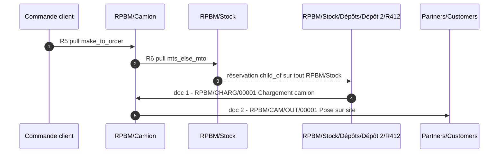

`reservation_method = manual` sur les deux types : rien n'est réservé avant que le préparateur ne
charge effectivement. `create_backorder = always` : ce qui est chargé et non posé reste dû, ce qui
alimente F7.

`R6.location_src_id = RPBM/Stock` donne au camion accès aux **dépôts et aux deux comptoirs**. C'est
voulu et sert F5 ; l'exclusion posée en [I.7](../architectures-stock.md#i7-le-périmètre-de-réservation--une-décision-de-plus-à-poser-au-client)
est asymétrique — elle interdit au comptoir de réserver dans le camion, pas l'inverse.

### F3 — Pièce absente, achat, dépôt, comptoir · **3 documents**

Flux dominant : 82 % du catalogue.

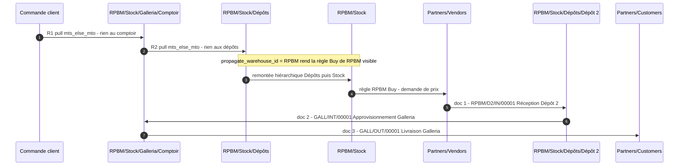

Sans `propagate_warehouse_id = RPBM` sur R2, l'étape 5 échoue et la confirmation de commande lève
`UserError` — voir [§ 2.5.1](#251-les-6-règles-créées-à-la-main).

### F4 — Le fournisseur livre au comptoir · **2 documents**

Traitement A des invariants : l'acheteur bascule le champ **« Livrer à »** de la demande de prix sur
*Réception Galleria* **avant confirmation**.

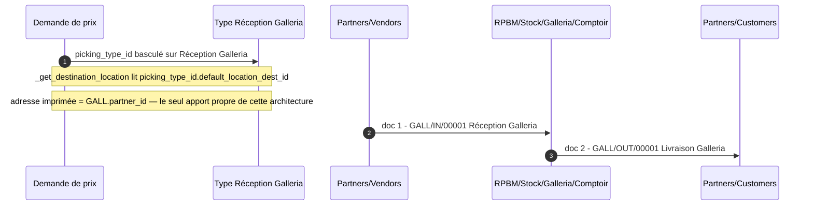

Sources : `purchase_stock/models/purchase_order.py:203-208` pour la destination,
`purchase_stock/report/purchase_report_templates.xml:9-11` pour l'adresse.

C'est le flux où l'architecture 3 gagne quelque chose de visible : en architecture 1, l'adresse
imprimée est celle du siège. **Chez RPBM ce document n'est pas envoyé** — d'où le verdict de
[D bis](../architectures-stock.md#d-bis--architecture-3--hybride-comptoirs-imbriqués).

Le comptoir dispose en outre d'une règle **Acheter** propre (`Galleria: Buy`,
[§ 2.5.2](#252-les-règles-générées--9-enregistrements)) : un point de commande posé sur
`Galleria/Comptoir` produit une demande de prix livrée au comptoir **sans intervention manuelle**.
C'est le seul automatisme que l'architecture 1 ne peut pas reproduire.

### F5 — Réception au comptoir, chargement camion, pose sur site · **3 documents**

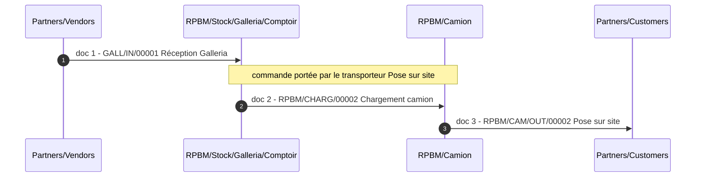

Le chargement passe par R6, dont la source `RPBM/Stock` couvre `Galleria/Comptoir`. Le type
`GALL-CAM` de l'invariant reste disponible pour un chargement **saisi à la main** — voir
[§ 4.6](#46--un-type-dopération-par-règle--pourquoi-il-en-faut-3-de-plus).

### F6 — Le comptoir renvoie une pièce en dépôt · **1 document, manuel**

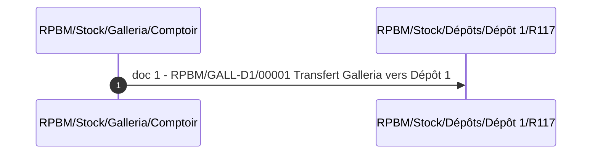

Aucune règle, aucune route : le magasinier crée le transfert depuis la file `GALL-D1` ou `GALL-D2`.
Le type est porté par `RPBM`, la référence est `RPBM/GALL-D1/…`.

### F7 — Article chargé mais non posé, retour · **1 document, manuel**

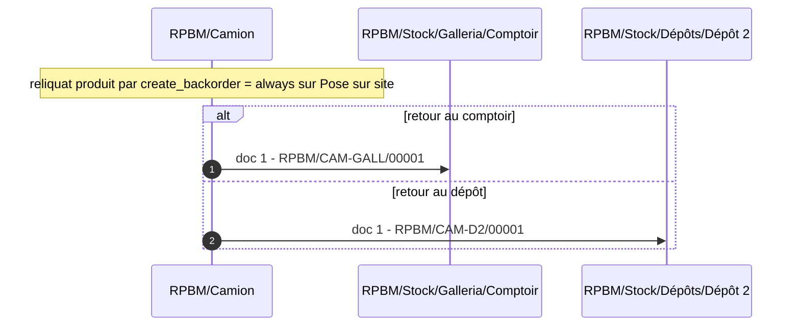

Le reliquat de F2/F5 matérialise la dette ; le transfert de retour la solde. Quatre files distinctes
(`CAM-D1`, `CAM-D2`, `CAM-GALL`, `CAM-GENI`) selon la destination réelle.

### F8 — Casse · **0 document de transfert**

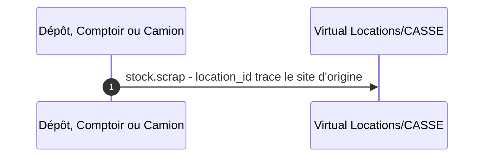

`stock.scrap.location_id` et `scrap_location_id` (`stock/models/stock_scrap.py:39-46`) ; l'origine de
la casse est lisible sur l'emplacement source. Aucun type d'opération consommé
([invariants § 2.5](00-invariants.md#25-récapitulatif)).

### F9 — Vente servie depuis le stock du comptoir · **1 document**

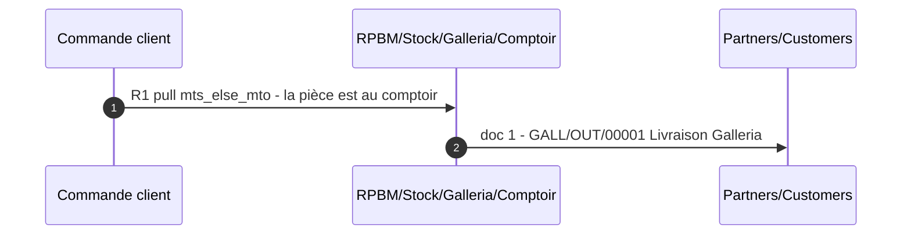

Le flux le plus fréquent en volume n'est pas alourdi par le pool par comptoir.

### F10 — Rééquilibrage entre sites de même profil · **1 document, manuel**

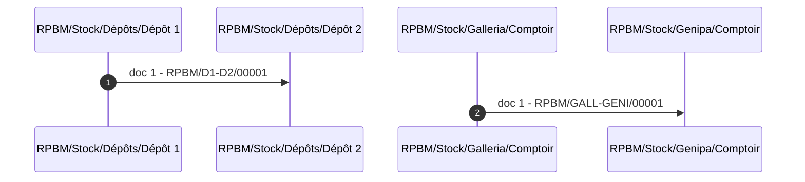

C'est le **seul** chemin par lequel du stock passe d'un comptoir à l'autre, et il est explicitement
saisi : conséquence directe et voulue du pool par comptoir.

### F11 — Retour fournisseur · **1 document**

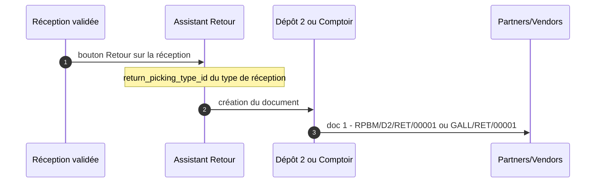

`stock/wizard/stock_picking_return.py:116`. Le rattachement `return_picking_type_id` est décrit en
[§ 2.3.4](#234-deux-points-de-vigilance-sur-ce-tableau) ; c'est un réglage manuel obligatoire pour
`GALL` et `GENI`, dont Odoo pose une valeur native fausse.

### Récapitulatif

| Flux | Documents | Automatique ? | Types mobilisés |
|---|---|---|---|
| F1 | **2** | oui | `GALL/INT`, `GALL/OUT` |
| F2 | **2** | oui | `CHARG`, `CAM/OUT` |
| F3 | **3** | oui | `D2/IN`, `GALL/INT`, `GALL/OUT` |
| F4 | **2** | semi — bascule manuelle du « Livrer à » | `GALL/IN`, `GALL/OUT` |
| F5 | **3** | oui | `GALL/IN`, `CHARG`, `CAM/OUT` |
| F6 | **1** | non | `GALL-D1`, `GALL-D2`, `GENI-D1`, `GENI-D2` |
| F7 | **1** | non | `CAM-D1`, `CAM-D2`, `CAM-GALL`, `CAM-GENI` |
| F8 | **0** | non | `stock.scrap` |
| F9 | **1** | oui | `GALL/OUT` |
| F10 | **1** | non | `D1-D2`, `D2-D1`, `GALL-GENI`, `GENI-GALL` |
| F11 | **1** | assistant | `D1/RET`, `D2/RET`, `GALL/RET`, `GENI/RET` |

**Douze des trente-quatre types ne sont jamais produits par une règle** : les 16 transferts non
camion et non rule-driven sont des files de saisie manuelle. C'est le prix du principe directeur des
invariants, identique dans les trois architectures.

---

## 4 — Ce que cette architecture impose de particulier

### 4.1 — Procédure de création, dans l'ordre

L'ordre compte. Chaque étape est justifiée par un comportement vérifié.

| # | Opération | Pourquoi à ce moment |
|---|---|---|
| 1 | **Reconstruire l'arbre de `RPBM`** : créer `Stock`, `Dépôts`, `Camion`, y rattacher les 489 racks, repointer `RPBM.lot_stock_id` sur `RPBM/Stock` | Prérequis inconditionnel ([H.1](../architectures-stock.md#h1-à-corriger-avant-toute-mise-en-service-quelle-que-soit-larchitecture)) ; `Dépôts` doit exister avant les règles R2/R4 qui s'en servent comme source |
| 2 | **Décocher `replenish_location` sur `RPBM/Stock`** *(temporairement)* | Sinon l'étape 5 échoue — voir [§ 4.4](#44--replenish_location--une-contrainte-que-d-bis4-ne-mentionne-pas) |
| 3 | **Créer l'entrepôt `GALL`** : `name = Galleria`, `code = GALL`, `partner_id`, `reception_steps = one_step`, `delivery_steps = ship_only`, `resupply_wh_ids` vide | La vue naît sous *Physical Locations* (`stock/models/stock_warehouse.py:112-113`) — elle n'est pas encore imbriquée |
| 4 | **Créer l'entrepôt `GENI`** à l'identique | idem |
| 5 | **Décocher `replenish_location` sur `GALL/Stock` et `GENI/Stock`** | `_get_locations_values` le pose à `True` (`stock/models/stock_warehouse.py:640`) ; deux emplacements de réassort dans une même chaîne parent/enfant sont interdits (`stock/models/stock_location.py:171-178`) |
| 6 | **Recocher `replenish_location` sur `RPBM/Stock`** | rétablit l'état cible |
| 7 | **Déplacer les vues** : `location_id` de la vue `GALL` ← `RPBM/Stock` ; idem `GENI` | C'est **le** geste de l'architecture. Aucun garde-fou ne s'y oppose (`stock/models/stock_location.py:186-216` ne contrôle que `company_id`, `usage`, `scrap_location` et `active`) |
| 8 | **Renommer** : vue `GALL` → `Galleria`, `GALL/Stock` → `Comptoir` ; idem Genipa | Purement lisibilité. Ne **jamais** renommer en écrivant `stock.warehouse.code` — voir [§ 4.2](#42--ce-que-write-régénère-et-quand) |
| 9 | **Vérifier `stock.location.warehouse_id`** sur toute la sous-arborescence des deux comptoirs | Le champ est stocké et son `@api.depends` ne porte que sur `warehouse_view_ids` et `location_id` **de l'enregistrement lui-même** (`stock/models/stock_location.py:139`) : le recalcul en cascade sur les enfants n'est pas garanti par le graphe de dépendances |
| 10 | **Reparamétrer les 3 types natifs de `RPBM`** (`in_type_id`, `out_type_id`, `int_type_id`) et les **12 types natifs des 3 entrepôts** selon [§ 2.3](#23-stockpickingtype--34-types-actifs) | Les types existent déjà ; on les reparamètre au lieu d'en créer |
| 11 | **Créer les 23 types manuels de `RPBM`** et les 2 `RET` des comptoirs, `warehouse_id` **explicite** | `_compute_warehouse_id` prendrait sinon le premier entrepôt (`stock/models/stock_picking.py:303-311`) |
| 12 | **Corriger les `return_picking_type_id`** des 4 types de réception | Odoo en pose une valeur native fausse (`stock/models/stock_warehouse.py:362-365`) |
| 13 | **Repointer `RPBM: Buy`** sur `location_dest_id = RPBM/Stock` | Voir [§ 2.5.2](#252-les-règles-générées--9-enregistrements) |
| 14 | **Créer les 3 routes et les 6 règles** | Les emplacements et les types qu'elles référencent doivent tous exister |
| 15 | **Créer les 3 `delivery.carrier`** et leurs 3 articles de service | `product_id` est `required` (`delivery/models/delivery_carrier.py:50`) |
| 16 | **Poser `res.users.property_warehouse_id`** par vendeur | `sale_stock/models/res_users.py:10` — limite le risque décrit en [§ 4.5](#45--le-groupe-multi-entrepôts-et-le-champ-que-le-vendeur-voit-maintenant) |
| 17 | **Rejouer les 11 flux en préproduction** | Voir [§ 4.8](#48--à-vérifier-en-préproduction-avant-mise-en-service) |

Les étapes 2, 5 et 6 forment un aller-retour inélégant. Il est évitable en créant `GALL` et `GENI`
**avant** de cocher `replenish_location` sur `RPBM/Stock` ; l'ordre ci-dessus est celui qui part de
l'instance actuelle, où `RPBM/Stock` n'existe pas encore.

### 4.2 — Ce que `write()` régénère, et quand

C'est la réserve la plus sérieuse techniquement : **la configuration n'est pas auto-portante.**
`stock.warehouse.write()` (`stock/models/stock_warehouse.py:163-287`) déclenche, selon les champs
écrits :

| Champ écrit | Ce qui est rejoué | Effet sur notre configuration |
|---|---|---|
| **n'importe lequel** | `_create_missing_locations(vals)` (`:171`) | Recrée sous `view_location_id` tout emplacement natif dont le many2one est **vide**. Les emplacements archivés ne le sont pas : le champ pointe toujours dessus. → **ne jamais supprimer `Input`, `Output`, `Quality Control`, `Packing Zone`, les archiver** |
| `code` | `_update_name_and_code` (`:191-192`, `:922-944`) → `lot_stock_id.location_id.write({'name': new_code})` (`:924`) | **La vue `Galleria` est renommée `GALL`.** Le renommage cosmétique de l'étape 8 est annulé |
| `name` ou `code` | réécriture des préfixes des 5 séquences (`:936-944`) et remplacement textuel du nom dans les routes et règles de l'entrepôt (`:927-934`) | Les 4 `sequence_code` des comptoirs sont conservés, seul le nom de séquence change. Les noms de règles subissent un `str.replace` — cosmétique |
| `code`, `reception_steps` ou `delivery_steps` | `_create_or_update_sequences_and_picking_types()` (`:199-202`) | Pour les types **existants**, écrit `_get_picking_type_update_values()` (`:957-985`) : `in_type_id.default_location_dest_id` ← `lot_stock_id`, `out_type_id.default_location_src_id` ← `lot_stock_id`, `pick`/`pack` `active` ← `False`, barcodes. → **`RPBM`, la destination de *Réception Dépôt 2* et la source de *Pose sur site* sont écrasées.** Sur `GALL`/`GENI` l'écrasement est sans effet, les valeurs coïncident déjà avec `lot_stock_id` |
| `reception_steps` ou `delivery_steps` | `_create_or_update_route()` (`:203-206`) → `route.rule_ids.write({'active': False})` (`:476`) puis `_find_existing_rule_or_create` (`:611-625`) | **Toute règle de la route de réception ou de livraison qu'on aurait modifiée est archivée sans être retrouvée** : la recherche se fait sur le quintuplet exact `(picking_type_id, location_src_id, location_dest_id, route_id, action)` (`:614-621`). Une règle modifiée ne correspond plus → Odoo en **crée une neuve** et laisse la modifiée archivée |
| `reception_steps`, `delivery_steps`, `buy_to_resupply` | `_create_or_update_global_routes_rules()` (`:207-215`) | Réécrit `mto_pull_id` et `buy_pull_id`. **`RPBM: Buy.location_dest_id` repasse à `in_type_id.default_location_dest_id`** = `Dépôt 2` → F3 casse à nouveau |
| `active` | contrôle des mouvements en cours, puis `_check_multiwarehouse_group()` (`:217-224`, `:285-286`) | Refuse l'archivage s'il reste des opérations en cours |
| `resupply_wh_ids` | création ou désactivation des routes de transit (`:261-283`) | **À ne jamais renseigner** : c'est ce champ qui ramènerait la chaîne à 3 documents de l'architecture 2 |

**Ce que cela veut dire en pratique.** Trois écritures sont dangereuses et une seule est anodine :

- **anodine** : `partner_id` — met à jour `property_stock_customer`/`property_stock_supplier` du
  contact (`:184-189`, `:311-321`) et rien d'autre ;
- **dangereuses** : `code`, `reception_steps`, `delivery_steps`. Chacune impose de re-vérifier, après
  coup : le nom de la vue, la destination de *Réception Dépôt 2*, la source de *Pose sur site*, la
  destination de `RPBM: Buy`, et l'état des règles des routes natives.

Ce n'est pas une raison d'écarter l'architecture — c'est une consigne d'exploitation à écrire dans
la procédure : **on ne modifie pas un entrepôt sans repasser la liste de contrôle ci-dessus.**

### 4.3 — Ce qu'un entrepôt en `one_step` / `ship_only` crée exactement

Le ménage est **plus léger** que ne le laisse craindre D bis.4. Décompte vérifié pour un entrepôt
créé avec `reception_steps = one_step`, `delivery_steps = ship_only`, `resupply_wh_ids` vide,
`purchase_stock` installé, groupe multi-emplacements actif :

| Modèle | Créés | Actifs | Détail |
|---|---|---|---|
| `stock.location` | **6** | **2** | 1 vue + `Stock` actif + `Input`, `Quality Control`, `Output`, `Packing Zone` **créés inactifs** (`:643-666`) |
| `ir.sequence` | **5** | 5 | une par type, y compris pour les types inactifs (`:355-359`, `:1046-1078`) |
| `stock.picking.type` | **5** | **3** | `IN`, `OUT`, `INT` actifs ; `PICK` et `PACK` **naissent inactifs** |
| `stock.route` | **3** | **2** | réception et livraison actives ; cross-dock créée inactive (`:559`, `:564`) |
| `stock.rule` | **5** | 5 | 0 sur la route de réception, 1 sur la livraison, 2 sur le cross-dock inerte, + `mto_pull_id` + `buy_pull_id` |

**`PICK` et `PACK` naissent bien inactifs, et c'est stable.** Le mécanisme mérite d'être compris :
`_create_or_update_sequences_and_picking_types` part de `_get_picking_type_update_values()` puis
**superpose** `_get_picking_type_create_values()` (`:346-347`, `:354`). Or `active` figure dans les
valeurs de **mise à jour** pour `pick_type_id` et `pack_type_id` — `self.delivery_steps != 'ship_only'
and self.active`, respectivement `self.delivery_steps == 'pick_pack_ship' and self.active`
(`:971-981`) — et **pas** dans les valeurs de création : la valeur `False` survit à la superposition.
Corollaire important : à chaque régénération, ces deux types sont **remis** à inactif. Il n'y a rien
à archiver, et rien qui puisse ressusciter.

**`INT` est actif**, lui, parce que `active` figure cette fois dans les valeurs de création :
`self.reception_steps != 'one_step' or self.delivery_steps != 'ship_only' or
self.user_has_groups('stock.group_stock_multi_locations')` (`:1039`). Le troisième terme est vrai
chez RPBM. C'est heureux : ce type est réutilisé comme *Approvisionnement Galleria*.

**Ce qui reste à faire à la main est donc court** : rien à archiver côté types, rien à supprimer côté
emplacements. Le « ménage » de D bis.4 se réduit à **reparamétrer 4 types et 1 règle par comptoir**.

### 4.4 — `replenish_location` : une contrainte que D bis.4 ne mentionne pas

`_get_locations_values` pose `replenish_location = True` sur le `Stock` de tout entrepôt créé
(`stock/models/stock_warehouse.py:640`). Et `stock.location` porte une contrainte :

```python
@api.constrains('replenish_location', 'location_id', 'usage')
def _check_replenish_location(self):
    ...
    replenish_wh_location = self.search([('id', '!=', loc.id), ('replenish_location', '=', True),
        '|', ('location_id', 'child_of', loc.id), ('location_id', 'parent_of', loc.id)], limit=1)
    if replenish_wh_location:
        raise ValidationError(...)
```

`stock/models/stock_location.py:171-178`. **Deux emplacements de réassort ne peuvent pas coexister
dans une même chaîne parent/enfant.** Or c'est exactement ce que produit l'imbrication :
`RPBM/Stock` et `RPBM/Stock/Galleria/Comptoir` sont dans la même chaîne.

Deux précisions, l'une rassurante et l'autre pas :

- **le déplacement de la vue ne déclenche pas la contrainte** : elle porte sur `replenish_location`,
  `location_id` et `usage` de l'enregistrement écrit, or la vue déplacée a
  `replenish_location = False` (forcé pour tout `usage != 'internal'`,
  `stock/models/stock_location.py:165-169`) ;
- **mais toute écriture ultérieure sur l'un des deux emplacements la déclenche**, et elle est
  symétrique : elle lève depuis `Comptoir` (dont l'ancêtre `RPBM` est le parent de `RPBM/Stock`)
  comme depuis `RPBM/Stock` (dont `Galleria` est un descendant).

**Décision retenue** : `replenish_location = True` **uniquement sur `RPBM/Stock`**, décoché sur les
deux `Comptoir`. Ce que cela coûte : `_get_orderpoint_locations()` ne retourne que les emplacements
portant ce drapeau (`stock/models/stock_orderpoint.py:648`), donc les points de commande
**auto-suggérés** dans la vue Réassort sont calculés à l'échelle de `RPBM/Stock` et non par comptoir.
Les points de commande **saisis à la main** sur `Galleria/Comptoir` restent parfaitement possibles —
`stock.warehouse.orderpoint.location_id` n'est pas contraint par ce drapeau.

C'est un écart net avec la fiche
[E.3](../architectures-stock.md#e3-architecture-3--les-comptoirs-sont-des-entrepôts-imbriqués), qui
annonce « `replenish_location = True` + orderpoints manuels » pour le profil comptoir : **la première
moitié est impossible**, la seconde suffit.

### 4.5 — Le groupe multi-entrepôts et le champ que le vendeur voit maintenant

`create()` appelle `_check_multiwarehouse_group()` (`stock/models/stock_warehouse.py:150`,
`:294-309`) : dès qu'il existe plus d'un entrepôt actif, `stock.group_stock_multi_warehouses` **et**
`stock.group_stock_multi_locations` sont ajoutés aux `implied_ids` de `base.group_user`. L'interface
change **pour tous les utilisateurs**, pas seulement pour ceux qui manipulent les comptoirs.

Concrètement, `sale.order.warehouse_id` devient visible et propose trois valeurs, dont deux ne
doivent jamais être choisies pour une pose sur site. Deux atténuations :

1. **`res.users.property_warehouse_id`** (`sale_stock/models/res_users.py:10`) fixe le défaut par
   vendeur : les vendeurs Galleria sur `GALL`, ceux de Genipa sur `GENI` ;
2. **`warehouse_id` vide sur les 6 règles** ([§ 2.5.1](#251-les-6-règles-créées-à-la-main)) rend le
   flux **insensible** à ce champ. C'est la raison principale de ce choix : sans lui, un vendeur qui
   laisse `RPBM` sur une commande Galleria ferait retomber l'approvisionnement sur
   `RPBM: Livrer en 1 étape`, dont la source est `RPBM/Stock` — et le pool par comptoir serait
   silencieusement violé, la commande Galleria réservant à Genipa.

Ce dernier point est le plus insidieux de l'architecture : **un mauvais choix d'entrepôt sur la
commande ne produit ni erreur ni avertissement, seulement un périmètre de réservation différent.**
`warehouse_id` vide sur les règles le neutralise, mais la démonstration doit être refaite en
préproduction.

### 4.6 — Un type d'opération par règle : pourquoi il en faut 3 de plus

Une `stock.rule` porte **un** `picking_type_id` et **une** `location_src_id`. Trois legs des onze
flux sont pilotés par une règle dont la source couvre **plusieurs sites** :

| Règle | Source | Types de l'invariant qui conviendraient | Problème |
|---|---|---|---|
| R2 / R4 | `RPBM/Stock/Dépôts` | `D1-GALL` **et** `D2-GALL` | La source réelle n'est connue qu'à la réservation. Une règle ne peut en désigner qu'un |
| R6 | `RPBM/Stock` | `D1-CAM`, `D2-CAM`, `GALL-CAM`, `GENI-CAM` | idem, sur quatre |

Deux issues seulement, et aucune n'est gratuite :

- **restreindre la règle à un seul site d'origine** — R2 partirait de `Dépôt 2` seul. Une pièce
  présente uniquement en `Dépôt 1` déclencherait alors un achat VSF : exactement le défaut que le
  pool par comptoir cherche à éviter ([I.7](../architectures-stock.md#i7-le-périmètre-de-réservation--une-décision-de-plus-à-poser-au-client)). Écartée ;
- **dédier un type d'opération à chaque règle**, dont la source est le parent commun. Retenue.

**Ce choix ne coûte aucun enregistrement supplémentaire** : les trois types nécessaires sont les
`int_type_id` **natifs** des trois entrepôts, qui seraient sinon inutilisés — `get_rules_dict()` ne
mobilise `int_type_id` qu'en `two_steps`, `three_steps` et `crossdock`
(`stock/models/stock_warehouse.py:782-791`), aucun de nos cas. On les reparamètre :

| Type natif | Devient | Source | Destination | Référence produite |
|---|---|---|---|---|
| `RPBM.int_type_id` | Chargement camion | `RPBM/Stock` | `RPBM/Camion` | `RPBM/CHARG/…` |
| `GALL.int_type_id` | Approvisionnement Galleria | `RPBM/Stock/Dépôts` | `…/Galleria/Comptoir` | `GALL/INT/…` |
| `GENI.int_type_id` | Approvisionnement Genipa | `RPBM/Stock/Dépôts` | `…/Genipa/Comptoir` | `GENI/INT/…` |

Le choix de porter `GALL/INT` par l'entrepôt `GALL` plutôt que par `RPBM` est délibéré : le document
d'approvisionnement d'un comptoir doit apparaître dans la file de **ce** comptoir, où l'équipe qui
le reçoit va le chercher, et sa référence `GALL/INT/00001` le dit sans l'ouvrir. Le prix de ce
rattachement est le `propagate_warehouse_id = RPBM` de R2, sans lequel l'escalade vers l'achat
échoue ([§ 2.5.1](#251-les-6-règles-créées-à-la-main)).

**Conséquence à assumer, et elle contredit l'invariant § 2.1** : `D1-GALL`, `D2-GALL`, `D1-GENI`,
`D2-GENI` sont annoncés comme servant F1 et F3, et `D1-CAM`, `D2-CAM`, `GALL-CAM`, `GENI-CAM` comme
servant F2 et F5. Dans cette architecture, ces huit types ne sont **jamais produits
automatiquement** : ils restent des files de saisie manuelle, pour le magasinier qui décide de
déplacer du stock sans commande client derrière. Point porté en
[§ 6](#6--points-non-tranchés-et-non-vérifiés).

**Cette contrainte n'est pas propre à l'architecture 3.** Elle vaut identiquement en architecture 1,
où [C.2](../architectures-stock.md#c2-les-deux-routes-sélectionnables-à-la-ligne-de-commande) parle
d'un type *Transfert* et d'un type *Chargement* génériques, sans les rattacher aux 20 types de
l'invariant.

### 4.7 — Le reporting par entrepôt se scinde, et de trois manières différentes

C'est le revers exact de l'apport « stock par comptoir ». Il ne se manifeste pas par une erreur mais
par des chiffres qui cessent de vouloir dire ce qu'ils voulaient dire. **Trois mécanismes
différents cohabitent dans le standard**, et l'imbrication les fait diverger.

#### Mécanisme 1 — l'entrepôt le plus profond gagne

`stock.quant.warehouse_id` est un `related='location_id.warehouse_id'` **non stocké**
(`stock/models/stock_quant.py:63`), et `stock.location.warehouse_id` retient l'entrepôt le plus
profond (`stock/models/stock_location.py:139-152`). Les quants des comptoirs sont donc ceux de
`GALL` et `GENI`, **et pas** ceux de `RPBM`.

| Rapport / vue | Impact concret |
|---|---|
| **Inventaire** (`stock.quant`, vue `stock.quant_search_view`) | Le champ `warehouse_id` y est un **filtre**, pas un groupement (`stock/views/stock_quant_views.xml:22`) — le champ n'étant pas stocké, il n'est pas groupable. Filtrer « Entrepôt = RPBM » **exclut** les quants des comptoirs. Un filtre qui donnait le total le donne désormais partiel |
| Toute vue ou tout filtre enregistré posé sur `stock.quant.warehouse_id` | idem |

#### Mécanisme 2 — tous les entrepôts parents comptent, donc on compte deux fois

`report.stock.quantity` — le rapport **Inventaire prévisionnel** — est une vue SQL qui joint
emplacement et entrepôt par
`sl.parent_path::text like concat('%/', w.view_location_id, '/%')`
(`stock/report/report_stock_quantity.py:52-53`) et, pour la partie stock, par
`l.parent_path like concat('%/', wh.view_location_id, '/%')`
(`stock/report/report_stock_quantity.py:131-132`). **Aucune sélection du plus profond, et un
`LEFT JOIN` sans déduplication** : un emplacement imbriqué satisfait la condition pour `RPBM`
**et** pour `GALL`, et produit deux lignes.

Conséquence : **le stock des comptoirs y est compté deux fois** dès qu'on ne filtre pas par
entrepôt. Par entrepôt pris séparément, les chiffres restent justes ; le total ne l'est plus.
C'est l'inverse exact du mécanisme 1, sur le même sujet, dans le même module.

#### Mécanisme 3 — l'arbre entier, donc des périmètres qui se recouvrent

Le **Rapport de prévision** d'un article prend `child_of warehouse.view_location_id`
(`stock/report/stock_forecasted.py:115-117`). Celui de `RPBM` **inclut** les deux comptoirs ; celui
de `GALL` ne couvre que Galleria. Les trois rapports se recouvrent au lieu de se partager.

Même logique pour `product.qty_available` : sans contexte, `_get_domain_locations` construit un
domaine `child_of` sur les `view_location_id` de **tous** les entrepôts
(`stock/models/product.py:307-311`, `:315-320`) — un domaine, donc **sans double comptage**. Avec
`context = {'warehouse': RPBM}`, la quantité en main de `RPBM` **inclut** les comptoirs.

#### Ce qu'il faut en retenir

| Question posée à Odoo | Réponse pour `RPBM` |
|---|---|
| « Quantité en main, entrepôt RPBM » (`qty_available`) | **inclut** les comptoirs |
| « Rapport de prévision, entrepôt RPBM » | **inclut** les comptoirs |
| « Inventaire, filtre Entrepôt = RPBM » | **exclut** les comptoirs |
| « Inventaire prévisionnel, tous entrepôts » | **compte deux fois** les comptoirs |

Aujourd'hui, avec un entrepôt unique, ces quatre réponses coïncident. Après imbrication, elles
divergent **sans avertissement ni erreur**. Tout rapport, tableau de bord, filtre enregistré ou
export existant appuyé sur la notion d'entrepôt est à réexaminer un par un — c'est un travail
d'inventaire préalable, pas une correction post-bascule.

### 4.8 — À vérifier en préproduction avant mise en service

Aucune de ces vérifications n'a été faite : ce document est une lecture de code.

1. **Le déplacement de la vue** (étape 7) et le recalcul de `stock.location.warehouse_id` sur toute
   la sous-arborescence des comptoirs (étape 9) ;
2. **F3 de bout en bout**, avec et sans `propagate_warehouse_id` sur R2 — c'est la démonstration
   directe du raisonnement de [§ 2.5.1](#251-les-6-règles-créées-à-la-main) ;
3. **Le pool par comptoir**, en vérifiant qu'une commande Galleria ne réserve **jamais** à Genipa,
   pour les trois valeurs possibles de `sale.order.warehouse_id` ;
4. **L'interaction du traitement A et de la chaîne MTO** : si l'acheteur bascule « Livrer à » sur
   *Réception Galleria* **après** que la chaîne `Dépôts → Galleria` a été générée, la marchandise
   arrive au comptoir alors qu'un transfert reste planifié. Comportement non vérifié — point déjà
   soulevé en [I.7](../architectures-stock.md#le-défaut-retenu--pool-par-comptoir-2026-08-06) ;
5. **Un renommage d'entrepôt**, pour mesurer réellement l'étendue de [§ 4.2](#42--ce-que-write-régénère-et-quand) ;
6. **Les quatre questions de reporting** de [§ 4.7](#47--le-reporting-par-entrepôt-se-scinde-et-de-trois-manières-différentes), sur un jeu de données où
   les comptoirs portent du stock ;
7. **Une source de règle sur `Dépôts`** : vérifier qu'un mouvement dont `location_id` est un
   emplacement intermédiaire portant lui-même des enfants se réserve et se valide normalement.

---

## 5 — Ce qu'elle ne donne pas

- **Aucun apport exploitable aujourd'hui.** Le seul différenciateur — l'adresse de livraison par
  comptoir sur le bon de commande fournisseur — porte sur un document que RPBM n'envoie pas
  ([I.3](../architectures-stock.md#i3-pourquoi-le-critère-de-bascule-ne-bascule-pas)). L'automatisme
  associé (règle *Acheter* par comptoir, [§ 2.5.2](#252-les-règles-générées--9-enregistrements))
  suppose des points de commande sur les comptoirs, qui ne sont pas décidés.
- **Pas de total par entrepôt fiable.** La ventilation par comptoir se paie par la perte du total
  implicite, et par trois sémantiques divergentes selon le rapport
  ([§ 4.7](#47--le-reporting-par-entrepôt-se-scinde-et-de-trois-manières-différentes)).
- **Pas de réassort auto-suggéré par comptoir.** `replenish_location` ne peut être posé que sur un
  seul niveau de la chaîne ([§ 4.4](#44--replenish_location--une-contrainte-que-d-bis4-ne-mentionne-pas)).
- **Pas de configuration auto-portante.** Trois champs d'entrepôt — `code`, `reception_steps`,
  `delivery_steps` — régénèrent des enregistrements et défont une partie du paramétrage
  ([§ 4.2](#42--ce-que-write-régénère-et-quand)). La procédure d'exploitation doit l'intégrer.
- **Pas de gain sur le nombre de documents.** F1 coûte 2 documents, F3 en coûte 3 — strictement
  comme l'architecture 1 sous le même pool par comptoir. L'imbrication ne compresse rien ; elle
  déplace le périmètre de réservation du `location_src_id` d'une règle vers le `lot_stock_id` d'un
  entrepôt.
- **Pas de neutralité pour les autres utilisateurs.** Le groupe multi-entrepôts s'active pour tout
  le monde ([§ 4.5](#45--le-groupe-multi-entrepôts-et-le-champ-que-le-vendeur-voit-maintenant)).
- **Pas de production automatique des 8 types de transfert dépôt→comptoir et site→camion** des
  invariants ([§ 4.6](#46--un-type-dopération-par-règle--pourquoi-il-en-faut-3-de-plus)).
- **Pas de cross-dock.** Il exige `reception_steps != one_step`
  (`stock/models/stock_warehouse.py:559`, `:564`) ; F4 passe par le traitement A, comme en
  architecture 1.
- **Rien de nouveau côté comptable.** `standard` / `manual_periodic`, aucune écriture générée
  ([invariants § 3.4](00-invariants.md#34-valorisation)).

---

## 6 — Points non tranchés et non vérifiés

**Points de conception tranchés ici, mais qui méritent une confirmation.**

1. **Le rattachement des 20 types de transfert à `RPBM`.** Choix retenu : un type de transfert
   appartient à l'entrepôt qui possède son emplacement **source** — sauf pour les trois types
   porteurs de règle, où il appartient à l'entrepôt **destinataire** pour que le document tombe dans
   la file de l'équipe qui le reçoit. `D2-GALL` est donc porté par `RPBM` (référence
   `RPBM/D2-GALL/…`) et `GALL/INT` par `GALL`. Cette asymétrie est assumée mais discutable :
   l'alternative — tout rattacher à `RPBM` — coûterait le `propagate_warehouse_id` en moins et la
   lisibilité de la file comptoir en moins.
2. **La convention de `sequence_code`** de [§ 2.0](#20-convention-de-sequence_code-retenue) retire le
   préfixe de site pour les 6 types portés par un comptoir. La référence produite est identique à
   celle de l'invariant, mais le `sequence_code` stocké diffère de la lettre du contrat.
3. **Les 3 types porteurs de règle** ([§ 4.6](#46--un-type-dopération-par-règle--pourquoi-il-en-faut-3-de-plus))
   portent le total à 34 au lieu de 31, et privent 8 des 20 types de transfert de toute production
   automatique. C'est un écart réel à l'invariant § 2.1, à arbitrer avec le rédacteur des
   invariants — d'autant qu'il vaut aussi pour l'architecture 1.
4. **`reservation_method = manual` et `create_backorder = always` sur les 10 types touchant le
   camion**, y compris ceux qui **chargent** le camion depuis un dépôt. L'invariant § 3.2 raisonne
   par profil de site, pas par sens du mouvement ; l'interprétation retenue est que le paramètre
   suit le camion, quel que soit le sens. À confirmer.
5. **`return_picking_type_id` de *Pose sur site*.** Un retour client d'une pose sur site devrait-il
   revenir au camion, au comptoir ou au dépôt ? Les invariants ne définissent aucun type de
   réception client. La valeur native serait *Réception Dépôt 2* ; laissée telle quelle faute de
   décision.
6. **Le sort des deux types sortants existants sur l'instance** (`Livraisons Galleria`,
   `Livraisons Génipa`, aujourd'hui portés par `RPBM` avec le même `sequence_code` `OUT`). Cette
   architecture les remplace par les `out_type_id` natifs de `GALL` et `GENI`. La bascule des
   documents en cours et la reprise de l'historique ne sont pas traitées ici : ce document décrit
   une cible, pas une migration.

**Points que je n'ai pas pu vérifier.**

7. **Rien n'a été essayé sur `rpbm-preprod`.** L'intégralité de ce document est une lecture de
   `D:\git\odoo_17\odoo17\addons`. La liste des vérifications à faire est en
   [§ 4.8](#48--à-vérifier-en-préproduction-avant-mise-en-service).
8. **Le recalcul en cascade de `stock.location.warehouse_id`** après déplacement de la vue. J'ai
   vérifié la définition du champ (stocké) et son `@api.depends`
   (`stock/models/stock_location.py:93`, `:139`) : il ne dépend que de `warehouse_view_ids` et
   `location_id` de l'enregistrement lui-même, donc rien ne garantit dans le graphe que les enfants
   soient recalculés. Dans notre cas les valeurs préexistantes sont déjà correctes (elles sont
   écrites en dur à la création, `stock/models/stock_warehouse.py:146-148`), mais je n'ai **pas
   vérifié** le comportement à l'exécution.
9. **Un mouvement dont `location_id` est `RPBM/Stock/Dépôts`.** J'ai vérifié que `_gather` filtre en
   `child_of` (`stock/models/stock_quant.py:812-819`) et que la ligne de mouvement reçoit
   l'emplacement réel du quant ; je n'ai **pas vérifié** de bout en bout la validation d'un transfert
   dont l'en-tête porte un emplacement intermédiaire. C'est le même schéma que `RPBM/Stock` en
   architecture 1, donc probablement sans surprise.
10. **La double ligne de `report_stock_quantity`.** La lecture du SQL est sans ambiguïté
    (`stock/report/report_stock_quantity.py:52-53`, `:131-132`) mais je n'ai **pas exécuté** la
    requête sur un jeu de données imbriqué. L'ampleur du double comptage doit être mesurée avant de
    conclure.
11. **Le comportement de `_update_name_and_code` sur les noms de règles** est un `str.replace` du
    nom de l'entrepôt (`stock/models/stock_warehouse.py:927-934`). Sur nos règles manuelles, qui ne
    contiennent pas le nom de l'entrepôt et n'appartiennent pas à `warehouse.route_ids`, l'effet
    devrait être nul. **Non vérifié.**
12. **Le nombre de camions** reste fixé à un ([invariants § 1](00-invariants.md#1-les-cinq-sites)).
    L'extension à N ([G](../architectures-stock.md#g--extension-à-n-camions)) n'a pas été confrontée
    à cette structure.
