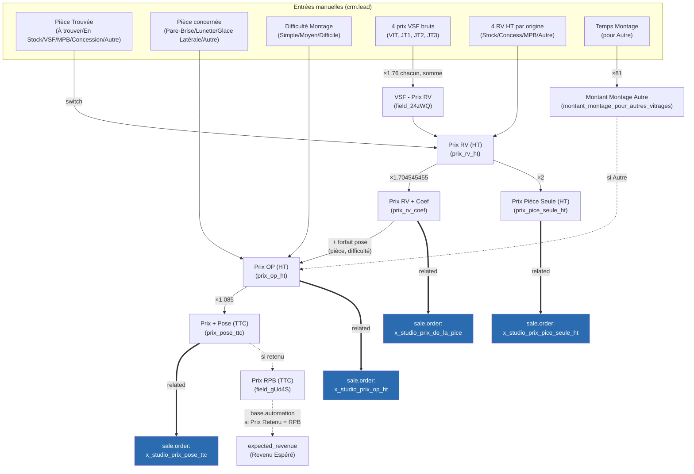
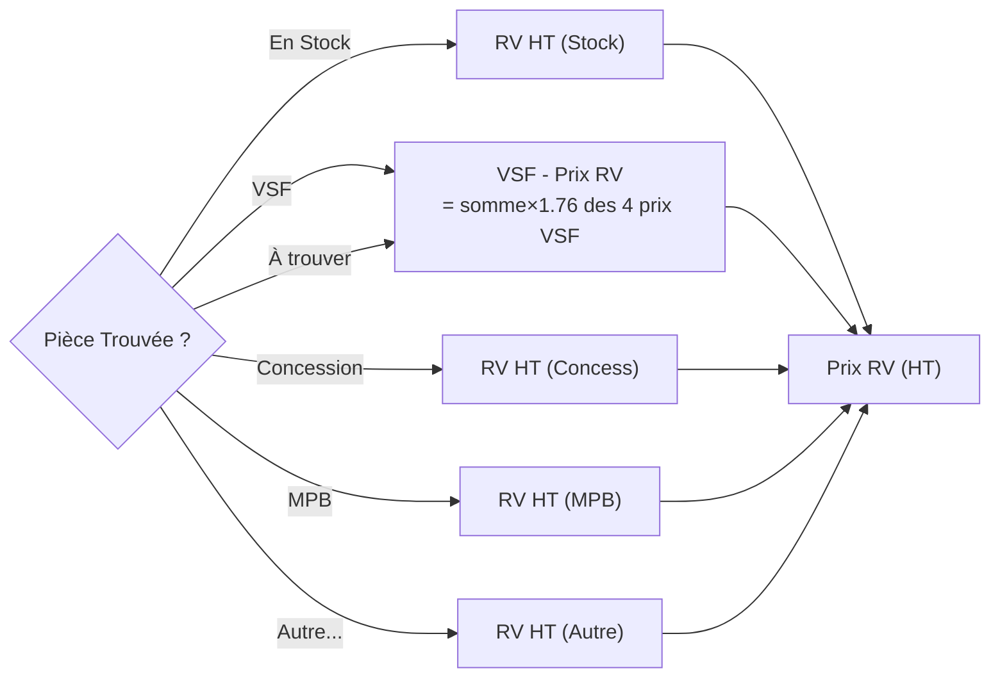

# Cartographie du prix de vente — devis RPBM

Documentation de référence sur la construction du prix de vente affiché sur les devis (`sale.order`), à partir des 4 champs demandés : `x_studio_prix_de_la_pice`, `x_studio_prix_op_ht`, `x_studio_prix_pice_seule_ht`, `x_studio_prix_pose_ttc`.

**Constat principal** : ce prix n'utilise pas le moteur de prix natif d'Odoo (pas de pricelist, pas de calcul sur `product.template`/`sale.order.line`). C'est un calcul métier entièrement porté par des champs Studio (`x_studio_*`) sur `crm.lead` (l'opportunité), que `sale.order` ne fait que **recopier** via des champs `related`. Toute la logique vit donc sur la Piste/Opportunité, pas sur le devis.

Fichiers de cette cartographie :
- [champs-crm-lead.md](champs-crm-lead.md) — référence complète des champs et formules sur `crm.lead` (la source)
- [champs-sale-order.md](champs-sale-order.md) — référence des champs miroirs sur `sale.order` (la destination)

Recherche effectuée en lecture seule via la skill `paradigme-mcp` (profil `rpbm-preprod`), sur `ir.model.fields`, `base.automation` et `ir.actions.server`, avec vérification numérique sur un devis réel (voir plus bas). Le dump `Jobs/champs_studio/studio_fields_by_model.json` (11/10/2024) est obsolète et n'a pas été réutilisé — le schéma a beaucoup évolué depuis (IDs de champs constatés jusqu'à 52679 en préprod).

## Vue d'ensemble de la cascade

## Sélection du prix selon l'origine de la pièce

`x_studio_field_z5iaE` ("Pièce Trouvée") pilote deux `switch` quasi-identiques (`x_studio_field_h06UD` et `x_studio_prix_rv_ht` — voir anomalie ci-dessous). Le second est celui qui compte pour la cascade :

Remarque : "En Stock" et "À trouver" retombent tous les deux, en pratique, sur le prix VSF (via `field_h06UD` pour "En Stock" qui lui-même vaut `RV HT (Stock)`, et directement `VSF - Prix RV` pour "À trouver") — donc une pièce pas encore localisée affiche un prix basé sur le catalogue VSF par défaut.

## Exemple chiffré vérifié

Devis `SO7504` (opportunité 12412, "MONTLUC Lionel - PB FORD MONDEO II"), pièce trouvée = VSF, pièce concernée = Pare-Brise, difficulté = Moyen :

| Champ | Valeur | Vérification |
|---|---|---|
| Prix RV (HT) | 224.4176 | (déduit) |
| `x_studio_prix_de_la_pice` (Prix RV + Coef) | 382.53 | `224.4176 × 1.704545455 = 382.53` ✓ |
| `x_studio_prix_pice_seule_ht` | 448.8352 | `224.4176 × 2 = 448.8352` ✓ |
| `x_studio_prix_op_ht` | 562.53 | `382.53 + 180` (Pare-Brise/Moyen) ✓ |
| `x_studio_prix_pose_ttc` | 610.345 | `562.53 × 1.085 = 610.34505` ✓ |

La cascade documentée reproduit exactement les valeurs observées sur cette instance.

## Anomalies / points de vigilance

Constats utiles pour un futur nettoyage — aucune action requise dans le cadre de cette cartographie :

1. **Libellé incohérent** : `x_studio_prix_de_la_pice` sur `sale.order` est labellisé *"Prix Pièce dans l'OP (HT)"*, mais pointe vers le champ *"Prix RV + Coef"* sur `crm.lead` — deux libellés différents pour la même donnée.
2. **Logique dupliquée** : `x_studio_field_h06UD` ("RV Pièce") et `x_studio_prix_rv_ht` ("Prix RV (HT)") implémentent presque le même `switch` sur "Pièce Trouvée", avec un niveau d'indirection en plus côté `prix_rv_ht` pour la branche "En Stock". Deux formules à maintenir en synchronisation manuelle si l'un des cas doit changer.
3. **Deux référentiels de temps de pose non connectés** : `x_studio_temps_main_oeuvre` (heures, sur `crm.lead` *et* recalculé indépendamment sur `sale.order`) et le forfait en euros codé en dur dans `x_studio_prix_op_ht` couvrent la même logique métier (pièce × difficulté) mais avec deux jeux de constantes séparés — modifier l'un sans l'autre créerait une incohérence silencieuse.
4. **Valeurs par défaut sur pièce non localisée** : "À trouver" utilise le prix VSF comme placeholder, au même titre que la pièce réellement sourcée chez VSF — à confirmer que c'est le comportement voulu.
5. **Mécanisme `expected_revenue` séparé** : `x_studio_prix_retenu` + 3 `base.automation` déterminent le Revenu Espéré CRM à partir de 3 prix candidats (RPB/XGlass/Proposé), dont un seul (RPB) est connecté à la cascade ci-dessus — les deux autres sont des saisies manuelles indépendantes. Ce mécanisme sert au forecast CRM, pas à l'affichage du prix sur le devis.

## Hors périmètre

Cette cartographie couvre uniquement la construction du **prix de vente**. Le volet **prix fournisseur** (créer un `product.supplierinfo` VSF par article à partir de la colonne `PRIX ACHAT` du fichier stock) est un chantier séparé, à traiter une fois cette cartographie validée par l'équipe.
