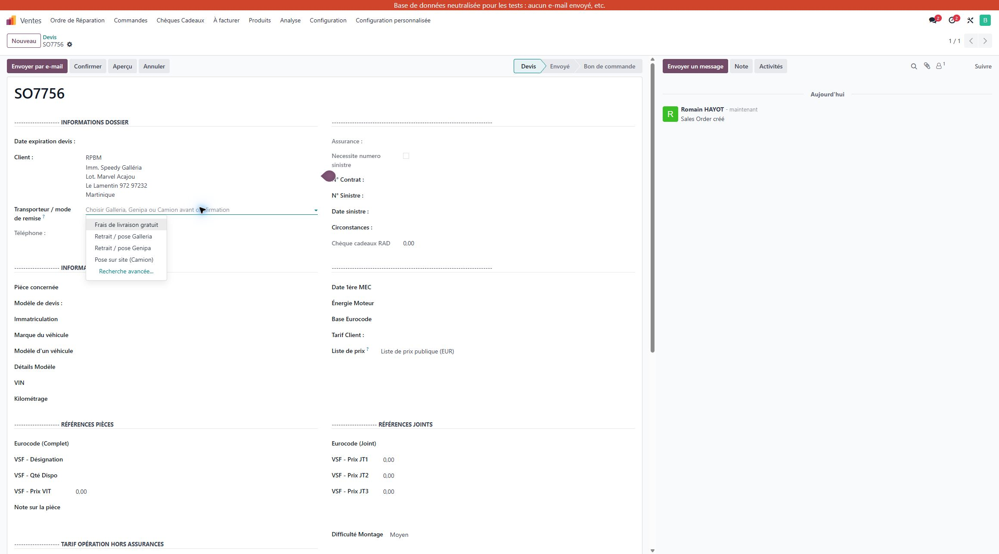
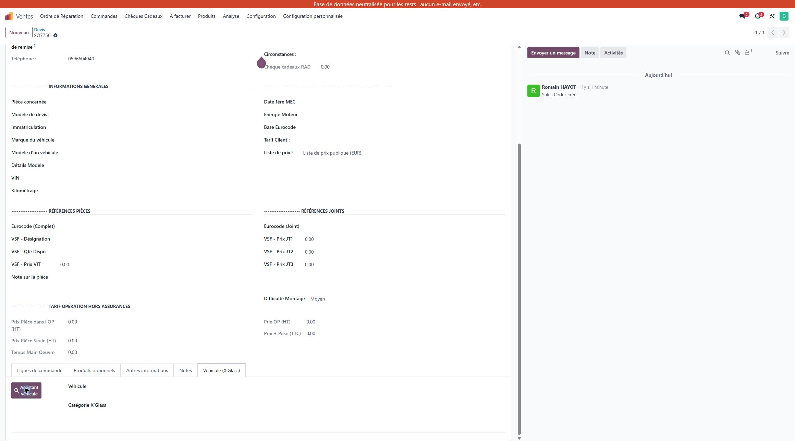

RPBM  /  PROJET ODOO

# Une pièce,
un parcours clair.

Nouvelle organisation logistique
et assistant véhicule & pièces

Identifier la pièce → Choisir le lieu de remise → Préparer et livrer

Document de validation et guide d’utilisation

Ce guide explique comment le module **rpbm_agent** aide à préparer un devis, et comment Odoo organise ensuite les achats, les déplacements de pièces et la remise au client.

> **Le geste indispensable du vendeur**  
> Choisir le **transporteur / mode de remise** sur chaque vente : Galleria, Genipa ou Camion. Ce choix détermine le parcours logistique.

Édition du 11 septembre 2026 · Préproduction RPBM

Organisation déployée pour essais. La validation du client et les essais restant à réaliser sont regroupés en fin de document. Ce guide ne vaut pas autorisation de démarrage en production.

| Pour décider | Pour travailler |
| --- | --- |
| Organisation et circuits : pages 2 à 7 | Assistant véhicule : pages 9 à 12 |
| Reprise du stock : page 8 | Résultats et validation : pages 13 et 14 |

01  /  RPBM - GUIDE CLIENT

# Ce que le projet change

Une même chaîne relie la recherche de la pièce, la vente et le mouvement physique.

---

| Jusqu’ici, selon la procédure existante | Avec l’organisation proposée |
| --- | --- |
| Ventes dans Odoo ; entrées et sorties principalement suivies dans des tableaux. | Un article et ses mouvements sont suivis dans Odoo, avec un emplacement d’origine et une destination. |
| Les couleurs du tableau signalent vendu, réservé ou cassé. | Une réservation, une livraison ou une mise au rebut matérialise chaque situation. |
| Le rapprochement entre ventes et sorties demande un contrôle régulier. | Les documents liés à la vente rendent visible ce qui reste à acheter, transférer ou remettre. |

## Deux briques qui se complètent

**L’assistant véhicule** recherche un véhicule et les pièces correspondantes dans X’Glass, puis les articles chez VSF. Il peut retrouver ou créer une fiche article et ajouter une ligne au devis.

**La gestion du stock** utilise les articles Odoo et le lieu de remise choisi sur la vente pour organiser les achats et déplacements nécessaires.

> **Un prix ou un article trouvé ne réserve pas une pièce**  
> La présence d’un article dans l’assistant ne signifie pas qu’il est disponible chez RPBM. L’ajout au devis ne fait pas sortir le stock. Les mouvements sont traités dans l’application Inventaire.

## La mise en place, vue côté client

1. Installer
l’assistant → 2. Organiser
les lieux → 3. Reprendre
le catalogue → 4. Compter
et tester

L’équipe de déploiement prépare l’installation et les accès fournisseurs. Les utilisateurs valident les parcours, les lieux physiques et les règles de travail. La reprise des quantités initiales reste une étape séparée.

02  /  RPBM - GUIDE CLIENT

# Un entrepôt Odoo, cinq sites

Les bâtiments restent distincts. Odoo les représente comme des zones d’une même organisation RPBM.

---

RPBM / Stock : Dépôts (Dépôt 1, Dépôt 2), Galleria, Genipa.
RPBM / Camion et RPBM / A controler sont hors de Stock.

## Ce que cette séparation permet

- **Galleria** sert ses ventes avec son stock, puis avec celui des deux dépôts. Elle ne prélève pas automatiquement à Genipa.

- **Genipa** suit la même règle avec son propre comptoir et les deux dépôts.

- Le **Camion** est chargé à partir des sites fixes. Une pièce déjà dans le camion ne peut pas être réservée automatiquement par une vente au comptoir.

- La zone **A controler** reste hors du circuit de réservation normal. **CASSE** sert à enregistrer les pièces mises au rebut, avec leur origine.

> **Le lieu réel reste à renseigner**  
> Le rack est la case physique où se trouve la pièce. Cette préproduction contient **179 emplacements au Dépôt 1 et 255 au Dépôt 2**. Deux fiches portent le nom **R101 au Dépôt 1** : faire lever cette ambiguïté avant le comptage initial.

03  /  RPBM - GUIDE CLIENT

# Vendeur : choisir le bon circuit

Sur la vente, le champ « Transporteur / mode de remise » est placé sous le client.

---

Capture de préproduction, cadrée sur le champ : choix du mode de remise, 11/09/2026.

| Choix à sélectionner | Conséquence |
| --- | --- |
| Retrait / pose Galleria | Pièce remise ou posée à Galleria. |
| Retrait / pose Genipa | Pièce remise ou posée à Genipa. |
| Pose sur site (Camion) | Chargement du camion, puis pose chez le client. |

**1.** Renseigner le client et les articles. **2.** Choisir le mode de remise convenu. **3.** Enregistrer le devis. **4.** Vérifier le choix avant de confirmer la vente.

> **Champ rétabli en préproduction ; à reprendre au déploiement**  
> Le champ était absent des vues de vente inspectées. Il a été ajouté et sa sauvegarde a été vérifiée sur le devis de démonstration. Le vendeur doit le renseigner : **aucun blocage automatique des ventes sans transporteur n’a été ajouté**.

Ne pas choisir l’ancien « Frais de livraison gratuit » pour ces trois circuits : il n’a aucune route associée. Une règle choisie exceptionnellement sur une ligne peut aussi prendre le dessus sur le transporteur ; faire contrôler ces exceptions par le référent.

Après confirmation, demander au référent de corriger le circuit si nécessaire : changer simplement le libellé ne suffit pas à refaire les documents déjà créés. Les prix de remise sont actuellement à 0 € ; le tarif de pose à domicile reste à confirmer.

04  /  RPBM - GUIDE CLIENT

# Remettre la pièce au comptoir

Le même fonctionnement s’applique à Galleria et à Genipa. Les exemples ci-dessous utilisent Galleria.

---

## Cas 1 · La pièce est disponible à Galleria

Galleria → Client
Un bon de livraison Galleria. La quantité doit être réellement disponible, hors réservations existantes.

À la confirmation de la vente, Odoo prépare la livraison depuis Galleria. L’équipe remet ou pose la pièce, renseigne la quantité réellement traitée et valide le bon correspondant.

## Cas 2 · La pièce est dans un dépôt

Dépôt 1 ou 2 → Galleria → Client
Un transfert vers Galleria, puis une livraison au client.

Le préparateur ouvre le transfert **Dépôts → Galleria**, contrôle le rack d’origine et déplace la pièce. Il valide le transfert lorsque le déplacement est effectué. Le comptoir traite ensuite la livraison client.

## Cas 3 · Il faut commander la pièce

Fournisseur → Dépôt 2 → Galleria → Client
Une demande de prix, puis trois documents de stock après confirmation de l’achat.

Si aucune quantité suffisante n’est disponible dans les lieux autorisés, Odoo peut préparer une demande de prix. L’acheteur vérifie le fournisseur, le prix et le délai, puis passe la commande selon la procédure habituelle. L’achat doit être possible pour cet article.

> **Lire les lignes pour savoir où prélever**  
> Le transfert automatique porte le nom **Dépôts → Galleria**, que la pièce vienne du Dépôt 1 ou du Dépôt 2. Le dépôt et le rack réels figurent dans les lignes de préparation. Le nom seul ne suffit pas.

05  /  RPBM - GUIDE CLIENT

# Préparer une pose chez le client

Le chargement et la pose sont deux événements différents, chacun avec son document.

---

Sites fixes
Dépôts / comptoirs → Camion
Pièces chargées → Client
Pièces posées

| Moment | Action de l’équipe |
| --- | --- |
| Avant le départ | Ouvrir « Chargement camion ». Contrôler les pièces et les racks d’origine. Réserver manuellement au moment de préparer le chargement. |
| Chargement effectué | Renseigner les quantités réellement embarquées et valider le chargement. Les pièces sont désormais localisées dans le camion. |
| Après l’intervention | Ouvrir « Pose sur site ». Renseigner et valider uniquement les quantités réellement remises ou posées. |
| Pièce non posée | La quantité restante reste à traiter. Organiser son retour vers le bon comptoir ou dépôt et enregistrer ce déplacement. |

## Une pièce oubliée dans le camion doit rester visible

Un reliquat est simplement **ce qui reste à faire**. Les opérations camion conservent automatiquement ce reste lorsque tout n’a pas été traité. Ne pas déclarer une pose terminée pour une pièce encore embarquée.

> **Le stock déjà embarqué ne sert pas de réserve générale**  
> Chaque nouvelle vente « Pose sur site (Camion) » déclenche une étape de chargement. La réutilisation d’une pièce restée dans le camion doit être organisée par le référent ; elle ne doit pas être supposée automatique.

Le circuit et les réservations manuelles sont configurés. Les essais complets de chargement, pose partielle, retour et réutilisation restent à réaliser avec l’équipe avant démarrage.

06  /  RPBM - GUIDE CLIENT

# Les autres mouvements du quotidien

Chaque déplacement réel doit laisser une trace dans le bon document Odoo.

---

| Situation | Marche à suivre |
| --- | --- |
| Réception fournisseur habituelle | L’achat automatique vise le Dépôt 2. Vérifier « Livrer à » sur l’achat avant confirmation. À réception, contrôler la référence et la quantité reçue. |
| Rangement au dépôt | Choisir le rack réel dans les opérations détaillées ou enregistrer le rangement vers ce rack. Aucun rack de réception précis n’est imposé automatiquement. |
| Dépôt 1 ↔ Dépôt 2, comptoir ↔ dépôt, Galleria ↔ Genipa | Dans Inventaire, créer un transfert avec le type correspondant à l’origine et à la destination. Contrôler les lieux, saisir les quantités, puis valider une fois le déplacement réalisé. |
| Retour du camion | Choisir le retour Camion → site réellement destinataire. La quantité redevient disponible dans ce site après traitement. |
| Pièce cassée | Enregistrer une mise au rebut vers CASSE depuis le lieu réel de la casse, y compris le camion. Ne pas simuler une livraison client. |
| Retour fournisseur | Partir de la réception concernée et utiliser le retour. Contrôler le fournisseur, l’origine et la quantité. Le retour de stock et l’éventuel avoir restent deux sujets à traiter. |

> **Livraison fournisseur directement au comptoir : essai à terminer**  
> L’acheteur peut choisir « Réception Galleria » ou « Réception Genipa » avant de confirmer l’achat. Mais un transfert vers ce comptoir peut déjà avoir été généré. **Faire contrôler la chaîne par le référent** : le traitement de ce transfert devenu inutile n’est pas encore validé en situation réelle.

Ne pas annuler un document lié à l’aveugle : cela peut affecter les mouvements suivants. Le fournisseur doit recevoir la bonne adresse par le canal de commande habituel ; vérifier le document imprimé si celui-ci est utilisé.

07  /  RPBM - GUIDE CLIENT

# Reprendre un stock fiable

Le catalogue décrit les articles. Le stock initial indique combien de pièces se trouvent réellement à chaque endroit.

---

| Déjà réalisé selon le compte rendu du 11/09 | Encore nécessaire avant démarrage |
| --- | --- |
| Import du catalogue : 3 229 références, 15 catégories et 30 fournisseurs issus du fichier de préparation. | Fournir et approuver un relevé daté : référence, quantité, lieu exact et état de chaque pièce. |
| 43 références douteuses exclues du catalogue importé. | Les corriger séparément si elles doivent être utilisées ; ne pas les recréer à l’aveugle. |
| Réorganisation des dépôts en préservant leurs racks existants. | Rapprocher les pièces physiques des emplacements et résoudre les cas inconnus. |
| Prix fournisseurs et coûts importés ; certains coûts restent à revoir. | Faire valider les prix de vente et les coûts manquants avant utilisation commerciale. |

## Comment préparer la bascule

- Fixer une date de comptage et une période pendant laquelle les mouvements sont arrêtés ou relevés séparément.

- Compter les pièces dans les dépôts, les comptoirs et le camion. Distinguer celles réservées, cassées ou à contrôler.

- Faire approuver les écarts, intégrer les quantités, puis contrôler quelques références de chaque site dans Odoo.

- Choisir la date à laquelle Odoo devient la référence des mouvements et désigner les personnes chargées du suivi.

> **Ne pas reprendre les anciennes couleurs comme des quantités fiables**  
> Les couleurs vendu / réservé / cassé du tableau ne sont pas conservées dans l’export CSV. Le modèle de fichier de stock initial est volontairement vide. L’import du catalogue ne prouve donc pas la reprise du stock physique.

Les volumes du catalogue ci-dessus viennent du dernier compte rendu d’import ; ils n’ont pas été recomptés article par article pour ce guide. Les quantités présentes en préproduction ne constituent pas un inventaire de démarrage.

08  /  RPBM - GUIDE CLIENT

# Ouvrir l’assistant véhicule

L’assistant est le bouton du module rpbm_agent. Il est accessible depuis une opportunité ou depuis son devis lié.

---

Capture de préproduction, cadrée sur l’onglet « Véhicule (X’Glass) » et le bouton « Assistant véhicule ».

## Le parcours conseillé

- Ouvrir le dossier client dans le CRM et vérifier le client concerné.

- Utiliser l’assistant dans ce dossier, ou ouvrir le devis associé à cette opportunité.

- Sur le devis, ouvrir l’onglet **Véhicule (X’Glass)**, puis cliquer sur **Assistant véhicule**.

> **L’onglet est absent sur un devis indépendant**  
> Le devis doit être lié à une opportunité. L’absence de cet onglet sur un devis sans opportunité est un comportement prévu du module. Repartir du dossier CRM ou faire vérifier le lien.

## La connexion aux fournisseurs doit être prête

L’ouverture de la fenêtre lance la connexion à X’Glass et VSF. L’équipe de déploiement doit avoir configuré les accès aux deux portails. Les utilisateurs ne doivent pas copier de mot de passe dans le dossier client.

> **État constaté pendant la préparation du guide**  
> Lors de la préparation, les quatre paramètres de connexion n’étaient pas encore présents sur la préproduction et l’ouverture est restée sur la connexion. Ils ont depuis été configurés ; l’authentification complète et les recherches sur les portails restent à rejouer.

Un seul utilisateur peut employer l’assistant à la fois avec les accès partagés actuels. Fermer la fenêtre après utilisation pour libérer la place.

09  /  RPBM - GUIDE CLIENT

# Identifier le véhicule et la pièce

Parcours prévu par le module ; à vérifier sur les portails une fois les accès configurés.

---

1. Véhicule → 2. Catégorie → 3. Pièce → 4. Article VSF

| Étape dans la fenêtre | Ce que vous faites et contrôlez |
| --- | --- |
| 1. Véhicule | Saisir ou vérifier l’immatriculation, puis cliquer sur « Rechercher ». Le premier résultat peut être sélectionné automatiquement : vérifier le modèle et la version. |
| Choix du véhicule | Choisir le bon véhicule. Si une alerte signale un conducteur différent du client, vérifier le dossier avant de poursuivre. « Voir » permet de consulter une fiche existante. |
| 2. Catégorie | Afficher les catégories du véhicule avec « Rechercher les Catégories », puis choisir le vitrage concerné. Vérifier aussi le champ « Pièce concernée », qui influence le calcul de pose existant. |
| 3. Pièce | Comparer les pièces proposées et sélectionner celle qui convient. Vérifier les caractéristiques et les éventuelles variantes avant de poursuivre. |
| 4. Article VSF | Une base Eurocode, c’est-à-dire le début de la référence vitrage, peut être proposée. La vérifier ; si nécessaire la saisir, puis utiliser « Rechercher sur VSF ». |

## La sélection automatique ne remplace pas votre contrôle

Le véhicule, une catégorie ou le début de référence peuvent être repris du dossier ou déduits par l’assistant. Vérifier la compatibilité avec le véhicule réel : vitrage, options, capteurs, dimensions et accessoires nécessaires.

> **Aucun résultat ?**  
> Vérifier d’abord l’immatriculation et le choix du véhicule. Pour la recherche article, vérifier la référence. Une panne du portail et une recherche sans résultat sont deux situations différentes : ne pas conclure trop vite que la pièce n’existe pas.

10  /  RPBM - GUIDE CLIENT

# Choisir un article et l’ajouter au devis

Le choix d’une référence VSF et son ajout au devis sont deux actions distinctes.

---

Sélectionner
l’article VSF → Retrouver ou créer
la fiche Odoo → Ajouter au devis

| Ce qui est affiché | Ce que cela signifie |
| --- | --- |
| Prix / Coût | Informations fournies par le parcours VSF. Vérifier ensuite le prix final de la ligne de devis, calculé avec les règles commerciales existantes. |
| En stock / Indisponible | Disponibilité présentée par VSF. **Ce n’est pas le stock physique RPBM** ni une promesse de délai de réception. |
| Voir le produit | Une fiche Odoo a été retrouvée. L’assistant indique le critère utilisé : référence, Eurocode ou nom. Vérifier qu’il s’agit bien du même article. |
| Créer le produit | Aucune fiche correspondante n’a été trouvée. Créer la fiche seulement après vérification ; cela ne crée aucune quantité en stock. |
| Ajouter au devis | Ajoute une ligne de quantité 1. Contrôler la quantité, la référence, la description et le prix dans le devis. |
| Articles suggérés | Les accessoires ne sont pas ajoutés automatiquement. Sélectionner et ajouter séparément ceux qui sont nécessaires. |

Cliquer sur une image pour l’agrandir lorsque cette possibilité est proposée. Le lien **Fiche technique** permet de consulter les détails de l’article.

> **Éviter les doublons dans le devis**  
> « Article déjà présent dans le devis » signifie qu’une ligne existe déjà. « Retirer du devis » n’est disponible que pour une ligne ajoutée par cette fenêtre pendant la session en cours. Une ligne existante se corrige dans le devis.

Sur une opportunité CRM, la confirmation prépare les informations du dossier. L’ajout de lignes décrit ici concerne le widget ouvert depuis une vente.

11  /  RPBM - GUIDE CLIENT

# Enregistrer et reprendre son travail

Les boutons de la fenêtre assistant ne confirment pas la commande client.

---

| Bouton | Effet attendu |
| --- | --- |
| Confirmer, dans l’assistant | Reporte les informations sélectionnées dans le formulaire. Il reste à enregistrer ce formulaire. |
| Confirmer et enregistrer | Reporte les informations puis enregistre le dossier ou le devis. |
| Annuler ou fermer la fenêtre | Quitte la recherche. Ne pas l’utiliser comme une annulation générale : une fiche créée ou une ligne déjà ajoutée peut nécessiter un contrôle séparé. |
| Confirmer, sur la vente | Valide commercialement la vente et peut déclencher les documents logistiques. Vérifier les articles et le transporteur avant ce clic. |

## Les contrôles de fin de saisie

Vérifier le client, le véhicule, la pièce concernée et la référence complète. Relire les lignes ajoutées, les quantités et les prix. Choisir le transporteur / mode de remise et enregistrer le devis.

## Si l’assistant ne répond pas comme prévu

| Message ou situation | Réflexe |
| --- | --- |
| Assistant utilisé par une autre personne | Attendre qu’elle termine et ferme sa fenêtre. Éviter les connexions concurrentes aux portails partagés. |
| Session expirée / Reconnecter | Utiliser « Reconnecter » si proposé. Vérifier le contexte restauré avant de poursuivre. |
| Connexion bloquée ou refusée | Faire vérifier les accès et la disponibilité des portails par le référent. Ne pas multiplier les créations ou les confirmations. |
| Onglet ou bouton introuvable | Vérifier l’opportunité liée, l’installation du module et les droits du compte utilisateur. |

Le verrou d’utilisation expire après 15 minutes sans activité prévue par le module. Une panne du portail ou du réseau peut demander une intervention ; attendre ne corrige pas un problème d’accès.

12  /  RPBM - GUIDE CLIENT

# Ce qui a été vérifié

Les résultats ci-dessous concernent la préproduction contrôlée le 11 septembre 2026.

---

| Contrôle | Résultat et portée |
| --- | --- |
| Module rpbm_agent | Version 17.0.260730.6 observée sur la cible lors du contrôle ; la version source actuelle est 17.0.260911.1. Bouton visible sur un devis lié à une opportunité. |
| Organisation logistique | Un entrepôt RPBM ; trois routes métier, 34 types d’opération, six règles métier et une règle de rangement vers le Dépôt 2. |
| Contrôle structurel rejoué | 53 entrées : **50 conformes, 2 observations, 1 essai non réalisé**. Aucune anomalie ou alerte parmi les contrôles exécutés. |
| Transporteur sur la vente | Champ rétabli, liste des choix vérifiée dans Chrome et valeur Galleria sauvegardée puis relue sur le devis de démonstration. |
| Essais du dernier commit | T1 : livraison Galleria générée avec stock au comptoir. T3 : en rupture, achat préparé vers le Dépôt 2, transfert et livraison en attente. Résultats issus du compte rendu du lancement précédent. |
| Recherche X’Glass et VSF | Les paramètres ont été configurés après ce contrôle ; l’authentification et la recherche de bout en bout restent à valider. |

> **La recette logistique n’est pas encore complète**  
> Les tests T1 et T3 n’ont pas validé physiquement une réception, un transfert ou une livraison. Les cas Genipa, camion, retour, casse, réception directe au comptoir et quantités partielles restent à éprouver avec les utilisateurs.

La présence des routes ne garantit pas tous les cas particuliers : disponibilité insuffisante, autres réservations, article nouvellement créé ou absence de fournisseur. Le référent doit vérifier l’achat automatique pour les articles concernés.

Les anciennes routes et l’ancien mode gratuit sont encore présents. Les résultats du contrôle structurel ne valent pas validation de leur usage.

13  /  RPBM - GUIDE CLIENT

# Validation du client et démarrage

À compléter ensemble, en distinguant l’accord sur l’organisation et l’autorisation de démarrage.

---

| Décision à consigner | Accord / réserve / responsable |
| --- | --- |
| Accepter les cinq sites regroupés dans un entrepôt Odoo, avec le camion à part. | ________________________________ |
| Accepter le stock séparé des comptoirs, les dépôts communs et les transferts automatiques regroupés. | ________________________________ |
| Organiser le choix du transporteur sur toutes les ventes et le traitement des oublis. | ________________________________ |
| Nommer les personnes qui achètent, réceptionnent, rangent, transfèrent, livrent et traitent les écarts. | ________________________________ |
| Valider le tarif « Pose à domicile », actuellement à 0 €, et le traitement des exceptions. | ________________________________ |
| Fixer le comptage initial, le traitement des pièces à contrôler et la date de bascule. | ________________________________ |

## Conditions à lever avant utilisation réelle

Rejouer et valider les accès X’Glass/VSF ; réaliser les cas métier restants ; vérifier les droits avec un vendeur et un magasinier ; intégrer puis contrôler le stock initial ; reprendre la visibilité du transporteur sur la cible de production.

**Décision :** accord sur l’organisation / accord avec réserves / à revoir
**Nom et fonction :** __________________________________________
**Date et signature :** _________________________________________

Un accord sur l’organisation n’efface pas les réserves de recette. Le lancement opérationnel fera l’objet d’une décision distincte une fois les conditions levées.

## Origine du document

Sources : commit de recette 08b6b1d et commit de configuration rpbm_agent e6c7364 du dépôt RPBM ; compte rendu « module et architecture » du 11/09/2026 ; dossier Gestion Stock ; code et documentation fonctionnelle de rpbm_agent ; lectures MCP et captures Chrome du 11/09/2026. Les anciens documents de cadrage sont interprétés avec les amendements du dernier compte rendu.

Préproduction : rpbm-pre-prod-37860002.dev.odoo.com. Les notes de vérification, captures et sources reproductibles de cette édition se trouvent dans Jobs/rpbm_agent_stock/documentation.
