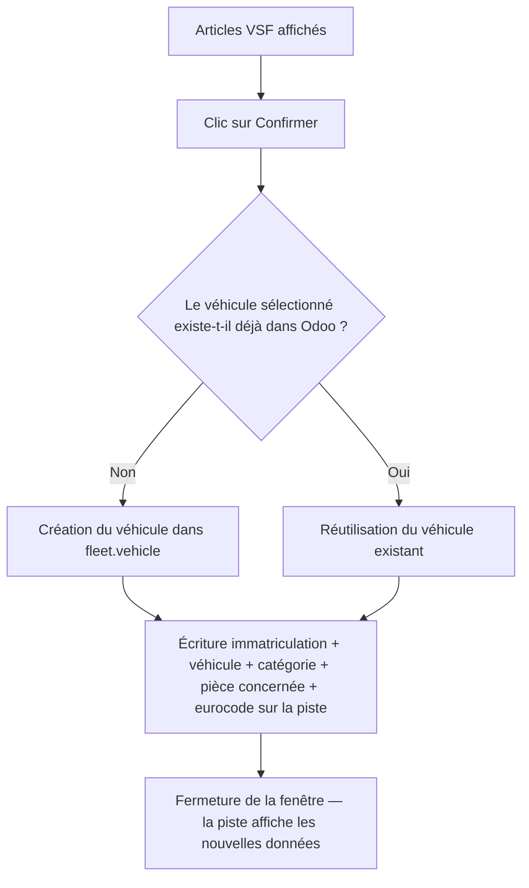
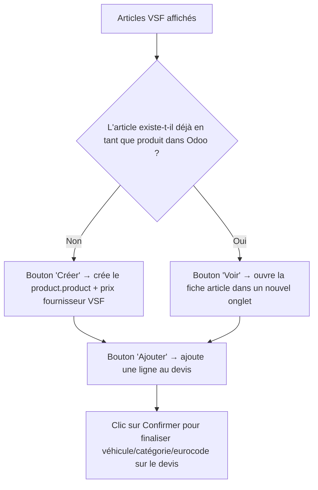

# Parcours utilisateur

## Point d'entrée

Le widget `rpbm_agent_widget` est une icône loupe (🔍) ajoutée par les vues versionnées du module (`views/crm_lead_views.xml`, `views/sale_order_views.xml` — voir [configuration](../technique/configuration.md#intégration-dans-les-vues)) sur **Piste/Opportunité** (`crm.lead`) et **Ordre de Vente** (`sale.order`). Un clic ouvre une fenêtre de dialogue qui pilote toute la recherche.

> Le comportement dépend du modèle sur lequel le widget est placé : voir [Finalisation](#finalisation-selon-le-modèle) plus bas pour les différences entre Piste/Opportunité et Ordre de Vente.

## Recherche et sélection (commun aux deux modèles)

Notes :
- Le premier véhicule de la liste est **sélectionné automatiquement** dès que la recherche renvoie des résultats.
- Si le conducteur (`driver_id`) du véhicule déjà présent dans Odoo diffère du client de l'enregistrement en cours, une alerte s'affiche.
- Si le champ "Catégorie X'Glass" est déjà renseigné sur l'enregistrement, la catégorie correspondante est présélectionnée automatiquement dès que la planche est chargée.
- La recherche VSF se relance automatiquement dès que le champ Eurocode change (saisie manuelle ou déduction automatique).

> ⚠️ Le diagramme visuel existant (`Readme.png`, généré via draw.io) libellait par erreur cette étape "Recherche du véhicule sur VSF" — la recherche véhicule se fait bien sur **X'Glass** ; VSF n'intervient qu'à l'étape de recherche par eurocode. Corrigé ci-dessus.

## Finalisation selon le modèle

### Piste / Opportunité (`crm.lead`)

Champs écrits sur la piste (mise à jour en mémoire du formulaire, sauvegardés au clic sur "Enregistrer" — ou immédiatement via "Confirmer et enregistrer") : immatriculation, véhicule lié, catégorie X'Glass, Pièce concernée, Base Eurocode — détail exact des champs et de leurs conditions d'écriture dans [6 — Confirmation sur Piste/Opportunité](workflow/06-confirmation-crm-lead.md).

### Ordre de Vente (`sale.order`)

En plus du flux véhicule/catégorie/eurocode ci-dessus (identique), chaque article VSF affiché propose des actions supplémentaires :

Champs/actions spécifiques à l'Ordre de Vente : immatriculation, véhicule lié, catégorie X'Glass, Pièce concernée, Base Eurocode — détail dans [7 — Confirmation sur Ordre de Vente](workflow/07-confirmation-sale-order.md). Le notebook du widget est masqué sur un devis sans opportunité liée. L'ajout au devis (`addToSaleOrder`) est **indépendant** du bouton "Confirm" de la fenêtre — on peut ajouter plusieurs articles avant de confirmer ; détail de la création de produit dans [9 — Création du produit](workflow/09-creation-produit.md).

## Prérequis avant utilisation

### Paramètres système

À créer dans `Réglages > Technique > Paramètres > Paramètres système` (`ir.config_parameter`) :

| Clé | Rôle |
|---|---|
| `XGLASS_USER` | Identifiant du portail X'Glass |
| `XGLASS_PASS` | Mot de passe du portail X'Glass |
| `VSF_LOGIN` | Identifiant du portail VSF |
| `VSF_PASSWORD` | Mot de passe du portail VSF |

### Champs Odoo Studio à créer

Les champs `x_studio_*` requis par le widget sont créés automatiquement à l'installation par `pre_init_hook` (voir [configuration technique](../technique/configuration.md#champs-odoo-studio-requis)). Inventaire complet par modèle (nom, type, rôle, champs obsolètes, structure des 3 champs Eurocode sur `crm.lead`) : [technique/champs/](../technique/champs/README.md).
