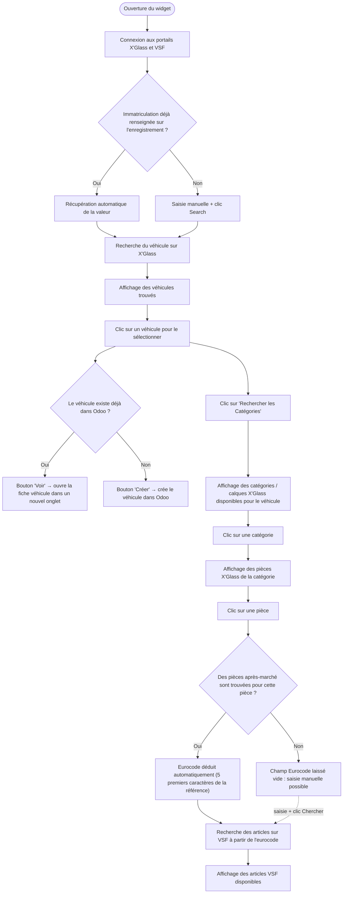
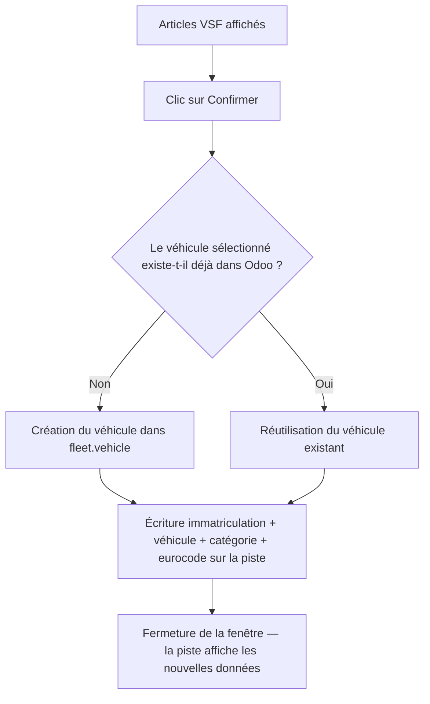
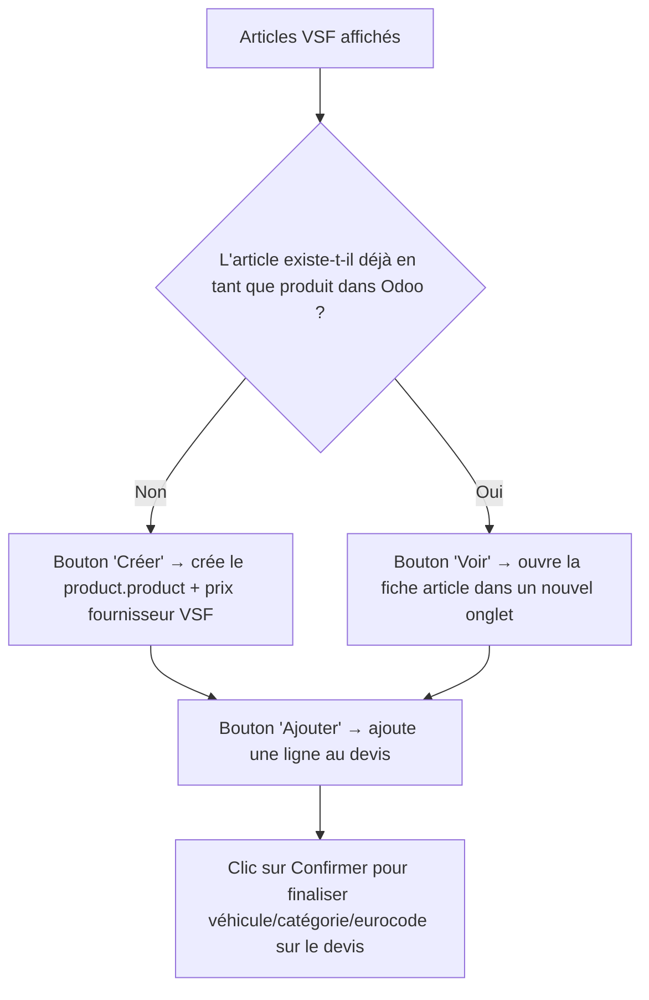

# Parcours utilisateur

## Point d'entrée

Le widget `rpbm_agent_widget` est une icône loupe (🔍) placée manuellement (via Odoo Studio) sur une vue formulaire — aujourd'hui utilisé sur **Piste/Opportunité** (`crm.lead`) et **Ordre de Vente** (`sale.order`). Un clic ouvre une fenêtre de dialogue qui pilote toute la recherche.

> Le comportement dépend du modèle sur lequel le widget est placé : voir [Finalisation](#finalisation-selon-le-modèle) plus bas pour les différences entre Piste/Opportunité et Ordre de Vente.

## Recherche et sélection (commun aux deux modèles)

Notes :
- Le premier véhicule de la liste est **sélectionné automatiquement** dès que la recherche renvoie des résultats.
- Si le conducteur (`driver_id`) du véhicule déjà présent dans Odoo diffère du client de l'enregistrement en cours, une alerte s'affiche.
- Si le champ "Catégorie X'Glass" est déjà renseigné sur l'enregistrement, la catégorie correspondante est présélectionnée automatiquement dès que la planche est chargée.
- La recherche VSF se relance automatiquement dès que le champ Eurocode change (saisie manuelle ou déduction automatique).

> ⚠️ Le diagramme visuel existant (`Readme.png`, généré via draw.io) libellait par erreur cette étape "Recherche du véhicule sur VSF" — la recherche véhicule se fait bien sur **X'Glass** ; VSF n'intervient qu'à l'étape de recherche par eurocode. Corrigé ci-dessus.

## Finalisation selon le modèle

### Piste / Opportunité (`crm.lead`)

Champs écrits sur la piste (mise à jour en mémoire du formulaire, sauvegardés au clic sur "Enregistrer" comme tout formulaire Odoo standard) :
- `x_studio_field_NVioD` (immatriculation)
- `x_studio_vehicle_id` (véhicule lié)
- `x_studio_categorie_xglass`
- `x_studio_base_eurocode` — ⚠️ nom utilisé par le code (`AbstractWidgetRecord.baseEurocodeField`, `utils.js:26`), mais ce champ **n'existe pas** sur `crm.lead` ; le vrai champ "Base Eurocode" existant en base s'appelle `x_studio_field_ORIyy` (voir [structure Eurocode](#structure-des-champs-eurocode-sur-crmlead) ci-dessous). Contrairement à `immatriculationField`, `baseEurocodeField` n'est pas surchargé par modèle — l'écriture d'eurocode échoue donc aujourd'hui quand le widget est placé sur une Piste/Opportunité.

### Ordre de Vente (`sale.order`)

En plus du flux véhicule/catégorie/eurocode ci-dessus (identique), chaque article VSF affiché propose des actions supplémentaires :

Champs/actions spécifiques à l'Ordre de Vente :
- Champ immatriculation : `x_studio_immatriculation_`
- L'ajout au devis (`addToSaleOrder`) est **indépendant** du bouton "Confirm" de la fenêtre — on peut ajouter plusieurs articles avant de confirmer.
- Lors de la création d'un article (`Créer`), Odoo enregistre :
  - un `product.product` : nom, référence (`default_code`), prix de vente, référence constructeur, image, description (lien vers la fiche VSF)
  - un `product.supplierinfo` associé (fournisseur VSF, prix d'achat remisé RPBM)

## Prérequis avant utilisation

### Paramètres système

À créer dans `Réglages > Technique > Paramètres > Paramètres système` (`ir.config_parameter`) :

| Clé | Rôle |
|---|---|
| `XGLASS_USER` | Identifiant du portail X'Glass |
| `XGLASS_PASS` | Mot de passe du portail X'Glass |
| `VSF_LOGIN` | Identifiant du portail VSF |
| `VSF_PASSWORD` | Mot de passe du portail VSF |

### Champs Odoo Studio à créer

Le module ne déclare aucun modèle ni vue (voir [architecture](../technique/architecture.md)) : ces champs doivent être créés manuellement via Odoo Studio avant utilisation.

**Véhicule — `fleet.vehicle`**
| Champ | Rôle |
|---|---|
| `x_studio_detail_model` | Détail du modèle (ex : `KIA PICANTO III PHASE 2 - 5P 2020-09-> 1.2i 85`) |
| `x_studio_date_mec` | Date de mise en circulation |
| `x_studio_autre_infos` | Autres informations (non utilisé actuellement) |
| `x_studio_note` | Champ HTML calculé affichant un résumé du véhicule |

**Piste / Opportunité — `crm.lead`**
| Champ | Rôle |
|---|---|
| `x_studio_field_NVioD` | Immatriculation — champ historique conservé (lié aux factures/commandes), rendu calculé à partir du véhicule lié |
| `x_studio_field_KyCjB` / `x_studio_field_ZhaeY` | Marque/modèle véhicule — **obsolètes** (marqués `[Obsolète]`), non fiables historiquement (doublons, créations sauvages) |
| `x_studio_vehicle_id` | Many2one vers `fleet.vehicle` |
| `x_studio_categorie_xglass` | Catégorie X'Glass sélectionnée (ex : Pare-brise) |
| `x_studio_field_ORIyy` ("Base Eurocode") | Voir [structure des champs Eurocode](#structure-des-champs-eurocode-sur-crmlead) ci-dessous |
| `x_studio_field_NwRik` ("Eurocode (Complet)") | idem |
| `x_studio_eurocode_joint` ("Eurocode (Joint)") | idem |

**Ordre de vente — `sale.order`**
| Champ | Rôle |
|---|---|
| `x_studio_vehicle_id` | Many2one vers `fleet.vehicle`, lié à celui de la piste |
| `x_studio_categorie_xglass` | Lié à celui de la piste |
| `x_studio_base_eurocode` | Champ `related` → `opportunity_id.x_studio_field_ORIyy` (le nom technique diffère de celui de la piste) |
| `x_studio_eurocode_joint` | Champ `related` → `opportunity_id.x_studio_eurocode_joint` |

Détails d'installation complets : [configuration technique](../technique/configuration.md).

#### Structure des champs Eurocode sur `crm.lead`

Trois champs Eurocode distincts coexistent sur la Piste/Opportunité, correspondant à trois étapes du travail des utilisateurs (indépendamment du widget, cette convention préexiste à `rpbm_agent`) :

1. **Base Eurocode** (`x_studio_field_ORIyy`) — les 5 premiers caractères de l'eurocode, saisis/déduits pour préfiltrer les articles VSF. C'est ce champ que le widget lit/écrit pour la recherche par eurocode (cf. [recherche et sélection](#recherche-et-sélection-commun-aux-deux-modèles)).
2. **Eurocode (Complet)** (`x_studio_field_NwRik`) — l'eurocode complet, renseigné une fois la pièce exacte trouvée et la sélection confirmée par l'utilisateur.
3. **Eurocode (Joint)** (`x_studio_eurocode_joint`) — renseigné en plus si un joint est nécessaire pour la pose de la pièce.

Le code du widget (`baseEurocodeField` dans `utils.js`) cible aujourd'hui `x_studio_base_eurocode`, qui n'existe que sur `sale.order` (en tant que champ `related`) et pas sur `crm.lead` — voir l'avertissement dans la section [Finalisation](#piste--opportunité-crmlead) ci-dessus.
