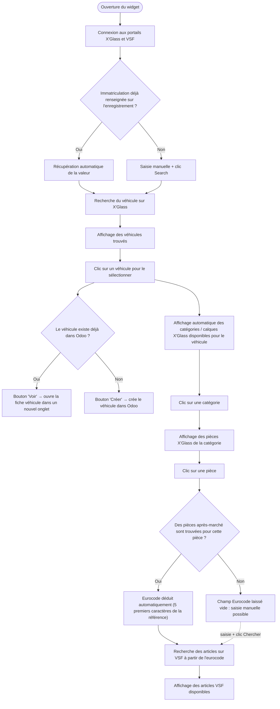
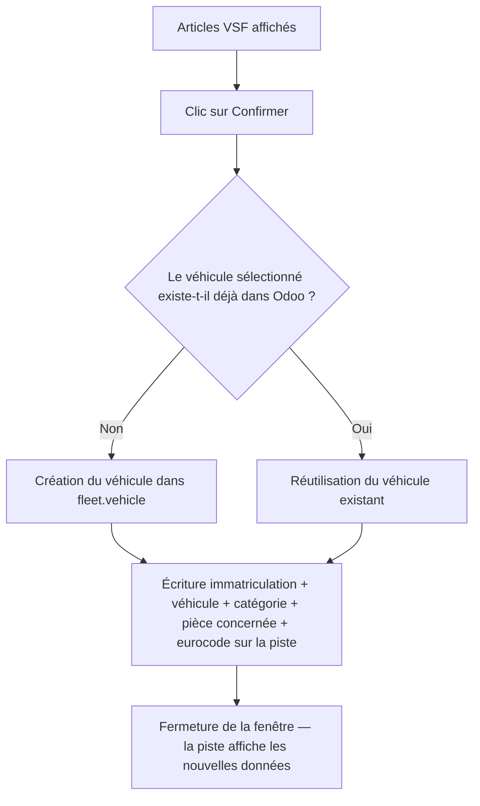
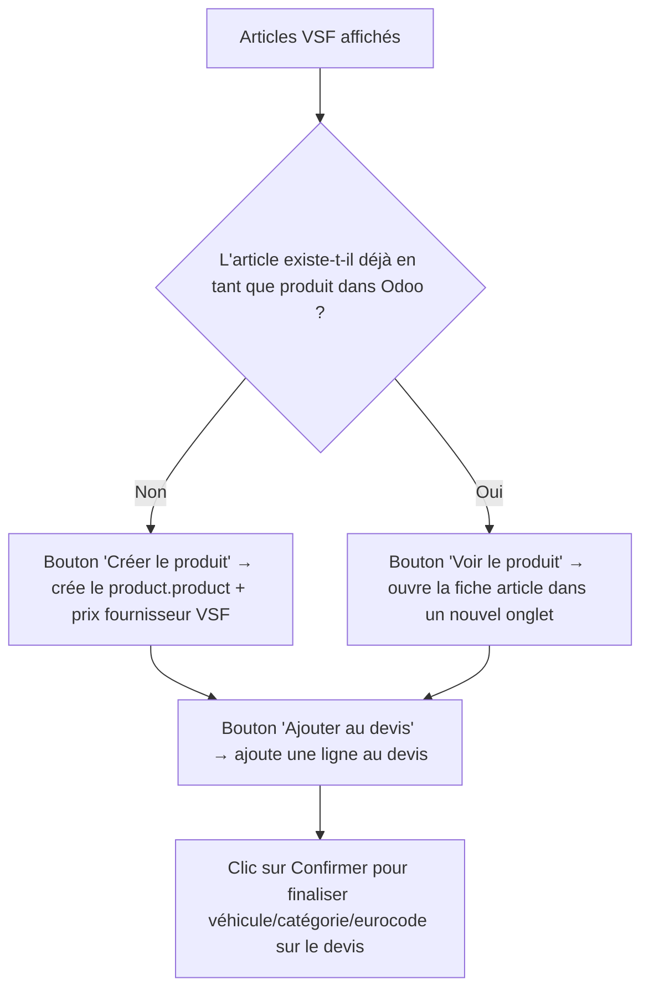

# Parcours utilisateur

## Point d'entrée

Le widget `rpbm_agent_widget` est une icône loupe (🔍) ajoutée par les vues versionnées du module (`views/crm_lead_views.xml`, `views/sale_order_views.xml` — voir [configuration](../technique/configuration.md#intégration-dans-les-vues)) sur **Piste/Opportunité** (`crm.lead`) et **Ordre de Vente** (`sale.order`). Un clic ouvre une fenêtre de dialogue qui pilote toute la recherche.

> Le comportement dépend du modèle sur lequel le widget est placé : voir [Finalisation](#finalisation-selon-le-modèle) plus bas pour les différences entre Piste/Opportunité et Ordre de Vente.

## Recherche et sélection (commun aux deux modèles)

Notes :
- Le premier véhicule de la liste est **sélectionné automatiquement** dès que la recherche renvoie des résultats.
- Si le conducteur (`driver_id`) du véhicule déjà présent dans Odoo diffère du client de l'enregistrement en cours, une alerte s'affiche.
- Si le champ "Catégorie X'Glass" est déjà renseigné sur l'enregistrement, la catégorie correspondante est présélectionnée automatiquement dès que la planche est chargée.
- La recherche VSF se relance automatiquement dès que le champ Eurocode change (saisie manuelle ou déduction automatique).

> ⚠️ L'ancien diagramme draw.io (source archivée dans [`_archive/Readme.drawio`](../_archive/Readme.drawio)) libellait par erreur cette étape "Recherche du véhicule sur VSF" — la recherche véhicule se fait bien sur **X'Glass** ; VSF n'intervient qu'à l'étape de recherche par eurocode. Les diagrammes Mermaid de ce dossier font foi.

## Finalisation selon le modèle

### Piste / Opportunité (`crm.lead`)

Champs écrits sur la piste (mise à jour en mémoire du formulaire, sauvegardés au clic sur "Enregistrer" — ou immédiatement via "Confirmer et enregistrer") : immatriculation, véhicule lié, catégorie X'Glass, Pièce concernée, Base Eurocode et, lorsque les données Fleet sont déterministes, les champs historiques véhicule (marque, modèle, VIN, énergie, détail modèle et date MEC). Une source vide, ambiguë ou non autorisée avertit sans bloquer ; détail exact dans [6 — Confirmation sur Piste/Opportunité](workflow/06-confirmation-crm-lead.md).

### Ordre de Vente (`sale.order`)

En plus du flux véhicule/catégorie/eurocode ci-dessus (identique), chaque article VSF affiché propose des actions supplémentaires :

Champs/actions spécifiques à l'Ordre de Vente : immatriculation, véhicule lié, catégorie X'Glass, Pièce concernée, Base Eurocode et miroirs historiques véhicule lorsque l'opportunité est liée. Le notebook du widget est masqué sur un devis sans opportunité liée. Le champ natif `carrier_id` (« Transporteur / mode de remise ») est visible sous le client ; il peut être prérempli depuis le lieu historique du CRM sur un nouveau devis et doit être renseigné avant la confirmation standard de la vente. L'ajout au devis (`addArticleToSaleOrder`) est **indépendant** du bouton « Confirmer » de la fenêtre — on peut ajouter plusieurs articles avant de confirmer ; détail dans [7 — Confirmation sur Ordre de Vente](workflow/07-confirmation-sale-order.md) et [9 — Création du produit](workflow/09-creation-produit.md).

### Main-d'œuvre X'Glass sur devis

Après la sélection d'une pièce, le widget affiche les opérations X'Glass et
leurs durées. Le vendeur coche les opérations à facturer puis les ajoute : une
ligne de service est créée par opération, avec la quantité en heures indiquée
par X'Glass. Le prix et les taxes sont ceux du produit Odoo, jamais un calcul du
widget : T1 → produit 24, T2 → 23, T3 → 113. Une opération sans durée positive,
sans identifiant ou sans taux reconnu reste non ajoutable et explique le motif.

Les lignes portent une provenance X'Glass persistante : à la réouverture, une
opération déjà ajoutée est reconnue et peut être retirée sans toucher aux lignes
manuelles. Le champ Studio agrégé de temps et le produit « Pose à Domicile » ne
participent pas à ce flux.

## Prérequis avant utilisation

### Paramètres système

Les identifiants portails se saisissent dans `Réglages > Paramètres généraux > Intégrations > Accès catalogues X'Glass / VSF` (groupe technique), ou directement dans `Réglages > Technique > Paramètres > Paramètres système` (`ir.config_parameter`) :

| Clé | Rôle |
|---|---|
| `XGLASS_USER` | Identifiant du portail X'Glass |
| `XGLASS_PASS` | Mot de passe du portail X'Glass |
| `VSF_LOGIN` | Identifiant du portail VSF |
| `VSF_PASSWORD` | Mot de passe du portail VSF |

Paramètres optionnels (`rpbm_agent.vsf_partner_id`, `rpbm_agent.vsf_discount`, `rpbm_agent.labor_product_t1/t2/t3`) : voir [configuration technique](../technique/configuration.md#paramètres-système-requis).

### Champs Odoo Studio à créer

Aucun champ Studio n'est à créer : le module déclare ses champs natifs `rpbm_*` et, si des champs Studio historiques existent, les alimente en double (voir [configuration technique](../technique/configuration.md#champs-natifs-et-champs-studio-historiques)). Inventaire par modèle : [technique/champs/](../technique/champs/README.md).

## Réouverture du dialogue et mémorisation des pièces

La confirmation mémorise la catégorie X’Glass, la base Eurocode et les identifiants
de la pièce X’Glass, de la pièce OE et de la pièce après-marché. À la réouverture,
le dialogue restaure ces choix et réduit les listes à la sélection existante.
Les boutons « Afficher les autres » rendent les listes complètes disponibles pour
une modification volontaire. Un second clic sur la pièce sélectionnée efface les
sélections dépendantes, la base Eurocode et les résultats VSF.
