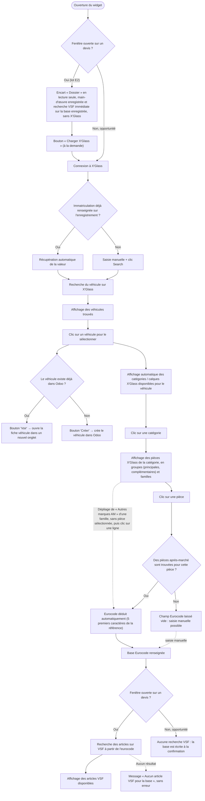
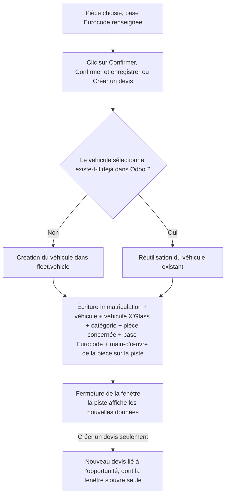

# Parcours utilisateur

## Point d'entrée

Le widget `rpbm_agent_widget` est une icône loupe (🔍) présente sur **Piste/Opportunité** (`crm.lead`) et **Ordre de Vente** (`sale.order`, si une opportunité est liée), à deux endroits qui ouvrent la même fenêtre : l'onglet « Véhicule (X'Glass) » ajouté par les vues versionnées du module (`views/crm_lead_views.xml`, `views/sale_order_views.xml`), et les sections Studio habituelles (« Informations Véhicule » de l'opportunité, groupe sous l'en-tête du devis), où le script `studio_views.py` l'ajoute avec les champs natifs (voir [configuration](../technique/configuration.md#intégration-dans-les-vues)). Un clic ouvre une fenêtre de dialogue en plein écran qui pilote toute la recherche ; son en-tête et ses boutons (« Confirmer », « Confirmer et enregistrer », « Annuler ») restent visibles quand le contenu défile.

> Le comportement dépend du modèle sur lequel le widget est placé : voir [Finalisation](#finalisation-selon-le-modèle) plus bas pour les différences entre Piste/Opportunité et Ordre de Vente. L'opportunité s'arrête à la base Eurocode et crée le devis (« Créer un devis ») ; le devis cherche les articles VSF.

## Recherche et sélection (commun aux deux modèles)

```mermaid
flowchart TD
    A([Ouverture du widget]) --> A1{Fenêtre ouverte sur un devis ?}
    A1 -->|"Oui (lot E2)"| A2["Encart « Dossier » en lecture seule, main-d'œuvre enregistrée et recherche VSF immédiate sur la base enregistrée, sans X'Glass"]
    A2 --> A3["Bouton « Charger X'Glass » (à la demande)"]
    A3 --> B
    A1 -->|"Non, opportunité"| B[Connexion à X'Glass]
    B --> C{Immatriculation déjà renseignée sur l'enregistrement ?}
    C -->|Oui| D[Récupération automatique de la valeur]
    C -->|Non| E[Saisie manuelle + clic Search]
    D --> F[Recherche du véhicule sur X'Glass]
    E --> F
    F --> G[Affichage des véhicules trouvés]
    G --> H[Clic sur un véhicule pour le sélectionner]
    H --> I{Le véhicule existe déjà dans Odoo ?}
    I -->|Oui| J["Bouton 'Voir' → ouvre la fiche véhicule dans un nouvel onglet"]
    I -->|Non| K["Bouton 'Créer' → crée le véhicule dans Odoo"]
    H --> M[Affichage automatique des catégories / calques X'Glass disponibles pour le véhicule]
    M --> N[Clic sur une catégorie]
    N --> O["Affichage des pièces X'Glass de la catégorie, en groupes (principales, complémentaires) et familles"]
    O --> P[Clic sur une pièce]
    O -.->|"Dépliage de « Autres marques AM » d'une famille, sans pièce sélectionnée, puis clic sur une ligne"| R
    P --> Q{Des pièces après-marché sont trouvées pour cette pièce ?}
    Q -->|Oui| R["Eurocode déduit automatiquement (5 premiers caractères de la référence)"]
    Q -->|Non| S["Champ Eurocode laissé vide : saisie manuelle possible"]
    R --> BE[Base Eurocode renseignée]
    S -.->|saisie manuelle| BE
    BE --> T{Fenêtre ouverte sur un devis ?}
    T -->|Oui| T1[Recherche des articles sur VSF à partir de l'eurocode]
    T1 --> U[Affichage des articles VSF disponibles]
    T1 -.->|"Aucun résultat"| U0["Message « Aucun article VSF pour la base », sans erreur"]
    T -->|"Non, opportunité"| T2["Aucune recherche VSF : la base est écrite à la confirmation"]
```

Notes :
- Le véhicule X'Glass mémorisé sur le dossier (`rpbm_xglass_vehicle_id`) est **sélectionné automatiquement** s'il figure dans les résultats ; sinon, c'est le premier véhicule de la liste, dès que la recherche renvoie des résultats.
- Si le conducteur (`driver_id`) du véhicule déjà présent dans Odoo diffère du client de l'enregistrement en cours, une alerte s'affiche.
- Les pièces de la catégorie sont présentées comme sur le portail : « Pièces principales » puis « Pièces complémentaires », chacune découpée en familles X'Glass, dans l'ordre du portail. Sous chaque famille, l'encart « Autres marques AM » est replié ; il se charge au dépliage, sans qu'une pièce soit sélectionnée. Un clic sur l'une de ses lignes renseigne l'eurocode (et lance la recherche VSF sur le devis), quelle que soit la famille (détail : [3](workflow/03-categorie-xglass.md) et [4](workflow/04-piece-piece-am.md)).
- Si le champ "Catégorie X'Glass" est déjà renseigné sur l'enregistrement, la catégorie correspondante est présélectionnée automatiquement dès que la planche est chargée.
- Sur le devis, la recherche VSF part **dès l'ouverture** sur la base enregistrée, sans attendre X'Glass, puis se relance automatiquement dès que le champ Eurocode change (saisie manuelle ou déduction automatique) ; l'opportunité n'a ni recherche VSF ni tableau. « Charger X'Glass » lance ensuite la chaîne ci-dessus (véhicule, catégorie, pièce, main-d'œuvre fraîche) sans vider le tableau ni la sélection (détail : [7](workflow/07-confirmation-sale-order.md#devis-sans-xglass-lot-e2)).
- Sur le devis, une base sans résultat (inexistante ou mal formée) n'est pas une erreur : la section affiche « Aucun article VSF pour « *base* ». », sans notification (lot correctif `17.0.261006.1`, détail : [5](workflow/05-recherche-vsf-eurocode.md)).
- Sur le devis, les articles VSF forment un tableau (eurocode, désignation, référence constructeur, stock, prix, coût, photo). Un clic sur une ligne sélectionne l'article et ouvre sous elle son détail : toutes les vignettes, les caractéristiques et les actions (détail : [5](workflow/05-recherche-vsf-eurocode.md)).

> ⚠️ L'ancien diagramme draw.io (source archivée dans [`_archive/Readme.drawio`](../_archive/Readme.drawio)) libellait par erreur cette étape "Recherche du véhicule sur VSF" — la recherche véhicule se fait bien sur **X'Glass** ; VSF n'intervient qu'à l'étape de recherche par eurocode. Les diagrammes Mermaid de ce dossier font foi.

## Finalisation selon le modèle

### Piste / Opportunité (`crm.lead`)

```mermaid
flowchart TD
    U[Pièce choisie, base Eurocode renseignée] --> V[Clic sur Confirmer, Confirmer et enregistrer ou Créer un devis]
    V --> W{Le véhicule sélectionné existe-t-il déjà dans Odoo ?}
    W -->|Non| X[Création du véhicule dans fleet.vehicle]
    W -->|Oui| Y[Réutilisation du véhicule existant]
    X --> Z[Écriture immatriculation + véhicule + véhicule X'Glass + catégorie + pièce concernée + base Eurocode + main-d'œuvre de la pièce sur la piste]
    Y --> Z
    Z --> AA[Fermeture de la fenêtre — la piste affiche les nouvelles données]
    AA -.->|Créer un devis seulement| AB["Nouveau devis lié à l'opportunité, dont la fenêtre s'ouvre seule"]
```

Champs écrits sur la piste (mise à jour en mémoire du formulaire, sauvegardés au clic sur "Enregistrer" — ou immédiatement via "Confirmer et enregistrer" et "Créer un devis") : immatriculation, véhicule lié, identifiant du véhicule X'Glass, catégorie X'Glass, Pièce concernée, Base Eurocode, main-d'œuvre de la pièce (enregistrée sans rien afficher, correctif du 2026-10-07) et, lorsque les données Fleet sont déterministes, les champs historiques véhicule (marque, modèle, VIN, énergie, détail modèle et date MEC). Une source vide, ambiguë ou non autorisée avertit sans bloquer ; détail exact dans [6 — Confirmation sur Piste/Opportunité](workflow/06-confirmation-crm-lead.md).

> **Article VSF.** La fenêtre de l'opportunité ne cherche plus d'article VSF : elle s'arrête à la base Eurocode. L'Eurocode complet, la désignation VSF, le stock VSF et la référence constructeur ne sont plus écrits depuis l'opportunité ; ils restent visibles et modifiables à la main dans le formulaire, et seul le devis les alimente (voir plus bas).

**Créer un devis.** Le bouton, placé après « Confirmer et enregistrer », est affiché sur une opportunité, pas sur une piste ; sans client, il est grisé, avec l'info-bulle « Renseignez le client de l'opportunité pour créer un devis. ». Comme « Confirmer » et « Confirmer et enregistrer », il est aussi grisé pendant un chargement. Il écrit et enregistre le dossier, ferme la fenêtre, puis ouvre un **nouveau** devis non enregistré, lié à l'opportunité, comme le bouton natif « Nouveau devis » : chaque clic en ouvre un nouveau. La fenêtre du widget s'ouvre alors seule sur ce devis, sans connexion à X'Glass : recherche VSF immédiate sur la même base, et encart « Dossier » avec le même véhicule, la même catégorie et la même pièce ; « Charger X'Glass » restaure la chaîne complète (détail : [6 — Confirmation sur Piste/Opportunité](workflow/06-confirmation-crm-lead.md#créer-un-devis-lot-e1)). Le libellé de la pièce choisie et sa main-d'œuvre sont écrits dans l'opportunité à cette occasion ; le devis propose cette main-d'œuvre dès l'ouverture.

### Ordre de Vente (`sale.order`)

Depuis le lot E2, le devis commence par les articles VSF : sa fenêtre s'ouvre par la loupe ou, après « Créer un devis », toute seule, **sans connexion à X'Glass**, sur l'encart « Dossier » (véhicule, catégorie, pièce concernée, pièce X'Glass, article principal, en lecture seule) et la recherche VSF de la base de l'opportunité. Le flux véhicule/catégorie/pièce ci-dessus (identique) n'apparaît qu'après « Charger X'Glass », qui restaure le véhicule, la pièce et la base de l'opportunité sans vider le tableau VSF. La main-d'œuvre de la pièce, enregistrée à l'opportunité, est proposée dès l'ouverture, entre l'encart et la recherche VSF (correctif du 2026-10-07). « Confirmer » est actif dès l'ouverture : sans X'Glass, il n'écrit que la base et l'article principal. Plusieurs vendeurs peuvent chercher sur VSF en même temps ; seul X'Glass reste réservé à un vendeur à la fois. La ligne de détail de chaque article VSF sélectionné propose des actions supplémentaires :

```mermaid
flowchart TD
    U[Articles VSF affichés] --> S["Clic sur la ligne d'un article : sa ligne de détail s'ouvre"]
    S --> W2{L'article existe-t-il déjà en tant que produit dans Odoo ?}
    W2 -->|Non| W3["Bouton 'Créer le produit' → crée le product.product + prix fournisseur VSF"]
    W2 -->|Oui| W4["Bouton 'Voir le produit' → ouvre la fiche article dans un nouvel onglet"]
    W3 --> W5["Bouton 'Ajouter au devis' → ajoute une ligne au devis"]
    W4 --> W5
    W5 --> W6[Clic sur Confirmer pour finaliser base Eurocode et article principal (et véhicule/catégorie si X'Glass est chargé)]
    W5 -.-> W5R["Bouton 'Retirer du devis' → retire la ligne ajoutée par le widget"]
```

Champs/actions spécifiques à l'Ordre de Vente : immatriculation, véhicule lié, catégorie X'Glass, Pièce concernée, Base Eurocode et miroirs historiques véhicule lorsque l'opportunité est liée. Le notebook du widget est masqué sur un devis sans opportunité liée. Le champ natif `carrier_id` (« Transporteur / mode de remise ») est visible sous le client ; il peut être prérempli depuis le lieu historique du CRM sur un nouveau devis et doit être renseigné avant la confirmation standard de la vente. L'ajout au devis (`addArticleToSaleOrder`) est **indépendant** du bouton « Confirmer » de la fenêtre — on peut ajouter plusieurs articles avant de confirmer ; détail dans [7 — Confirmation sur Ordre de Vente](workflow/07-confirmation-sale-order.md) et [9 — Création du produit](workflow/09-creation-produit.md). L'ajout au devis ne renseigne pas l'Eurocode ni la désignation VSF du dossier : désigner l'article principal puis confirmer. Une fois la ligne ajoutée, « Retirer du devis » remplace « Ajouter au devis » et la supprime ; un produit déjà présent à l'ouverture de la fenêtre affiche « Article déjà présent dans le devis. », sans retrait (voir [9](workflow/09-creation-produit.md#retirer-du-devis-r28)).

> **Article principal.** L'Eurocode complet, la désignation VSF, le stock VSF et la référence constructeur ne sont écrits que si un article VSF a été désigné avec « Définir comme article principal » avant « Confirmer ». Sélectionner un article, ou l'ajouter au devis, ne suffit pas : sans article principal, ces champs restent inchangés, sans message.

**Prix de la ligne ajoutée.** La ligne reçoit un « Prix X'Glass » égal au prix de vente VSF diminué de la remise RPBM (paramètre `rpbm_agent.vsf_discount`, 20 % par défaut ; ce prix vient de VSF malgré son nom). L'automatisation Studio « Tarif x glass » en déduit le prix unitaire : Prix X'Glass × 1,5. Elle ne se déclenche que lorsque le Prix X'Glass change : un prix unitaire corrigé à la main est conservé. Une ligne saisie sans l'assistant garde le prix de la liste de prix.

### Main-d'œuvre X'Glass sur devis

Les opérations X'Glass de la pièce et leurs durées s'affichent dès l'ouverture
du devis, sans « Charger X'Glass », quand l'opportunité a une main-d'œuvre
enregistrée (correctif du 2026-10-07 ; l'opportunité l'enregistre sans rien
afficher, à « Confirmer », « Confirmer et enregistrer » et « Créer un devis »).
Sinon, par exemple pour un dossier confirmé avant ce correctif, elles
apparaissent après « Charger X'Glass », depuis la pièce restaurée ou
sélectionnée ; le « Confirmer » qui suit les enregistre.

Le vendeur coche les opérations à facturer puis les ajoute : une
ligne de service est créée par opération, avec la quantité en heures indiquée
par X'Glass. Le prix et les taxes sont ceux du produit Odoo, jamais un calcul du
widget : T1 → produit 24, T2 → 23, T3 → 113. Une opération sans durée positive,
sans identifiant ou sans taux reconnu reste non ajoutable et explique le motif.

Les lignes portent une provenance X'Glass persistante : à la réouverture, une
opération déjà ajoutée est reconnue et peut être retirée sans toucher aux lignes
manuelles. Le champ Studio agrégé de temps et le produit « Pose à Domicile » ne
participent pas à ce flux.

## Où retrouver les informations véhicule

Les champs natifs du module (immatriculation, marque, modèle, VIN, énergie, eurocodes, pièce, désignation VSF…) sont affichés dans les écrans habituels des équipes :

| Écran | Contenu |
|---|---|
| Opportunité | Section Studio « Informations Véhicule » : bouton « Assistant véhicule » et champs natifs ; les champs natifs de la pièce et du lieu d'intervention remplacent les anciens dans leurs sections. Les champs sans équivalent natif (kilométrage, année modèle, autres infos, autre pièce, prix VSF, codes AutoVert…) restent à leur place. |
| Devis lié à une opportunité | Bloc « Informations véhicule » sous l'en-tête : bouton et champs natifs. Absent sans opportunité liée. |
| Facture client | Immatriculation, marque, modèle, eurocode et pièce concernée, repris automatiquement du devis lié, en lecture seule. |
| Onglet « Anciens champs » (les trois formulaires) | Anciens champs Studio doublés par un natif, suffixés « (ancien) ». Sur l'opportunité et le devis, ils restent synchronisés avec le natif dans les deux sens ; sur la facture, ce sont des copies en lecture seule. |

L'onglet « Véhicule (X'Glass) » du module reste présent : son bouton ouvre la même fenêtre que celui de la section Studio.

**Listes.** Opportunités, devis/commandes et factures client affichent les colonnes Immatriculation, Marque et Modèle (Eurocode sur les opportunités) ; certaines sont masquées par défaut et s'affichent depuis le menu des colonnes. Les anciennes colonnes, suffixées « (ancien) », sont masquées par défaut.

**Recherches.** Sur les opportunités, les devis/commandes et les factures, taper une valeur puis choisir « Immatriculation », « Marque du véhicule », « Modèle du véhicule », « VIN » (pas sur les factures), « Eurocode » ou « Véhicule », qui cherche à la fois dans la plaque, le VIN, la marque et le modèle. Pour un modèle, taper son nom seul (« 208 », pas « PEUGEOT/208 »). Les regroupements « Marque du véhicule » et « Modèle du véhicule » sont disponibles. Les anciennes entrées de recherche portent « (ancien) ».

**Articles.** La recherche des articles propose « Eurocode ». La recherche « Produit » trouve aussi l'eurocode, qui sert de référence interne pour presque tout le catalogue VSF. Il n'existe pas encore de recherche structurée par marque ou modèle de véhicule : taper la marque ou le modèle dans « Produit », les noms VSF les contenant souvent, parfois abrégés (VW, MB…).

## Prérequis avant utilisation

### Paramètres système

Les identifiants portails se saisissent dans `Réglages > Paramètres généraux > Intégrations > Accès catalogues X'Glass / VSF` (groupe technique), ou directement dans `Réglages > Technique > Paramètres > Paramètres système` (`ir.config_parameter`) :

| Clé | Rôle |
|---|---|
| `XGLASS_USER` | Identifiant du portail X'Glass |
| `XGLASS_PASS` | Mot de passe du portail X'Glass |
| `VSF_LOGIN` | Identifiant du portail VSF |
| `VSF_PASSWORD` | Mot de passe du portail VSF |

Paramètres optionnels (`rpbm_agent.vsf_partner_id`, `rpbm_agent.vsf_discount`, `rpbm_agent.labor_product_t1/t2/t3`) : voir [configuration technique](../technique/configuration.md#paramètres-système-requis).

### Champs Odoo Studio à créer

Aucun champ Studio n'est à créer : le module déclare ses champs natifs `rpbm_*` et, si des champs Studio historiques existent, les alimente en double (voir [configuration technique](../technique/configuration.md#champs-natifs-et-champs-studio-historiques)). Inventaire par modèle : [technique/champs/](../technique/champs/README.md).

## Réouverture du dialogue et mémorisation des pièces

La confirmation mémorise le véhicule X’Glass sélectionné (son identifiant, parmi les véhicules
qu'une même immatriculation peut renvoyer), la catégorie X’Glass, la base Eurocode et les identifiants
de la pièce X’Glass, de la pièce OE et de la pièce après-marché, ainsi que le libellé de la pièce
choisie (lot E2) et la main-d'œuvre de la pièce (correctif du 2026-10-07). À la réouverture, le dialogue de l'opportunité restaure ces choix et réduit les
listes à la sélection existante ; celui du devis les affiche d'abord dans l'encart « Dossier » et ne
les restaure qu'après « Charger X'Glass ». Une pièce mémorisée mais
encore introuvable (chargement en cours, pièce absente de la liste) n'est pas effacée par une
confirmation : seule une action explicite la remplace ou la retire (choisir une pièce ou la
désélectionner, cliquer sur une autre catégorie ou un autre véhicule, relancer « Rechercher » avec
succès ; voir [6](workflow/06-confirmation-crm-lead.md#pièce-mémorisée-lot-e11)).
Les boutons « Afficher les autres » rendent les listes complètes disponibles pour
une modification volontaire. Lorsque seule une base Eurocode a été enregistrée, sans pièce
retrouvée, le dialogue montre les familles et leurs encarts « Autres marques AM » mais pas
les cartes de pièces ; sur le devis, la recherche VSF part malgré tout à l'ouverture (lot E2), alors
qu'elle ne partait pas au lot D. Un second clic sur la pièce sélectionnée efface les
sélections dépendantes, la base Eurocode et les résultats VSF.
