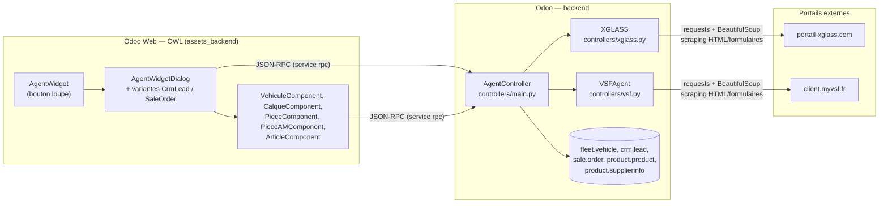
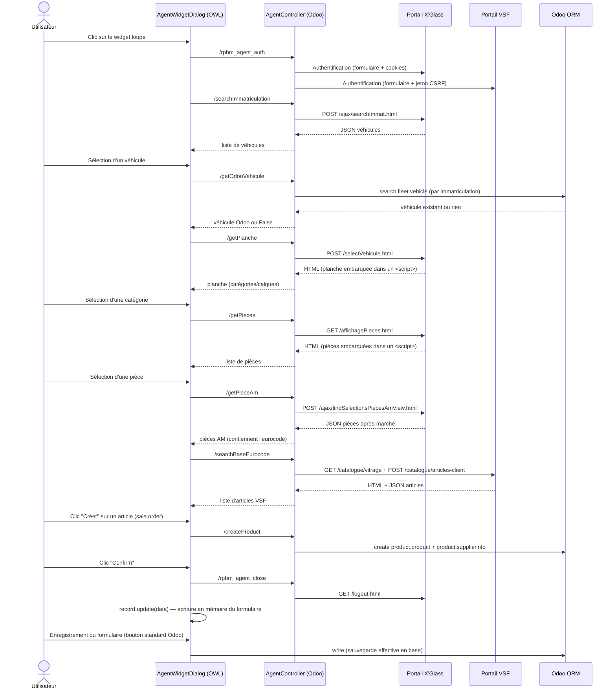

# Architecture

## Stack

- **Odoo 17** (`__manifest__.py` : `version: "17.0.250623.1"`), module `rpbm_agent`, dépend de `crm`, `fleet`, `sale_crm`.
- **Backend** : un seul controller Odoo (`AgentController`, `controllers/main.py`), toutes les routes en JSON-RPC (`type='json'`, `auth='user'`). Pas de modèle Python custom, pas de vue XML, pas de règle de sécurité (`ir.model.access.csv`) dans le module.
- **Intégration portails externes** : `requests.Session()` + `BeautifulSoup4` (scraping HTML/formulaires + quelques endpoints AJAX internes renvoyant du JSON). **Aucune API officielle**, aucun Selenium/Playwright.
- **Frontend** : composants OWL (framework de vues Odoo), déclarés en `web.assets_backend` (glob `rpbm_agent/static/src/*`). Le widget est injecté dans les vues formulaire **via Odoo Studio**, pas via des vues XML versionnées dans ce module.

## Vue d'ensemble des composants

Détail de chaque bloc : [backend](backend.md), [frontend](frontend.md).

## Séquence complète (cas Ordre de Vente)

## Points d'attention transverses

- **Aucune persistance de configuration versionnée** : les champs `x_studio_*` consommés par le code (frontend et backend) sont créés via Odoo Studio, donc dans la base de données de chaque instance Odoo, pas dans ce dépôt. Le module ne fonctionne pas "out of the box" sur une instance vierge sans avoir recréé ces champs (voir [configuration](configuration.md)).
- **Aucune sécurité applicative dédiée** : les routes sont ouvertes à tout utilisateur connecté (`auth='user'`), sans groupe ni `ir.model.access.csv` propre au module.
- **État de session partagé** : `vsfAgent`/`xglassAgent` sont des instances Python **au niveau module** (pas par utilisateur Odoo, pas par requête) — voir [backend](backend.md#état-de-session-partagé) et l'[état des lieux](../etat-des-lieux.md) pour l'implication en usage concurrent.
