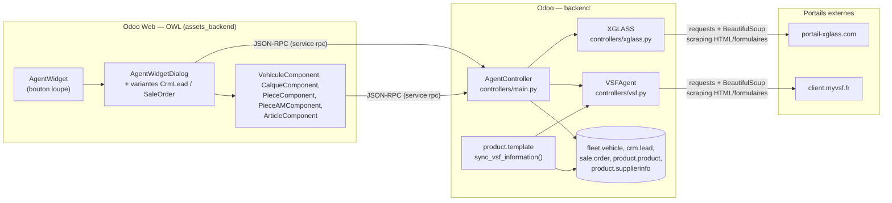
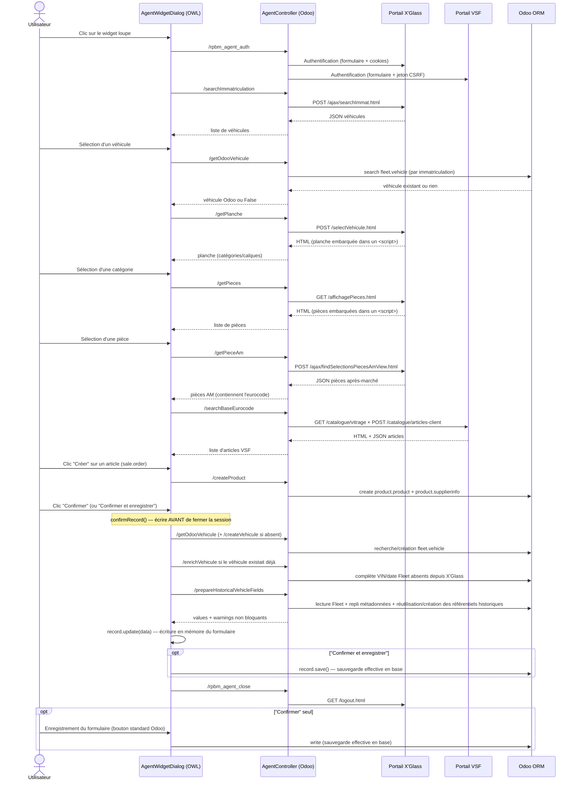

# Architecture

## Stack

- **Odoo 17**, module `rpbm_agent` (version courante dans [`__manifest__.py`](../../__manifest__.py), bumpée à chaque déploiement), dépend de `crm`, `delivery`, `fleet`, `product`, `sale_crm`. Le module utilise le champ natif `sale.order.carrier_id` ; le routage de ses routes reste fourni par `stock_delivery` dans l'architecture stock.
- **Backend** : un controller Odoo (`AgentController`, `controllers/main.py`) pour le widget JSON-RPC et une extension ORM `product.template` pour la synchronisation batch VSF. Pas de règle de sécurité (`ir.model.access.csv`) dans le module.
- **Intégration portails externes** : `requests.Session()` + `BeautifulSoup4` (scraping HTML/formulaires + quelques endpoints AJAX internes renvoyant du JSON). **Aucune API officielle**, aucun Selenium/Playwright.
- **Frontend** : composants OWL (framework de vues Odoo), déclarés en `web.assets_backend` (glob `rpbm_agent/static/src/*`). Le widget et les champs `x_studio_*` sont placés par les **vues XML versionnées** du module (`views/*.xml`, voir [configuration](configuration.md#intégration-dans-les-vues)) ; le comportement s'adapte selon `resModel` (`crm.lead`, `sale.order`, ou dialog générique).

## Vue d'ensemble des composants

Détail de chaque bloc : [backend](backend.md), [frontend](frontend.md).

## Configuration du script de transfert des secrets

Le script standalone [`push_credentials.py`](../../push_credentials.py) a deux
propriétaires de configuration distincts : le profil Paradigme sélectionne et
authentifie la cible Odoo ; le fichier `.env` du module fournit uniquement les
identifiants des portails à transférer. Le profil est sélectionné par
`.paradigme.yaml`, décrit globalement dans `~/.paradigme/` et résolu sans
fallback vers `.env.local` ou vers l'environnement du processus. Les valeurs
transférées sont ensuite stockées par Odoo dans `ir.config_parameter`, qui est
la source de vérité de l'exécution en production.

## Séquence complète (cas Ordre de Vente)

## Points d'attention transverses

- **Champs `x_studio_*` désormais créés automatiquement** à l'installation par `pre_init_hook` (voir [configuration](configuration.md#champs-odoo-studio-requis)) : le module fonctionne "out of the box" sur une instance vierge pour les champs listés dans [technique/champs/](champs/README.md) ; les champs Studio historiques (immatriculation, eurocode complet/joint) restent créés à la main, préexistants à ce module.
- **Compatibilité historique véhicule** : la confirmation prépare les champs Studio historiques depuis Fleet ; les huit alias techniques `x_rpbm_vehicle_*` ne sont plus créés par le hook. Les alias déjà présents et tous les champs historiques restent inchangés.
- **Mode logistique** : `sale.order.carrier_id` est la source canonique du lieu/mode de remise. Une vue versionnée le rend visible après les réorganisations Studio ; sa valeur peut être préremplie depuis `crm.lead.x_studio_lieu_intervention` uniquement sur les nouveaux devis. La confirmation de la vente refuse un transporteur vide pour éviter le routage implicite.
- **Aucune sécurité applicative dédiée** : les routes sont ouvertes à tout utilisateur connecté (`auth='user'`), sans groupe ni `ir.model.access.csv` propre au module.
- **Contrôle d'accès de la synchronisation historique** : `/prepareHistoricalVehicleFields` n'utilise pas `sudo`, lit seulement les champs Fleet nécessaires et transforme toute absence de droit couverte en avertissement non bloquant.
- **État de session partagé** : `vsfAgent`/`xglassAgent` sont des instances Python **au niveau module** (pas par utilisateur Odoo, pas par requête) — voir [backend](backend.md#état-de-session-partagée) et l'[état des lieux](../etat-des-lieux.md) pour l'implication en usage concurrent.
