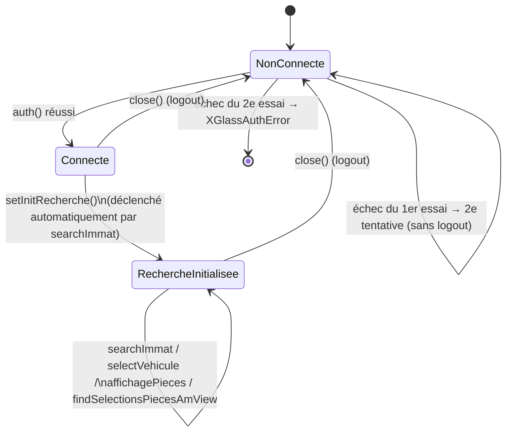

# Backend

`controllers/main.py` expose un unique controller `AgentController`. Deux instances globales sont créées **au chargement du module Python** (pas par requête, pas par utilisateur) :

```python
vsfAgent = vsf.VSFAgent()
xglassAgent = xglass.XGLASS()
```

`/rpbm_agent_auth` réinstancie ces deux objets puis authentifie chacun via les paramètres système `ir.config_parameter`. Voir [état de session partagée](#état-de-session-partagée) plus bas, et [verrou de concurrence](../technique/configuration.md#concurrence--verrou-de-session) pour le mécanisme qui sérialise désormais les sessions widget entre utilisateurs.

## Référence des routes

Toutes les routes sont déclarées `type='json'`, `auth='user'` (JSON-RPC, utilisateur Odoo connecté requis, pas de contrôle de droits plus fin).

| Route | Paramètres | Résumé | Modèles/portails touchés |
|---|---|---|---|
| `/rpbm_agent_auth` | — | Réinstancie et authentifie `vsfAgent`/`xglassAgent` depuis `ir.config_parameter` (`XGLASS_USER`, `XGLASS_PASS`, `VSF_LOGIN`, `VSF_PASSWORD`) | X'Glass, VSF, `ir.config_parameter` |
| `/rpbm_agent_close` | — | Ferme la session X'Glass (`xglassAgent.close()`) et libère le verrou. VSF n'est pas déconnecté explicitement (`VSFAgent` n'a pas de `close()`, non nécessaire) | X'Glass |
| `/searchImmatriculation` | `immatriculation: str` | Recherche véhicule(s) par plaque sur X'Glass | X'Glass |
| `/rpbm_agent/getVehiculeMeta` | `vehiculeId: str` | Sélectionne le véhicule côté portail (`selectVehicule`) et retourne `{meta: {vin, cnit, dateMec}, planche}` en un seul aller-retour | X'Glass |
| `/getOdooVehicule` | `immatriculation: str` | Recherche un véhicule Odoo existant par plaque ; retourne `{id, name, driver_id}` ou `False` | `fleet.vehicle` |
| `/createVehicule` | `immatriculation, partner_id, vehicule_info, vehicule_meta` | Crée (ou retourne l'existant) marque/modèle si besoin, puis le `fleet.vehicle` (`rpbm_detail_model`, `rpbm_first_registration_date`, `vin_sn`) ; retourne `{id, name}`. L'énergie X'Glass est convertie vers une clé native `fleet.FUEL_TYPES` (`XGLASS_ENERGY_TO_FUEL_TYPE`, énergie inconnue = champ vide). L'image X'Glass est facultative et n'est tentée que si l'appelant détient encore le verrou portail. | `fleet.vehicle`, `fleet.vehicle.model.brand`, `fleet.vehicle.model`, X'Glass (image facultative) |
| `/enrichVehicule` | `vehicle_id: int, vehicule_meta` | Complète uniquement `vin_sn` et `rpbm_first_registration_date` manquants d'un `fleet.vehicle` existant (un VIN de l'ancienne forme `var = …;` est remplacé) ; les droits insuffisants deviennent un avertissement | `fleet.vehicle` |
| `/getPlanche` | `vehiculeId: int` | Re-sélectionne le véhicule côté portail et retourne la "planche" ; utilisé par le widget uniquement pour restaurer le contexte après reconnexion | X'Glass |
| `/getPieces` | `plancheId: int, calqueId: int` | Récupère et aplatit les pièces X'Glass d'une catégorie ; chaque pièce porte `laborOperations` (opérations de main-d'œuvre T1/T2/T3 avec `productId` issu de `rpbm_agent.labor_product_t*`) | X'Glass, `ir.config_parameter` |
| `/getPieceAm` | `element_withPiecesAm, pieceId=None, elementSitId=None` | Récupère les pièces après-marché associées à une pièce, via `XGLASS.findSelectionsPiecesAmView()` | X'Glass |
| `/searchBaseEurocode` | `baseEurocode: str` | Recherche les articles VSF correspondant à une base eurocode | VSF |
| `/getVsfArticleDetails` | `articleVsfInfo: dict, enrichSuggestions=True` | Lit la fiche de l'article sélectionné : images pleine taille, dimensions, caractéristiques et suggestions VSF (fiches des suggestions lues aussi si `enrichSuggestions`) | VSF |
| `/doesProductExists` | `articleVsfInfo: dict` | Recherche un produit par référence interne, eurocode, puis nom | `product.product`, `product.template` |
| `/createProduct` | `articleVsfInfo: dict` | Retourne le produit existant ou crée le produit + son prix fournisseur VSF, avec verrou transactionnel par code et eurocode sur le template | `product.product`, `product.template`, `product.supplierinfo` |

### Dérivation du véhicule et champs Studio

Le widget n'écrit que les champs natifs `rpbm_*` de l'opportunité (ou leurs miroirs sur le devis).
Marque, modèle, VIN, énergie, détail et date de mise en circulation sont dérivés du véhicule Fleet
lié par le `compute` de `crm.lead` ; la recopie vers les champs Studio historiques (et le retour
d'une saisie Studio vers le natif) est faite par le mixin de `models/legacy_fields.py`, sans route
dédiée. Voir [configuration](configuration.md#champs-natifs-et-champs-studio-historiques).

## X'Glass (`controllers/xglass.py`)

- **Portail** : `https://portail-xglass.com`, authentification Spring Security classique (`j_spring_security_check`, `j_username`/`j_password`), session par cookies (`requests.Session`).
- **Contrainte connue** : *"un seul utilisateur actif par identifiant"* — le portail refuse une seconde session simultanée pour le même identifiant. `auth()` réessaie donc exactement une fois sans se déconnecter entre les deux tentatives (la première tentative refusée évince la session restée ouverte) — détail dans [configuration](configuration.md#authentification-des-portails).
- **Contrainte non documentée ailleurs** (retrouvée dans `controllers/xglass.ipynb`, cellule 27) : une recherche par immatriculation (`searchImmat`) n'est acceptée par le portail que si la page `initRechercheVehicule.html` a été chargée au préalable dans la session — d'où `setInitRecherche()` appelé automatiquement par `searchImmat()` si nécessaire.

### États de session



### Classes de données

Toutes construites depuis le JSON/HTML du portail (`**kwargs` → attributs), aucune n'est un modèle Odoo :

| Classe | Rôle |
|---|---|
| `XGlassMarque`, `XGlassModele` | Marque et modèle véhicule (X'Glass) |
| `XGlassVehicule` | Véhicule retourné par la recherche immatriculation ; calcule `energieLibelle` via `xglass_lbl.getLabel()` et construit `imgUrl` |
| `XGlassCalque` | Catégorie de pièces (la planche elle-même est renvoyée en JSON brut par `selectVehicule()`) |
| `XGlassPieceOe`, `XGlassPieceOeCaracteristique(Type)` | Pièce d'origine et ses caractéristiques |
| `XGlassPieceTemps*` (4 classes) | Temps/opérations de main d'œuvre associés à une pièce |
| `XGlassPiece` | Regroupe une `XGlassPieceOe` et ses temps |
| `XGlassElement` | Regroupement de pièces (`ELEMENTSIT_PRINCIPAUX`/`ELEMENTSIT_COMPLEMENTAIRES`) |

Exemple de payload `XGlassVehicule` (issu de `controllers/xglass.ipynb`) :
```json
{
  "id": 431060,
  "libelleCourt": "SUZUKI BALENO II - 5P 2016-04-> 1.2i 90",
  "energieLibelle": "Essence",
  "puissanceKw": 66,
  "puissanceCom": 90,
  "portesNbr": 5,
  "cylindreeCm3": 1242,
  "modele": { "gamme": "BALENO", "id": 4267 },
  "imgUrl": "https://portail-xglass.com/images/images_modele/40377.jpg"
}
```
Métadonnées associées (`getVehiculeMeta`) :
```json
{ "cnit": "M10CPFVP000R017", "dateMec": "02/2016", "vin": "VF7SA9HPKFW589387" }
```

### `xglass_lbl.py`

Fichier statique : un dict `LIBS` (~1440 entrées) recopiant les libellés d'internationalisation du frontend X'Glass, exposé via `getLabel(label)`. Dans le code actuel, **seules les clés `lbl.energie.*`** sont consommées (traduction du type de carburant) — le reste du dictionnaire n'est pas exploité.

## VSF (`controllers/vsf.py`)

- **Portail** : `https://client.myvsf.fr`, authentification formulaire classique avec jeton CSRF caché (`<input name="_token">`) + session cookie.
- `VSFAgent` n'a **pas de méthode `close()`** (contrairement à `XGLASS`).
- `searchEurocodeArticlesClient()` : récupère d'abord la liste d'IDs d'articles + un jeton CSRF meta depuis la page HTML de résultats, puis interroge l'endpoint AJAX `/catalogue/articles-client` (JSON), et fusionne ce JSON avec les informations extraites directement des lignes `<tr class="product-line">` de la page HTML (image, URL fiche, référence constructeur) — matching manuel sur le champ `code`.
- `getArticleDetails()` lit une fiche article authentifiée : caractéristiques libellé/valeur, dimensions converties en millimètres, images `p=xlg` réellement signées par VSF, et cartes du carrousel `#article-reference-complementaires-carousel`. Il ne synthétise jamais une URL pleine taille depuis une miniature, car la signature dépend du format demandé.
- `VSFArticle.__init__` calcule `prixVenteRPBM = prixVente * (1 - remiseRPBM)` à partir de `rpbm_agent.vsf_discount` (défaut de compatibilité `0.2`). `VSFArticle` n'expose aucun champ `id` — seul `code` sert de clé (voir implication côté frontend dans l'[état des lieux](../etat-des-lieux.md)).

Exemple de payload `VSFArticle` :
```json
{
  "code": "EA01RGPR5RQ",
  "name": "CUSTODE ARRIÈRE DROIT TEINTÉ VERT FONCÉ GREAT WALL HOVER  08-",
  "prixHT": 102.56,
  "prixVente": 113.95,
  "prixVenteRPBM": 91.16,
  "remise": "10%",
  "stock": 5,
  "type_piece": "LA",
  "url": "https://client.myvsf.fr/catalogue/article/EA01RGPR5RQ"
}
```

## État de session partagée

`vsfAgent` et `xglassAgent` sont des instances **au niveau du module Python**, donc partagées par tous les workers/requêtes/utilisateurs Odoo qui appellent ces routes sur le même processus serveur (et réinstanciées à chaque `/rpbm_agent_auth`, ce qui donne une ardoise propre par session plutôt qu'un problème une fois combiné au verrou ci-dessous). Elles portent un état mutable (`self.session` de `requests`, `self.selectedVehiculePage`, `self.initRecherche`). Combiné à la contrainte "un seul utilisateur actif par identifiant" du portail X'Glass, deux utilisateurs Odoo utilisant le widget en même temps partageraient la même session portail sans coordination — désormais empêché par un verrou applicatif (`ir.config_parameter` `rpbm_agent.session_lock`, `main.py::acquire_agent_lock`/`touch_agent_lock`/`release_agent_lock`) qui sérialise des sessions widget complètes entre utilisateurs, avec expiration glissante de 15 min en filet de sécurité — voir [configuration](configuration.md#concurrence--verrou-de-session) pour le détail, et l'[état des lieux](../etat-des-lieux.md) pour l'historique du problème.

Une expiration détectée dans X'Glass (`XGlassAuthError`), VSF (`VSFAuthError`) ou le verrou
local est convertie en `AgentSessionExpiredError`, sous-classe de `UserError`. Son nom est le
marqueur JSON-RPC consommé par le widget ; il ne dépend pas du message affiché. Les autres
erreurs portail restent des `UserError` fonctionnels. `/rpbm_agent_auth` reste l'unique route
de (re)connexion et réinstancie les deux agents avant de les authentifier.
