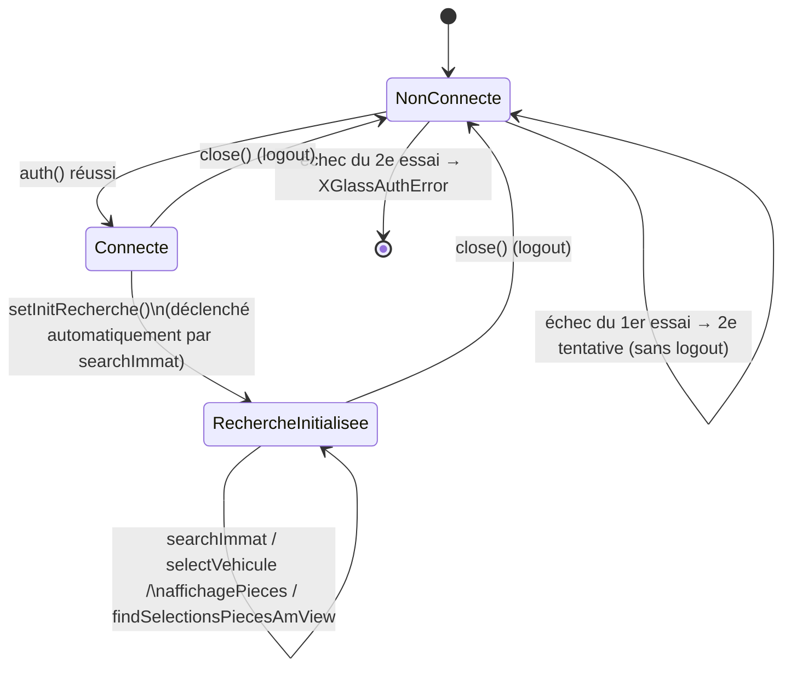

# Backend

`controllers/main.py` expose un unique controller `AgentController`. Deux instances globales sont créées **au chargement du module Python** (pas par requête, pas par utilisateur) :

```python
vsfAgent = vsf.VSFAgent()
xglassAgent = xglass.XGLASS()
```

`/rpbm_agent_auth` réinstancie ces deux objets puis authentifie chacun via les paramètres système `ir.config_parameter`. Voir [état de session partagée](#état-de-session-partagée) plus bas, et [verrou de concurrence](../technique/configuration.md#concurrence--verrou-de-session) pour le mécanisme qui sérialise désormais les sessions widget entre utilisateurs.

## Référence des routes

Toutes les routes sont déclarées `type='json'`, `auth='user'` (JSON-RPC, utilisateur Odoo connecté requis, pas de contrôle de droits plus fin).

Droits : les commerciaux (`sales_team.group_sale_salesman`) n'ont que la **lecture** sur `fleet.vehicle`, `fleet.vehicle.model` et `fleet.vehicle.model.brand` ([`security/ir.model.access.csv`](../../security/ir.model.access.csv)), sans groupe Parc automobile : le groupe Fleet « Officer » restreint la visibilité aux véhicules dont l'utilisateur est conducteur, ce qui masque les véhicules clients. Les créations/écritures du widget (`fleet.vehicle` dans `/createVehicule` et `/enrichVehicule`, `product.product` et `product.supplierinfo` dans `/createProduct`) passent par `sudo()` : elles ne sont possibles que via le widget, pas depuis les menus Parc automobile / Articles.

| Route | Paramètres | Résumé | Modèles/portails touchés |
|---|---|---|---|
| `/rpbm_agent_auth` | — | Réinstancie et authentifie `vsfAgent`/`xglassAgent` depuis `ir.config_parameter` (`XGLASS_USER`, `XGLASS_PASS`, `VSF_LOGIN`, `VSF_PASSWORD`) | X'Glass, VSF, `ir.config_parameter` |
| `/rpbm_agent_close` | — | Ferme la session X'Glass (`xglassAgent.close()`) et libère le verrou. VSF n'est pas déconnecté explicitement (`VSFAgent` n'a pas de `close()`, non nécessaire) | X'Glass |
| `/searchImmatriculation` | `immatriculation: str` | Recherche véhicule(s) par plaque sur X'Glass | X'Glass |
| `/rpbm_agent/getVehiculeMeta` | `vehiculeId: str` | Sélectionne le véhicule côté portail (`selectVehicule`) et retourne `{meta: {vin, cnit, dateMec}, planche}` en un seul aller-retour | X'Glass |
| `/getOdooVehicule` | `immatriculation: str` | Recherche un véhicule Odoo existant par plaque ; retourne `{id, name, driver_id}` ou `False` | `fleet.vehicle` |
| `/createVehicule` | `immatriculation, partner_id, vehicule_info, vehicule_meta` | Crée (ou retourne l'existant) marque/modèle si besoin, puis le `fleet.vehicle` (`rpbm_detail_model`, `rpbm_first_registration_date`, `vin_sn`) ; retourne `{id, name}`. L'énergie X'Glass est convertie vers une clé native `fleet.FUEL_TYPES` (`XGLASS_ENERGY_TO_FUEL_TYPE`, énergie inconnue = champ vide). L'image X'Glass est facultative et n'est tentée que si l'appelant détient encore le verrou portail. | `fleet.vehicle`, `fleet.vehicle.model.brand`, `fleet.vehicle.model`, X'Glass (image facultative) |
| `/enrichVehicule` | `vehicle_id: int, vehicule_meta` | Complète uniquement `vin_sn` et `rpbm_first_registration_date` manquants d'un `fleet.vehicle` existant (un VIN de l'ancienne forme `var = …;` est remplacé) ; les droits insuffisants deviennent un avertissement | `fleet.vehicle` |
| `/getPlanche` | `vehiculeId: int` | Re-sélectionne le véhicule côté portail et retourne la "planche" ; utilisé par le widget uniquement pour restaurer le contexte après reconnexion | X'Glass |
| `/getPieces` | `plancheId: int, calqueId: int` | Récupère et aplatit les pièces X'Glass d'une catégorie, principales puis complémentaires, dans l'ordre du portail ; chaque pièce porte son groupe (`elementKey`), sa famille (`elementSitId`, `elementSitLibelle`) et `laborOperations` (opérations de main-d'œuvre T1/T2/T3 avec `productId` issu de `rpbm_agent.labor_product_t*`). Voir [lot D, build A](#getpieces-et-getpieceam-lot-d-build-a) | X'Glass, `ir.config_parameter` |
| `/getPieceAm` | `element_withPiecesAm, pieceId=None, elementSitId=None` | Récupère les pièces après-marché associées à une pièce (« Équivalence AM »), ou, sans `pieceId`, à une famille (encart « Autres marques AM »), via `XGLASS.findSelectionsPiecesAmView()`. Retourne toujours une liste (`null` ou absence = liste vide) ; corps non JSON = erreur utilisateur. Voir [lot D, build A](#getpieces-et-getpieceam-lot-d-build-a) | X'Glass |
| `/searchBaseEurocode` | `baseEurocode: str` | Recherche les articles VSF correspondant à une base eurocode. Une base sans résultat renvoie une liste vide, pas une erreur (lot correctif `17.0.261006.1`, voir [Recherche sans résultat](#recherche-sans-résultat-r24)) | VSF |
| `/getVsfArticleDetails` | `articleVsfInfo: dict, enrichSuggestions=True` | Lit la fiche de l'article sélectionné : images pleine taille, dimensions, caractéristiques et suggestions VSF (fiches des suggestions lues aussi si `enrichSuggestions`, en parallèle : au plus `MAX_PARALLEL_SUGGESTIONS` = 4 requêtes simultanées, ordre du carrousel conservé) | VSF |
| `/doesProductExists` | `articleVsfInfo: dict` | Recherche le produit d'un article VSF (`_find_existing_product`) : code VSF (`rpbm_eurocode`) d'abord, puis référence interne et nom exact unique pour les seuls produits sans eurocode ; jamais un produit qui porte l'eurocode d'un autre article | `product.product`, `product.template` |
| `/createProduct` | `articleVsfInfo: dict` | Retourne le produit existant (même recherche) ou crée le produit + son prix fournisseur VSF, avec verrou transactionnel par code et eurocode sur le template | `product.product`, `product.template`, `product.supplierinfo` |

### Rattachement d'un article VSF à un produit (lot E1.1)

`_find_existing_product(env, product_code, eurocode, product_name)` (`main.py`) est la recherche commune de `/doesProductExists` et de `/createProduct`. `product_code` est la référence interne attendue (`_article_constructor_reference` : référence constructeur, ou code VSF si elle est absente), `eurocode` le code VSF de l'article et `product_name` son nom. Version `17.0.261005.4`, recette live réussie le 2026-10-05 : à l'étape 1 de SO-07, `6108AXSR` affiche « Article absent de la base Odoo » et le produit `6574AXSH` n'est plus proposé (VSF ne suggérant plus `6108AXSR`, le contrôle a porté sur sa ligne principale). Le test Odoo ci-dessous est non exécuté, abandonné sur décision de l'utilisateur (2026-10-06).

| Rang | Critère | Condition | Résultat retenu | `matched_by` |
|---|---|---|---|---|
| 1 | `product_tmpl_id.rpbm_eurocode` égal au code VSF | aucune | le premier (`limit=1`) | `eurocode` |
| 2 | `default_code` égal à la référence interne attendue | produit sans eurocode, **seulement si l'eurocode de l'article est fourni** ; sinon aucune restriction | le premier (`limit=1`) | `reference_interne` |
| 3 | `name` égal au nom de l'article (`=ilike`, insensible à la casse) | produit sans eurocode | seulement s'il y a exactement un produit (`limit=2`) | `nom` |

« Sans eurocode » se traduit par `('product_tmpl_id.rpbm_eurocode', 'in', [False, ''])` : champ à `NULL` ou chaîne vide (`= False` ne couvre que `NULL`). Un produit qui porte un eurocode ne peut donc être retenu que par le rang 1 : celui d'un autre article est exclu des rangs 2 et 3. Deux produits sans eurocode de même nom ne donnent aucun rattachement.

**Eurocode fourni ou non.** `/doesProductExists` et `/createProduct` tirent l'eurocode de `articleVsfInfo.code` (`/createProduct` refuse un article sans code). Un appel ancien de `/doesProductExists` avec `productCode` seul est converti en `{'code': productCode}` : l'eurocode est alors fourni et la restriction du rang 2 s'applique aussi. Elle ne tombe que sans eurocode (`articleVsfInfo` sans `code`, ou appel direct de la fonction) : la référence interne suffit alors.

**Origine.** L'ancien ordre (référence interne, eurocode, nom) laissait le nom suffire : la suggestion VSF `6108AXSR` « GEL CAPTEUR SILICONE », sans produit propre, était rattachée au produit `6574AXSH`, seul produit de ce nom et gel d'un autre article. `/createProduct` applique la même recherche : sans produit trouvé, il crée le produit avec `rpbm_eurocode` égal au code VSF ([9](../fonctionnel/workflow/09-creation-produit.md)).

**Contrôle.** `tests/test_find_existing_product.py` (`TransactionCase`, importé dans `tests/__init__.py`) compte six tests, avec des valeurs propres au test (`TEST6574AXSH`, `TEST6108AXSR`, « GEL CAPTEUR SILICONE (test E1.1) ») : le résultat ne dépend pas des produits de la base. Ils couvrent le nom d'un produit portant un autre eurocode (non retenu : le cas d'origine rejoué), l'eurocode avant la référence, la référence d'un produit sans eurocode (`NULL` ou chaîne vide), la référence d'un produit portant un autre eurocode (non retenue, mais retenue si l'eurocode n'est pas fourni), le nom unique d'un ancien produit et deux anciens produits de même nom (non retenus). Ils demandent une base PostgreSQL et le lanceur Odoo avec `--test-enable`. Le poste de développement n'a pas PostgreSQL et le build de staging met le module à jour sans `--test-enable` : le fichier est **non exécuté, abandonné sur décision de l'utilisateur (2026-10-06)** et reste dans le dépôt.

### `/getPieces` et `/getPieceAm` (lot D, build A)

Version `17.0.261005.1` : recette réussie le 2026-10-05 sur le build `ab31793`.

- **Libellé de famille.** Chaque pièce de `/getPieces` reçoit `elementSitLibelle`, égal au
  `libelle` de son `XGlassElement` (déjà calculé dans `controllers/xglass.py`, mais perdu à
  l'aplatissement). Clé ajoutée : rien n'est retiré de la réponse, ni l'ordre
  (`ELEMENTSIT_PRINCIPAUX` puis `ELEMENTSIT_COMPLEMENTAIRES`, ordre du portail). Le regroupement
  lui-même se fait dans le frontend (voir [frontend](frontend.md#groupes-de-pièces-et-encarts-autre-am-par-famille-r19-r20)).
- **Journalisation des familles.** Pour chaque élément reçu, `_logger.info` écrit : `elementKey`,
  `elementSitId`, libellé, `affichageAm`, `containsPiecesAm`, `elementVitre` et nombre de pièces ;
  il écrit aussi les clés de premier niveau de `elementSitMapData` que le widget ne traite pas
  (le portail connaît d'autres groupes, par exemple hors calque ou recherche par référence : leur
  présence dans les réponses réelles n'est pas vérifiée). Ces lignes vont au journal serveur
  seulement : aucune écriture en base, aucun corps de réponse enregistré, et pour les clés
  inconnues seulement leur nom et leur taille. Elles remplacent un vidage de la réponse complète,
  jugé contraire au protocole de recette « sans écriture ». Une ligne par élément
  (`getPieces <planche> <calque> : <groupe> elementSitId=… libellé=… affichageAm=… containsPiecesAm=…
  elementVitre=… pièces=…`), plus une ligne pour les clés ignorées. Elles servent à décider plus tard si l'encart « Autres marques AM » doit être limité aux familles qui
  l'annoncent.
- **Pas de filtre sur les drapeaux.** Le serveur et le widget n'appliquent aucune règle
  `affichageAm and containsPiecesAm` : l'encart est proposé pour toutes les familles (décision du
  2026-10-02 « toujours présent, replié »). Observé en trace pour la famille principale du
  pare-brise : les deux drapeaux sont vrais ; les familles complémentaires n'ont pas été tracées.
- **`/getPieceAm` renvoie toujours une liste.** `XGLASS.findSelectionsPiecesAmView()`
  (`controllers/xglass.py`) ne renvoie plus la réponse HTTP mais directement
  `(r.json() or {}).get('selectionsPiecesAmView') or []` ; un corps non JSON (`ValueError`)
  devient une `XGlassError` « Réponse X'Glass illisible (pièces AM) », que `main.py::getPieceAm`
  convertit par `_raise_portal_error` en erreur utilisateur typée (`UserError`, ou
  `AgentSessionExpiredError` si la session a expiré). Un seul appelant dans le dépôt
  (`main.py`). Observé (recette R11, 2026-10-02) : sans contexte véhicule, X'Glass répond
  `{"errorCode": "10", "selectionsPiecesAmView": null}` ; l'ancien code renvoyait alors `None`
  au widget (encart `None` après reconnexion). Désormais la liste est vide.
  Hypothèse de lecture, non observée : un corps `null` entier aurait levé une `AttributeError`.
  Effet de bord à surveiller : une réponse dégradée devient une liste vide, que le widget met en
  cache par véhicule et famille jusqu'à la fermeture de la dialog ou à la reconnexion
  (« Aucune autre référence après-marché. » peut alors masquer le défaut ; la reconnexion à chaud
  rejoue la recherche d'immatriculation pour l'éviter, voir [configuration](configuration.md#reconnexion-à-chaud)).

### Dérivation du véhicule et champs Studio

Le widget n'écrit que les champs natifs `rpbm_*` de l'opportunité (ou leurs miroirs sur le devis).
Marque, modèle, VIN, énergie, détail et date de mise en circulation sont dérivés du véhicule Fleet
lié par le `compute` de `crm.lead` ; la recopie vers les champs Studio historiques (et le retour
d'une saisie Studio vers le natif) est faite par le mixin de `models/legacy_fields.py`, sans route
dédiée. Voir [configuration](configuration.md#champs-natifs-et-champs-studio-historiques).

## X'Glass (`controllers/xglass.py`)

- **Portail** : `https://portail-xglass.com`, authentification Spring Security classique (`j_spring_security_check`, `j_username`/`j_password`), session par cookies (`requests.Session`).
- **Contrainte connue** : *"un seul utilisateur actif par identifiant"* — le portail refuse une seconde session simultanée pour le même identifiant. `auth()` réessaie donc exactement une fois sans se déconnecter entre les deux tentatives (la première tentative refusée évince la session restée ouverte) — détail dans [configuration](configuration.md#authentification-des-portails).
- **Contrainte non documentée ailleurs** (retrouvée dans `controllers/xglass.ipynb`, cellule 27) : une recherche par immatriculation (`searchImmat`) n'est acceptée par le portail que si la page `initRechercheVehicule.html` a été chargée au préalable dans la session — d'où `setInitRecherche()` appelé automatiquement par `searchImmat()` si nécessaire.

### États de session


```mermaid
stateDiagram-v2
    [*] --> NonConnecte
    NonConnecte --> Connecte: auth() réussi
    NonConnecte --> NonConnecte: échec du 1er essai → 2e tentative (sans logout)
    NonConnecte --> [*]: échec du 2e essai → XGlassAuthError
    Connecte --> RechercheInitialisee: setInitRecherche()\n(déclenché automatiquement par searchImmat)
    RechercheInitialisee --> RechercheInitialisee: searchImmat / selectVehicule /\naffichagePieces / findSelectionsPiecesAmView
    Connecte --> NonConnecte: close() (logout)
    RechercheInitialisee --> NonConnecte: close() (logout)
```

### Classes de données

Toutes construites depuis le JSON/HTML du portail (`**kwargs` → attributs), aucune n'est un modèle Odoo :

| Classe | Rôle |
|---|---|
| `XGlassMarque`, `XGlassModele` | Marque et modèle véhicule (X'Glass) |
| `XGlassVehicule` | Véhicule retourné par la recherche immatriculation ; calcule `energieLibelle` via `xglass_lbl.getLabel()` et construit `imgUrl` |
| `XGlassCalque` | Catégorie de pièces (la planche elle-même est renvoyée en JSON brut par `selectVehicule()`) |
| `XGlassPieceOe`, `XGlassPieceOeCaracteristique(Type)` | Pièce d'origine et ses caractéristiques |
| `XGlassPieceTemps*` (4 classes) | Temps/opérations de main d'œuvre associés à une pièce |
| `XGlassPiece` | Regroupe une `XGlassPieceOe` et ses temps |
| `XGlassElement` | Regroupement de pièces (`ELEMENTSIT_PRINCIPAUX`/`ELEMENTSIT_COMPLEMENTAIRES`) |

Exemple de payload `XGlassVehicule` (issu de `controllers/xglass.ipynb`) :
```json
{
  "id": 431060,
  "libelleCourt": "SUZUKI BALENO II - 5P 2016-04-> 1.2i 90",
  "energieLibelle": "Essence",
  "puissanceKw": 66,
  "puissanceCom": 90,
  "portesNbr": 5,
  "cylindreeCm3": 1242,
  "modele": { "gamme": "BALENO", "id": 4267 },
  "imgUrl": "https://portail-xglass.com/images/images_modele/40377.jpg"
}
```
Métadonnées associées (`getVehiculeMeta`) :
```json
{ "cnit": "M10CPFVP000R017", "dateMec": "02/2016", "vin": "VF7SA9HPKFW589387" }
```

### `xglass_lbl.py`

Fichier statique : un dict `LIBS` (~1440 entrées) recopiant les libellés d'internationalisation du frontend X'Glass, exposé via `getLabel(label)`. Dans le code actuel, **seules les clés `lbl.energie.*`** sont consommées (traduction du type de carburant) — le reste du dictionnaire n'est pas exploité.

## VSF (`controllers/vsf.py`)

- **Portail** : `https://client.myvsf.fr`, authentification formulaire classique avec jeton CSRF caché (`<input name="_token">`) + session cookie.
- `VSFAgent` n'a **pas de méthode `close()`** (contrairement à `XGLASS`).
- `searchEurocodeArticlesClient()` : récupère d'abord la liste d'IDs d'articles + un jeton CSRF meta depuis la page HTML de résultats, puis interroge l'endpoint AJAX `/catalogue/articles-client` (JSON), et fusionne ce JSON avec les informations extraites directement des lignes `<tr class="product-line">` de la page HTML. Dans la première cellule, chaque lien `data-fslightbox` plein format est apparié à sa miniature pour produire `images[{thumbnailUrl, fullUrl}]` ; les signatures `sm` et `xlg` restent celles servies par VSF. L'`url` de fiche, lue dans la deuxième cellule, passe par `_absolute_url` dès cette extraction (`extractProductInfo`, build `17.0.261005.2`), comme `getArticleDetails` le faisait déjà à la sélection : le lien « Fiche technique » d'une ligne non sélectionnée a ainsi une URL VSF complète, que le `href` de la page soit relatif ou absolu. Le matching reste manuel sur `code`. Sans liste d'articles, une page « aucun résultat » de VSF renvoie `[]` sans requête `articles-client` (voir [Recherche sans résultat](#recherche-sans-résultat-r24)).
- `getArticleDetails()` lit une fiche article authentifiée : caractéristiques libellé/valeur, dimensions converties en millimètres, images `p=xlg` réellement signées par VSF, et cartes du carrousel `#article-reference-complementaires-carousel`. Il conserve les paires d'images de la recherche ; sans elles, il ne lit que `#carousel-article-photos` quand ce conteneur existe, excluant `#carousel-modele-photos` (repli page entière pour l'ancien HTML et les fixtures). Il ne synthétise jamais une URL pleine taille depuis une miniature, car la signature dépend du format demandé.
- `VSFArticle.__init__` calcule `prixVenteRPBM = prixVente * (1 - remiseRPBM)` à partir de `rpbm_agent.vsf_discount` (défaut de compatibilité `0.2`). `VSFArticle` n'expose aucun champ `id` — seul `code` sert de clé (voir implication côté frontend dans l'[état des lieux](../etat-des-lieux.md)).

Exemple de payload `VSFArticle` :
```json
{
  "code": "EA01RGPR5RQ",
  "name": "CUSTODE ARRIÈRE DROIT TEINTÉ VERT FONCÉ GREAT WALL HOVER  08-",
  "prixHT": 102.56,
  "prixVente": 113.95,
  "prixVenteRPBM": 91.16,
  "remise": "10%",
  "stock": 5,
  "type_piece": "LA",
  "url": "https://client.myvsf.fr/catalogue/article/EA01RGPR5RQ"
}
```

### Recherche sans résultat (R24)

Lot correctif `17.0.261006.1` (commit `44b86e0`), recette live réussie le 2026-10-06 sans écriture : `9999Z` affiche « Aucun article VSF pour « 9999Z ». », sans notification d'erreur ([SO-09](../jeu-de-test.md#so-09--base-sans-résultat-lot-correctif-du-2026-10-06-r24), étape 1 ; les autres étapes, facultatives, n'ont pas été jouées).

**Trace réelle** (2026-10-06, une connexion VSF) de `GET /catalogue/vitrage?search=<valeur>` :

| Valeur | HTTP | Liste d'articles | Résultat |
|---|---|---|---|
| `6108A` | 200 | présente | 21 articles |
| `6108a` | 200 | présente | 21 articles (VSF ignore la casse) |
| `9999Z` | 200 | absente | page « Aucun résultat ne correspond à votre recherche. » |
| `A+B &C D` | 200 | absente | même page |
| `61-08A` | 200 | absente | même page |

VSF répond donc à une base sans article par une page 200 authentifiée, normale, **sans** `#articles-list-container` : ce n'est ni une panne ni une session expirée.

- **Avant le lot.** `searchEurocodeArticlesClient()` levait `VSFError` (« Conteneur articles introuvable sur la page de résultats VSF (session expirée ?) ») dès que la liste manquait, et `/searchBaseEurocode` convertissait toute `VSFError` en « Recherche impossible : le portail VSF est inaccessible. » : toute base sans résultat, même au bon format, passait pour une panne (recette R13 à R17, 2026-10-05).
- **Désormais.** Sans `#articles-list-container`, la méthode renvoie `[]` si le `#catalog-container` de la page contient l'image `/img/no-result.png` ou le texte « Aucun résultat ne correspond à votre recherche » ; elle ne fait alors aucune requête `articles-client`. La route renvoie `[]` au widget, qui affiche « Aucun article VSF pour « *base* ». » ([frontend](frontend.md#recherche-sans-résultat-r24)).
- **Page inattendue.** Sans liste d'articles ni marqueur « aucun résultat », la méthode lève `VSFError("Page de résultats VSF inattendue, ni liste d'articles ni message « aucun résultat ».")` : le message ne parle plus de session. `main.py` est inchangé, **voulu** (décision du 2026-10-06) : la route convertit toujours une `VSFError` en « Recherche impossible : le portail VSF est inaccessible. », parce qu'une page VSF de structure inattendue reste, pour l'utilisateur, un incident du portail ; le message exact n'est que dans le journal serveur.
- **Session expirée.** Elle n'est pas confondue avec « aucun résultat » : elle se détecte avant tout parsing, par l'URL de connexion (`ensure_logged()` lève `VSFAuthError`, donc `AgentSessionExpiredError` côté widget).
- **Rejeu.** Après une `AgentSessionExpiredError`, le widget se reconnecte et rejoue la requête une seule fois (`callPortal`) : une saisie peut donc produire deux requêtes `/searchBaseEurocode`, sans double déclenchement. Ce rejeu est voulu ; avant le lot, c'est lui qui échouait avec le message trompeur.
- **Casse.** VSF ignore la casse (`6108a` donne les mêmes 21 articles que `6108A`) ; le widget ne la normalise pas.
- **Contrôle.** `test_portal_auth.py` : `test_vsf_recherche_sans_resultat_sans_post` (image, texte ou les deux : `[]` et aucun POST) et `test_vsf_recherche_page_inattendue` (une page sans liste ni message, ou avec un conteneur de catalogue sans marqueur, lève une `VSFError` qui ne parle pas de session).

## État de session partagée

`vsfAgent` et `xglassAgent` sont des instances **au niveau du module Python**, donc partagées par tous les workers/requêtes/utilisateurs Odoo qui appellent ces routes sur le même processus serveur (et réinstanciées à chaque `/rpbm_agent_auth`, ce qui donne une ardoise propre par session plutôt qu'un problème une fois combiné au verrou ci-dessous). Elles portent un état mutable (`self.session` de `requests`, `self.selectedVehiculePage`, `self.initRecherche`). Combiné à la contrainte "un seul utilisateur actif par identifiant" du portail X'Glass, deux utilisateurs Odoo utilisant le widget en même temps partageraient la même session portail sans coordination — désormais empêché par un verrou applicatif (`ir.config_parameter` `rpbm_agent.session_lock`, `main.py::acquire_agent_lock`/`touch_agent_lock`/`release_agent_lock`) qui sérialise des sessions widget complètes entre utilisateurs, avec expiration glissante de 15 min en filet de sécurité — voir [configuration](configuration.md#concurrence--verrou-de-session) pour le détail, et l'[état des lieux](../etat-des-lieux.md) pour l'historique du problème.

Une expiration détectée dans X'Glass (`XGlassAuthError`), VSF (`VSFAuthError`) ou le verrou
local est convertie en `AgentSessionExpiredError`, sous-classe de `UserError`. Son nom est le
marqueur JSON-RPC consommé par le widget ; il ne dépend pas du message affiché. Les autres
erreurs portail restent des `UserError` fonctionnels. `/rpbm_agent_auth` reste l'unique route
de (re)connexion et réinstancie les deux agents avant de les authentifier.
