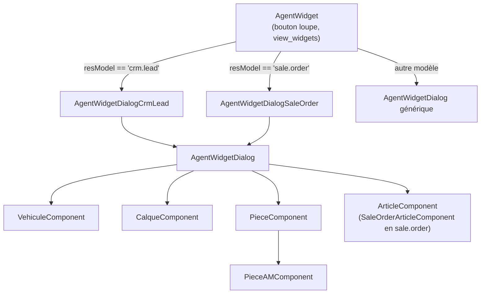
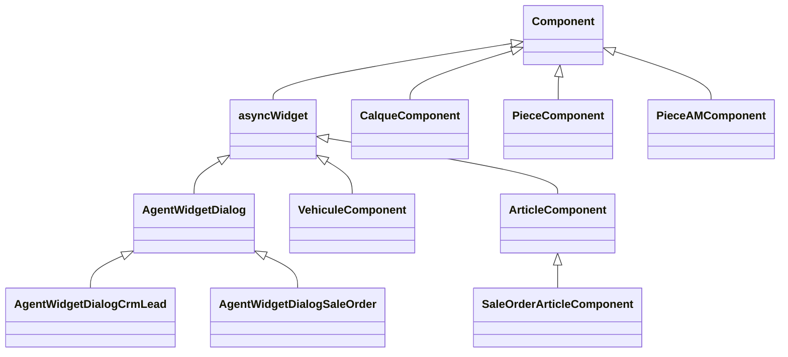
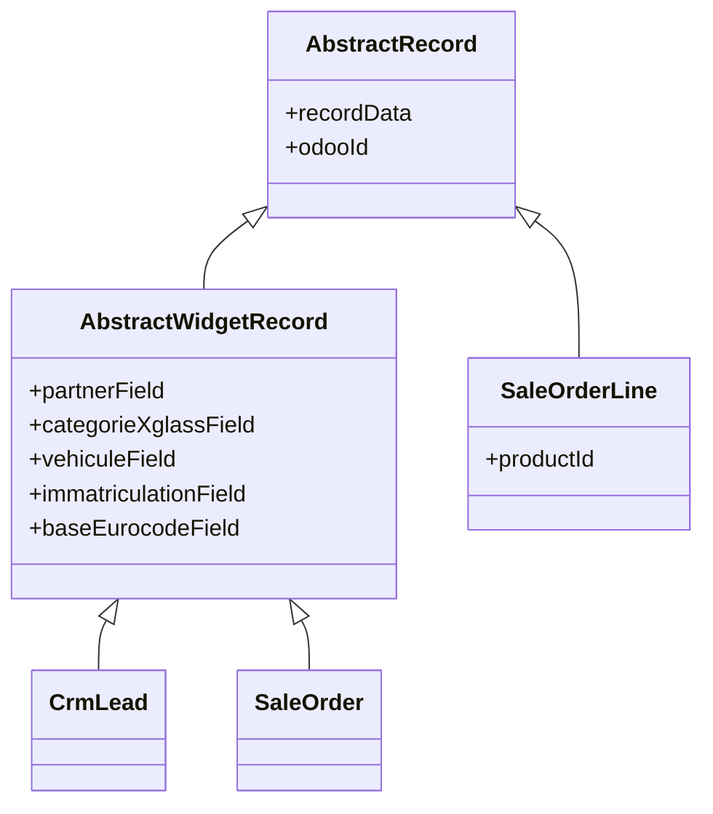
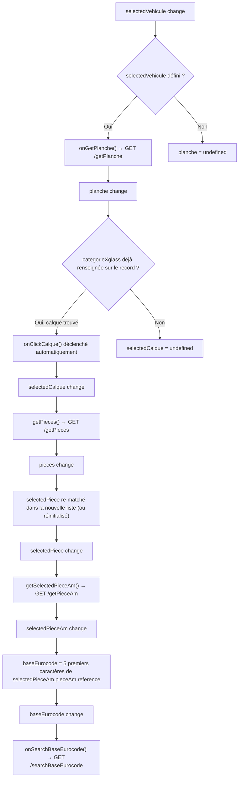

# Frontend (OWL)

Aucune vue XML n'est versionnée dans le module : le placement du widget dans les formulaires (`<widget name="rpbm_agent_widget" />`) se fait via Odoo Studio, en base de données de chaque instance.

## Arborescence des composants

## Hiérarchie des classes

`asyncWidget` (`utils.js`) est la classe de base fournissant les services `rpc`/`orm`, l'accès à `record`, et `runAsync(fn, message)` — wrapper try/catch qui bascule `state.loading` avant/après l'appel. **La gestion d'erreur de `runAsync` se limite à `console.error(e)`**, sans notification utilisateur.

### Hiérarchie des classes "record" (champs Odoo par modèle porteur)

`CrmLead` et `SaleOrder` surchargent certaines de ces propriétés avec des noms de champs `x_studio_*` différents selon le modèle. Détail des noms de champs par classe/modèle, y compris quels champs sont effectivement lus/écrits (certains, comme `SaleOrder.eurocodeField`, sont morts) : voir [technique/champs/](champs/README.md) et l'[état des lieux](../etat-des-lieux.md).

## Chaîne réactive (`useEffect`) de `AgentWidgetDialog`

Toute la progression du parcours (véhicule → planche → catégorie → pièces → pièce AM → eurocode → VSF) est pilotée par une cascade de `useEffect`, pas par des appels séquentiels explicites :

Un `useEffect` séparé recalcule `state.canConfim` (sic) à chaque changement de `selectedVehicule`/`planche`/`selectedCalque`/`baseEurocode`, mais **cette valeur n'est branchée à aucun élément du template** (`t-att-disabled` commenté avec un `<!-- FIXME -->` explicite sur le bouton "Confirm").

## Table des appels serveur

| Méthode JS | Composant | Route | Usage |
|---|---|---|---|
| `auth_agents()` | `AgentWidgetDialog` | `/rpbm_agent_auth` | Connexion X'Glass + VSF |
| `closeAgents()` | `AgentWidgetDialog` | `/rpbm_agent_close` | Fermeture session X'Glass |
| `searchImmatriculation()` | `AgentWidgetDialog` | `/searchImmatriculation` | Recherche véhicule(s) par plaque |
| `getOdooVehicule()` | `AgentWidgetDialog` **et** `VehiculeComponent` | `/getOdooVehicule` | Véhicule Odoo existant (appelé en double, voir [état des lieux](../etat-des-lieux.md)) |
| `createOdooVehicule()` / `onClickCreateVehicule()` | `AgentWidgetDialog` et `VehiculeComponent` | `/createVehicule` | Création du véhicule |
| `getVehiculeMeta()` | `VehiculeComponent` uniquement (code équivalent commenté dans la dialog) | `/rbm_agent/getVehiculeMeta` | VIN/CNIT/date MEC |
| `getPlanche()` | `AgentWidgetDialog` | `/getPlanche` | Catégories/calques disponibles |
| `getPieces()` | `AgentWidgetDialog` | `/getPieces` | Pièces d'une catégorie |
| `getPieceAm()` | `AgentWidgetDialog` | `/getPieceAm` | Pièces après-marché d'une pièce |
| `onSearchBaseEurocode()` | `AgentWidgetDialog` | `/searchBaseEurocode` | Articles VSF par eurocode |
| `doesProductExists()` | `SaleOrderArticleComponent` | `/doesProductExists` | Vérifie l'existence du produit |
| `createProduct()` | `SaleOrderArticleComponent` | `/createProduct` | Crée le produit + prix fournisseur |
| `addToSaleOrder()` | `SaleOrderArticleComponent` | — (pas de route, manipulation directe de `record.data.order_line.addNewRecord`) | Ajoute une ligne au devis |

## Écriture finale

`AgentWidgetDialog.onConfirm()` construit un objet `data` (via `getRecordData()`) et appelle **`this.props.record.update(data)`** — mise à jour en mémoire du `Record` Odoo standard. L'écriture effective en base se fait ensuite via le mécanisme de sauvegarde standard du formulaire Odoo (bouton "Enregistrer"), pas via un `orm.write` explicite du module. Le service `orm` est injecté (`useService("orm")`) dans plusieurs classes mais n'est en réalité jamais appelé — tous les échanges passent par `rpc` vers les routes custom de `main.py`.
