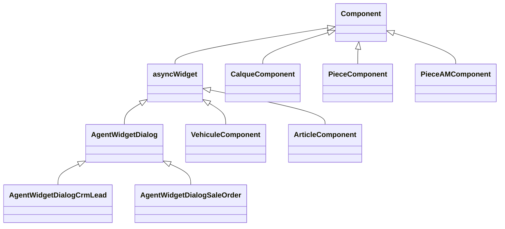
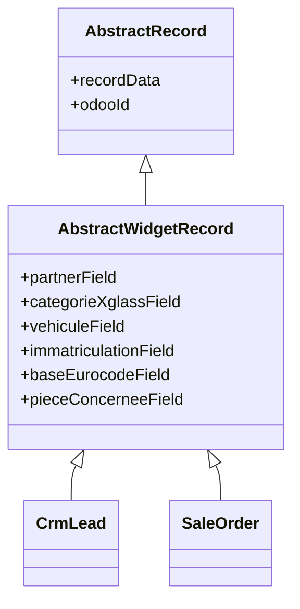
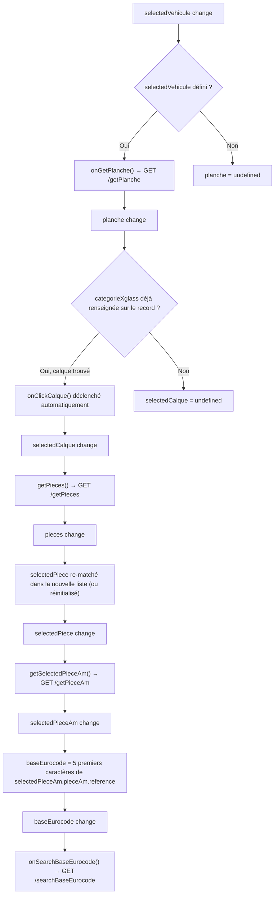

# Frontend (OWL)

Le placement du widget dans les formulaires (`<widget name="rpbm_agent_widget" />`) se fait par les **vues XML versionnées** du module (`views/crm_lead_views.xml`, `views/sale_order_views.xml`, etc. — voir [configuration](configuration.md#intégration-dans-les-vues)), chacune héritant de la vue formulaire de base du modèle.

## Arborescence des composants

## Hiérarchie des classes

`asyncWidget` (`utils.js`) est la classe de base fournissant le service `rpc`, l'accès à
`record`, et `runAsync(fn, message)` — wrapper try/catch qui bascule un état de chargement
**propre à chaque composant** avant/après l'appel et affiche une notification Odoo en cas
d'erreur.

## Détails discriminants des pièces OE

Les pièces après-marché ne sont affichées que sous la pièce OE active, dans un encadré portant
explicitement son libellé. Cliquer de nouveau sur cette pièce la désélectionne et efface les
données qui en dépendent (pièce après-marché, eurocode, résultats et article VSF).

`PieceComponent` affiche les données déjà reçues par `/getPieces`, sans nouvel appel vers
X'Glass : référence OE, détail technique ou complément de libellé, couleur et caractéristiques
typées marquées discriminantes par le portail. L'affichage est limité à quatre lignes pour
préserver la lisibilité des cartes ; ces éléments distinguent notamment les capteurs, teintes,
chauffage, acoustique et états de livraison.

Dans la liste VSF, l'encart de création ou de consultation Odoo est rendu sous l'article VSF
sélectionné.

Au clic sur un article, le widget lit sa fiche VSF afin d'afficher les suggestions du carrousel
« références complémentaires ». Ces suggestions sont sélectionnables comme un résultat VSF
normal. Les miniatures disposant d'une URL pleine taille signée par VSF ouvrent une prévisualisation
dans une dialog Odoo ; les miniatures seules restent non cliquables.

### Hiérarchie des classes "record" (champs Odoo par modèle porteur)

`CrmLead` et `SaleOrder` surchargent certaines de ces propriétés avec des noms de champs `x_studio_*` différents selon le modèle (ex. `immatriculationField`, `baseEurocodeField`). Détail des noms de champs par classe/modèle : voir [technique/champs/](champs/README.md).

## Chaîne réactive (`useEffect`) de `AgentWidgetDialog`

Toute la progression du parcours (véhicule → planche → catégorie → pièces → pièce AM → eurocode → VSF) est pilotée par une cascade de `useEffect`, pas par des appels séquentiels explicites :

Un `useEffect` séparé recalcule `state.canConfirm` à chaque changement de véhicule ou de
catégorie. Les boutons « Confirmer » et « Confirmer et enregistrer » restent désactivés tant
que ces deux sélections ne sont pas présentes.

## Table des appels serveur

| Méthode JS | Composant | Route | Usage |
|---|---|---|---|
| `auth_agents()` | `AgentWidgetDialog` | `/rpbm_agent_auth` | Connexion X'Glass + VSF |
| `closeAgents()` | `AgentWidgetDialog` | `/rpbm_agent_close` | Fermeture session X'Glass |
| `searchImmatriculation()` | `AgentWidgetDialog` | `/searchImmatriculation` | Recherche véhicule(s) par plaque |
| `getOdooVehicule()` | `AgentWidgetDialog` **et** `VehiculeComponent` | `/getOdooVehicule` | Véhicule Odoo existant (appelé en double, voir [état des lieux](../etat-des-lieux.md)) |
| `createOdooVehicule()` / `onClickCreateVehicule()` | `AgentWidgetDialog` et `VehiculeComponent` | `/createVehicule` | Création du véhicule |
| `getVehiculeMeta()` | `AgentWidgetDialog` pour le seul véhicule sélectionné | `/rpbm_agent/getVehiculeMeta` | VIN/CNIT/date MEC |
| `getPlanche()` | `AgentWidgetDialog` | `/getPlanche` | Catégories/calques disponibles |
| `getPieces()` | `AgentWidgetDialog` | `/getPieces` | Pièces d'une catégorie |
| `getPieceAm()` | `AgentWidgetDialog` | `/getPieceAm` | Pièces après-marché d'une pièce |
| `onSearchBaseEurocode()` | `AgentWidgetDialog` | `/searchBaseEurocode` | Articles VSF par eurocode |
| `findSelectedProduct()` | `AgentWidgetDialog` | `/doesProductExists` | Recherche le produit existant (référence/eurocode/nom) |
| `createSelectedProduct()` | `AgentWidgetDialog` | `/createProduct` | Crée le produit + prix fournisseur |
| `addSelectedProductToSaleOrder()` | `AgentWidgetDialogSaleOrder` | — (pas de route, `record.data.order_line.addNewRecord` + `update`) | Ajoute une ligne au devis |

## Écriture finale

`AgentWidgetDialog.onConfirm()` / `onConfirmAndSave()` délèguent à `confirmRecord(save)`, qui
construit un objet `data` (via `getRecordData()`) et appelle
**`this.props.record.update(data)`** — mise à jour en mémoire du `Record` Odoo standard —
**avant** de fermer la session portail (`closeAgents()`, cf. correctif L1.0).
L'écriture effective en base se fait ensuite via le mécanisme de sauvegarde standard du
formulaire Odoo (bouton « Enregistrer »), ou directement avec « Confirmer et enregistrer ».
Le module n'utilise pas de `orm.write` : tous ses échanges serveur passent par `rpc` vers les
routes custom de `main.py`.
