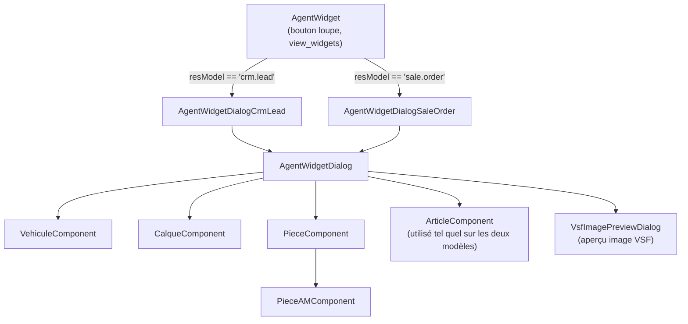
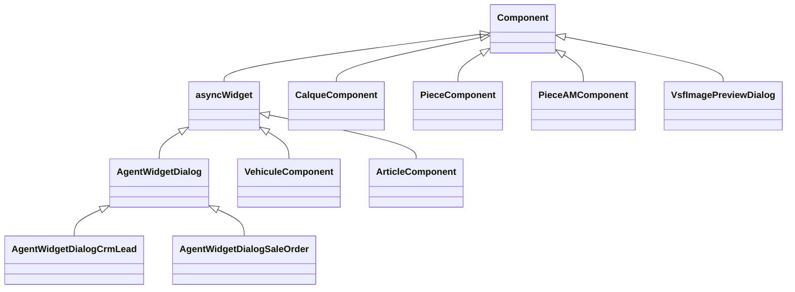
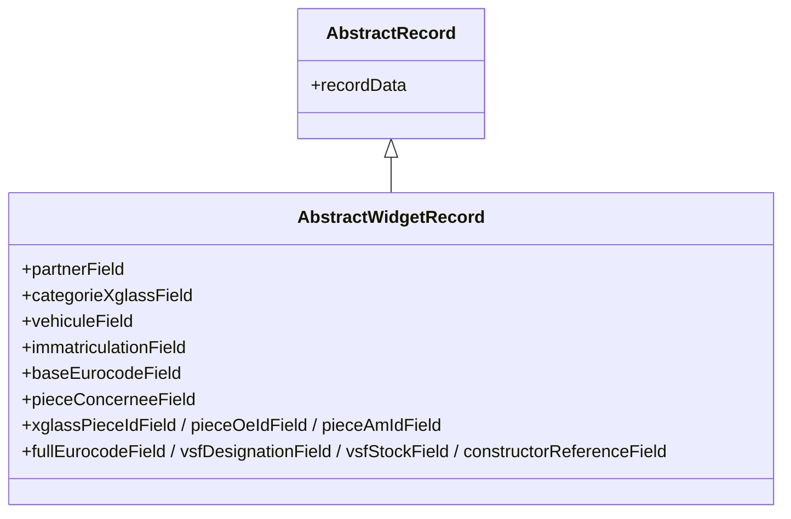
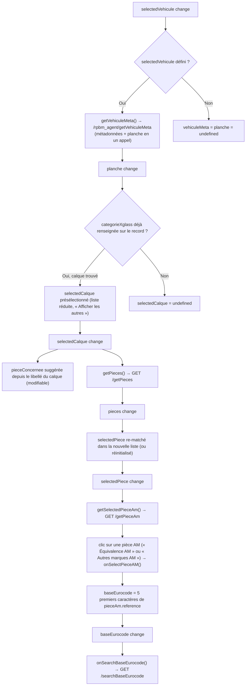

# Frontend (OWL)

## Articles VSF et suggestions

`AgentWidgetDialog` garde les sélections dans `selectedArticleCodes`, indexé par code VSF, et les produits Odoo dans `articleProducts`, également par code. Un article sélectionné possède donc son propre chargement, sa recherche/création produit et, sur un devis, son ajout ou retrait.

**Tableau (R21, lot D, build B `17.0.261005.2`).** Les résultats forment un `<table name="vsf_articles">` (`table table-sm table-hover align-middle`) qui remplace les cartes de R13 et R14. Il a sept colonnes : Eurocode, Désignation, Réf. constructeur, Stock, Prix, Coût et Photo ; Stock, Prix et Coût sont alignés à droite (`text-end`). Chaque article principal a son propre `<tbody>` (`t-foreach`), qui sépare les groupes de lignes. Le bouton « Rechercher sur VSF » porte `name="vsf_search"`, comme le tableau et la section `vsf_section` : ancres XPath pour les dialogs héritiers. `ArticleComponent` rend deux `<tr>` racines :

- **ligne principale** : la classe `table-primary` marque l'article sélectionné (le getter `style` est supprimé) et un clic appelle la prop obligatoire `onSelect`. Cellules : Eurocode (`article.code`, `font-monospace text-nowrap`) ; désignation (`article.name`) suivie du lien « Fiche technique » (`article.url`, `target="_blank"`, `rel="noopener"`, `t-on-click.stop` pour ne pas sélectionner la ligne) ; référence constructeur ; stock, ou « Indisponible » quand il est nul (`available` vaut `stock > 0`) ; prix et coût, vides si le prix est absent ; première vignette ;
- **ligne de détail** : rendue seulement si l'article est sélectionné, sur toute la largeur du tableau (`colspan="7"`). Elle contient toutes les vignettes, les caractéristiques techniques, « Détails VSF indisponibles pour cet article » le cas échéant, puis le slot `actions` (voir [plus bas](#vignettes-et-actions-par-article)).

`onSelect` remplace le `t-on-click` posé sur le composant : Owl attache un tel gestionnaire à l'élément parent et le déclenche pour toutes les racines du composant, ligne de détail comprise, dont un clic désélectionnerait l'article. `AgentWidgetDialog` passe `onClickArticleVsf(articleCode)` aux résultats et `onClickSuggestedArticle(articleCode, parentArticleCode)` aux suggestions (tous deux délèguent à `toggleVsfArticle()`) : résultats et suggestions partagent le même gabarit.

La sélection d'un article principal charge sa fiche et hydrate ses suggestions à un seul niveau. Les suggestions ne rejoignent jamais `articlesVsf` : elles suivent leur principal dans son `<tbody>`, après sa ligne de détail, sous une ligne de légende « Articles suggérés par VSF », et se sélectionnent comme lui. Désélectionner le principal retire les sélections de ce groupe. `AgentWidgetDialogSaleOrder` mémorise uniquement les lignes de devis qu'il a ajoutées pendant la dialog et appelle `order_line.delete(line)` pour les retirer sans toucher aux lignes préexistantes.

Le lien « Ouvrir dans un nouvel onglet » vise
`https://client.myvsf.fr/catalogue/vitrage?search=<base encodée>` (`target="_blank"`,
`rel="noopener"`). Sa destination suit la saisie courante sans lancer de RPC sur chaque
événement `input` ; une valeur vide ou composée d'espaces désactive le lien. L'authentification
dans l'onglet appartient au navigateur de l'utilisateur, indépendamment des agents serveur.
`baseEurocodeInput` porte la saisie affichée et la destination du lien ; `baseEurocode` ne
change qu'à la validation du champ ou à une sélection/restauration. `setBaseEurocode()`
synchronise ces deux valeurs pour les changements programmatiques.

| Méthode JS | Composant | Usage |
|---|---|---|
| `toggleVsfArticle()` | `AgentWidgetDialog` | Sélection/désélection d'un article (clic sur sa ligne) et désélection du groupe parent |
| `findProductForArticle()` / `createProductForArticle()` | `AgentWidgetDialog` | Recherche ou création du produit de l'article concerné |
| `addArticleToSaleOrder()` / `removeArticleFromSaleOrder()` | `AgentWidgetDialogSaleOrder` | Ajout/retrait sûr d'une ligne créée par le widget |

Le widget (`<widget name="rpbm_agent_widget" />`) est placé à deux endroits de chaque formulaire, ce qui donne volontairement deux boutons : l'onglet « Véhicule (X'Glass) » des **vues XML versionnées** du module (`views/crm_lead_views.xml`, `views/sale_order_views.xml`), qui héritent de la vue formulaire de base, et les sections Studio utilisées par les équipes (« Informations Véhicule » de l'opportunité, groupe sous l'en-tête du devis), où le script `studio_views.py` l'ajoute (voir [`Jobs/rpbm_agent_stock`](../../../Jobs/rpbm_agent_stock/README.md) et [configuration](configuration.md#intégration-dans-les-vues)). Les deux boutons ouvrent la même dialog.

## Dialog en plein écran (R22)

Lot D, build B (`17.0.261005.2`). `agent_widget_dialog.xml` ouvre le dialog avec `<Dialog size="'fullscreen'" …>`, ce qui pose la classe Bootstrap `modal-fullscreen` sur `.modal-dialog` (`web/core/dialog/dialog.js` accepte `sm`, `md`, `lg`, `xl`, `fs` et `fullscreen`, avec `lg` par défaut). Les guillemets intérieurs sont obligatoires : avant ce build, le gabarit écrivait `size="xl"` sans eux, Owl évaluait `xl` comme une expression du contexte du composant (`undefined`) et le dialog retombait sur `lg`, soit 980 px (voir l'[état des lieux](../etat-des-lieux.md#6-uiux)). [`test_portal_auth.py`](../../test_portal_auth.py) (`test_dialog_principal_en_plein_ecran`) vérifie donc que le template principal porte le littéral `size="'fullscreen'"` (garde-fou R22).

La taille ne change pas le défilement : dans Odoo 17, tout dialog a déjà un corps défilant avec en-tête et pied fixes (`web/static/src/scss/bootstrap_review.scss`, l. 61-79, active dès 576 px), si bien que « Confirmer », « Confirmer et enregistrer » et « Annuler » restent visibles avec un long tableau. Elle change les marges (lecture du code Odoo 17 local, à confirmer à la recette) :

| Taille | Largeur | Hauteur | Coins |
|---|---|---|---|
| `fs` | pleine largeur moins 1,75 rem de chaque côté | suit le contenu, jusqu'à l'écran | arrondis |
| `fullscreen` (retenue) | toute la largeur | toute la hauteur | carrés |

Odoo conserve 1,75 rem de marge verticale dans les deux cas. `'fullscreen'` est le choix du 2026-10-05, à la place de `'fs'` d'abord noté ; une règle SCSS du module ne serait ajoutée que si la recette demandait un bord à bord vertical. `VsfImagePreviewDialog` garde `size="'xl'"`, déjà écrit correctement, et s'ouvre par-dessus. Aucune recette live n'a encore été exécutée sur ce build.

## Arborescence des composants

```mermaid
flowchart TD
    AW["AgentWidget<br/>(bouton loupe, view_widgets)"] -->|"resModel == 'crm.lead'"| DCL[AgentWidgetDialogCrmLead]
    AW -->|"resModel == 'sale.order'"| DSO[AgentWidgetDialogSaleOrder]
    DCL --> Base[AgentWidgetDialog]
    DSO --> Base
    Base --> VC[VehiculeComponent]
    Base --> CC[CalqueComponent]
    Base --> PC[PieceComponent]
    PC --> PAC[PieceAMComponent]
    Base --> AC["ArticleComponent<br/>(utilisé tel quel sur les deux modèles)"]
    Base --> VIP["VsfImagePreviewDialog<br/>(aperçu image VSF)"]
```

Le widget n'est placé que sur `crm.lead` et `sale.order` (`DIALOG_BY_MODEL`, `agent_widget.js`), dans l'onglet du module comme dans les sections Studio ; il n'existe pas de dialog générique pour un autre modèle. La facture (`account.move`) n'affiche donc que les champs natifs repris du devis, sans bouton (voir [champs de la facture](champs/account-move.md)).

## Hiérarchie des classes

```mermaid
classDiagram
    class Component
    class asyncWidget
    class AgentWidgetDialog
    class AgentWidgetDialogCrmLead
    class AgentWidgetDialogSaleOrder
    class VehiculeComponent
    class ArticleComponent
    class CalqueComponent
    class PieceComponent
    class PieceAMComponent
    class VsfImagePreviewDialog

    Component <|-- asyncWidget
    asyncWidget <|-- AgentWidgetDialog
    AgentWidgetDialog <|-- AgentWidgetDialogCrmLead
    AgentWidgetDialog <|-- AgentWidgetDialogSaleOrder
    asyncWidget <|-- VehiculeComponent
    asyncWidget <|-- ArticleComponent
    Component <|-- CalqueComponent
    Component <|-- PieceComponent
    Component <|-- PieceAMComponent
    Component <|-- VsfImagePreviewDialog
```

`asyncWidget` (`utils.js`) est la classe de base fournissant le service `rpc`, l'accès à
`record`, et `runAsync(fn, message)` — wrapper try/catch qui bascule un état de chargement
**propre à chaque composant** avant/après l'appel et affiche une notification Odoo en cas
d'erreur.

## Groupes de pièces et encarts AUTRE AM par famille (R19, R20)

Lot D, build A (`17.0.261005.1`) : recette réussie le 2026-10-05 sur le build `ab31793`.

**Données reçues.** `/getPieces` renvoie toujours une liste plate : éléments principaux puis
complémentaires, pièces dans l'ordre du portail (jamais trié). Chaque pièce porte `elementKey`
(groupe), `elementSitId` (famille), `element.withPiecesAm` et, nouveauté, `elementSitLibelle`
(voir [backend](backend.md#getpieces-et-getpieceam-lot-d-build-a)).

**`pieceGroups`.** Getter calculé sur `this.pieces`, **jamais sur `visiblePieces`** : celui-ci est
vide quand le contexte est restauré sans pièce retrouvée (base Eurocode seule), cas où les
familles et leurs encarts doivent pourtant rester visibles. Il regroupe par `elementKey` puis
`elementSitId`, en conservant l'ordre reçu, et retourne
`[{key, titre, familles: [{elementSitId, libelle, withPiecesAm, pieces}]}]`. Titres : « Pièces
principales » et « Pièces complémentaires » (constante `PIECE_GROUP_TITLES`, libellés du portail
dans `controllers/xglass_lbl.py`) ; une pièce sans `elementKey` connu tombe dans un groupe
générique « Pièces ». Les groupes et familles étant déduits des pièces, aucun n'est vide.
Le terme « Catégorie » n'est pas réutilisé pour les bandeaux de famille : il désigne le calque
(section 2).

`visiblePieceGroups` restreint ces groupes en mode focalisé à la seule famille qui contient la
pièce sélectionnée (le titre de son groupe reste affiché), et `visibleFamillePieces(famille)`
croise les pièces de la famille avec `visiblePieces` pour les cartes.

**Template (`agent_widget_dialog.xml`, section 3).** Boucles imbriquées groupe puis famille :
titre de groupe (`h6`), bandeau de famille (libellé X'Glass), grille `row g-2` de `PieceComponent`
(inchangé, limitée aux pièces visibles de la famille), puis l'encart « Autres marques AM »
replié en fin de famille, **hors** du wrapper de pièce et affiché même quand la famille n'a
aucune carte visible. « Équivalence AM » reste sous la pièce sélectionnée.

| Mode | `visiblePieces` | Rendu |
|---|---|---|
| Tout | toutes les pièces | tous les groupes et familles, cartes et encarts |
| Focalisé (pièce sélectionnée, `showAllPieces` faux) | la pièce sélectionnée | seule la famille de la pièce, avec sa carte et son encart ; « Afficher les autres » rétablit tout |
| Restauré sans pièce | vide | toutes les familles avec leurs encarts, sans cartes |

**État des encarts.** `state.autresAmOpen` n'est plus un booléen unique mais une table
`{[autresAmKey]: bool}`, avec `autresAmKey(famille)` = `<id véhicule>-<elementSitId>` (clé par
véhicule et famille, introduite en `17.0.261002.3` : deux véhicules peuvent partager planche et
famille). Les accesseurs prennent la famille : `autresAmFor(famille)` (cache ou `{loading}`),
`isAutresAmOpen(famille)`, `onToggleAutresAm(famille)` et `loadAutresAm(famille)`. Le chargement
garde la logique de `261002.3` : cache consulté d'abord, état `{loading}` pendant l'appel,
entrée supprimée en cas d'erreur (replier puis déplier relance l'appel ; l'encart reste alors
ouvert et vide, avec la notification d'erreur de `runAsync`), `callPortal('/getPieceAm', …)`
sans `pieceId`, avec `famille.withPiecesAm` et `famille.elementSitId`. `clearSelectedPiece()` ne
touche plus l'état ouvert : choisir ou annuler une pièce ne replie aucun encart. La
reconnexion à chaud vide la table d'état ouvert en plus du cache : les encarts se replient et
se rechargent au prochain dépliage.

**Section VSF découplée de la pièce.** Le getter `showVsfSection` vaut
`selectedPiece || selectedPieceAm || hasRestoredPieceContext` et remplace le
`t-if="selectedPiece or hasRestoredPieceContext"` de la section 4. Le `useEffect` qui lance
`onSearchBaseEurocode()` passe de `selectedPiece && baseEurocode` à
`(selectedPiece || selectedPieceAm) && baseEurocode`, et ses dépendances de l'objet
`selectedPiece` au booléen « une sélection existe » : une pièce AM restaurée après la pièce OE ne
relance donc pas une recherche déjà en cours. Une base restaurée seule ne lance pas de recherche
(R12) et le dédoublonnage sur `articlesVsf.length` est conservé. Conséquence : un clic sur une
ligne AM sans pièce renseigne la base et lance la recherche.

**Point d'extension du devis.** `agent_widget_dialog_sale_order.xml` insérait la section
« Main d'œuvre » et renumérotait le `h5` par deux XPath écrits sur le `t-if` littéral de la
section VSF (`//section[@t-if='selectedPiece or hasRestoredPieceContext']`) : changer cette
condition cassait l'héritage sans erreur visible. La section VSF porte maintenant
`name="vsf_section"` et les deux XPath ciblent `//section[@name='vsf_section']` (le `h5` reste
enfant direct de la section). La condition peut évoluer sans toucher au devis. Contrôle hors
Odoo prévu : un seul nœud par XPath, avec `xml.etree.ElementTree` (`lxml` absent du `.venv`).

**Contrôles hors réseau.** `test_widget_vsf.mjs` couvre `pieceGroups` et `visiblePieceGroups` (tout, focalisé, restauré sans pièce, `elementKey`
absent, aucune pièce), un seul `callPortal` par couple véhicule-famille après replier puis déplier,
l'état ouvert indépendant par famille, les listes distinctes de deux véhicules, l'absence
d'entrée en cache après erreur, la table vidée à la reconnexion, la recherche VSF lancée par une
ligne AM sans pièce, et l'absence de recherche pour une base restaurée seule. Le harnais rejoue
les effets Owl à la main. `test_portal_auth.py` couvre la tolérance de
`findSelectionsPiecesAmView` (liste, `null`, corps non JSON) et le contrôle des deux XPath du
devis (un seul nœud chacun, `xml.etree.ElementTree`, `lxml` étant absent du `.venv`). Les trois
modes de pièces (tout, focalisé, restauré sans pièce) ont été vérifiés à la recette live du build A
(2026-10-05). Le rendu Owl local (Chromium et Owl du code Odoo, scripts hors dépôt) couvre le lien
direct VSF, les vignettes et l'aperçu, et le tableau VSF.

## Détails discriminants des pièces OE

Les pièces « Équivalence AM » ne sont affichées que sous la pièce OE active, dans un encadré
portant explicitement son libellé. La pièce active occupe toute la largeur de la grille. L'encart
repliable « Autres marques AM » reprend l'encart X'Glass « AUTRE AM » et se trouve désormais à la
fin de chaque famille (voir [ci-dessus](#groupes-de-pièces-et-encarts-autre-am-par-famille-r19-r20) ;
`loadAutresAm()`). Ses lignes utilisent le même `PieceAMComponent` que les cartes
« Équivalence AM » et le même `onSelectPieceAM()` ; la prop optionnelle `compact` choisit le
gabarit en ligne (`list-group-item` dans une `list-group-flush`, environ 60 px par ligne, mesurés
dans l'ancien dialog de 980 px avant le plein écran R22, voir l'[état des lieux](../etat-des-lieux.md#6-uiux), au lieu d'environ 155 px par carte), avec les mêmes getters `fournisseur`,
`dateLibelle`, `description`, `hasPrix` et `style`. Cliquer de nouveau sur cette pièce la désélectionne et efface les
données qui en dépendent (pièce après-marché, eurocode, résultats et article VSF).

`PieceComponent` affiche les données déjà reçues par `/getPieces`, sans nouvel appel vers
X'Glass : référence OE, détail technique ou complément de libellé, couleur et caractéristiques
typées marquées discriminantes par le portail. L'affichage est limité à quatre lignes pour
préserver la lisibilité des cartes ; ces éléments distinguent notamment les capteurs, teintes,
chauffage, acoustique et états de livraison.

### Vignettes et actions par article

Dans le tableau VSF, chaque article sélectionné possède son propre encart de création ou de
consultation Odoo, dans sa ligne de détail. Une sélection par code permet de conserver plusieurs
articles ouverts en parallèle ; retirer un principal retire aussi les suggestions de son groupe.

`ArticleComponent` expose un slot Owl optionnel `actions`, rendu dans la ligne de détail, après les
vignettes et les caractéristiques. La dialog principale y injecte l'encart produit ; la dialog devis
l'enrichit par héritage avec l'ajout ou le retrait de la ligne de devis, tant pour l'article
principal que pour chaque suggestion. Les deux encarts utilisent des points d'insertion XML
distincts afin que l'héritage Owl ajoute les actions de devis à chaque article. Un clic dans la
ligne de détail ne modifie pas la sélection, puisque seule la ligne principale porte `onSelect` ;
le conteneur d'actions garde en plus son `t-on-click.stop`.

Au clic sur un article principal, le widget lit sa fiche VSF et hydrate les articles de son
carrousel « références complémentaires » sans les ajouter aux résultats principaux ; les
suggestions ne sont pas développées récursivement.

Les vignettes avec une URL pleine taille signée par VSF sont des liens natifs (`target="_blank"` et
`rel="noopener"`). La colonne Photo n'affiche que la première ; la ligne de détail les affiche
toutes, avec le même balisage. Clic simple = aperçu interne, sans changer la sélection (`openImage`
arrête la propagation) ; tout clic modifié garde le comportement natif (Ctrl/Cmd-clic ou clic
central ouvre un nouvel onglet), lui aussi sans modifier la sélection. Le dialog d'aperçu reçoit
uniquement les URL plein format de l'article et l'index courant : `openImage` lui passe la liste des
`fullUrl` de `article.images`, quelle que soit la vignette cliquée (colonne Photo ou ligne de détail).
`useState` et `useHotkey` font défiler ←/→ en boucle, y compris avec une seule photo qui reste
stable. Les photos du modèle sont exclues côté backend. L'URL de fiche (`article.url`) est absolue
dès la recherche : `extractProductInfo` la passe par `_absolute_url` (voir
[backend](backend.md#vsf-controllersvsfpy)), ce que vérifie une assertion de
`test_vsf_recherche_apparie_les_images_signees` dans
[`test_portal_auth.py`](../../test_portal_auth.py). La recette live du tableau (reprise de R15 à R17)
reste à exécuter : voir le
[jeu de test](../jeu-de-test.md#tableau-vsf-en-plein-écran-r21-r22-reprise-de-r15-à-r17).

### Hiérarchie des classes "record" (champs Odoo par modèle porteur)

```mermaid
classDiagram
    class AbstractRecord {
        +recordData
    }
    class AbstractWidgetRecord {
        +partnerField
        +categorieXglassField
        +vehiculeField
        +immatriculationField
        +baseEurocodeField
        +pieceConcerneeField
        +xglassPieceIdField / pieceOeIdField / pieceAmIdField
        +fullEurocodeField / vsfDesignationField / vsfStockField / constructorReferenceField
    }
    AbstractRecord <|-- AbstractWidgetRecord
```

Les noms sont ceux des champs natifs `rpbm_*`, identiques sur `crm.lead` et `sale.order` (miroirs
`related` écrivables) : une seule table, aucune surcharge par modèle. Détail : [technique/champs/](champs/README.md).

## Chaîne réactive (`useEffect`) de `AgentWidgetDialog`

Toute la progression du parcours (véhicule → planche → catégorie → pièces → pièce AM → eurocode → VSF) est pilotée par une cascade de `useEffect`, pas par des appels séquentiels explicites :

```mermaid
flowchart TD
    V[selectedVehicule change] --> P{selectedVehicule défini ?}
    P -->|Oui| GP["getVehiculeMeta() → /rpbm_agent/getVehiculeMeta<br/>(métadonnées + planche en un appel)"]
    P -->|Non| RP[vehiculeMeta = planche = undefined]
    GP --> PL[planche change]
    PL --> C{"categorieXglass déjà renseignée sur le record ?"}
    C -->|Oui, calque trouvé| SC["selectedCalque présélectionné (liste réduite, « Afficher les autres »)"]
    C -->|Non| NC[selectedCalque = undefined]
    SC --> CA[selectedCalque change]
    CA --> PCS["pieceConcernee suggérée depuis le libellé du calque (modifiable)"]
    CA --> GPi["getPieces() → GET /getPieces"]
    GPi --> PI[pieces change]
    PI --> SP["selectedPiece re-matché dans la nouvelle liste (ou réinitialisé)"]
    SP --> SPC[selectedPiece change]
    SPC --> GPA["getSelectedPieceAm() → GET /getPieceAm"]
    GPA --> PA["clic sur une pièce AM (« Équivalence AM » ou « Autres marques AM ») → onSelectPieceAM()"]
    PA --> EU["baseEurocode = 5 premiers caractères de pieceAm.reference"]
    EU --> EUC[baseEurocode change]
    EUC --> SB["onSearchBaseEurocode() → GET /searchBaseEurocode"]
```

Depuis le lot D (build A), le déclencheur de la recherche VSF est
`(selectedPiece || selectedPieceAm) && baseEurocode` : une pièce après-marché choisie dans un
encart « Autres marques AM » suffit, sans pièce OE sélectionnée.

Un `useEffect` séparé recalcule `state.canConfirm` à chaque changement de véhicule ou de
catégorie. Les boutons « Confirmer » et « Confirmer et enregistrer » restent désactivés tant
que ces deux sélections ne sont pas présentes.

À l'ouverture, `restoreSelectionFromRecord()` relit les identifiants persistés
(`rpbm_xglass_piece_id`, `rpbm_piece_oe_id`, `rpbm_piece_am_id`, base Eurocode) et la
cascade ci-dessus re-sélectionne la pièce/pièce AM correspondantes ; `showAllCalques` /
`showAllPieces` pilotent l'affichage réduit à la sélection courante.

## Table des appels serveur

| Méthode JS | Composant | Route | Usage |
|---|---|---|---|
| `auth_agents()` | `AgentWidgetDialog` | `/rpbm_agent_auth` | Connexion X'Glass + VSF |
| `closeAgents()` | `AgentWidgetDialog` | `/rpbm_agent_close` | Fermeture session X'Glass |
| `searchImmatriculation()` | `AgentWidgetDialog` | `/searchImmatriculation` | Recherche véhicule(s) par plaque |
| `getOdooVehicule()` | `AgentWidgetDialog` **et** `VehiculeComponent` | `/getOdooVehicule` | Véhicule Odoo existant (`{id, name, driver_id}`), appelé par carte puis à la confirmation |
| `createOdooVehicule()` / `onClickCreateVehicule()` | `AgentWidgetDialog` et `VehiculeComponent` | `/createVehicule` | Création du véhicule ; retourne `{id, name}` |
| `enrichOdooVehicule()` | `AgentWidgetDialog` à la confirmation si le véhicule existe déjà | `/enrichVehicule` | Complément des champs Fleet VIN/date manquants depuis les métadonnées X'Glass ; avertissements |
| `getVehiculeMeta()` | `AgentWidgetDialog` pour le seul véhicule sélectionné | `/rpbm_agent/getVehiculeMeta` | VIN/CNIT/date MEC **et** planche (catégories/calques), en un appel |
| `restorePortalContext()` | `AgentWidgetDialog` après reconnexion | `/searchImmatriculation` puis `/getPlanche` | Rejoue la dernière recherche aboutie puis la sélection du véhicule côté portail, sans toucher l'état Owl |
| `getPieces()` | `AgentWidgetDialog` | `/getPieces` | Pièces d'une catégorie |
| `getPieceAm()` | `AgentWidgetDialog` | `/getPieceAm` | Pièces après-marché d'une pièce (« Équivalence AM ») |
| `loadAutresAm()` | `AgentWidgetDialog`, au dépliage de l'encart « Autres marques AM » d'une famille (sans pièce requise) | `/getPieceAm` sans `pieceId` | Encart X'Glass « AUTRE AM » de la famille (`idElementSit`), en cache par véhicule + `elementSitId` |
| `onSearchBaseEurocode()` | `AgentWidgetDialog` | `/searchBaseEurocode` | Articles VSF par eurocode |
| `loadArticleDetails()` | `AgentWidgetDialog` | `/getVsfArticleDetails` | Fiche VSF complète d'un article sélectionné (+ suggestions pour un article principal) |
| `findProductForArticle()` | `AgentWidgetDialog` | `/doesProductExists` | Recherche le produit existant pour un article VSF donné |
| `createProductForArticle()` | `AgentWidgetDialog` | `/createProduct` | Crée le produit + prix fournisseur pour cet article |
| `addArticleToSaleOrder()` / `removeArticleFromSaleOrder()` | `AgentWidgetDialogSaleOrder` | — (pas de route, `record.data.order_line.addNewRecord` / `delete`) | Ajoute ou retire une ligne créée par le widget |
| `addSelectedLaborOperations()` / `removeLaborOperation()` | `AgentWidgetDialogSaleOrder` | — (`order_line.addNewRecord` / `delete`) | Lignes de service T1/T2/T3 (`laborOperations` de la pièce), provenance `rpbm_labor_operation_key` |

L'encart d'actions d'un article VSF est le sous-template `rpbm_agent.ArticleActions`
(`agent_widget_dialog.xml`), appelé pour les articles principaux et suggérés (slot `actions` de la
ligne de détail) ; la dialog devis
l'étend une seule fois (`rpbm_agent.SaleOrderArticleActions`) pour y ajouter l'ajout/retrait de
ligne, derrière un garde-fou `addArticleToSaleOrder` puisque l'extension Owl est globale.

## Écriture finale

`AgentWidgetDialog.onConfirm()` / `onConfirmAndSave()` délèguent à `confirmRecord(save)`, qui
construit un objet `data` (via `getRecordData()`) et appelle
**`this.props.record.update(data)`** — mise à jour en mémoire du `Record` Odoo standard —
**avant** de fermer la session portail (`closeAgents()`, cf. correctif L1.0).
Lorsque le véhicule existe déjà, `getRecordData()` appelle `/enrichVehicule` (VIN et date MEC
Fleet manquants) ; les `warnings` sont affichés sans bloquer. Marque, modèle, VIN, énergie,
détail et date de l'opportunité ne sont pas écrits par le widget : ils dérivent du véhicule lié
côté serveur (`compute`, visible dans le formulaire via l'onchange) et sont recopiés vers les
champs Studio historiques à l'enregistrement.
L'écriture effective en base se fait ensuite via le mécanisme de sauvegarde standard du
formulaire Odoo (bouton « Enregistrer »), ou directement avec « Confirmer et enregistrer ».
Le module n'utilise pas de `orm.write` : tous ses échanges serveur passent par `rpc` vers les
routes custom de `main.py`.

## Reconnexion à chaud des portails

Les appels dépendants de X'Glass ou VSF passent par `callPortal()`. Lorsqu'une erreur
JSON-RPC `AgentSessionExpiredError` remonte, la dialog réauthentifie une fois les deux agents.
Elle rejoue ensuite silencieusement `/searchImmatriculation`, avec l'immatriculation de la
dernière recherche aboutie (`_searchedImmatriculation`), puis `/getPlanche`, pour restaurer la
sélection serveur du véhicule courant. Elle rejoue enfin une seule fois l'appel interrompu.

Sans la recherche, X'Glass refuse la sélection sans erreur (voir
[configuration](configuration.md#reconnexion-à-chaud)). Hormis le cache et l'état ouvert des encarts
« Autres marques AM », vidés, cette restauration n'écrit pas dans l'état Owl : véhicule, catégorie, pièces, articles
et sélections affichés restent inchangés.

Si la reconnexion ou le rejeu échoue à nouveau, `reconnectRequired` affiche le bouton
« Reconnecter » dans le footer. Le bouton conserve le contexte mais ne relance pas l'action
initiale. Les erreurs réseau, métier ou d'identifiants ne déclenchent pas ce bouton.
