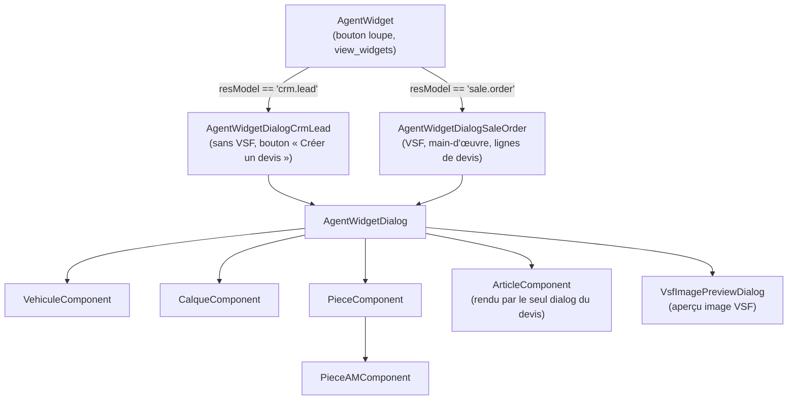
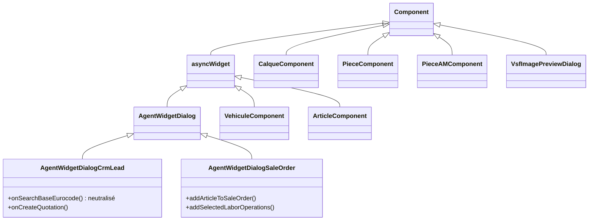
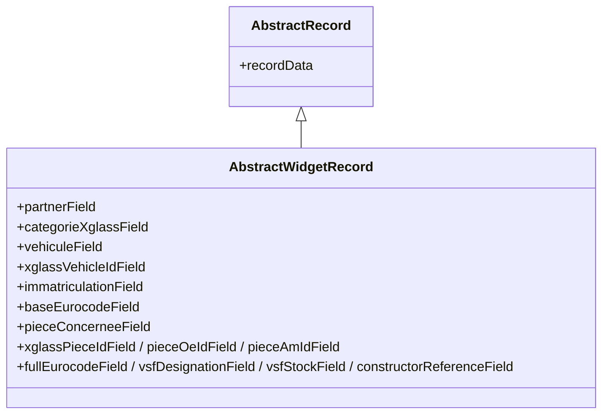
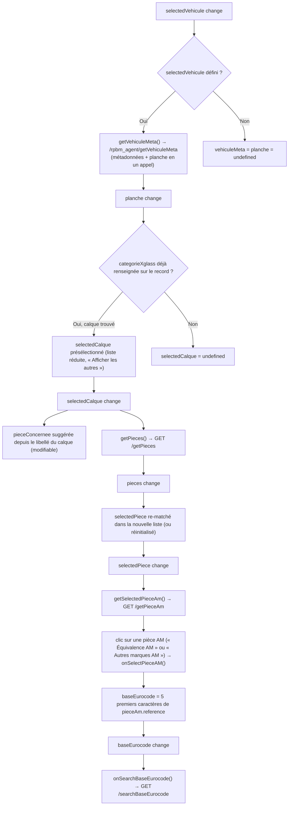

# Frontend (OWL)

## Articles VSF et suggestions

`AgentWidgetDialog` garde les sélections dans `selectedArticleCodes`, indexé par code VSF, et les produits Odoo dans `articleProducts`, également par code. Un article sélectionné possède donc son propre chargement, sa recherche/création produit et, sur un devis, son ajout ou retrait. Depuis le lot E1, le tableau et la recherche VSF n'existent que dans le dialog du devis : celui de l'opportunité les retire (voir [Créer un devis](#créer-un-devis-lot-e1)).

**Tableau (R21, lot D, build B `17.0.261005.2`).** Les résultats forment un `<table name="vsf_articles">` (`table table-sm table-hover align-middle`) qui remplace les cartes de R13 et R14. Il a sept colonnes : Eurocode, Désignation, Réf. constructeur, Stock, Prix, Coût et Photo ; Stock, Prix et Coût sont alignés à droite (`text-end`). Chaque article principal a son propre `<tbody>` (`t-foreach`), qui sépare les groupes de lignes. Le bouton « Rechercher sur VSF » porte `name="vsf_search"`, comme le tableau et la section `vsf_section` : ancres XPath pour les dialogs héritiers (celui de l'opportunité retire `vsf_search` et `vsf_articles`). `ArticleComponent` rend deux `<tr>` racines :

- **ligne principale** : la classe `table-primary` marque l'article sélectionné (le getter `style` est supprimé) et un clic appelle la prop obligatoire `onSelect`. Cellules : Eurocode (`article.code`, `font-monospace text-nowrap`) ; désignation (`article.name`) suivie du lien « Fiche technique » (`article.url`, `target="_blank"`, `rel="noopener"`, `t-on-click.stop` pour ne pas sélectionner la ligne) ; référence constructeur ; stock, ou « Indisponible » quand il est nul (`available` vaut `stock > 0`) ; prix et coût, vides si le prix est absent ; première vignette ;
- **ligne de détail** : rendue seulement si l'article est sélectionné, sur toute la largeur du tableau (`colspan="7"`). Elle contient toutes les vignettes, les caractéristiques techniques, « Détails VSF indisponibles pour cet article » le cas échéant, puis le slot `actions` (voir [plus bas](#vignettes-et-actions-par-article)).

`onSelect` remplace le `t-on-click` posé sur le composant : Owl attache un tel gestionnaire à l'élément parent et le déclenche pour toutes les racines du composant, ligne de détail comprise, dont un clic désélectionnerait l'article. `AgentWidgetDialog` passe `onClickArticleVsf(articleCode)` aux résultats et `onClickSuggestedArticle(articleCode, parentArticleCode)` aux suggestions (tous deux délèguent à `toggleVsfArticle()`) : résultats et suggestions partagent le même gabarit.

La sélection d'un article principal charge sa fiche et hydrate ses suggestions à un seul niveau. Les suggestions ne rejoignent jamais `articlesVsf` : elles suivent leur principal dans son `<tbody>`, après sa ligne de détail, sous une ligne de légende « Articles suggérés par VSF », et se sélectionnent comme lui. Désélectionner le principal retire les sélections de ce groupe. `AgentWidgetDialogSaleOrder` mémorise le produit des seules lignes de devis qu'il a ajoutées pendant la dialog, les retrouve par ce produit parmi les lignes du devis et appelle `order_line.delete(line)` pour les retirer sans toucher aux lignes préexistantes (voir [Ligne de devis ajoutée par le widget](#ligne-de-devis-ajoutée-par-le-widget-r28)).

Le lien « Ouvrir dans un nouvel onglet » vise
`https://client.myvsf.fr/catalogue/vitrage?search=<base encodée>` (`target="_blank"`,
`rel="noopener"`). Sa destination suit la saisie courante sans lancer de RPC sur chaque
événement `input` ; une valeur vide ou composée d'espaces désactive le lien. L'authentification
dans l'onglet appartient au navigateur de l'utilisateur, indépendamment des agents serveur.
`baseEurocodeInput` porte la saisie affichée et la destination du lien ; `baseEurocode` ne
change qu'à la validation du champ ou à une sélection/restauration. `setBaseEurocode()`
synchronise ces deux valeurs pour les changements programmatiques.

| Méthode JS | Composant | Usage |
|---|---|---|
| `toggleVsfArticle()` | `AgentWidgetDialog` | Sélection/désélection d'un article (clic sur sa ligne) et désélection du groupe parent |
| `findProductForArticle()` / `createProductForArticle()` | `AgentWidgetDialog` | Recherche ou création du produit de l'article concerné |
| `addArticleToSaleOrder()` / `removeArticleFromSaleOrder()` | `AgentWidgetDialogSaleOrder` | Ajout/retrait sûr d'une ligne créée par le widget |

Le widget (`<widget name="rpbm_agent_widget" />`) est placé à deux endroits de chaque formulaire, ce qui donne volontairement deux boutons : l'onglet « Véhicule (X'Glass) » des **vues XML versionnées** du module (`views/crm_lead_views.xml`, `views/sale_order_views.xml`), qui héritent de la vue formulaire de base, et les sections Studio utilisées par les équipes (« Informations Véhicule » de l'opportunité, groupe sous l'en-tête du devis), où le script `studio_views.py` l'ajoute (voir [`Jobs/rpbm_agent_stock`](../../../Jobs/rpbm_agent_stock/README.md) et [configuration](configuration.md#intégration-dans-les-vues)). Les deux boutons ouvrent la même dialog.

### Recherche sans résultat (R24)

Lot correctif `17.0.261006.1` (commit `44b86e0`), recette live réussie le 2026-10-06 sans écriture ([SO-09](../jeu-de-test.md#so-09--base-sans-résultat-lot-correctif-du-2026-10-06-r24), étape 1 : `9999Z`, sans tableau, sans notification d'erreur ni erreur de console). Quand VSF ne trouve aucun article pour la base, le serveur renvoie une liste vide, sans erreur (voir [backend](backend.md#recherche-sans-résultat-r24)), et la section VSF du devis affiche « Aucun article VSF pour « *base* ». » à la place du tableau, sans notification d'erreur.

- **État.** `state.vsfNoResultFor` retient la base de la dernière recherche aboutie sans article. `searchBaseEurocode()` le remet à `undefined` juste avant chaque appel au portail : le message disparaît dès le départ d'une nouvelle recherche, et une erreur ne laisse pas l'ancien message. Après succès, il vaut la base cherchée si la liste est vide (`res.length ? undefined : baseEurocode`). Il est aussi remis à `undefined` sur une base vide (clic sur « Rechercher sur VSF » avec le champ vide) et par `clearSelectedPiece()`.
- **Gabarit.** Un paragraphe `name="vsf_no_result"` (`text-muted`) suit le tableau dans `agent_widget_dialog.xml`, avec `t-if="!articlesVsf.length and state.vsfNoResultFor"`. C'est un `t-if` et non un `t-elif`, car l'opportunité retire le tableau par XPath. L'opportunité n'est pas concernée : elle ne cherche plus sur VSF depuis le lot E1, donc `vsfNoResultFor` n'y est jamais posé.
- **Relance.** Cliquer de nouveau sur « Rechercher sur VSF » sur une base sans résultat refait une recherche : une même base n'est écartée que si ses résultats sont déjà affichés (règle du 2026-09-20).
- **Rejeu après reconnexion.** `callPortal()` rejoue la requête une seule fois après une `AgentSessionExpiredError` ; le rejeu d'une base sans résultat aboutit désormais à ce message, plus à la notification d'erreur. Le « double envoi » relevé à la recette du 2026-10-05 n'est pas un double déclenchement et n'est pas à corriger.
- **Contrôle.** Bloc R24 de `test_widget_vsf.mjs` : une recherche sans article retient la base cherchée ; un résultat, une erreur et `clearSelectedPiece()` l'effacent.

### Ligne de devis ajoutée par le widget (R28)

Lot correctif `17.0.261006.1` (commit `44b86e0`), recette live réussie le 2026-10-06 sans écriture ([SO-08](../jeu-de-test.md#so-08--retirer-du-devis-lot-correctif-du-2026-10-06-r28), étapes 1 à 3 et 6 : « Ajouter au devis » donne « Retirer du devis », jamais « Article déjà présent dans le devis. », et « Retirer du devis » ramène « Ajouter au devis »). `AgentWidgetDialogSaleOrder` garde, par code d'article, le **produit** des lignes qu'il a ajoutées pendant la fenêtre (`_widgetProductIdsByArticleCode`, rempli après `newLine.update(...)` dans `addArticleToSaleOrder()` et vidé par `removeArticleFromSaleOrder()`). `getWidgetOrderLine(articleCode)` renvoie la ligne de `order_line.records` dont `data.product_id?.[0]` vaut ce produit.

| Situation | Dans la ligne de détail de l'article |
|---|---|
| Produit absent du devis | « Ajouter au devis » |
| Ligne ajoutée par le widget pendant cette fenêtre | « Retirer du devis » |
| Produit déjà présent à l'ouverture, ou ajouté par une fenêtre précédente | « Article déjà présent dans le devis. », ni ajout ni retrait |

- **Défaut corrigé.** `getWidgetOrderLine()` cherchait la ligne par identité d'objet (`records.includes(line)`). Or l'objet renvoyé par `addNewRecord` n'est pas toujours celui conservé dans `records` : « Retirer du devis » manquait après « Ajouter au devis », et l'article montrait « Article déjà présent dans le devis. ». La fonction date du 2026-07-29 : le défaut est antérieur au lot E. C'est celui de la main-d'œuvre, constaté à la recette du 2026-09-20 et corrigé par clé.
- **Effet limité à l'affichage.** La mise à jour faite sur l'objet renvoyé par `addNewRecord` atteint bien la ligne du devis : une ligne ajoutée à la recette d'E1, puis enregistrée, portait sa quantité de 1, son `rpbm_xglass_price` et le `price_unit` qui en découle (relevé en base). Seule la comparaison d'objets échouait : aucune ligne n'était fausse, c'est le bouton qui manquait.
- **Règle inchangée.** On ne retire que ce que le widget a ajouté pendant la fenêtre ouverte : la table est propre à l'instance de la fenêtre, vide à l'ouverture. Après « Annuler » puis réouverture sans enregistrer le formulaire, la ligne ajoutée devient une ligne préexistante : « Article déjà présent dans le devis. », à supprimer dans la liste native du devis.
- **Main-d'œuvre.** Inchangée : `_laborLine(operation)` cherche par `rpbm_labor_operation_key`, y compris pour une ligne ajoutée lors d'une session précédente. Le code mort `_widgetLaborLinesByKey` et `_restoreLaborLines()`, dont la table n'était jamais relue, est supprimé.
- **Quantité et prix.** Ils ne s'observent pas sans enregistrer le formulaire ; la preuve vient de la ligne de la recette d'E1 (voir ci-dessus).
- **Contrôle.** Bloc R28 de `test_widget_vsf.mjs` : l'objet renvoyé par `addNewRecord` est remplacé dans `records` après l'ajout ; « Retirer du devis » s'affiche quand même, le retrait supprime la ligne de `records`, et un produit présent à l'ouverture reste « déjà présent », sans ajout possible.

## Dialog en plein écran (R22)

Lot D, build B (`17.0.261005.2`). `agent_widget_dialog.xml` ouvre le dialog avec `<Dialog size="'fullscreen'" …>`, ce qui pose la classe Bootstrap `modal-fullscreen` sur `.modal-dialog` (`web/core/dialog/dialog.js` accepte `sm`, `md`, `lg`, `xl`, `fs` et `fullscreen`, avec `lg` par défaut). Les guillemets intérieurs sont obligatoires : avant ce build, le gabarit écrivait `size="xl"` sans eux, Owl évaluait `xl` comme une expression du contexte du composant (`undefined`) et le dialog retombait sur `lg`, soit 980 px (voir l'[état des lieux](../etat-des-lieux.md#6-uiux)). [`test_portal_auth.py`](../../test_portal_auth.py) (`test_dialog_principal_en_plein_ecran`) vérifie donc que le template principal porte le littéral `size="'fullscreen'"` (garde-fou R22).

La taille ne change pas le défilement : dans Odoo 17, tout dialog a déjà un corps défilant avec en-tête et pied fixes (`web/static/src/scss/bootstrap_review.scss`, l. 61-79, active dès 576 px), si bien que « Confirmer », « Confirmer et enregistrer » et « Annuler » restent visibles avec un long tableau. Elle change les marges (lecture du code Odoo 17 local, confirmée par la mesure du 2026-10-05) :

| Taille | Largeur | Hauteur | Coins |
|---|---|---|---|
| `fs` | pleine largeur moins 1,75 rem de chaque côté | suit le contenu, jusqu'à l'écran | arrondis |
| `fullscreen` (retenue) | toute la largeur | toute la hauteur | carrés |

Odoo conserve 1,75 rem de marge verticale dans les deux cas. `'fullscreen'` est le choix du 2026-10-05, à la place de `'fs'` d'abord noté. Recette live réussie le 2026-10-05 sur le build `6cbecd3` : `.modal-dialog` de 1680 × 927 dans une fenêtre de 1680 × 927, contenu de 1680 × 871 à 28 px du haut, soit des bandes de 28 px (1,75 rem) en haut et en bas. Aucune règle SCSS du module n'est ajoutée tant que le client ne demande pas un bord à bord vertical. `VsfImagePreviewDialog` garde `size="'xl'"`, déjà écrit correctement, et s'ouvre par-dessus.

## Arborescence des composants


```mermaid
flowchart TD
    AW["AgentWidget<br/>(bouton loupe, view_widgets)"] -->|"resModel == 'crm.lead'"| DCL["AgentWidgetDialogCrmLead<br/>(sans VSF, bouton « Créer un devis »)"]
    AW -->|"resModel == 'sale.order'"| DSO["AgentWidgetDialogSaleOrder<br/>(VSF, main-d'œuvre, lignes de devis)"]
    DCL --> Base[AgentWidgetDialog]
    DSO --> Base
    Base --> VC[VehiculeComponent]
    Base --> CC[CalqueComponent]
    Base --> PC[PieceComponent]
    PC --> PAC[PieceAMComponent]
    Base --> AC["ArticleComponent<br/>(rendu par le seul dialog du devis)"]
    Base --> VIP["VsfImagePreviewDialog<br/>(aperçu image VSF)"]
```

Le widget n'est placé que sur `crm.lead` et `sale.order` (`DIALOG_BY_MODEL`, `agent_widget.js`), dans l'onglet du module comme dans les sections Studio ; il n'existe pas de dialog générique pour un autre modèle. `DIALOG_BY_MODEL` associe `crm.lead` à `AgentWidgetDialogCrmLead` et `sale.order` à `AgentWidgetDialogSaleOrder` ; avant le lot E1, l'opportunité instanciait directement la classe de base `AgentWidgetDialog`. La facture (`account.move`) n'affiche donc que les champs natifs repris du devis, sans bouton (voir [champs de la facture](champs/account-move.md)).

## Hiérarchie des classes


```mermaid
classDiagram
    class Component
    class asyncWidget
    class AgentWidgetDialog
    class AgentWidgetDialogCrmLead {
        +onSearchBaseEurocode() neutralisé
        +onCreateQuotation()
    }
    class AgentWidgetDialogSaleOrder {
        +addArticleToSaleOrder()
        +addSelectedLaborOperations()
    }
    class VehiculeComponent
    class ArticleComponent
    class CalqueComponent
    class PieceComponent
    class PieceAMComponent
    class VsfImagePreviewDialog

    Component <|-- asyncWidget
    asyncWidget <|-- AgentWidgetDialog
    AgentWidgetDialog <|-- AgentWidgetDialogCrmLead
    AgentWidgetDialog <|-- AgentWidgetDialogSaleOrder
    asyncWidget <|-- VehiculeComponent
    asyncWidget <|-- ArticleComponent
    Component <|-- CalqueComponent
    Component <|-- PieceComponent
    Component <|-- PieceAMComponent
    Component <|-- VsfImagePreviewDialog
```

`asyncWidget` (`utils.js`) est la classe de base fournissant le service `rpc`, l'accès à
`record`, et `runAsync(fn, message)` — wrapper try/catch qui bascule un état de chargement
**propre à chaque composant** avant/après l'appel et affiche une notification Odoo en cas
d'erreur.

## Groupes de pièces et encarts AUTRE AM par famille (R19, R20)

Lot D, build A (`17.0.261005.1`) : recette réussie le 2026-10-05 sur le build `ab31793`.

**Données reçues.** `/getPieces` renvoie toujours une liste plate : éléments principaux puis
complémentaires, pièces dans l'ordre du portail (jamais trié). Chaque pièce porte `elementKey`
(groupe), `elementSitId` (famille), `element.withPiecesAm` et, nouveauté, `elementSitLibelle`
(voir [backend](backend.md#getpieces-et-getpieceam-lot-d-build-a)).

**`pieceGroups`.** Getter calculé sur `this.pieces`, **jamais sur `visiblePieces`** : celui-ci est
vide quand le contexte est restauré sans pièce retrouvée (base Eurocode seule), cas où les
familles et leurs encarts doivent pourtant rester visibles. Il regroupe par `elementKey` puis
`elementSitId`, en conservant l'ordre reçu, et retourne
`[{key, titre, familles: [{elementSitId, libelle, withPiecesAm, pieces}]}]`. Titres : « Pièces
principales » et « Pièces complémentaires » (constante `PIECE_GROUP_TITLES`, libellés du portail
dans `controllers/xglass_lbl.py`) ; une pièce sans `elementKey` connu tombe dans un groupe
générique « Pièces ». Les groupes et familles étant déduits des pièces, aucun n'est vide.
Le terme « Catégorie » n'est pas réutilisé pour les bandeaux de famille : il désigne le calque
(section 2).

`visiblePieceGroups` restreint ces groupes en mode focalisé à la seule famille qui contient la
pièce sélectionnée (le titre de son groupe reste affiché), et `visibleFamillePieces(famille)`
croise les pièces de la famille avec `visiblePieces` pour les cartes.

**Template (`agent_widget_dialog.xml`, section 3).** Boucles imbriquées groupe puis famille :
titre de groupe (`h6`), bandeau de famille (libellé X'Glass), grille `row g-2` de `PieceComponent`
(inchangé, limitée aux pièces visibles de la famille), puis l'encart « Autres marques AM »
replié en fin de famille, **hors** du wrapper de pièce et affiché même quand la famille n'a
aucune carte visible. « Équivalence AM » reste sous la pièce sélectionnée.

| Mode | `visiblePieces` | Rendu |
|---|---|---|
| Tout | toutes les pièces | tous les groupes et familles, cartes et encarts |
| Focalisé (pièce sélectionnée, `showAllPieces` faux) | la pièce sélectionnée | seule la famille de la pièce, avec sa carte et son encart ; « Afficher les autres » rétablit tout |
| Restauré sans pièce | vide | toutes les familles avec leurs encarts, sans cartes |

**État des encarts.** `state.autresAmOpen` n'est plus un booléen unique mais une table
`{[autresAmKey]: bool}`, avec `autresAmKey(famille)` = `<id véhicule>-<elementSitId>` (clé par
véhicule et famille, introduite en `17.0.261002.3` : deux véhicules peuvent partager planche et
famille). Les accesseurs prennent la famille : `autresAmFor(famille)` (cache ou `{loading}`),
`isAutresAmOpen(famille)`, `onToggleAutresAm(famille)` et `loadAutresAm(famille)`. Le chargement
garde la logique de `261002.3` : cache consulté d'abord, état `{loading}` pendant l'appel,
entrée supprimée en cas d'erreur (replier puis déplier relance l'appel ; l'encart reste alors
ouvert et vide, avec la notification d'erreur de `runAsync`), `callPortal('/getPieceAm', …)`
sans `pieceId`, avec `famille.withPiecesAm` et `famille.elementSitId`. `clearSelectedPiece()` ne
touche plus l'état ouvert : choisir ou annuler une pièce ne replie aucun encart. La
reconnexion à chaud vide la table d'état ouvert en plus du cache : les encarts se replient et
se rechargent au prochain dépliage.

**Section VSF découplée de la pièce.** Le getter `showVsfSection` vaut
`selectedPiece || selectedPieceAm || hasRestoredPieceContext` et remplace le
`t-if="selectedPiece or hasRestoredPieceContext"` de la section 4. Le `useEffect` qui lance
`onSearchBaseEurocode()` passe de `selectedPiece && baseEurocode` à
`(selectedPiece || selectedPieceAm) && baseEurocode`, et ses dépendances de l'objet
`selectedPiece` au booléen « une sélection existe » : une pièce AM restaurée après la pièce OE ne
relance donc pas une recherche déjà en cours. Une base restaurée seule ne lance pas de recherche
(R12) et le dédoublonnage sur `articlesVsf.length` est conservé. Conséquence : un clic sur une
ligne AM sans pièce renseigne la base et lance la recherche.

**Point d'extension du devis.** `agent_widget_dialog_sale_order.xml` insérait la section
« Main d'œuvre » et renumérotait le `h5` par deux XPath écrits sur le `t-if` littéral de la
section VSF (`//section[@t-if='selectedPiece or hasRestoredPieceContext']`) : changer cette
condition cassait l'héritage sans erreur visible. La section VSF porte maintenant
`name="vsf_section"` et les deux XPath ciblent `//section[@name='vsf_section']` (le `h5` reste
enfant direct de la section). La condition peut évoluer sans toucher au devis. Contrôle hors
Odoo : un seul nœud par XPath, avec `xml.etree.ElementTree` (`lxml` absent du `.venv`). Le dialog de
l'opportunité (`rpbm_agent.CrmLeadDialog`, lot E1) s'appuie sur les mêmes ancres par quatre XPath
(voir [Créer un devis](#créer-un-devis-lot-e1)) ; `test_xpath_des_dialogs_ciblent_un_seul_noeud`
contrôle les deux gabarits héritiers.

**Contrôles hors réseau.** `test_widget_vsf.mjs` couvre `pieceGroups` et `visiblePieceGroups` (tout, focalisé, restauré sans pièce, `elementKey`
absent, aucune pièce), un seul `callPortal` par couple véhicule-famille après replier puis déplier,
l'état ouvert indépendant par famille, les listes distinctes de deux véhicules, l'absence
d'entrée en cache après erreur, la table vidée à la reconnexion, la recherche VSF lancée par une
ligne AM sans pièce, et l'absence de recherche pour une base restaurée seule. Le harnais rejoue
les effets Owl à la main. `test_portal_auth.py` couvre la tolérance de
`findSelectionsPiecesAmView` (liste, `null`, corps non JSON) et le contrôle des XPath des dialogs
héritiers (deux pour le devis, quatre pour l'opportunité depuis le lot E1 ; un seul nœud chacun,
`xml.etree.ElementTree`, `lxml` étant absent du `.venv`). Les trois
modes de pièces (tout, focalisé, restauré sans pièce) ont été vérifiés à la recette live du build A
(2026-10-05). Le rendu Owl local (Chromium et Owl du code Odoo, scripts hors dépôt) couvre le lien
direct VSF, les vignettes et l'aperçu, le tableau VSF et, depuis le lot E1, les dialogs de
l'opportunité et du devis (l'héritage est appliqué par DOM avant le montage). Le lot E1.1 y ajoute
l'état des boutons du pied (« Créer un devis » grisé sans client avec l'info-bulle sur son
enveloppe, boutons d'écriture désactivés pendant un chargement) et le câblage du clic d'une carte
véhicule sur `onClickVehicule` ; la carte y est factice, sans le lien « Voir ».

## Détails discriminants des pièces OE

Les pièces « Équivalence AM » ne sont affichées que sous la pièce OE active, dans un encadré
portant explicitement son libellé. La pièce active occupe toute la largeur de la grille. L'encart
repliable « Autres marques AM » reprend l'encart X'Glass « AUTRE AM » et se trouve désormais à la
fin de chaque famille (voir [ci-dessus](#groupes-de-pièces-et-encarts-autre-am-par-famille-r19-r20) ;
`loadAutresAm()`). Ses lignes utilisent le même `PieceAMComponent` que les cartes
« Équivalence AM » et le même `onSelectPieceAM()` ; la prop optionnelle `compact` choisit le
gabarit en ligne (`list-group-item` dans une `list-group-flush`, environ 60 px par ligne, mesurés
dans l'ancien dialog de 980 px avant le plein écran R22, voir l'[état des lieux](../etat-des-lieux.md#6-uiux), au lieu d'environ 155 px par carte), avec les mêmes getters `fournisseur`,
`dateLibelle`, `description`, `hasPrix` et `style`. Cliquer de nouveau sur cette pièce la désélectionne et efface les
données qui en dépendent (pièce après-marché, eurocode, résultats et article VSF).

`PieceComponent` affiche les données déjà reçues par `/getPieces`, sans nouvel appel vers
X'Glass : référence OE, détail technique ou complément de libellé, couleur et caractéristiques
typées marquées discriminantes par le portail. L'affichage est limité à quatre lignes pour
préserver la lisibilité des cartes ; ces éléments distinguent notamment les capteurs, teintes,
chauffage, acoustique et états de livraison.

### Vignettes et actions par article

Dans le tableau VSF, chaque article sélectionné possède son propre encart de création ou de
consultation Odoo, dans sa ligne de détail. Une sélection par code permet de conserver plusieurs
articles ouverts en parallèle ; retirer un principal retire aussi les suggestions de son groupe.

`ArticleComponent` expose un slot Owl optionnel `actions`, rendu dans la ligne de détail, après les
vignettes et les caractéristiques. La dialog principale y injecte l'encart produit ; la dialog devis
l'enrichit par héritage avec l'ajout ou le retrait de la ligne de devis, tant pour l'article
principal que pour chaque suggestion. Les deux encarts utilisent des points d'insertion XML
distincts afin que l'héritage Owl ajoute les actions de devis à chaque article. Un clic dans la
ligne de détail ne modifie pas la sélection, puisque seule la ligne principale porte `onSelect` ;
le conteneur d'actions garde en plus son `t-on-click.stop`.

Au clic sur un article principal, le widget lit sa fiche VSF et hydrate les articles de son
carrousel « références complémentaires » sans les ajouter aux résultats principaux ; les
suggestions ne sont pas développées récursivement.

Les vignettes avec une URL pleine taille signée par VSF sont des liens natifs (`target="_blank"` et
`rel="noopener"`). La colonne Photo n'affiche que la première ; la ligne de détail les affiche
toutes, avec le même balisage. Clic simple = aperçu interne, sans changer la sélection (`openImage`
arrête la propagation) ; tout clic modifié garde le comportement natif (Ctrl/Cmd-clic ou clic
central ouvre un nouvel onglet), lui aussi sans modifier la sélection. Le dialog d'aperçu reçoit
uniquement les URL plein format de l'article et l'index courant : `openImage` lui passe la liste des
`fullUrl` de `article.images`, quelle que soit la vignette cliquée (colonne Photo ou ligne de détail).
`useState` et `useHotkey` font défiler ←/→ en boucle, y compris avec une seule photo qui reste
stable. Les photos du modèle sont exclues côté backend. L'URL de fiche (`article.url`) est absolue
dès la recherche : `extractProductInfo` la passe par `_absolute_url` (voir
[backend](backend.md#vsf-controllersvsfpy)), ce que vérifie une assertion de
`test_vsf_recherche_apparie_les_images_signees` dans
[`test_portal_auth.py`](../../test_portal_auth.py). Recette live du tableau (reprise de R15 à R17) réussie le
2026-10-05 sur le build `6cbecd3` : voir le
[jeu de test](../jeu-de-test.md#tableau-vsf-en-plein-écran-r21-r22-reprise-de-r15-à-r17).
Le clic milieu, le clic simple sur « Fiche technique » et l'affichage de la recherche VSF après
connexion ont été vérifiés à la main par l'utilisateur le 2026-10-06, sans écart signalé.

### Hiérarchie des classes "record" (champs Odoo par modèle porteur)


```mermaid
classDiagram
    class AbstractRecord {
        +recordData
    }
    class AbstractWidgetRecord {
        +partnerField
        +categorieXglassField
        +vehiculeField
        +xglassVehicleIdField
        +immatriculationField
        +baseEurocodeField
        +pieceConcerneeField
        +xglassPieceIdField / pieceOeIdField / pieceAmIdField
        +fullEurocodeField / vsfDesignationField / vsfStockField / constructorReferenceField
    }
    AbstractRecord <|-- AbstractWidgetRecord
```

Les noms sont ceux des champs natifs `rpbm_*`, identiques sur `crm.lead` et `sale.order` (miroirs
`related` écrivables) : une seule table, aucune surcharge par modèle. Détail : [technique/champs/](champs/README.md).

## Chaîne réactive (`useEffect`) de `AgentWidgetDialog`

Toute la progression du parcours (véhicule → planche → catégorie → pièces → pièce AM → eurocode → VSF) est pilotée par une cascade de `useEffect`, pas par des appels séquentiels explicites :


```mermaid
flowchart TD
    V[selectedVehicule change] --> P{selectedVehicule défini ?}
    P -->|Oui| GP["getVehiculeMeta() → /rpbm_agent/getVehiculeMeta<br/>(métadonnées + planche en un appel)"]
    P -->|Non| RP[vehiculeMeta = planche = undefined]
    GP --> PL[planche change]
    PL --> C{"categorieXglass déjà renseignée sur le record ?"}
    C -->|Oui, calque trouvé| SC["selectedCalque présélectionné (liste réduite, « Afficher les autres »)"]
    C -->|Non| NC[selectedCalque = undefined]
    SC --> CA[selectedCalque change]
    CA --> PCS["pieceConcernee suggérée depuis le libellé du calque (modifiable)"]
    CA --> GPi["getPieces() → GET /getPieces"]
    GPi --> PI[pieces change]
    PI --> SP["selectedPiece re-matché dans la nouvelle liste (ou réinitialisé)"]
    SP --> SPC[selectedPiece change]
    SPC --> GPA["getSelectedPieceAm() → GET /getPieceAm"]
    GPA --> PA["clic sur une pièce AM (« Équivalence AM » ou « Autres marques AM ») → onSelectPieceAM()"]
    PA --> EU["baseEurocode = 5 premiers caractères de pieceAm.reference"]
    EU --> EUC[baseEurocode change]
    EUC --> SB["onSearchBaseEurocode() → GET /searchBaseEurocode"]
```

Depuis le lot D (build A), le déclencheur de la recherche VSF est
`(selectedPiece || selectedPieceAm) && baseEurocode` : une pièce après-marché choisie dans un
encart « Autres marques AM » suffit, sans pièce OE sélectionnée. Sur le dialog de l'opportunité
(lot E1), `onSearchBaseEurocode()` est neutralisé : l'effet ne lance aucune recherche et la
cascade s'arrête à la base Eurocode.

Un `useEffect` séparé recalcule `state.canConfirm` à chaque changement de véhicule ou de
catégorie. Les boutons « Confirmer » et « Confirmer et enregistrer » (et « Créer un devis » sur
l'opportunité) restent désactivés tant que ces deux sélections ne sont pas présentes, pendant une
reconnexion, pendant une écriture (`state.writing`) et, depuis le lot E1.1, pendant un chargement :
`!state.canConfirm or isReconnecting or state.writing or isLoading`.

Un autre effet, sur `vehicules`, sélectionne le véhicule X'Glass mémorisé (`_restoreVehiculeId`,
lu dans `rpbm_xglass_vehicle_id`) s'il figure dans la liste, sinon le premier ; une liste vide
donne `undefined`.

À l'ouverture, `restoreSelectionFromRecord()` relit les identifiants persistés
(`rpbm_xglass_vehicle_id`, `rpbm_xglass_piece_id`, `rpbm_piece_oe_id`, `rpbm_piece_am_id`, base
Eurocode) et la cascade ci-dessus re-sélectionne le véhicule, la pièce et la pièce AM
correspondants ; `showAllCalques` / `showAllPieces` pilotent l'affichage réduit à la sélection
courante. Une pièce retrouvée est conservée ; une pièce introuvable n'est pas effacée à la
confirmation (voir [Pièce mémorisée](#pièce-mémorisée-et-boutons-désactivés-lot-e11)).

## Table des appels serveur

| Méthode JS | Composant | Route | Usage |
|---|---|---|---|
| `auth_agents()` | `AgentWidgetDialog` | `/rpbm_agent_auth` | Connexion X'Glass + VSF |
| `closeAgents()` | `AgentWidgetDialog` | `/rpbm_agent_close` | Fermeture session X'Glass |
| `searchImmatriculation()` | `AgentWidgetDialog` | `/searchImmatriculation` | Recherche véhicule(s) par plaque |
| `getOdooVehicule()` | `AgentWidgetDialog` **et** `VehiculeComponent` | `/getOdooVehicule` | Véhicule Odoo existant (`{id, name, driver_id}`), appelé par carte puis à la confirmation |
| `createOdooVehicule()` / `onClickCreateVehicule()` | `AgentWidgetDialog` et `VehiculeComponent` | `/createVehicule` | Création du véhicule ; retourne `{id, name}` |
| `enrichOdooVehicule()` | `AgentWidgetDialog` à la confirmation si le véhicule existe déjà | `/enrichVehicule` | Complément des champs Fleet VIN/date manquants depuis les métadonnées X'Glass ; avertissements |
| `getVehiculeMeta()` | `AgentWidgetDialog` pour le seul véhicule sélectionné | `/rpbm_agent/getVehiculeMeta` | VIN/CNIT/date MEC **et** planche (catégories/calques), en un appel |
| `restorePortalContext()` | `AgentWidgetDialog` après reconnexion | `/searchImmatriculation` puis `/getPlanche` | Rejoue la dernière recherche aboutie puis la sélection du véhicule côté portail, sans toucher l'état Owl |
| `getPieces()` | `AgentWidgetDialog` | `/getPieces` | Pièces d'une catégorie |
| `getPieceAm()` | `AgentWidgetDialog` | `/getPieceAm` | Pièces après-marché d'une pièce (« Équivalence AM ») |
| `loadAutresAm()` | `AgentWidgetDialog`, au dépliage de l'encart « Autres marques AM » d'une famille (sans pièce requise) | `/getPieceAm` sans `pieceId` | Encart X'Glass « AUTRE AM » de la famille (`idElementSit`), en cache par véhicule + `elementSitId` |
| `onSearchBaseEurocode()` | `AgentWidgetDialog` (neutralisé dans `AgentWidgetDialogCrmLead`) | `/searchBaseEurocode` | Articles VSF par eurocode (dialog du devis seulement) ; une liste vide donne « Aucun article VSF pour « *base* ». » ([R24](#recherche-sans-résultat-r24)) |
| `loadArticleDetails()` | `AgentWidgetDialog` | `/getVsfArticleDetails` | Fiche VSF complète d'un article sélectionné (+ suggestions pour un article principal) |
| `findProductForArticle()` | `AgentWidgetDialog` | `/doesProductExists` | Recherche le produit existant pour un article VSF donné |
| `createProductForArticle()` | `AgentWidgetDialog` | `/createProduct` | Crée le produit + prix fournisseur pour cet article |
| `addArticleToSaleOrder()` / `removeArticleFromSaleOrder()` | `AgentWidgetDialogSaleOrder` | — (pas de route, `record.data.order_line.addNewRecord` / `delete`) | Ajoute ou retire une ligne créée par le widget, retrouvée par son produit ([R28](#ligne-de-devis-ajoutée-par-le-widget-r28)) |
| `addSelectedLaborOperations()` / `removeLaborOperation()` | `AgentWidgetDialogSaleOrder` | — (`order_line.addNewRecord` / `delete`) | Lignes de service T1/T2/T3 (`laborOperations` de la pièce), provenance `rpbm_labor_operation_key` |
| `onCreateQuotation()` | `AgentWidgetDialogCrmLead` | — (`action.doActionButton` → `action_sale_quotations_new`, aucune route du module) | Écrit l'opportunité, puis ouvre un nouveau devis lié (voir [Créer un devis](#créer-un-devis-lot-e1)) |

L'encart d'actions d'un article VSF est le sous-template `rpbm_agent.ArticleActions`
(`agent_widget_dialog.xml`), appelé pour les articles principaux et suggérés (slot `actions` de la
ligne de détail) ; la dialog devis
l'étend une seule fois (`rpbm_agent.SaleOrderArticleActions`) pour y ajouter l'ajout/retrait de
ligne, derrière un garde-fou `addArticleToSaleOrder` puisque l'extension Owl est globale.

## Écriture finale

`AgentWidgetDialog.onConfirm()` / `onConfirmAndSave()` délèguent à `confirmRecord(save)`, qui
appelle `writeRecord(save)` puis ferme le dialog si l'écriture a abouti. `writeRecord(save)` est
l'écriture commune aux trois boutons d'écriture, « Créer un devis » compris : garde anti-doublon
`state.writing`, construction d'un objet `data` (via `getRecordData()`, qui inclut
`rpbm_xglass_vehicle_id` et n'inclut les identifiants de pièce que s'ils ont été retrouvés ou
modifiés explicitement, voir [Pièce mémorisée](#pièce-mémorisée-et-boutons-désactivés-lot-e11)),
**`this.props.record.update(data)`** — mise à jour en mémoire du
`Record` Odoo standard —, `record.save()` seulement pour « Confirmer et enregistrer » ou « Créer un
devis » (un formulaire invalide ou refusé lève une erreur : rien n'est fermé), **puis** fermeture
de la session portail (`closeAgents()`, cf. correctif L1.0). Elle renvoie `true` si tout a abouti.
Lorsque le véhicule existe déjà, `getRecordData()` appelle `/enrichVehicule` (VIN et date MEC
Fleet manquants) ; les `warnings` sont affichés sans bloquer. Marque, modèle, VIN, énergie,
détail et date de l'opportunité ne sont pas écrits par le widget : ils dérivent du véhicule lié
côté serveur (`compute`, visible dans le formulaire via l'onchange) et sont recopiés vers les
champs Studio historiques à l'enregistrement.
L'écriture effective en base se fait ensuite via le mécanisme de sauvegarde standard du
formulaire Odoo (bouton « Enregistrer »), ou directement avec « Confirmer et enregistrer ».
Le module n'utilise pas de `orm.write` : tous ses échanges serveur passent par `rpc` vers les
routes custom de `main.py`, à l'exception de « Créer un devis », qui appelle la méthode native
`action_sale_quotations_new` par `doActionButton`.

## Créer un devis (lot E1)

Lot E1 (`17.0.261005.3`) : le dialog de l'opportunité s'arrête à la pièce et à la base Eurocode,
et crée le devis où l'on choisit les articles VSF. Recette live réussie le 2026-10-05, en
`17.0.261005.4`, pour E1 et E1.1 ensemble (voir le [jeu de test](../jeu-de-test.md#crm-07--créer-un-devis-lot-e1)).
Le lot correctif E1.1 (`17.0.261005.4`), décidé après l'essai de l'utilisateur, est décrit en fin de
section.

**Dialog de l'opportunité.** `AgentWidgetDialogCrmLead` (`agent_widget_dialog_crm_lead.js` et
`.xml`) étend `AgentWidgetDialog` ; `agent_widget.js` y associe `crm.lead`. Son gabarit
`rpbm_agent.CrmLeadDialog` hérite en mode `primary` de `rpbm_agent.AgentWidgetDialog` par quatre
XPath :
- le `<h5>` de la section VSF devient « 4. Base Eurocode » ;
- le bouton `vsf_search` et le tableau `vsf_articles` sont retirés ; le champ base et « Ouvrir dans
  un nouvel onglet » restent ;
- le bouton « Créer un devis » s'ajoute après `onConfirmAndSave`.

`onSearchBaseEurocode()` y est neutralisé. Sans article, `getRecordData()` n'écrit plus
`rpbm_eurocode`, `rpbm_vsf_designation`, `rpbm_vsf_stock` ni `rpbm_constructor_reference` : ils
restent visibles et modifiables à la main dans le formulaire, et seul le dialog du devis les
alimente (décision du 2026-10-05, voir [validations métier](../validations-metier.md)).

**Bouton « Créer un devis ».**
- Affiché sur une opportunité, pas sur une piste (`props.record.data.type !== 'lead'`), comme le
  bouton natif « Nouveau devis », masqué si `type == 'lead'`. La condition reste vraie si le champ
  `type` manque à la vue. Le bouton natif est aussi masqué sur une opportunité perdue
  (`probability == 0 and not active`), ce que le bouton du widget ne teste pas. Depuis le lot E1.1,
  il n'est plus masqué sans client : il est grisé, avec une info-bulle (voir la fin de la section).
- Désactivé comme « Confirmer » : `!state.canConfirm or isReconnecting or state.writing`. Depuis le
  lot E1.1, il l'est aussi sans client et pendant un chargement
  (`!record.partnerId or !state.canConfirm or isReconnecting or state.writing or isLoading`) ;
  « Confirmer » et « Confirmer et enregistrer » reçoivent le même `or isLoading`.
- Placé **après** « Confirmer et enregistrer » : le raccourci Ctrl+Entrée clique le premier bouton
  visible du pied, même désactivé (`web/core/dialog/dialog.js`), et reste donc « Confirmer ». Ordre
  du pied : « Reconnecter » quand il est nécessaire, « Confirmer », « Confirmer et enregistrer »,
  « Créer un devis », « Annuler ».

**Séquence de `onCreateQuotation()`.**
1. `writeRecord(true)` écrit, enregistre et ferme les portails ; s'il renvoie `false` (formulaire
   invalide, erreur serveur), rien d'autre n'a lieu et le dialog reste ouvert.
2. `this.props.close()`.
3. Le drapeau privé au fichier `pendingOpportunityId` reçoit `record.resId`.
4. `action.doActionButton({ type: "object", name: "action_sale_quotations_new", resModel:
   "crm.lead", resId, context: record.context })`, sans `runAsync` : Odoo affiche lui-même l'erreur,
   comme pour le bouton natif ; l'opportunité est alors déjà enregistrée. Avec un client, la méthode renvoie l'action
   `sale_crm.sale_action_quotations_new` (contexte `default_opportunity_id`, `default_partner_id`…) :
   un **nouveau** devis, non enregistré, lié à l'opportunité ; chaque clic en ouvre un nouveau. Sans
   client, Odoo passerait par l'assistant `crm.quotation.partner`, mais le bouton n'est alors pas
   affiché.
5. `finally` : le drapeau est vidé.

**Ouverture du dialog du devis.** Le même fichier applique un `patch(FormController.prototype)`.
Pour un `sale.order`, au `onMounted`, si `pendingOpportunityId` est posé, que l'enregistrement est
nouveau (`root.isNew`) et que `root.data.opportunity_id[0] === pendingOpportunityId`, le drapeau est
vidé et `dialogService.add(AgentWidgetDialogSaleOrder, { record: root })` ouvre le dialog. Il
restaure alors le contexte comme à toute réouverture : véhicule mémorisé, pièce, pièce AM, base,
recherche VSF automatique et « 4. Main d'œuvre ».
- **Pourquoi un drapeau JavaScript.** `doActionButton` recopie dans le contexte de l'action suivante
  toute clé qui ne correspond pas à `CTX_KEY_REGEX` (`default_*`, `search_default_*`, `show_*`,
  `*_view_ref`, `group_by`, `active_id(s)`, `orderedBy` ; `web/webclient/actions/action_service.js`).
  Une clé de contexte propre au module resterait dans le contexte du devis et se propagerait aux
  actions suivantes. Le drapeau, en mémoire et à usage unique, ne fuit pas.
- **Pourquoi le contrôle porte sur le montage.** Chaque changement d'action ferme tous les dialogs
  (`dialog.closeAll()` dans `_updateUI`), et le `onMounted` du formulaire passe avant la résolution
  de `doAction`. La promesse de `doActionButton` peut même ne jamais se résoudre si une autre action
  la remplace (`KeepLast`) : on ne peut pas ouvrir le dialog après un `await`. Le contrôle exige donc
  le drapeau **et** un devis nouveau de cette opportunité ; le `finally` n'est qu'un filet.
- **Conséquences.** Le dialog ne s'ouvre ni avec « Nouveau devis » natif, ni par Ventes › Devis ›
  Nouveau, ni au retour par le fil d'Ariane, ni après un rechargement de la page. Le service `action`
  n'a pas de métadonnée `async` : `useService` ne le protège pas, il reste appelable après
  `close()`, contrairement à `rpc` et `orm`.

**Anti-doublon.** `state.writing`, partagé par « Confirmer », « Confirmer et enregistrer » et
« Créer un devis », désactive les trois boutons ; `writeRecord()` ignore un appel tant qu'une
écriture est en cours. Un double clic n'écrit donc qu'une fois et ne crée qu'un devis.

**Véhicule X'Glass mémorisé.** `getRecordData()` écrit `rpbm_xglass_vehicle_id`
(`String(selectedVehicule.id)`, ou une chaîne vide sans véhicule) ; le champ n'a pas d'équivalent Studio (voir
[champs de l'opportunité](champs/crm-lead.md)). L'effet sur `vehicules` le relit à la réouverture
(voir plus haut) : une immatriculation peut renvoyer plusieurs véhicules X'Glass, et le devis ouvert
automatiquement doit retrouver celui de l'opportunité.

**Contrôles hors réseau.** `test_widget_vsf.mjs` couvre la restauration du véhicule mémorisé
(présent dans la liste, inconnu, liste vide), l'absence de recherche VSF côté opportunité,
l'enchaînement et les paramètres de « Créer un devis », le drapeau à usage unique (aucun dialog pour
un formulaire `crm.lead`, un devis sans opportunité, un devis qui n'est pas nouveau ou d'une autre
opportunité), l'échec d'enregistrement, le rejet de l'action et l'anti-doublon. Son bloc du lot E1.1
rejoue `getRecordData()` sur un dialog dont les trois identifiants de pièce sont mémorisés :
- confirmation avant le chargement des pièces : aucun identifiant n'est écrit ; pièce introuvable et
  effets automatiques : valeurs conservées ;
- pièce retrouvée : écrite ; pièce AM absente des équivalences (« Autres marques AM ») : conservée ;
  pièce AM retrouvée : écrite ;
- autre pièce, désélection, autre catégorie, ligne AM (pièce AM seulement), autre véhicule et
  recherche d'immatriculation de l'utilisateur : valeurs remplacées ou vidées ;
- effet sur `vehicules` et recherche automatique de l'ouverture (`init`), clic sur le véhicule ou la
  catégorie déjà affichés : rien n'est libéré.

`tests/test_legacy_sync.py` vérifie que le miroir `rpbm_xglass_vehicle_id` du devis remonte à
l'opportunité ; `tests/test_find_existing_product.py` couvre le rattachement produit (voir
[backend](backend.md#rattachement-dun-article-vsf-à-un-produit-lot-e11) ; non exécuté, abandonné sur
décision de l'utilisateur, 2026-10-06).

**Cas limite accepté.** Une opportunité sans pièce OE, avec seulement une ligne « Autres marques
AM » et une base, ouvre le devis sans recherche VSF automatique (règle R12 : la recherche
automatique exige une pièce ou une pièce AM sélectionnée) ; il faut un clic sur « Rechercher sur
VSF ».

### Pièce mémorisée et boutons désactivés (lot E1.1)

Lot E1.1 (`17.0.261005.4`), décidé après l'essai de l'utilisateur sur E1. Une opportunité enregistrée
par « Créer un devis » avait perdu ses identifiants de pièce (X'Glass, OE et AM) : le devis s'ouvrait
donc en mode « base restaurée sans pièce », avec des familles et des encarts sans cartes. Causes dans E1 :
- `getRecordData()` écrivait toujours la sélection affichée, soit `""` quand aucune pièce n'était
  sélectionnée ;
- les boutons d'écriture étaient actifs dès que le véhicule et la catégorie étaient choisis, pendant
  que les pièces chargeaient encore ;
- une pièce mémorisée mais introuvable était effacée de la même façon ;
- une ligne « Autres marques AM » mémorisée n'est jamais retrouvée à la restauration, qui ne cherche
  que parmi les équivalences de la pièce.

**Règle.** Pour une pièce déjà mémorisée à l'ouverture, `rpbm_xglass_piece_id` et `rpbm_piece_oe_id`
d'une part, `rpbm_piece_am_id` d'autre part ne sont réécrits que si la sélection a été **retrouvée à
la restauration**, ou **remplacée ou retirée par une action explicite** de l'utilisateur. Sinon
`getRecordData()` ne les inclut pas et la valeur mémorisée est conservée. Sans pièce mémorisée à
l'ouverture, rien ne change : la sélection affichée est écrite, vide si rien n'est sélectionné.

Deux drapeaux portent cet état. `restoreSelectionFromRecord()` les pose à l'ouverture :
`_keepStoredPiece` pour les pièces X'Glass et OE, écrites ensemble, quand l'un de leurs identifiants
est mémorisé ; `_keepStoredPieceAm` pour la pièce AM. Tant qu'un drapeau est à vrai, `getRecordData()`
n'écrit pas les identifiants qu'il protège, même pendant un chargement. Il retombe à faux :
- **à la restauration** : `_keepStoredPiece` quand `getPieces()` retrouve la pièce ;
  `_keepStoredPieceAm` quand `getPieceAm()` retrouve la pièce AM parmi les équivalences de la pièce.
  Une ligne « Autres marques AM » mémorisée n'est jamais retrouvée : elle reste protégée tant que
  l'utilisateur n'agit pas ;
- **à une action explicite** : `releaseStoredPieces()` remet les deux drapeaux à faux, et
  `onSelectPieceAM()` ne remet à faux que `_keepStoredPieceAm`, directement :

| Action de l'utilisateur | Gestionnaire | Drapeaux remis à faux |
|---|---|---|
| Clic sur une pièce, pour la sélectionner ou la désélectionner | `onSelectPiece()` | les deux, par `releaseStoredPieces()` |
| Clic sur une **autre** catégorie que celle affichée | `onClickCalque()`, gardé par `calqueId !== selectedCalqueId` | les deux, par `releaseStoredPieces()` |
| Clic sur un **autre** véhicule que celui affiché | `onClickVehicule()` (nouvelle méthode appelée par le gabarit, gardée par `vehiculeId !== selectedVehiculeId`), puis `onSelectVehicule()` | les deux, par `releaseStoredPieces()` |
| Recherche d'immatriculation **réussie** (bouton « Rechercher ») | `onSearchImmatriculation()`, après `searchImmatriculation()` | les deux, par `releaseStoredPieces()` |
| Clic sur une carte « Équivalence AM » ou une ligne « Autres marques AM » | `onSelectPieceAM()` | `_keepStoredPieceAm` seulement : la pièce X'Glass et la pièce OE restent protégées |

Ne libèrent rien :
- un nouveau clic sur le véhicule ou la catégorie déjà affichés (les gardes ci-dessus). Le lien
  « Voir » de la carte véhicule n'a pas de gestionnaire propre : son clic remonte à la carte et suit
  la même règle ;
- une recherche d'immatriculation en erreur : `runAsync()` intercepte l'exception avant
  `releaseStoredPieces()`. Un champ vide, qui vide la liste sans appel au portail, compte en revanche
  comme une recherche réussie ;
- la recherche automatique de l'ouverture (`init()` appelle `searchImmatriculation()` sans passer par
  le bouton) et l'effet sur `vehicules`, qui appelle `onSelectVehicule()` sans passer par
  `onClickVehicule()`.

**Boutons.** « Confirmer », « Confirmer et enregistrer » et « Créer un devis » sont désactivés
pendant un chargement (`isLoading`), en plus des conditions précédentes (véhicule et catégorie requis, reconnexion,
écriture en cours) : le pied ne peut plus partir avant l'arrivée des pièces.

**« Créer un devis » sans client.** Le bouton reste visible sur toute opportunité, pas sur une piste.
Sans client, il est grisé, avec l'info-bulle « Renseignez le client de l'opportunité pour créer un
devis. » : masqué, il n'expliquait rien et l'utilisateur ne le trouvait pas. Un `<span>` enveloppe
le bouton et porte l'info-bulle, car un bouton désactivé ne reçoit pas le survol :

```xml
<span t-if="props.record.data.type !== 'lead'" t-att-title="record.partnerId ? undefined : 'Renseignez le client de l\'opportunité pour créer un devis.'">
    <button class="btn btn-primary" t-on-click="onCreateQuotation" t-att-disabled="!record.partnerId or !state.canConfirm or isReconnecting or state.writing or isLoading">Créer un devis</button>
</span>
```

Avec un client, `title` vaut `undefined` : l'attribut n'est pas posé. Le gabarit CRM garde ses quatre
XPath ; seul le contenu inséré après `onConfirmAndSave` change.

**Recette et limites connues.** Recette live réussie le 2026-10-05, en `17.0.261005.4`, pour E1 et
E1.1 ensemble : boutons d'écriture grisés pendant tous les chargements, confirmation sans rien
toucher qui ne réécrit ni la pièce ni la pièce AM, « Créer un devis » grisé avec l'info-bulle sans
client, et ligne « Autres marques AM » mémorisée qui reste mémorisée à la confirmation (la sauvegarde
ne contient pas `rpbm_piece_am_id`). Deux limites du code, relevées à sa lecture, n'ont **pas été
vérifiées** en live :
- **Ligne « Autres marques AM » choisie pendant la restauration de la pièce AM.** `getPieceAm()`
  réassigne `selectedPieceAm` avec le résultat de sa recherche parmi les équivalences (la pièce
  mémorisée, ou `undefined`). Une ligne choisie entre-temps est donc remplacée (comportement antérieur
  à E1.1) ; comme `onSelectPieceAM()` a déjà remis `_keepStoredPieceAm` à faux, la pièce AM peut être
  écrite vide à la confirmation. La fenêtre est étroite : le clic doit tomber pendant le chargement ;
- **Largeur de téléphone.** Le `<span>` qui enveloppe « Créer un devis » devient l'élément du pied à
  la place du bouton : sur un écran étroit, le bouton dans son enveloppe pourrait être rétréci ou mal
  aligné.

Une troisième limite, `isLoading` qui peut brièvement repasser à faux entre deux chargements
enchaînés (booléen unique que chaque `runAsync` met à vrai puis à faux), a été observée à la
recette : un passage à l'état actif de 55 ms entre deux chargements enchaînés, sans conséquence (un
clic réel sur « Confirmer » pendant un chargement est resté sans effet). Les drapeaux
`_keepStoredPiece` et `_keepStoredPieceAm` restent la vraie protection des valeurs mémorisées, la
désactivation des boutons n'étant qu'un filet.

## Reconnexion à chaud des portails

Les appels dépendants de X'Glass ou VSF passent par `callPortal()`. Lorsqu'une erreur
JSON-RPC `AgentSessionExpiredError` remonte, la dialog réauthentifie une fois les deux agents.
Elle rejoue ensuite silencieusement `/searchImmatriculation`, avec l'immatriculation de la
dernière recherche aboutie (`_searchedImmatriculation`), puis `/getPlanche`, pour restaurer la
sélection serveur du véhicule courant. Elle rejoue enfin une seule fois l'appel interrompu.

Sans la recherche, X'Glass refuse la sélection sans erreur (voir
[configuration](configuration.md#reconnexion-à-chaud)). Hormis le cache et l'état ouvert des encarts
« Autres marques AM », vidés, cette restauration n'écrit pas dans l'état Owl : véhicule, catégorie, pièces, articles
et sélections affichés restent inchangés.

Si la reconnexion ou le rejeu échoue à nouveau, `reconnectRequired` affiche le bouton
« Reconnecter » dans le footer. Le bouton conserve le contexte mais ne relance pas l'action
initiale. Les erreurs réseau, métier ou d'identifiants ne déclenchent pas ce bouton.
